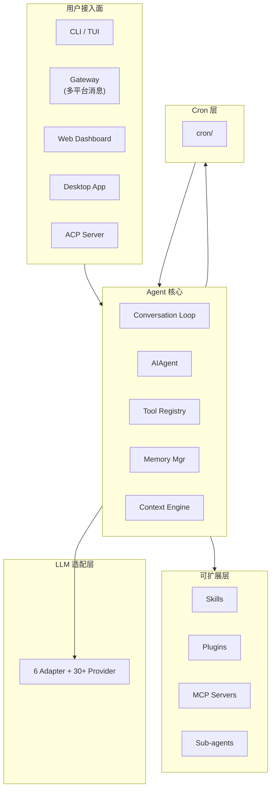

# Hermes Agent 项目梳理 · 索引

> 本目录是 **Hermes Agent** 项目的系统性梳理,服务于 agent 开发面试准备。
> 所有关键架构与流程配有 **mermaid 图**,便于快速理解。
> 项目根目录:`D:\hans\proj\hermes-agent`,版本 `0.18.2`,License MIT,维护方 Nous Research。

---

## 文档索引

| 编号 | 文件 | 主题 | 关键看点 |
|------|------|------|----------|
| 00 | [00-overview.md](./00-overview.md) | 项目总览 | 一句话定位、核心特性、顶层架构图 |
| 01 | [01-modules-and-techstack.md](./01-modules-and-techstack.md) | 模块 / 技术栈 | 目录树、依赖清单、Provider 矩阵 |
| 02 | [02-architecture-main-flow.md](./02-architecture-main-flow.md) | 主流程 | AIAgent.run_conversation 时序图、Provider 路由 |
| 03 | [03-memory.md](./03-memory.md) | 记忆系统 | 三层记忆、frozen snapshot、流式 scrubber |
| 04 | [04-context-engineering.md](./04-context-engineering.md) | 上下文工程 | 5 阶段压缩管线、token 估算、@ 引用语法 |
| 05 | [05-cron-scheduling.md](./05-cron-scheduling.md) | 定时任务 | cron 三层锁、注入扫描、网关 ticker |
| 06 | [06-tools-and-registry.md](./06-tools-and-registry.md) | 工具注册与分发 | AST 扫描自注册、check_fn TTL、Tool Search |
| 07 | [07-skills.md](./07-skills.md) | 技能系统 | agentskills.io 兼容、Curator 自演化 |
| 08 | [08-plugins.md](./08-plugins.md) | 插件系统 | 4 来源加载、40+ hooks、PluginContext |
| 09 | [09-mcp.md](./09-mcp.md) | MCP 集成 | 客户端 + 服务端双向、OAuth、stdio 看门狗 |
| 10 | [10-subagent.md](./10-subagent.md) | 子代理 | DELEGATE_BLOCKED_TOOLS、心跳检测、摘要回传 |
| 11 | [11-harness-sandbox.md](./11-harness-sandbox.md) | 沙箱 / 终端 | 6 种 backend、approval 系统、YOLO 冻结 |
| 12 | [12-hooks.md](./12-hooks.md) | Hooks / 中间件 | 生命周期事件、shell_hooks bridge |
| 13 | [13-config-management.md](./13-config-management.md) | 配置管理 | model / plugin / skill / mcp 配置加载顺序 |
| 14 | [14-cli-tui.md](./14-cli-tui.md) | CLI / TUI | 80+ slash 命令、prompt_toolkit |
| 15 | [15-observability.md](./15-observability.md) | 可观测性 | Observer Hooks 契约、Langfuse 插件 |
| 16 | [16-testing.md](./16-testing.md) | 测试框架 | ~2000+ test 文件、分层、conftest |
| 17 | [17-build-from-scratch.md](./17-build-from-scratch.md) | 从零构建 | MVP → 中级 → 高级迭代路线 |
| 18 | [18-interview-questions.md](./18-interview-questions.md) | 面试题 | 5 类高频问题 + 参考答案 |
| 19 | [19-quantifiable-metrics.md](./19-quantifiable-metrics.md) | 量化指标 | 性能/质量/安全/可靠性/可维护 |

---

## 项目速览

### 一句话定位
**Hermes** = Nous Research 出品的"自演化、模型无关"的 agent 操作系统。
不是 LLM 包装,而是带**持久记忆、定时调度、子代理编排、多平台分发、MCP、可插拔沙箱**的完整运行环境。

### 核心数据
- **代码规模**:Python ~30 万行,~3000 文件;`agent/conversation_loop.py` 单文件 ~308 KB / ~7800 行
- **工具数**:80+(含 `terminal` / `file_tools` / `delegate_task` / `cronjob` / MCP 动态注入)
- **模型 Provider**:30+(Anthropic / OpenAI / OpenRouter / Bedrock / Vertex / Azure / Codex / xAI / Qwen / Moonshot / Nous / 自定义)
- **插件**:17 类,88 个 `plugin.yaml`
- **技能**:164 `SKILL.md` + 自演化 Curator
- **Hooks**:40+ 生命周期事件 + shell 脚本 bridge
- **MCP**:客户端(250 KB)+ 服务端(`mcp_serve.py`,36 KB)
- **执行环境**:6 种(local / docker / ssh / singularity / modal / daytona)

### 顶层架构

---

## 推荐阅读路径

### 路径 A(面试突击,60 分钟)
1. `00-overview.md` → `02-architecture-main-flow.md` → `18-interview-questions.md`

### 路径 B(深度掌握,4 小时)
1. 顺序阅读 00 → 12
2. 重点细看 `03-memory.md`、`06-tools-and-registry.md`、`10-subagent.md`、`11-harness-sandbox.md`
3. 最后看 `17-build-from-scratch.md` 和 `19-quantifiable-metrics.md`

### 路径 C(面试官视角)
1. `18-interview-questions.md`(题目列表)
2. 按题目回溯到对应子模块文档
3. 对照 `19-quantifiable-metrics.md` 准备量化数据

---

## 关键文件速查

| 关注点 | 文件路径 | 行数/大小 |
|--------|----------|----------|
| 主循环 | `agent/conversation_loop.py` | ~308 KB |
| AIAgent 类 | `run_agent.py:393` / `agent/agent_init.py` | 108 KB init |
| run_conversation | `run_agent.py:5748` | - |
| 上下文压缩 | `agent/context_compressor.py` | 161 KB |
| 记忆管理 | `agent/memory_manager.py` | 47 KB |
| MemoryProvider ABC | `agent/memory_provider.py` | - |
| ContextEngine ABC | `agent/context_engine.py` | - |
| 工具注册 | `tools/registry.py` | - |
| 工具分发 | `model_tools.py:1019` | - |
| 子代理 | `tools/delegate_tool.py` | 157 KB |
| MCP 客户端 | `tools/mcp_tool.py` | 250 KB |
| MCP 服务端 | `mcp_serve.py` | 36 KB |
| 6 种 backend | `tools/environments/*.py` | - |
| Cron | `cron/{jobs,scheduler}.py` | - |
| Hooks | `hermes_cli/plugins.py:135-213` | 40+ events |
| Shell hook bridge | `agent/shell_hooks.py` | 35 KB |
| Curator | `agent/curator.py` | 87 KB |
| Provider 抽象 | `providers/base.py` | - |
| Anthropic adapter | `agent/anthropic_adapter.py` | 123 KB |
| Auxiliary client | `agent/auxiliary_client.py` | 344 KB |

---

## 关键设计哲学(面试高频考点)

1. **可插拔抽象**:`MemoryProvider` / `ContextEngine` / `BaseEnvironment` / `PluginContext` 全部 ABC,自带完整生命周期 hook
2. **frozen snapshot**:`MEMORY.md` 加载即冻结,保护上游 prompt cache
3. **`<memory-context>` 围栏 + 流式 scrubber**:防止注入内容泄漏到 UI
4. **三层 cron 锁**:RLock + 跨进程 flock + 优雅降级
5. **DELEGATE_BLOCKED_TOOLS**:子代理工具集强制裁剪,避免递归 / 副作用
6. **心跳检测 > wall-clock 超时**:不杀重任务,只杀真卡死的
7. **6 backend 共享 ProcessHandle**:沙箱可换,接口不变
8. **AST 扫描自注册**:新工具零配置即可被发现
9. **40+ hooks + shell bridge**:Python 插件 + 外部脚本都可介入生命周期
10. **Curator 自演化**:技能被自动合并/归档/复活

更多细节见 `18-interview-questions.md` 和对应子系统文档。