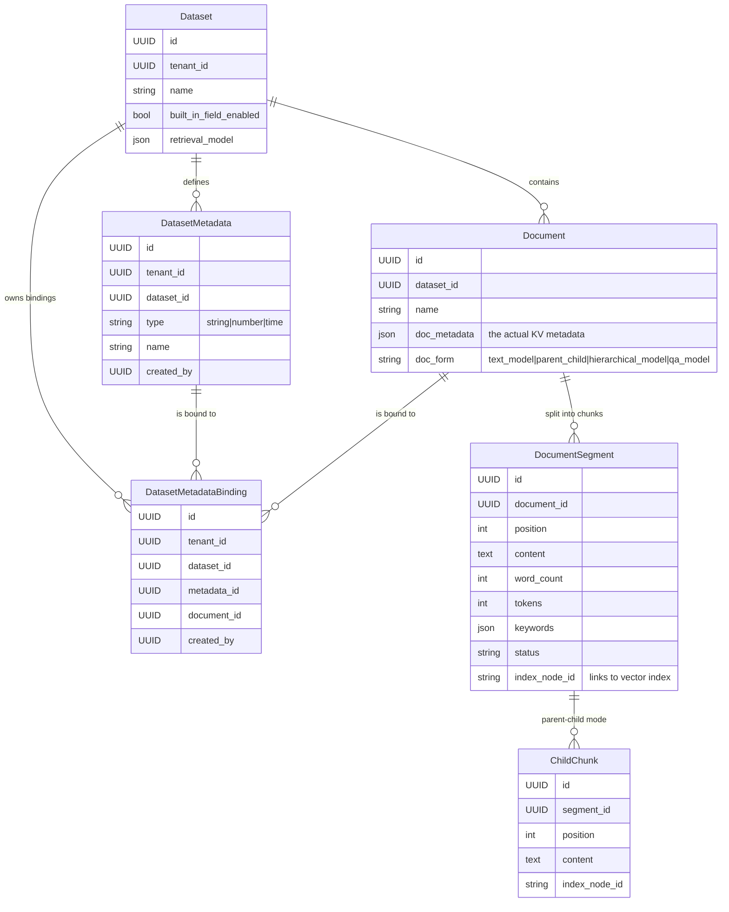
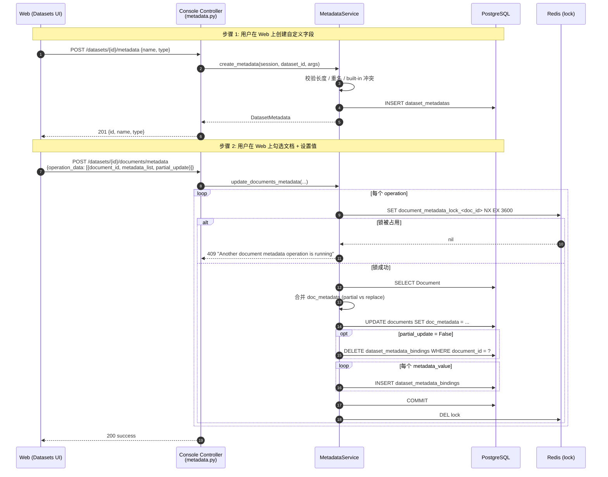
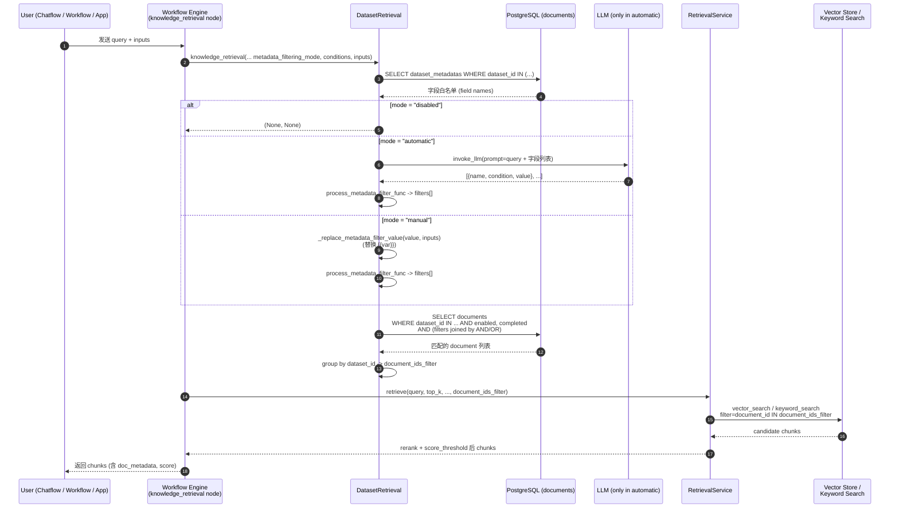

# Dify Chunk（文档片段）Metadata 管理与按 Metadata 过滤 设计文档

> 目标读者：Dify 平台开发者 / RAG 检索相关维护者
>
> 范围：覆盖 Dify 中**知识库（Dataset / Knowledge Base）场景下**的 chunk（`DocumentSegment`） metadata 的 **Schema 管理、存储更新、过滤查询**三大能力，附 Mermaid 设计图、流程图、时序图。

---

## 1. 关键结论（TL;DR）

- **Metadata 不存放在 chunk（`DocumentSegment`）上**，而是存放在 chunk 的**父文档 `Document.doc_metadata`（JSON 字段）** 上。同一文档的所有 segment 共享同一份 metadata。
- **Schema 表**：`dataset_metadatas`（每个 Dataset 一组字段定义）+ `dataset_metadata_bindings`（Dataset-Metadata 与 Document 的多对多绑定关系）。
- **过滤是文档级过滤**：先用 `doc_metadata` 上的 JSON 操作符（`as_string()` / `as_float()` / `is_(None)` / `like` / `in_` …）从 `documents` 表中筛出匹配的 `document_id`，再把 `document_ids_filter` 传给 `RetrievalService.retrieve()`，在向量 / 关键词检索阶段对 chunk 做硬约束。
- **两种模式**：`manual`（用户在 workflow 节点手工配置条件）和 `automatic`（LLM 从自然语言 query 中自动抽取条件）。
- **三种字段类型**：`string` / `number` / `time`，决定可用操作符。
- **变量插值**：过滤值里支持 `{{var_name}}` 占位符，运行时用工作流输入 `inputs` 替换。
- **没有外部元数据源同步**：只有内置字段（`document_name` / `uploader` / `upload_date` / `last_update_date` / `source`）以及用户在控制台手工创建的自定义字段；外部知识库（Notion / 站点 / 文件上传）只把 `source` 字段填上来源类型。

---

## 2. 关键源码索引

| 关注点 | 文件 | 关键行 |
| --- | --- | --- |
| Chunk 模型 `DocumentSegment` | `api/models/dataset.py` | 843-1042 |
| 子 chunk 模型 `ChildChunk`（parent-child 模式） | `api/models/dataset.py` | 1057-1114 |
| Document 模型 + `doc_metadata` 字段 | `api/models/dataset.py` | 497-657, **565** |
| `Dataset.doc_metadata` schema 属性 | `api/models/dataset.py` | 395-445 |
| `DatasetMetadata` / `DatasetMetadataBinding` | `api/models/dataset.py` | 1524-1573 |
| `DatasetMetadataType` 枚举 | `api/models/enums.py` | 254-259 |
| 内置字段常量 | `api/core/rag/index_processor/constant/built_in_field.py` | 1-19 |
| Metadata Service（CRUD） | `api/services/metadata_service.py` | 23-338 |
| 批量更新文档 metadata | `api/services/metadata_service.py` | 234-303 |
| Built-in 字段启用 / 禁用 | `api/services/metadata_service.py` | 174-232 |
| 控制台 Metadata API | `api/controllers/console/datasets/metadata.py` | 1-205 |
| 单文档 metadata PUT | `api/controllers/console/datasets/datasets_document.py` | 1110-1154 |
| 外部 Service API | `api/controllers/service_api/dataset/metadata.py` | 1-316 |
| Pydantic Schema（filter / conditions） | `api/core/rag/entities/metadata_entities.py` | 1-82 |
| **过滤主逻辑**（SQL 拼装） | `api/core/rag/retrieval/dataset_retrieval.py` | 1391-1479 |
| **过滤条件 → SQL 表达式** | `api/core/rag/retrieval/dataset_retrieval.py` | 1557-1634 |
| 自动模式（LLM 抽条件） | `api/core/rag/retrieval/dataset_retrieval.py` | 1495-1555 |
| `{{var}}` 替换 | `api/core/rag/retrieval/dataset_retrieval.py` | 1481-1493 |
| 过滤后用 `document_ids_filter` 检索 | `api/core/rag/retrieval/dataset_retrieval.py` | 670-720 |
| `RetrievalService.retrieve(document_ids_filter=)` | `api/core/rag/datasource/retrieval_service.py` | 199-230 |
| 命中测试服务（hit testing） | `api/services/hit_testing_service.py` | 105-189 |
| Knowledge Retrieval workflow 节点 | `api/core/workflow/nodes/knowledge_retrieval/` | 整目录 |
| 前端类型定义 | `web/app/components/workflow/nodes/knowledge-retrieval/types.ts` | 42-110 |
| 前端可用操作符（按类型） | `web/app/components/workflow/nodes/knowledge-retrieval/components/metadata/condition-list/utils.ts` | 26-62 |
| 前端 metadata 配置 hook | `web/app/components/workflow/nodes/knowledge-retrieval/hooks/use-knowledge-metadata-config.ts` | 41-130 |

---

## 3. 数据模型设计

### 3.1 实体关系



> 注意：`DocumentSegment` 上**没有** metadata 字段。所有 chunk 的 metadata 在检索时通过 `document_id` 反查 `Document.doc_metadata` 得到。

### 3.2 `Document.doc_metadata` 字段

`api/models/dataset.py:565`

```python
doc_metadata = mapped_column(AdjustedJSON, nullable=True)
```

带 JSONB 索引：

```python
adjusted_json_index("document_metadata_idx", "doc_metadata")
```

这让 `doc_metadata->>'field_name'` 之类的 JSON 路径查询能走索引，过滤时延友好。

### 3.3 内置字段

`api/core/rag/index_processor/constant/built_in_field.py`

```python
class BuiltInField(StrEnum):
    document_name    = auto()   # str
    uploader         = auto()   # str
    upload_date      = auto()   # time
    last_update_date = auto()   # time
    source           = auto()   # str   e.g. file_upload / website / notion
```

`Dataset.doc_metadata` 属性在 `built_in_field_enabled=True` 时，会把这 5 个字段附加到 schema 中返回给前端，方便 UI 提示。

### 3.4 Pydantic 过滤条件 Schema

`api/core/rag/entities/metadata_entities.py`

```python
SupportedComparisonOperator = Literal[
    # 字符串 / 数组
    "contains", "not contains", "start with", "end with",
    "is", "is not", "empty", "not empty", "in", "not in",
    # 数字
    "=", "≠", ">", "<", "≥", "≤",
    # 时间
    "before", "after",
]

class Condition(BaseModel):
    name: str
    comparison_operator: SupportedComparisonOperator
    value: str | list[str] | int | float | None

class MetadataFilteringCondition(BaseModel):
    logical_operator: Literal["and", "or"] | None = "and"
    conditions: list[Condition] | None = None
```

---

## 4. Metadata Schema 管理（CRUD）

### 4.1 控制台 / Service API 端点

`api/controllers/console/datasets/metadata.py` & `api/controllers/service_api/dataset/metadata.py`：

| Method | Path | 说明 |
| --- | --- | --- |
| POST | `/datasets/<id>/metadata` | 创建自定义 metadata 字段 |
| GET  | `/datasets/<id>/metadata` | 列出所有 metadata 字段（含绑定数） |
| PATCH | `/datasets/<id>/metadata/<metadata_id>` | 重命名字段（会传播到所有 `Document.doc_metadata`） |
| DELETE | `/datasets/<id>/metadata/<metadata_id>` | 删除字段（同时从所有 `Document.doc_metadata` 移除 key） |
| GET | `/datasets/metadata/built-in` | 列出 5 个内置字段定义 |
| POST | `/datasets/<id>/metadata/built-in/enable` | 启用内置字段（回填所有 working document） |
| POST | `/datasets/<id>/metadata/built-in/disable` | 停用内置字段 |
| POST | `/datasets/<id>/documents/metadata` | 批量更新一个或多个文档的 metadata 值 |

### 4.2 Metadata Service 关键方法

`api/services/metadata_service.py`：

```python
class MetadataService:
    @staticmethod
    def create_metadata(session, dataset_id, metadata_args, current_user, current_tenant_id) -> DatasetMetadata:
        # 1. 校验 name 长度 <= 255
        # 2. 校验 name 唯一（同 dataset 内 + 不与 built-in 重名）
        # 3. insert dataset_metadatas
        ...

    @staticmethod
    def update_metadata_name(session, dataset_id, metadata_id, name, user):
        # 同步重命名 DatasetMetadata.name
        # 并遍历所有 dataset_metadata_bindings 对应的 Document.doc_metadata
        # 用 deep-copy 替换 key
        ...

    @staticmethod
    def delete_metadata(session, dataset_id, metadata_id):
        # 删除 DatasetMetadata
        # 找到所有 binding -> document，deep-copy 文档 doc_metadata 后 pop 掉该 key
        ...

    @staticmethod
    def enable_built_in_field(session, dataset):
        # 遍历 working documents，注入 5 个 built-in 字段
        # dataset.built_in_field_enabled = True
        ...

    @staticmethod
    def update_documents_metadata(session, dataset, metadata_args, user, tenant_id):
        # 对每个 operation:
        #   1. redis 锁 document_metadata_lock_<doc_id>
        #   2. 加载 Document
        #   3. partial_update ? deep-copy : 新 dict
        #   4. 写入 metadata_list
        #   5. 若 built-in 启用, 重写 5 个 built-in 字段
        #   6. 写回 document.doc_metadata
        #   7. partial_update=False 时, 先 delete bindings
        #      然后为每个 metadata_value 插入 DatasetMetadataBinding
        ...

    @staticmethod
    def knowledge_base_metadata_lock_check(dataset_id, document_id):
        # Redis SETNX, key 为 dataset_metadata_lock_<id> 或 document_metadata_lock_<id>
        # 1h 过期
        ...
```

### 4.3 Schema 维护时序（创建字段 + 写入文档值）



---

## 5. Metadata 存储与更新

### 5.1 文档创建时回填 built-in

`api/services/dataset_service.py:2782-2792`（`DocumentService.save_document_with_dataset_bindings`）：

```python
doc_metadata = {}
if dataset.built_in_field_enabled:
    doc_metadata = {
        BuiltInField.document_name:    name,
        BuiltInField.uploader:         account.name,
        BuiltInField.upload_date:      datetime.datetime.now(datetime.UTC).strftime("%Y-%m-%d %H:%M:%S"),
        BuiltInField.last_update_date: datetime.datetime.now(datetime.UTC).strftime("%Y-%m-%d %H:%M:%S"),
        BuiltInField.source:           data_source_type,   # file_upload / notion / website
    }
if doc_metadata:
    document.doc_metadata = doc_metadata
```

### 5.2 单文档 metadata 更新

`api/controllers/console/datasets/datasets_document.py:1110-1154`：

- 接受 `doc_type` + `doc_metadata`；
- `doc_type` 必须在 `DocumentService.DOCUMENT_METADATA_SCHEMA` 中；
- 按 schema 校验 value 类型，再把白名单内的字段写入 `document.doc_metadata`。

### 5.3 文档改名 → 自动同步内置字段

`api/services/dataset_service.py:2020-2029`：

```python
if dataset.built_in_field_enabled:
    if document.doc_metadata:
        doc_metadata = copy.deepcopy(document.doc_metadata)
        doc_metadata[BuiltInField.document_name] = name
        document.doc_metadata = doc_metadata
```

### 5.4 chunk 索引时不携带 metadata

`api/core/rag/index_processor/processor/paragraph_index_processor.py`（约 200-211 行）构造用于向量化的 `Document` 列表时只填 `dataset_id / document_id / doc_id / doc_hash`，**没有把 `doc_metadata` 写进 vector payload**。在检索时，**按 `document_id` 回查数据库里的 `Document.doc_metadata` 即可拿到 metadata**。

---

## 6. 按 Metadata 过滤 Chunk（核心检索路径）

### 6.1 总体流程图

```mermaid
flowchart TD
    A[用户发起检索<br/>Chatflow / Workflow / Hit Test] --> B{metadata_filtering_mode}
    B -- disabled --> Z[跳过 metadata 过滤]
    B -- manual --> M[读 metadata_filtering_conditions]
    B -- automatic --> L[LLM 抽取 conditions<br/>_automatic_metadata_filter_func]

    M --> P1[变量插值<br/>_replace_metadata_filter_value<br/>把 {{var}} 替换成 inputs]
    P1 --> P2[遍历 conditions<br/>调用 process_metadata_filter_func]
    L --> P2

    P2 --> Q[process_metadata_filter_func<br/>按 comparison_operator 生成 SQLAlchemy filter]
    Q --> R{所有 conditions 处理完?}
    R -- 否 --> P2
    R -- 是 --> S{logical_operator}

    S -- and --> T[document_query = document_query.where(and_(*filters))]
    S -- or --> T2[document_query = document_query.where(or_(*filters))]

    T --> U[SELECT documents WHERE dataset_id IN ... AND filters]
    T2 --> U

    U --> V[得到 document_ids 列表<br/>group by dataset_id]
    V --> W[把 document_ids 传到<br/>RetrievalService.retrieve<br/>document_ids_filter=]
    W --> X[向量 / 关键词 / 全文检索<br/>只在这些文档内查]
    X --> Y[Top-K chunks + rerank]
    Y --> OUTF[返回结果]
```

### 6.2 操作符 → SQL 表达式映射表

`api/core/rag/retrieval/dataset_retrieval.py:1557-1634` 中 `process_metadata_filter_func` 的完整映射：

| 类别 | 操作符（前端枚举） | SQL 表达式 | 备注 |
| --- | --- | --- | --- |
| string | `contains` | `json_field LIKE '%val%'` | `escape_like_pattern` |
| string | `not contains` | `json_field NOT LIKE '%val%'` | |
| string | `start with` | `json_field LIKE 'val%'` | |
| string | `end with` | `json_field LIKE '%val'` | |
| string | `is` | `json_field = val` (str) | |
| string | `=` | 同上 | |
| string | `is not` | `json_field != val` (str) | |
| string | `≠` | 同上 | |
| string | `empty` | `doc_metadata[name] IS NULL` | 不需要 value |
| string | `not empty` | `doc_metadata[name] IS NOT NULL` | 不需要 value |
| string/array | `in` | `json_field IN (...)` | 字符串按 `,` 切 |
| string/array | `not in` | `json_field NOT IN (...)` | 空列表时返回 True/False literal |
| number | `=` | `doc_metadata[name].as_float() = val` | |
| number | `≠` | `... as_float() != val` | |
| number | `>` | `... as_float() > val` | |
| number | `<` | `... as_float() < val` | |
| number | `≥` | `... as_float() >= val` | |
| number | `≤` | `... as_float() <= val` | |
| time | `is` | `... as_string() = val` | |
| time | `before` | `... as_float() < val` | 时间以 float(timestamp) 存 |
| time | `after` | `... as_float() > val` | |

> 实现细节：所有 string 操作都先取 `json_field = DatasetDocument.doc_metadata[name].as_string()`，再走 LIKE；数字 / 时间走 `as_float()`。

### 6.3 主入口函数签名

`api/core/rag/retrieval/dataset_retrieval.py:1391-1479`：

```python
def get_metadata_filter_condition(
    self,
    session: Session,
    dataset_ids: list[str],
    query: str,
    tenant_id: str,
    user_id: str,
    metadata_filtering_mode: str,                                # "disabled" | "automatic" | "manual"
    metadata_model_config: ModelConfig,                          # automatic 模式使用的 LLM 配置
    metadata_filtering_conditions: MetadataFilteringCondition | None,
    inputs: dict[str, Any],                                      # 工作流输入, 用于 {{var}} 替换
) -> tuple[dict[str, list[str]] | None, MetadataFilteringCondition | None]:
    document_query = select(DatasetDocument).where(
        DatasetDocument.dataset_id.in_(dataset_ids),
        DatasetDocument.indexing_status == "completed",
        DatasetDocument.enabled == True,
        DatasetDocument.archived == False,
    )
    filters: list = []
    metadata_condition = None
    if metadata_filtering_mode == "disabled":
        return None, None
    elif metadata_filtering_mode == "automatic":
        automatic_metadata_filters = self._automatic_metadata_filter_func(
            session, dataset_ids, query, tenant_id, user_id, metadata_model_config
        )
        ...
    elif metadata_filtering_mode == "manual":
        if metadata_filtering_conditions:
            conditions = []
            for sequence, condition in enumerate(metadata_filtering_conditions.conditions):
                metadata_name = condition.name
                expected_value = condition.value
                if expected_value is not None and condition.comparison_operator not in ("empty", "not empty"):
                    if isinstance(expected_value, str):
                        expected_value = self._replace_metadata_filter_value(expected_value, inputs)
                conditions.append(Condition(name=metadata_name,
                                            comparison_operator=condition.comparison_operator,
                                            value=expected_value))
                filters = self.process_metadata_filter_func(
                    sequence, condition.comparison_operator, metadata_name, expected_value, filters
                )
            metadata_condition = MetadataFilteringCondition(
                logical_operator=metadata_filtering_conditions.logical_operator,
                conditions=conditions,
            )
    if filters:
        if metadata_filtering_conditions and metadata_filtering_conditions.logical_operator == "and":
            document_query = document_query.where(and_(*filters))
        else:
            document_query = document_query.where(or_(*filters))
    documents = session.scalars(document_query).all()
    metadata_filter_document_ids: dict[str, list[str]] = defaultdict(list) if documents else None
    for document in documents:
        metadata_filter_document_ids[document.dataset_id].append(document.id)
    return metadata_filter_document_ids, metadata_condition
```

### 6.4 过滤结果如何约束后续检索

`api/core/rag/retrieval/dataset_retrieval.py:670-720`（`single_retrieve`）：

```python
if metadata_filter_document_ids:
    document_ids = metadata_filter_document_ids.get(selected_dataset.id, [])
    if document_ids:
        document_ids_filter = document_ids
    else:
        return []  # 当前 dataset 没有匹配文档 -> 直接返回空

results = RetrievalService.retrieve(
    retrieval_method=retrieval_method,
    dataset_id=selected_dataset.id,
    query=query,
    top_k=top_k,
    score_threshold=score_threshold,
    reranking_model=reranking_model,
    reranking_mode=retrieval_model_config.get("reranking_mode", "reranking_model"),
    weights=retrieval_model_config.get("weights", None),
    document_ids_filter=document_ids_filter,   # 关键: 把 metadata 命中的 document_id 作为硬过滤
)
```

`api/core/rag/datasource/retrieval_service.py:199-230`：`RetrievalService.retrieve(document_ids_filter=...)` 把这个列表**透传**到底层 vector store / keyword search 的 `filter` 表达式（如 `document_id in [...]`），从而**只在这些 document 的 chunk 中搜索**。

### 6.5 命中测试 (Hit Testing) 同样走 metadata 过滤

`api/services/hit_testing_service.py:105-189`：

- 把 `retrieval_model.metadata_filtering_conditions` 解析成 `MetadataFilteringCondition`；
- 用 `DatasetRetrieval.get_metadata_filter_condition(..., mode="manual", inputs={})` 算出 `document_ids_filter`；
- `RetrievalService.retrieve(document_ids_filter=...)` 拿到候选 chunks。

> 命中测试只支持 `manual` 模式（前端在 dataset 详情页调试时不允许让 LLM 临时抽条件）。

### 6.6 端到端时序图：用户 query → 按 metadata 过滤 → 返回 chunks



### 6.7 automatic 模式细节

`api/core/rag/retrieval/dataset_retrieval.py:1495-1555`：

1. 取出当前 `dataset_ids` 下的所有 `DatasetMetadata.name`，拼成字段白名单；
2. 用用户在节点里配置的 LLM (`metadata_model_config`) + prompt 模板（`template_prompts.py` 中 `METADATA_FILTER_SYSTEM_PROMPT`），让 LLM 输出 JSON 数组 `[{"metadata_name": "...", "condition": "...", "value": "..."}, ...]`；
3. 把这些 condition 当成 manual 一样走 `process_metadata_filter_func`。

### 6.8 `{{var}}` 变量插值

`api/core/rag/retrieval/dataset_retrieval.py:1481-1493`：

```python
def _replace_metadata_filter_value(self, text: str, inputs: dict[str, Any]) -> str:
    if not inputs:
        return text
    pattern = re.compile(r"\{\{(\w+)\}\}")
    output = pattern.sub(lambda m: str(inputs.get(m.group(1), f"{{{{{m.group(1)}}}}}")), text)
    output = re.sub(r"[\r\n\t]+", " ", output).strip()
    return output
```

例如条件 `department = {{user_dept}}`，工作流输入 `{"user_dept": "Engineering"}`，运行时就变成 `department = "Engineering"`。

---

## 7. 前端 UI 关键点（`web/app/components/workflow/nodes/knowledge-retrieval/`）

### 7.1 操作符按字段类型可选项

`components/metadata/condition-list/utils.ts:26-62`：

| 字段类型 | 允许的操作符 |
| --- | --- |
| string / select | `is`, `is not`, `contains`, `not contains`, `start with`, `end with`, `empty`, `not empty`, `in`, `not in` |
| number | `=`, `≠`, `>`, `<`, `≥`, `≤`, `empty`, `not empty` |
| time | `is`, `before`, `after`, `empty`, `not empty` |

### 7.2 节点类型定义（关键字段）

`types.ts:42-110`：

```typescript
export enum MetadataFilteringModeEnum {
  disabled = 'disabled',
  automatic = 'automatic',
  manual = 'manual',
}

export type KnowledgeRetrievalNodeType = CommonNodeType & {
  query_variable_selector: ValueSelector
  dataset_ids: string[]
  retrieval_mode: RetrievalMode          // multiple / single
  ...
  metadata_filtering_mode?: MetadataFilteringModeEnum
  metadata_filtering_conditions?: MetadataFilteringConditions
  metadata_model_config?: ModelConfig
}
```

### 7.3 UI 写入条件

`hooks/use-knowledge-metadata-config.ts:41-130` 通过 `produce` 把 `{id, name, type, comparison_operator, value}` 写进 `inputs.metadata_filtering_conditions.conditions`，随 workflow schema 持久化，并在运行时由 workflow 引擎读取发往后端。

---

## 8. 外部知识库（External Knowledge Base）的差异

`api/services/external_knowledge_service.py:322` 中 `fetch_external_knowledge_retrieval(..., metadata_condition=...)`：

- 当 `Dataset.provider == "external"` 时，过滤条件**不查本地 `documents.doc_metadata`**，而是把 `MetadataFilteringCondition` 整体透传给外部 API；
- 外部 API 由用户在创建外部知识库时配置（Dify 通过 webhook 调过去）；
- 因此 Dify **不做**外部元数据源同步，只做"传话筒"。

---

## 9. 设计要点 / 约束

1. **粒度 = 文档级，不是 chunk 级**：检索性能更优（先 JSON 过滤拿 `document_id`，再在更小的 chunk 集合中做向量检索），但代价是同一文档的所有 chunk 共享同一份 metadata，**没有 per-chunk 自定义 metadata**。
2. **JSONB + GIN 索引**：`document_metadata_idx` 让 `doc_metadata->>'field'` 类查询走索引。
3. **Redis 锁防并发**：`dataset_metadata_lock_*` / `document_metadata_lock_*`，TTL 1 小时。
4. **删除/重命名字段会传播到所有文档的 `doc_metadata`**：通过 `DatasetMetadataBinding` 找到 `document_id`，再 deep-copy + pop/rename。期间加 dataset 级写锁。
5. **过滤条件顺序**：`process_metadata_filter_func` 内部 `sequence` 当前未在 SQL 中使用，仅用于将来调试；真正决定如何拼 SQL 的是 `logical_operator`。
6. **空值语义**：`empty` = `doc_metadata[name] IS NULL`（key 不存在或值为 null 都算）；`not empty` 反之。
7. **变量插值只在 manual 模式 + string 类型值上做**；number / list 不替换。
8. **automatic 模式必须有 LLM 配置** (`metadata_model_config`)；hit testing 不走 automatic。

---

## 10. 总结：一张大图把整个链路串起来

```mermaid
flowchart LR
    subgraph "Schema 层"
        A1[admin 创建 metadata 字段] --> A2[(dataset_metadatas)]
        A3[admin 启用 built-in 字段] --> A4[(documents.doc_metadata)]
    end

    subgraph "数据层"
        B1[文档入库] --> B2[DocumentService<br/>save_document_with_dataset_bindings]
        B2 --> A4
        B3[admin 勾选文档填值] --> B4[MetadataService<br/>update_documents_metadata]
        B4 --> A4
        B4 --> A5[(dataset_metadata_bindings)]
    end

    subgraph "检索层 (chatflow / workflow / hit test)"
        C1[Knowledge Retrieval 节点] --> C2{filtering_mode}
        C2 -- disabled --> C3[skip]
        C2 -- manual --> C4[conditions + {{var}}]
        C2 -- automatic --> C5[LLM 抽 conditions]
        C4 --> C6[process_metadata_filter_func<br/>转 SQLAlchemy filter]
        C5 --> C6
        C6 --> C7[SELECT documents<br/>AND/OR 拼接]
        A4 -. JSON 查询 .-> C7
        C7 --> C8[document_ids_filter]
        C8 --> C9[RetrievalService.retrieve<br/>document_ids_filter=...]
        C9 --> C10[Vector / Keyword Search<br/>filter=document_id IN ...]
        C10 --> C11[rerank + top_k]
        C11 --> C12[返回 chunks + doc_metadata]
    end
```

---

## 11. 扩展点 / 已知限制

| 方向 | 现状 | 限制 / 改进点 |
| --- | --- | --- |
| Per-chunk metadata | 不支持 | 所有 segment 共享父 doc 的 metadata。若需要，可考虑新增 `document_segments.doc_metadata` 列并复制父文档的元数据后再做段级编辑 |
| 字段索引 | `document_metadata_idx` GIN 索引在 JSONB 上 | 对 `doc_metadata->>'field'` 等值 / LIKE 友好；对 `as_float()` 的范围查询不直接走索引，可能慢 |
| External KB sync | 无 | 没有"把外部 Notion/Confluence 字段映射成 metadata 字段"的 UI，可作为产品改进方向 |
| 自动模式可控性 | LLM 自己抽 | 没有 token 数 / 字段白名单之外的"hint"机制；prompt 在 `template_prompts.py` 中可改 |
| 过滤日志 | 仅 result / score | 没把命中的 metadata value 一并打到日志，做可观测性时需补 |
| 软删除 / 版本 | metadata 字段硬删 | 删除字段会从所有 doc.doc_metadata 抹掉 key；如需"软删"可加 `deleted_at` |

---

## 12. 参考调用栈（从用户 query 到 chunk 的完整路径）

```
Chatflow / Workflow 节点
 └─ core/workflow/nodes/knowledge_retrieval/knowledge_retrieval_node.py
     └─ core/rag/retrieval/dataset_retrieval.DatasetRetrieval
         ├─ get_metadata_filter_condition(...)
         │   ├─ _automatic_metadata_filter_func(...)            # automatic
         │   ├─ _replace_metadata_filter_value(...)             # {{var}} 替换
         │   └─ process_metadata_filter_func(...)               # 操作符 → SQL
         │       └─ SELECT documents WHERE doc_metadata[...]...
         │
         └─ single_retrieve / multiple_retrieve
             └─ core/rag/datasource/retrieval_service.Retriever
                 └─ retrieve(document_ids_filter=document_ids)
                     └─ VectorStore / Keyword Search
                         └─ 返回 chunks
```

至此，**Dify 关于 chunk metadata 管理和按 metadata 过滤**的设计、流程与时序完整呈现。
