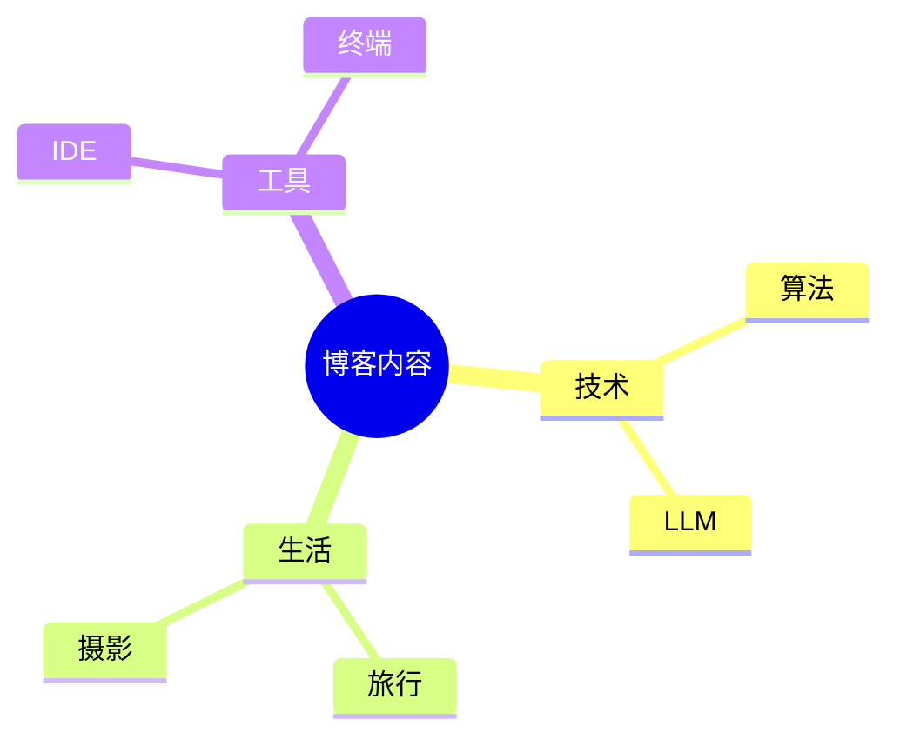
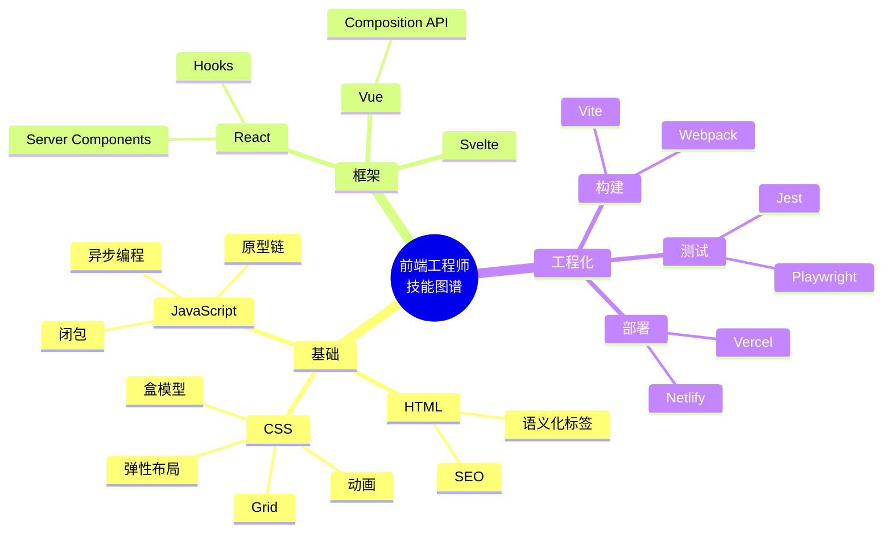
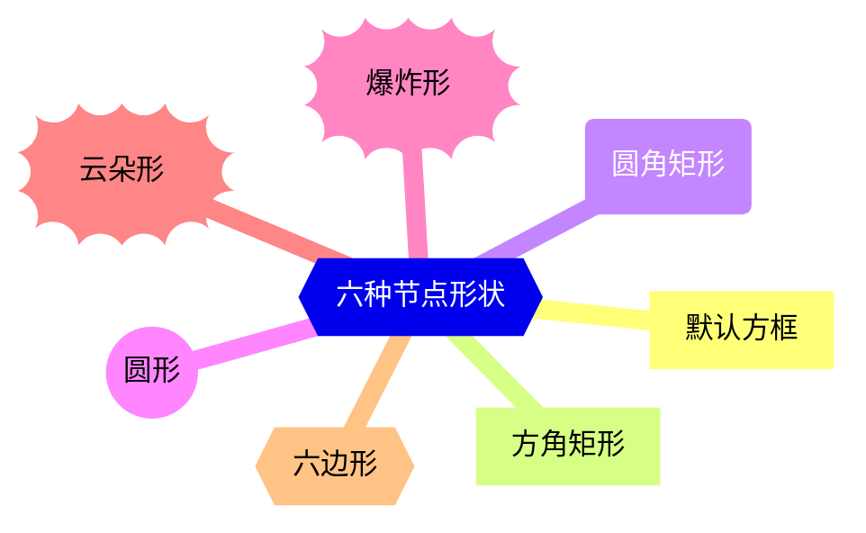
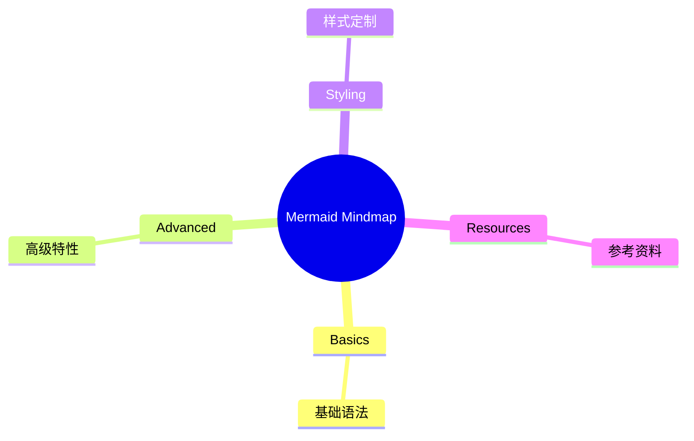
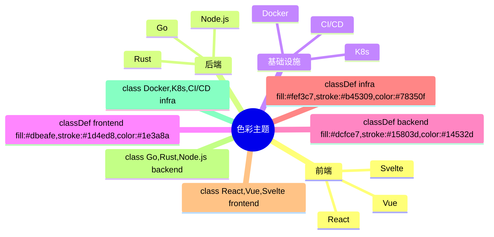
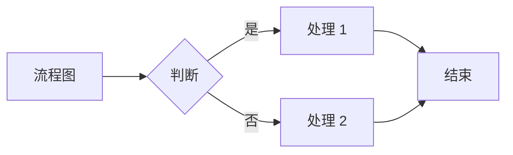
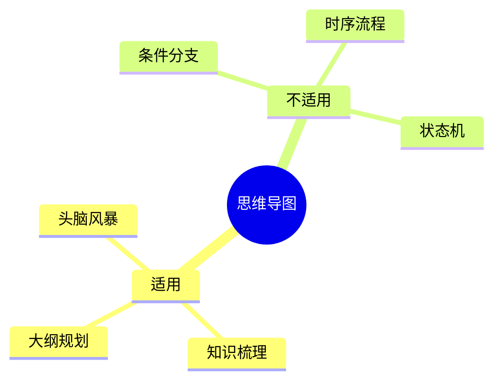
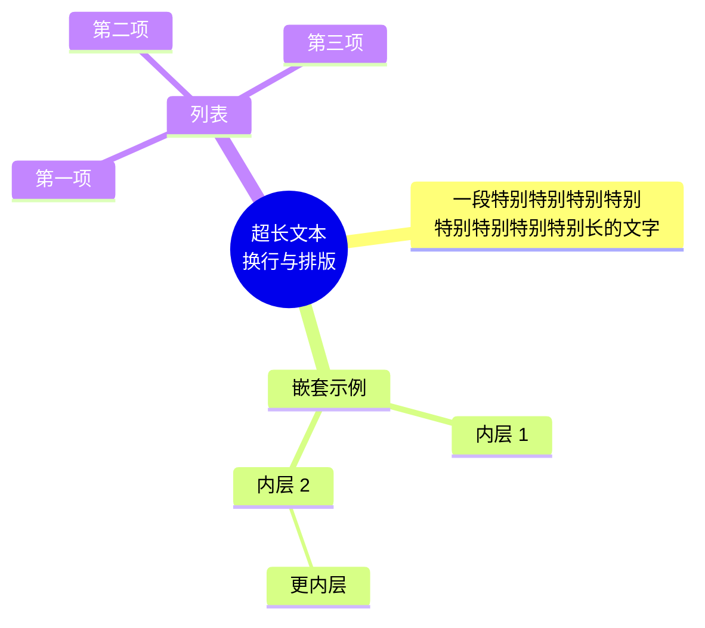
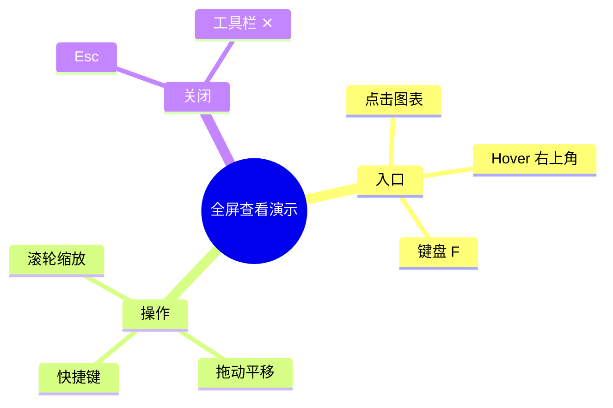

> 这是一篇专门用来测试 Mermaid **思维导图（mindmap）** 渲染效果的博文。本站 [PostLayout](src/layouts/PostLayout.astro) 通过 CDN 动态引入 Mermaid 11 并监听 `pre[data-language="mermaid"]`，所以下面所有用 ` ```mermaid ` 包起来的代码块都会在浏览器端被替换成 SVG 思维导图。

## 一、最基础的思维导图

Mermaid 的 `mindmap` 语法以根节点起头，每往下一级多缩进两个空格。下面的例子演示了一个三级结构的思维导图：

````markdown

````

渲染后长这样：


> 根节点用 `((...))` 包起来就是**圆形**（circle），用 `[...]` 是**矩形**（square），用 `(...))` 是**圆角矩形**（rounded）。其它形状见第三节。

## 二、多级嵌套 + 丰富分支

Mermaid 思维导图**没有层数上限**，缩进越多层级越深。下面是一个 4 层结构的例子，用来展示大纲型思维导图的典型样貌：



## 三、六种节点形状

Mermaid mindmap 支持六种节点形状，仅在**写法上**有区别，渲染时用对应图形呈现：



> 小坑：根节点用 `(( ))` 是圆形，用 `( )` 是圆角矩形；`))((` 是爆炸形；`{{ }}` 是六边形。下表是一个速查：

| 写法 | 形状 | 英文 |
| ------ | ------ | ------ |
| `Text` | 默认（圆角小方块） | default |
| `Text[Text]` | 方角矩形 | square |
| `Text(Text)` | 圆角矩形 | rounded |
| `Text((Text))` | 圆形 | circle |
| `Text))Text((` | 爆炸/不规则 | bang |
| `Text))Text((` | 云朵（与 bang 同语法，靠渲染区分） | cloud |
| `Text{{Text}}` | 六边形 | hexagon |

## 四、节点图标

通过 `::icon(fa fa-xxx)` 语法可以在节点文字前加上 FontAwesome 图标。本站的 Mermaid 11 默认**不会自动加载 FontAwesome 样式表**，需要自己额外引一行（这一步放到博文正文中演示即可，实际项目里应放在布局里）：



> 如果页面没有引入 FontAwesome CSS，图标位置会显示成方块，但**结构仍然能正常渲染**——这正好可以验证我们博客的健壮性。

## 五、用 `classDef` 上色

通过 `classDef` + `:::className` 可以给节点统一上色。下面的例子把不同分类染成不同色系：



> 颜色既支持十六进制也支持英文颜色名，背景填充用 `fill:`、描边用 `stroke:`、文字用 `color:`。可玩性比纯 flowchart 高不少。

## 六、思维导图 vs 流程图

很多人会把 mindmap 和 flowchart 弄混。两者在 Mermaid 中的定位完全不同：





**一句话区别**：流程图强调**走向与分支**，思维导图强调**层级与归类**。如果你想表达"做一件事要分几步走"，选 flowchart；如果你想表达"一个主题能拆成几大块"，选 mindmap。

## 七、嵌套节点与超长文本

Mermaid 思维导图对长文本友好，会自动换行；也支持**节点内嵌套子分支**（虽然不常用）：



> 换行使用 `<br/>`（HTML 风格），这是 Mermaid 全局通用约定。

## 八、总结与常见问题

把这次测试的要点收个尾：

1. **根节点必须存在**，否则整张图不渲染。建议写成 `root((主题))` 这种最稳的圆形根。
2. **缩进决定层级**——两级用 2 空格，三级用 4 空格，依次类推；不要用 Tab。
3. **形状用括号对决定**——`[]`、`())`、`((` 、`{{}}` 都有含义。
4. **多张思维导图可以共存**——本页面已经连续放了 8 张，全部独立渲染。
5. **CDN 加载延迟**——首次打开会看到约 100ms 的空白，然后 SVG 突然出现，这是正常行为。

如果上面所有 ` ```mermaid ` 代码块都正常显示了彩色思维导图，那么说明本博客的 Mermaid 集成完全 work，可以放心在未来的文章里使用 mindmap 来做大纲梳理和知识地图了 🎉。

## 九、全屏查看（点图放大）

当思维导图层级很深、文字很多时，页面里会显得拥挤。本站给每张 Mermaid 图表都加了一键全屏能力：

- **点击图表任意位置** → 弹出全屏 Modal
- **Hover 时右上角的展开图标** → 同样的入口
- **键盘 Tab 聚焦图表后按 F** → 也能进入

进入全屏后能做的事：

| 快捷键 / 操作 | 效果 |
| -------------- | ------ |
| 鼠标滚轮（Ctrl/⌘ 修饰） | 围绕光标缩放 |
| 鼠标拖动 | 平移图表 |
| `+` / `−` | 工具栏按钮或快捷键缩放 |
| `0` | 复位到 100% |
| `{}` 按钮 | 切换查看 Mermaid 源码 |
| `Esc` / 关闭按钮 | 退出全屏 |

打开后效果类似这样（直接点上面任意一张图试试）：



## 十、导出为 SVG

工具栏右侧的下载按钮（[⬇]）点了之后直接导出当前图表为 **SVG 矢量**——可拖进 Figma / Illustrator / Inkscape 编辑、放进 Markdown 或任意富文本编辑器、也能转 PDF / 嵌进 PPT。

文件名自动取自当前文章的 slug + 图序号，例如本页第一张图导出为 `mermaid-mindmap-test-01.svg`。

> 实现细节：导出前会对 SVG 做一次"清洗"——补 `xmlns` / `xmlns:xlink`、补当前主题的背景色 `<rect>`、把当前画布上的 `transform: scale() translate()` 全部归零、**内联一份 Mermaid 主题 CSS**（`.node rect`、`.edgePath .path` 等 class 样式必须嵌在 SVG 内部才能在浏览器 / Figma 里生效），并把 `viewBox` 解析出的真实长边缩放到 **至少 1200px**——避免导出后看着像缩略图。这样导出来的图**不带 Modal 内的临时缩放状态**，是干净的原始版本。
