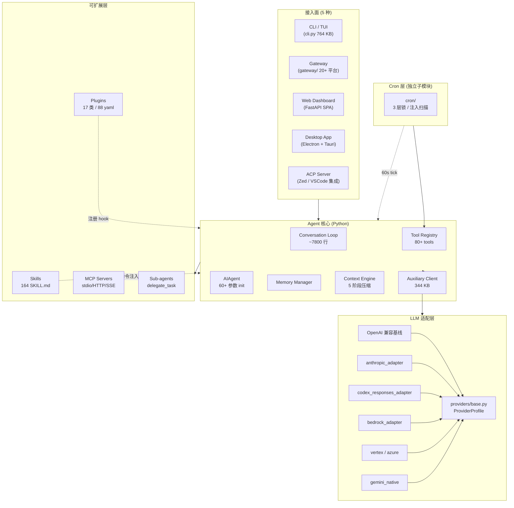

# 00 · 项目总览

## 一句话定位

**Hermes Agent** = Nous Research 出品的"**自演化、模型无关**"的 AI agent 操作系统。
不是 LLM 包装,而是带**持久记忆、定时调度、子代理编排、多平台分发、MCP、可插拔沙箱**的完整运行环境。

- 仓库: <https://github.com/NousResearch/Hermes-Agent>
- 文档: <https://hermes-agent.nousresearch.com>
- License: MIT
- 当前版本: Python `0.18.2`,Node 工作区 `1.0.0`
- 维护方: Nous Research
- Discord / X:Nous Research 官方

---

## 核心特性(README 直接引用)

> "The self-improving AI agent built by Nous Research"

- ✅ 自带**学习闭环**:运行中创建技能、复盘历史、随使用变好
- ✅ **会话搜索 + LLM 摘要**(FTS5 over state.db)
- ✅ **Honcho dialectic user modeling**(可选外部记忆 provider)
- ✅ 兼容 **agentskills.io** 开放技能标准
- ✅ **多平台消息网关**:Telegram / Discord / Slack / WhatsApp / Signal / 飞书 / iMessage / Matrix / ...
- ✅ **完整 TUI**:多行编辑、斜杠自动补全、流式工具输出、中断-重定向
- ✅ **可插拔模型**:OpenAI、Anthropic、OpenRouter、Bedrock、Vertex、Azure、Codex、HuggingFace、Ollama、自定义
- ✅ **MCP 客户端/服务端**(双向)
- ✅ **6 种执行沙箱**:local / docker / ssh / singularity / modal / daytona
- ✅ **Cron 自动化**(网关内置 60s ticker)
- ✅ **Mixture-of-Agents**(MoA)循环
- ✅ **ACP(Agent Client Protocol)** 编辑器集成

---

## 设计哲学

| 原则 | 体现 |
|------|------|
| **模型无关** | 通过 OpenAI 兼容协议 + 自定义 adapter 抽象,30+ provider 同构 |
| **可插拔抽象** | `MemoryProvider` / `ContextEngine` / `BaseEnvironment` / `PluginContext` 全部 ABC |
| **多接入面同核心** | CLI / TUI / Gateway / Web / Desktop / ACP 都驱动同一个 `run_conversation` |
| **自演化** | Curator 自动合并/归档/复活技能 |
| **安全优先** | YOLO 模式 import 时冻结、cron 注入扫描、sandbox 6 backend、approval contextvars |
| **生产级可观测** | Observer Hooks 契约 + Langfuse 插件 + shell_hooks bridge |
| **桌面级工具链** | prompt_toolkit / Rich / pydantic / tenacity / croniter / pywinpty |

---

## 顶层架构图



---

## 数据流一览(一轮交互)

```mermaid
sequenceDiagram
    autonumber
    actor U as 用户
    participant Loop as Conversation Loop
    participant Mem as Memory Mgr
    participant Ctx as Context Engine
    participant LLM as LLM Provider
    participant Reg as Tool Registry
    participant Hook as Hooks (40+)
    participant Aux as Auxiliary Client

    U->>Loop: 输入消息
    Loop->>Mem: prefetch_all()
    Loop->>Ctx: should_compress?
    alt 上下文超长
        Ctx->>Aux: 摘要(走小模型)
        Aux-->>Ctx: 压缩摘要
    end
    Loop->>LLM: chat(messages + tool schemas)
    LLM-->>Loop: response(content + tool_calls)
    Loop->>Hook: pre_tool_call(每个)
    Hook-->>Loop: allow / block / inject context
    Loop->>Reg: handle_function_call()
    Reg-->>Loop: result
    Loop->>Hook: post_tool_call
    Loop->>Mem: sync_turn()
    Loop-->>U: 流式输出
```

---

## 与"普通 Agent 框架"的关键差异

| 维度 | 普通框架 | Hermes |
|------|----------|--------|
| 模型 | 通常绑定 1 个 provider | 30+ provider + 自定义 adapter |
| 上下文 | 简单截断 | 5 阶段压缩 + frozen snapshot + 引用语法 |
| 记忆 | 偶尔有 | 三层:文件 / SQLite / 8 个外部 provider |
| 工具 | 注册表 + schema | AST 自注册 + check_fn TTL + Tool Search bridge |
| 多 agent | 偶尔有 | DELEGATE_BLOCKED_TOOLS + 角色编排 + 异步后台队列 |
| 调度 | 通常无 | 完整 cron 系统,3 层锁,网关内置 ticker |
| 沙箱 | 偶尔有 Docker | 6 种 backend 可热切换 |
| 沙箱逃逸防御 | 基本无 | threat_patterns + cron 注入扫描 + shell_hooks 白名单 |
| 自演化 | 无 | Curator 自动合并/归档技能 |
| Hooks | 1-2 个 | 40+ Python hook + shell 脚本 bridge |
| 平台分发 | CLI only | CLI + TUI + 20+ 网关 + Web + Desktop + ACP |
| MCP | 通常仅客户端 | 客户端(250 KB)+ 服务端(36 KB)双向 |
| 安全 | YOLO 开关 | YOLO 在 import 时冻结,绕不过 |

---

## 不适合场景(诚实评价)

- **轻量 demo / prototype**:太重,启动慢,理解成本高
- **纯前端 SPA 嵌入**:Python 后端要求高
- **极致低延迟**:每个 hook、approval、context fence 都有开销
- **预算极小**:30+ provider 抽象、6 种 sandbox 抽象的学习曲线高

---

## 适合学习/借鉴的点(面试可聊)

1. **Provider 抽象的设计**(Profile dataclass 而非 20 个 boolean)
2. **frozen snapshot 模式**(保 cache 的精髓)
3. **`<memory-context>` 围栏 + 流式 scrubber**(防注入的巧思)
4. **DELEGATE_BLOCKED_TOOLS**(子代理工具集裁剪原则)
5. **心跳检测替代 wall-clock 超时**(防止误杀)
6. **AST 扫描自注册**(零配置工具发现)
7. **Curator 自演化**(LLM-as-architect 的实战)
8. **Observer Hooks 契约 + shell bridge**(可观测性 + 外部脚本介入)
9. **三层 cron 锁 + 优雅降级**(并发与可靠性的平衡)
10. **6 backend 共享 ProcessHandle 协议**(抽象层设计范例)

详见 `18-interview-questions.md`。