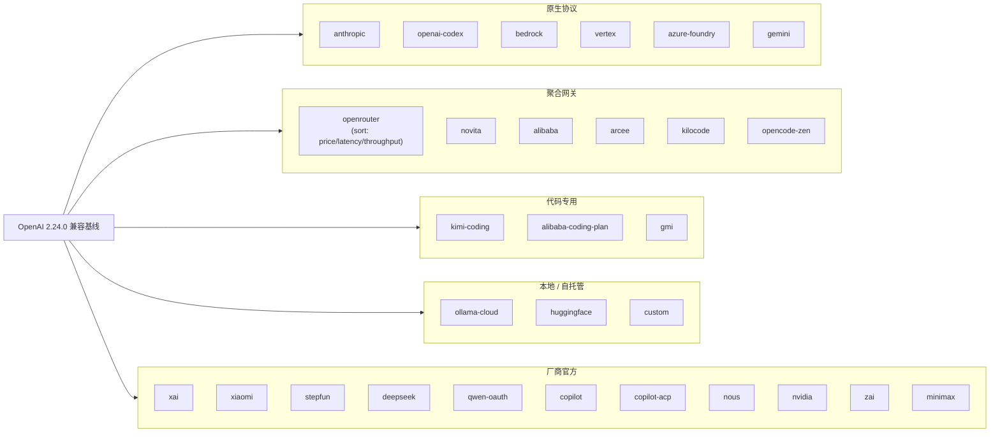

# 01 · 模块清单与技术栈

## 目录结构

```
D:\hans\proj\hermes-agent\
├── agent/                  # 100+ 模块,核心 agent 逻辑(~3.7 MB Python)
├── hermes_cli/             # CLI 命令(~147 文件)
├── gateway/                # 多平台消息网关
├── tools/                  # 自注册工具模块
├── providers/              # Provider profile 基类
├── plugins/                # 插件(17 类,88 个 plugin.yaml)
├── skills/                 # 内置技能(164 SKILL.md)
├── optional-skills/        # 可选技能
├── optional-mcps/          # 可选 MCP 服务器目录
├── cron/                   # 内置调度器
├── acp_adapter/            # Agent Client Protocol 服务器
├── tui_gateway/            # TUI 后端
├── apps/                   # 桌面 + Bootstrap Installer
│   ├── desktop/            # Electron 桌面
│   ├── bootstrap-installer/ # Tauri(Rust)安装器
│   └── shared/
├── ui-tui/                 # React + Ink TUI
├── web/                    # FastAPI Dashboard SPA
├── website/                # 营销 / 文档站
├── docs/                   # 文档
├── locales/                # i18n(en, es, zh-CN, ur-pk)
├── docker/                 # Dockerfile + docker-compose
├── nix/                    # Nix flake
├── packaging/              # Homebrew formula
├── scripts/                # 安装/工具脚本
├── tests/                  # pytest 套件(~2000+ 文件)
├── datagen-config-examples/ # 数据生成配置样例
├── cli-config.yaml.example # 完整配置模板(~77 KB)
├── .env.example            # 环境变量样例(~24 KB)
├── pyproject.toml          # Python 包元数据
├── package.json            # Node 工作区根
└── uv.lock                 # uv 锁文件
```

---

## 核心包(Python)

`pyproject.toml:357` 声明的 find.packages:

| 包名 | 职责 |
|------|------|
| `agent` | AIAgent、conversation_loop、context_compressor、memory_manager、provider adapter |
| `tools` | 80+ 工具模块 + Tool Registry |
| `hermes_cli` | CLI 主程序 + 147 个命令/工具模块 |
| `gateway` | 多平台消息网关(20+ 平台) |
| `tui_gateway` | TUI 网关后端 |
| `cron` | 调度器(独立子模块,可单独使用) |
| `acp_adapter` | Agent Client Protocol 服务器(Zed / VSCode) |
| `plugins` | 插件发现与加载 |
| `providers` | Provider profile 抽象基类 |

入口点(`pyproject.toml:307-310`):

| 命令 | 入口 |
|------|------|
| `hermes` | `hermes_cli.main:main` |
| `hermes-agent` | `run_agent:main` |
| `hermes-acp` | `acp_adapter.entry:main` |

---

## 关键模块清单

### agent/ 核心

| 文件 | 大小 | 职责 |
|------|------|------|
| `conversation_loop.py` | ~308 KB / ~7800 行 | **主循环** |
| `agent_init.py` | 108 KB | 60+ 参数的 `AIAgent.__init__` |
| `context_compressor.py` | 161 KB | **5 阶段压缩算法** |
| `context_engine.py` | - | ContextEngine ABC |
| `memory_manager.py` | 47 KB | 记忆管理 + 流式 scrubber |
| `memory_provider.py` | - | MemoryProvider ABC |
| `conversation_compression.py` | - | 压缩锁 + 守护线程 |
| `auxiliary_client.py` | **344 KB**(最大) | 辅助任务路由(压缩/摘要/Curator) |
| `anthropic_adapter.py` | 123 KB | Anthropic 原生协议 |
| `codex_responses_adapter.py` | 64 KB | OpenAI Responses 协议 |
| `codex_runtime.py` | 40 KB | Codex 运行时 |
| `bedrock_adapter.py` | 55 KB | AWS Bedrock |
| `azure_identity_adapter.py` | 24 KB | Azure AD 认证 |
| `vertex_adapter.py` | 9 KB | GCP Vertex |
| `gemini_native_adapter.py` | 39 KB | Gemini 原生 |
| `chat_completion_helpers.py` | 158 KB | Chat Completions 工具 |
| `tool_executor.py` | 82 KB | 工具执行编排 |
| `prompt_builder.py` | 99 KB | 三段式 prompt 组装 |
| `agent_runtime_helpers.py` | 150 KB | 运行时辅助 |
| `curator.py` | 87 KB | **技能自演化** |
| `moa_loop.py` | 54 KB | Mixture-of-Agents |
| `skill_commands.py` | 29 KB | 技能命令解析 |
| `skill_utils.py` | 32 KB | 技能工具 |
| `skill_bundles.py` | - | 技能 bundle |
| `skill_preprocessing.py` | - | 技能预处理 |
| `coding_context.py` | 39 KB | coding 模式上下文 |
| `learning_graph.py` | 11 KB | 技能使用图谱 |
| `insights.py` | 40 KB | `/insights` 命令后端 |
| `account_usage.py` | 28 KB | 账户用量 |
| `credential_pool.py` | 112 KB | 多账号凭证轮转 |
| `fallback_config.py` | - | Provider fallback 链 |
| `reasoning_timeouts.py` | - | 推理模型超时 |
| `redact.py` | 37 KB | 日志脱敏 |
| `file_safety.py` | 28 KB | 文件路径安全 |
| `secret_scope.py` | - | 密钥作用域 |
| `credential_persistence.py` | - | 凭证持久化 |
| `trajectory.py` | - | 轨迹(用于 RL) |
| `lsp/` | - | LSP(语言服务器协议) |
| `transports/` | - | 传输层抽象 |
| `pet/` | - | Honcho dialectic 子系统 |

### tools/ 工具集(80+)

| 类别 | 代表 |
|------|------|
| 终端 | `terminal_tool.py`(6 backend)+ `process_registry.py` |
| 文件 | `file_tools.py`(211 KB)、`file_operations.py`、`patch.py`、`patch_parser.py`、`search_files.py`、`write_approval.py` |
| 网络 | `web_tools.py`(search/extract)、`browser_tool.py`(210 KB)+ supervisor |
| 代码 | `execute_code`(80 KB,Python sandbox) |
| 记忆 | `memory_tool.py`、`session_search_tool.py`(FTS5) |
| 技能 | `skill_manager_tool.py`、`skills_tool.py`、`skills_hub.py`、`skill_usage.py`、`skills_guard.py`、`skills_ast_audit.py`、`skills_sync.py` |
| 定时 | `cronjob_tools.py`(57 KB) |
| 子代理 | `delegate_tool.py`(157 KB)、`async_delegation.py`(24 KB) |
| MCP | `mcp_tool.py`(250 KB)、`mcp_stdio_watchdog.py`、`mcp_oauth.py`、`mcp_oauth_manager.py` |
| 视觉 | `image_generation.py`(67 KB)、`video_generation.py`、`vision_analyze.py`、`text_to_speech.py`(含 NeuTTS local)、`transcription.py` |
| 平台 | `discord_tool.py`、`feishu_*.py`、`x_search.py`、`yuanbao_tools.py` |
| 通信 | `send_message`(跨平台投递)、`clarify`(交互式追问)、`todo` |
| 安全 | `tirith.py`(URL 安全)、`threat_patterns.py`、`osv_check.py`、`path_security.py`、`credential_files.py` |
| 工具 | `tool_guardrails.py`、`tool_output_limits.py`、`tool_result_storage.py`、`tool_result_classification.py`、`file_state.py` |

### tools/environments/ 6 种沙箱

| 文件 | 用途 |
|------|------|
| `base.py` | `BaseEnvironment` ABC + `ProcessHandle` Protocol |
| `local.py` | 默认本地执行(最快) |
| `docker.py` | Docker 容器 |
| `ssh.py` | 远程 SSH |
| `singularity.py` | Singularity SIF + overlays |
| `modal.py` | Modal 沙箱 |
| `managed_modal.py` | Nous 托管的 Modal |
| `daytona.py` | Daytona serverless 持久云 |

### cron/ 调度器(独立子模块)

```
cron/
├── __init__.py         # 公共 API
├── jobs.py             # 任务定义、parse_schedule、3 层锁
├── scheduler.py        # tick()、prompt-injection scanner
├── scheduler_provider.py
├── suggestions.py      # 调度建议
└── blueprint_catalog.py # 28 KB 蓝图库
```

### plugins/ 插件(17 类)

| 类别 | 示例 |
|------|------|
| `model-providers/` | 30+ 目录:anthropic, openai-codex, openrouter, bedrock, vertex, azure-foundry, ollama-cloud, alibaba, qwen-oauth, xai, nous, ... |
| `memory/` | 8 个外部 provider:honcho, hindsight, mem0, openviking, retaindb, byterover, supermemory, holographic |
| `context_engine/` | (当前空,LCM-style 占位) |
| `cron_providers/` | cron 后端变体 |
| `image_gen/`, `video_gen/` | 多模态生成 |
| `browser/` | 浏览器变体 |
| `kanban/` | 看板 |
| `observability/` | langfuse, nemo_relay |
| `disk-cleanup/` | 磁盘清理 |
| `dashboard_auth/` | Dashboard 认证 |
| `security-guidance/` | 安全提示 |
| `hermes-achievements/` | 成就系统 |
| `platforms/` | 平台集成 |
| `google_meet/`, `spotify/`, `teams_pipeline/`, `web/` | 第三方集成 |

### skills/ 内置技能(15 大类 164 SKILL.md)

```
skills/
├── apple/                # Apple 生态
├── autonomous-ai-agents/
├── computer-use/
├── creative/
├── data-science/
├── dogfood/
├── email/
├── github/
├── media/
├── mlops/
├── note-taking/
├── productivity/
├── research/
├── smart-home/
├── social-media/
├── software-development/
└── yuanbao/
```

### tests/ 测试(2000+ test_*.py)

```
tests/
├── conftest.py            # 35 KB
├── acp/ acp_adapter/
├── agent/ agent/lsp/ agent/transports/
├── ci/ cli/ computer_use/
├── cron/
├── dashboard/ docker/
├── e2e/ e2e/matrix_xsign_bootstrap/
├── fakes/ fixtures/
├── gateway/ gateway/platforms/ gateway/relay/
├── hermes_cli/ hermes_state/
├── honcho_plugin/ openviking_plugin/
├── integration/ manual/
├── plugins/ plugins/browser/ plugins/dashboard_auth/
│   plugins/image_gen/ plugins/memory/
│   plugins/model_providers/ plugins/platforms/photon/
│   plugins/video_gen/
├── providers/
├── run_agent/
├── scripts/ secret_sources/ skills/ stress/
```

---

## 技术栈

### 语言版本

| 语言 | 版本 | 用途 |
|------|------|------|
| Python | `>=3.11,<3.14` | 主体(避开 cp314 wheel 缺口) |
| TypeScript | Node `>=20` | TUI / Web / Desktop |
| Rust | Tauri | Bootstrap Installer |

### Python 核心依赖(`pyproject.toml`)

| 库 | 版本 | 用途 |
|----|------|------|
| `openai` | 2.24.0 | OpenAI 兼容基线 client |
| `anthropic` | 0.87.0(可选) | Anthropic 原生协议 |
| `boto3` | - | Bedrock |
| `google-auth` | - | Vertex |
| `azure-identity` | - | Azure |
| `mistralai` | 2.4.8 | Mistral |
| `httpx[socks]` | 0.28.1 | HTTP + SOCKS 代理 |
| `websockets` | 15.0.1 | WebSocket |
| `fastapi` | >=0.104,<1 | Web Dashboard |
| `uvicorn[standard]` | - | ASGI 服务器 |
| `python-multipart` | - | multipart 上传 |
| `starlette` | 1.0.1(CVE-patched) | FastAPI 底层 |
| `prompt_toolkit` | 3.0.52 | TUI |
| `rich` | 14.3.3 | 终端美化 |
| `simple-term-menu` | - | 菜单 |
| `Pillow` | 12.2.0 | 图像处理 |
| `Markdown` | 3.10.2 | Markdown 解析 |
| `pyyaml` | - | YAML |
| `ruamel.yaml` | - | 保留注释的 YAML |
| `pydantic` | 2.13.4 | 数据模型 |
| `python-dotenv` | 1.2.2 | .env 加载 |
| `fire` | - | CLI 框架 |
| `Jinja2` | - | 模板 |
| `croniter` | 6.0.0 | cron 表达式解析 |
| `tenacity` | - | 重试 |
| `pywinpty` / `ptyprocess` | - | Windows / Unix PTY |
| `psutil` | - | 进程信息 |
| `pathspec` | - | 路径匹配(.gitignore 风格) |
| `tzdata` | - | Windows tz |
| `cryptography` | 46.0.7 | 加密 |
| `PyJWT[crypto]` | - | JWT |
| `defusedxml` | - | 防 XXE |
| `mcp` | 1.26.0 | MCP 协议 |
| `aiosqlite` | - | 异步 SQLite |

### Node 关键依赖(`package.json`)

| 包 | 用途 |
|----|------|
| `agent-browser` | 浏览器自动化 |
| Ink / React | TUI |
| Electron | 桌面 |
| Tauri(Rust) | 引导安装器 |

### 构建与工具

| 工具 | 用途 |
|------|------|
| `setuptools>=77` | Python 打包 |
| `uv` + `uv.lock` | 依赖锁定 |
| `ruff`(preview,PLW1514) | Lint |
| `ty` | 类型检查 |
| `pytest` 9.0.2 + `pytest-asyncio` 1.3.0 | 测试 |
| `debugpy` | 调试 |
| `mcp` | MCP 调试 |

### 容器与打包

- `Dockerfile` + `docker-compose.yml` + `docker-compose.windows.yml`
- `flake.nix` + `flake.lock`(Nix)
- `packaging/homebrew/`(Homebrew formula)
- `hermes_cli/scripts/install.ps1`(Windows 安装)

---

## LLM Provider 矩阵(`plugins/model-providers/`)



**共 30+ provider**:`alibaba, alibaba-coding-plan, anthropic, arcee, azure-foundry, bedrock, copilot, copilot-acp, custom, deepseek, gemini, gmi, huggingface, kilocode, kimi-coding, minimax, nous, novita, nvidia, ollama-cloud, openai-codex, opencode-zen, openrouter, qwen-oauth, stepfun, vertex, xai, xiaomi, zai`

---

## 关键数据点(快记)

| 项 | 数值 |
|----|------|
| Python 文件数 | ~2,032 |
| Python 代码量 | ~30 万行 |
| 测试文件 | ~2,000 个 `test_*.py` |
| 工具数 | 80+ |
| Hooks 数 | 40+ |
| Provider 插件 | 30+ |
| 插件类别 | 17 |
| `plugin.yaml` 数 | 88 |
| `SKILL.md` 数 | 164(内置)+ 大量 optional |
| 沙箱 backend | 6 种 |
| MCP 实现 | 客户端 250 KB + 服务端 36 KB |
| 主循环 | `conversation_loop.py` ~308 KB / ~7800 行 |
| 最大单文件 | `agent/auxiliary_client.py` 344 KB |
| 版本 | Python 0.18.2 / Node 1.0.0 |