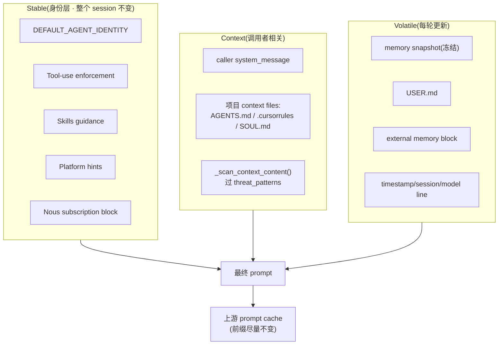
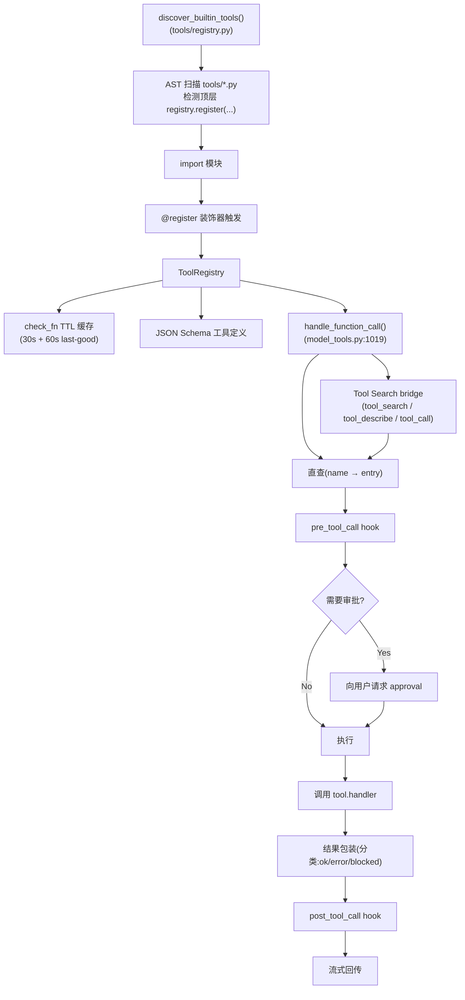
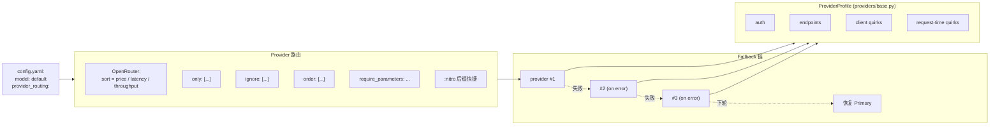
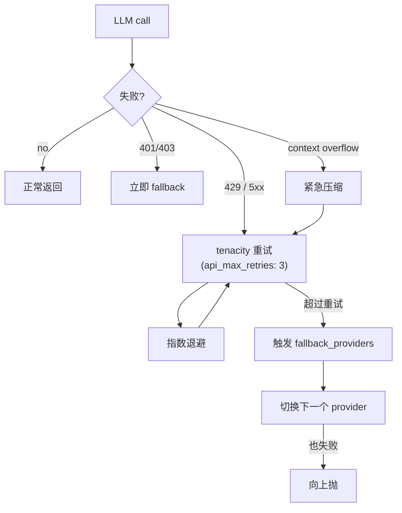
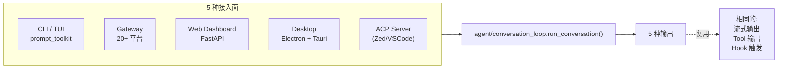

# 02 · 主流程架构

## 入口与生命周期

### 入口点

```python
# pyproject.toml:307-310
hermes        -> hermes_cli.main:main        # 主 CLI/TUI
hermes-agent  -> run_agent:main              # 程序化入口
hermes-acp    -> acp_adapter.entry:main      # 编辑器集成
```

### 类结构

```python
# run_agent.py:393
class AIAgent:
    def __init__(self, ...):       # 60+ 参数 → agent/agent_init.py(108 KB)
        ...

# run_agent.py:5748
def run_conversation(...):         # 主循环入口
    ...
```

实际主体实现位于 `agent/conversation_loop.py`(308 KB, ~7800 行)。
该文件 docstring 明确描述:驱动单轮 user turn 经过 **模型调用 → 工具分发 → 重试 → fallback → 压缩 → post-turn hooks → 后台记忆/技能复盘**。

---

## 一轮交互的完整时序

```mermaid
sequenceDiagram
    autonumber
    actor U as User / Gateway / Web
    participant Loop as Conversation Loop
    participant Mem as Memory Mgr
    participant Ctx as Context Engine
    participant Aux as Auxiliary Client
    participant LLM as LLM Provider
    participant Hook as Hooks (40+)
    participant Reg as Tool Registry
    participant Tool as Tool 实现

    U->>Loop: 输入消息
    Loop->>Loop: 解析 @ 引用(@file/folder/git/url/diff)
    Loop->>Mem: prefetch_all() (memory + user + external)
    Mem-->>Loop: <memory-context>...</memory-context> 围栏内容
    Loop->>Ctx: should_compress? (threshold 75%)
    alt 上下文超阈值
        Loop->>Ctx: compress()
        Ctx->>Aux: 摘要中间 turns(走小模型)
        Aux-->>Ctx: 压缩摘要
        Ctx-->>Loop: 新 messages 列表
    end
    Loop->>Hook: pre_llm_call(inject context?)
    Loop->>LLM: chat.completions(<br/>messages, tools, model, ...)
    LLM-->>Loop: response(<br/>content + tool_calls)
    Loop->>Hook: post_llm_call

    loop 每个 tool_call
        Loop->>Hook: pre_tool_call(name, args)
        Hook-->>Loop: {decision: allow/block} 或 {context: "..."}
        opt 需要审批
            Loop->>U: 弹 approval 请求
            U-->>Loop: approve / deny
        end
        Loop->>Reg: handle_function_call(name, args)
        Reg->>Tool: 执行(可能进入 sandbox)
        Tool-->>Reg: result
        Reg-->>Loop: result
        Loop->>Hook: post_tool_call(result, status, duration_ms)
    end

    Loop->>Hook: pre_verify(响应已完整?)
    alt 未完整
        Hook-->>Loop: {action: continue, message: "..."}
        Loop->>LLM: 再次调用(累计 N 次,默认 3)
    end
    Loop->>Mem: sync_turn()(记忆/MEMORY.md 写入)
    Loop->>Hook: on_session_*(session 状态)
    Loop-->>U: 流式输出(content + tool 输出)
```

---

## Prompt 组装(三级)

`agent/system_prompt.py:10-22` 定义了三段式 prompt:



设计要点:
- **Stable 不变** → 命中上游 cache
- **Context 半稳** → 用户可控,但变更会 invalidate cache
- **Volatile 每轮变** → 接受 cache 失效,但尽量短

详见 `04-context-engineering.md`。

---

## 工具分发流程



---

## Provider 路由



详见 `13-config-management.md`。

---

## ContextEngine ABC

```python
# agent/context_engine.py
class ContextEngine(ABC):
    name: str
    last_prompt_tokens: int
    threshold_tokens: int
    context_length: int
    compression_count: int
    threshold_percent: float = 0.75
    protect_first_n: int = 3
    protect_last_n: int = 6

    def update_from_response(self, response): ...
    def should_compress(self) -> bool: ...
    def compress(self, messages) -> list: ...
    def on_session_start(self): ...
    def on_session_end(self): ...
    def on_reset(self): ...
    def get_tool_schemas(self) -> list: ...
    def handle_tool_call(self, ...): ...
    def get_status(self) -> dict: ...
    def update_model(self, ...): ...
```

默认 `compressor`(`agent/context_compressor.py`,5 阶段);可替换为 LCM 等。
详见 `04-context-engineering.md`。

---

## MemoryProvider ABC

```python
# agent/memory_provider.py
class MemoryProvider(ABC):
    # 必选
    def initialize(self): ...
    def system_prompt_block(self) -> str: ...
    def prefetch(self) -> dict: ...
    def queue_prefetch(self) -> dict: ...
    def sync_turn(self, turn_data): ...
    def get_tool_schemas(self) -> list: ...
    def handle_tool_call(self, name, args): ...
    def shutdown(self): ...

    # 可选生命周期 hook
    def on_turn_start(self, turn): ...
    def on_session_end(self, session): ...
    def on_session_switch(self, old, new): ...
    def on_pre_compress(self, messages): ...
    def on_delegation(self, task, result): ...
    def on_memory_write(self, entry): ...
    def backup_paths(self) -> list: ...
```

**互斥**:MemoryManager 强制"**只允许一个外部 provider**",防止 schema 膨胀。

详见 `03-memory.md`。

---

## 重试与错误恢复



---

## 后台任务(非阻塞)

`agent/background_review.py` + `agent/curator.py`:

- 周期复盘:`MEMORY.md` / `USER.md` / `skills/` 状态
- 主动建议是否需要合并/归档
- 不阻塞主循环,在 idle 时由 Loop 调度

---

## 多接入面同核心



所有接入面都驱动同一个 `run_conversation`,因此:
- ✅ 同一份配置
- ✅ 同一份记忆
- ✅ 同一份工具集
- ✅ 同一份 Hook 链路

---

## 关键设计原则(面试可直接引用)

1. **三个 namespace 隔离**:Session(用户) / Task(任务) / Process(进程)
2. **frozen snapshot**:MEMORY.md 加载即冻结,保护 cache
3. **promote/demote toolset**:根据角色 + 上下文动态升降工具
4. **三段 prompt**:稳定 / 上下文 / 易变,平衡 cache 命中与新鲜度
5. **AST 自注册**:新工具零配置即可被发现
6. **重试 + fallback 双层**:429/5xx 走重试,401/403 立即换 provider
7. **后台复盘**:Curator / Insight 不阻塞主循环
8. **同核心多接入**:一个 loop,五个外壳

详见 `18-interview-questions.md` 中"主流程"类题目。