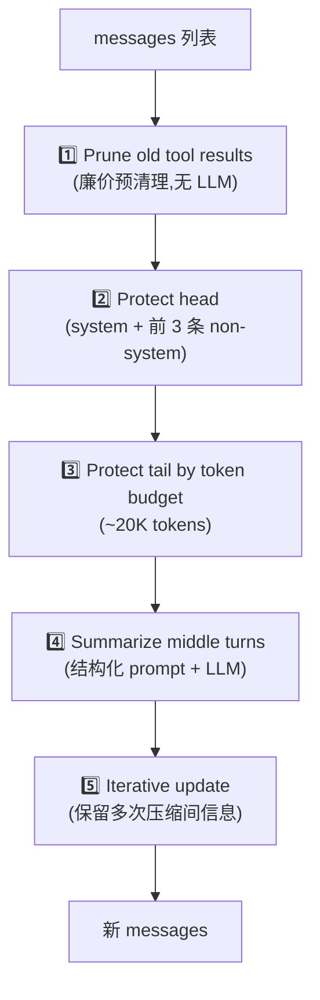
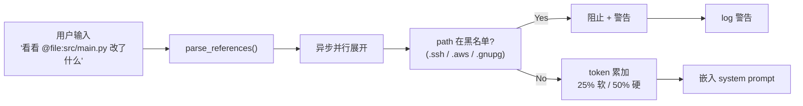

# 04 · 上下文工程

## 概述

上下文工程 = **怎么用满 context window 又不爆**。
Hermes 在这一块做得非常细:
- 5 阶段压缩管线(`agent/context_compressor.py`, 161 KB)
- 可插拔 ContextEngine ABC(`agent/context_engine.py`)
- 冻结快照保 cache(`tools/memory_tool.py`)
- `@file/folder/git/url/diff/staged` 引用语法(`agent/context_references.py`)
- 流式 scrubber 防围栏泄漏(`agent/memory_manager.py:171-334`)

---

## ContextEngine ABC

```python
# agent/context_engine.py
class ContextEngine(ABC):
    name: str
    last_prompt_tokens: int
    threshold_tokens: int
    context_length: int
    compression_count: int
    threshold_percent: float = 0.75     # 触发阈值
    protect_first_n: int = 3            # 保护前 N 条
    protect_last_n: int = 6             # 保护后 N 条

    def update_from_response(self, response): ...
    def should_compress(self) -> bool: ...
    def compress(self, messages) -> list: ...
    def on_session_start(self): ...
    def on_session_end(self): ...
    def on_reset(self): ...
    def get_tool_schemas(self) -> list: ...
    def handle_tool_call(self, ...): ...
    def get_status(self) -> dict: ...
    def update_model(self, ...): ...
```

通过 `config.yaml` 的 `context.engine` 切换。默认 `compressor`;可换成 LCM 风格(自带 `lcm_grep` / `lcm_describe` / `lcm_expand` 工具)。

---

## 5 阶段压缩管线

`agent/context_compressor.py` 是 Hermes 上下文工程的灵魂。



### 阶段细节

#### 1️⃣ 修剪旧工具结果
- 删除老的 tool result(无信息量)
- 不调用 LLM,纯字符串操作

#### 2️⃣ 保护 head
- system 消息
- 前 3 条 non-system 消息
- 永远不会进摘要

#### 3️⃣ 保护 tail(按 token 预算)
- 从最新一条往前数,累加 token
- 直到达到 20K 为止
- 防止"用户最后一句话 + 工具调用"被摘要掉

#### 4️⃣ 摘要 middle turns
- 构造**结构化 prompt** + `_HISTORICAL_SUMMARY_PREFIXES`(旧前缀列表剥离)
- 调用辅助模型(走 `AuxiliaryClient`)
- 输出加 `SUMMARY_PREFIX`(REFERENCE ONLY 提示)

#### 5️⃣ 迭代更新
- 多次压缩间**保留信息**(避免"压缩 N 次后只剩骨架")
- `compression_count++`

---

## 关键设计细节(面试必看)

### Summary Prefix —— 防"摘要变成新任务"

```python
# agent/context_compressor.py:44-70
SUMMARY_PREFIX = (
    "[REFERENCE ONLY — this is a summary of earlier conversation turns. "
    "Respond ONLY to the latest user message. Do NOT resume any earlier task.]"
)
```

**问题**:`#11475`, `#14521`, `#33256` —— 弱模型会把摘要误认为"新任务"继续做。
**解决**:显式 prefix 阻止模型把摘要当成新指令。

### Historical Prefix 剥离

```python
# _HISTORICAL_SUMMARY_PREFIXES = [...]
# 多次压缩时,先剥离旧的 SUMMARY_PREFIX
# 再加新的 SUMMARY_PREFIX
```

否则旧版本的前缀会一直留在 body 里,污染后续 prompt。

### 小上下文阈值特殊处理

```python
_SMALL_CTX_THRESHOLD_PERCENT = 0.75
_SMALL_CTX_WINDOW_LIMIT = 512_000
```

128K-262K 模型不要每 1-2 轮就压缩(否则摘要成本 > 收益)。

### Replay Budget Keys

```python
_REPLAY_BUDGET_KEYS = [
    "codex_reasoning_items",
    # ... 其它 provider 端 replay 字段
]
```

实际案例:`#55572` —— 单 session 115K tokens / 27% payload 是 `codex_reasoning_items`。
需要把这些字段计入预算,否则低估。

### 工具调用 JSON 截断(防 schema 破坏)

```python
# agent/context_compressor.py:435-478
def _truncate_tool_call_args_json(args: dict) -> dict:
    """
    在 parsed JSON 内部截断长字符串
    而不是截断 raw 字符串
    """
```

问题:`#11762` —— raw 字符串切片产生未闭合字符串,某些 provider 返回 400。
解决:解析 JSON → 在 value 内截断 → 重新序列化 → 保证 JSON 合法。

### 媒体剥离

```python
def _strip_historical_media(messages):
    """剥离最后一条含图 user message 之前的图片"""
```

### 持久化标记清理

```python
def _strip_persistence_markers(messages):
    """保证压缩后没有 _db_persisted 标记"""
```

`#57491` —— 不清理会导致 messages 重复入库。

---

## Token 估算策略(混合)

```python
# 优先级
1. API response.usage.usage  # 真实数据(优先)
2. _CHARS_PER_TOKEN = 4      # 粗略估算(降级)
3. _IMAGE_TOKEN_ESTIMATE = 1600  # 图片固定(对齐 Claude Code)
```

**教训**:`#28053` —— 不能只估 args,要估**完整 tool_call envelope**(`id/type/function.name/JSON 结构`)。否则并行 tool 调用会少估 2-15 倍。

---

## 压缩锁与守护线程

```python
# agent/conversation_compression.py:75-151
class _CompressionLockLeaseRefresher:
    """守护线程,每 N 秒刷新 DB row TTL,直到压缩完成"""
```

- 每次压缩任务持有一个**带 TTL 的 DB 行**作为 lease
- 守护线程刷新 TTL
- bounded consecutive-failure tolerance
- 防止"压缩任务被其他进程判定为僵死并杀掉"

---

## Auxiliary Client 路由

`agent/auxiliary_client.py`(344 KB,最大单文件)负责把"辅助任务"路由到合适的模型:
- 压缩
- 摘要
- Curator review
- skill 整理

`check_compression_model_feasibility()`:警告"辅助模型的 context 装不下主模型的压缩阈值"。

---

## `@` 引用语法(`agent/context_references.py`)

Claude Code 风格的引用语法:

```
@file:./README.md
@folder:./src
@git:HEAD~3
@url:https://...
@diff
@staged
```

**实现要点**:
- 异步并行展开
- **25% 软上限 / 50% 硬上限**(占 context window)
- **家目录安全黑名单**:`.ssh` `.aws` `.gnupg`(lines 22-38)



---

## 手动触发

```
/compress             # 自动选择焦点
/compress <focus_topic>  # 指定摘要焦点
```

`agent/context_engine.py:101-105` 定义。

---

## 关键设计原则

1. **5 阶段而非 1 阶段**:工具结果清理 + 头尾保护 + 中段摘要 + 迭代,各司其职
2. **SUMMARY_PREFIX 显式防御**:防弱模型把摘要当新任务
3. **小上下文特殊处理**:128K 模型不要"每轮压缩"
4. **Replay Budget Keys**:不低估 provider 端 replay 字段
5. **JSON 内部截断**:保 schema 合法性
6. **流式 scrubber**:跨 chunk 保留尾部
7. **压缩锁 + 守护线程**:防止被错误判定为僵死
8. **混合 token 估算**:real → chars/4 → image const
9. **@ 引用 25/50 上限**:用户友好 + 安全
10. **可插拔 ContextEngine**:不锁死实现

---

## 常见坑 / 面试考点

- Q:**压缩后模型会"忘记原始任务"吗?**
  A:`SUMMARY_PREFIX` 显式防御;head 保护 + tail 保护保留关键上下文
- Q:**为什么 5 阶段而不是一次 LLM 摘要?**
  A:1) 工具结果清理无 LLM 成本;2) 头尾保护避免丢关键信息;3) 多阶段可分别观测
- Q:**token 估算为什么不直接用 tiktoken?**
  A:跨 provider 一致性 + image const + replay 字段覆盖
- Q:**ContextEngine 怎么切换?**
  A:`config.yaml` 的 `context.engine`,LCM 等可作为 drop-in 替换
- Q:**@ 引用会绕过安全吗?**
  A:有路径黑名单 + 25/50 token 预算上限

详见 `18-interview-questions.md` 中"上下文类"题目。