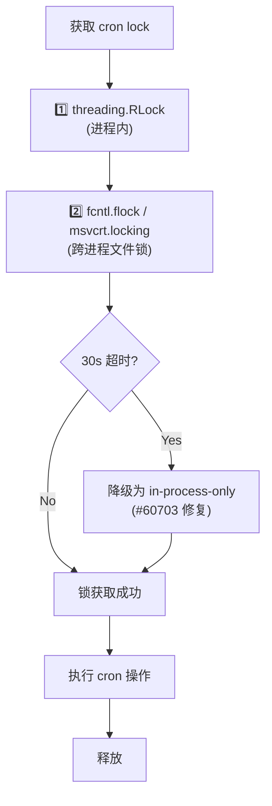
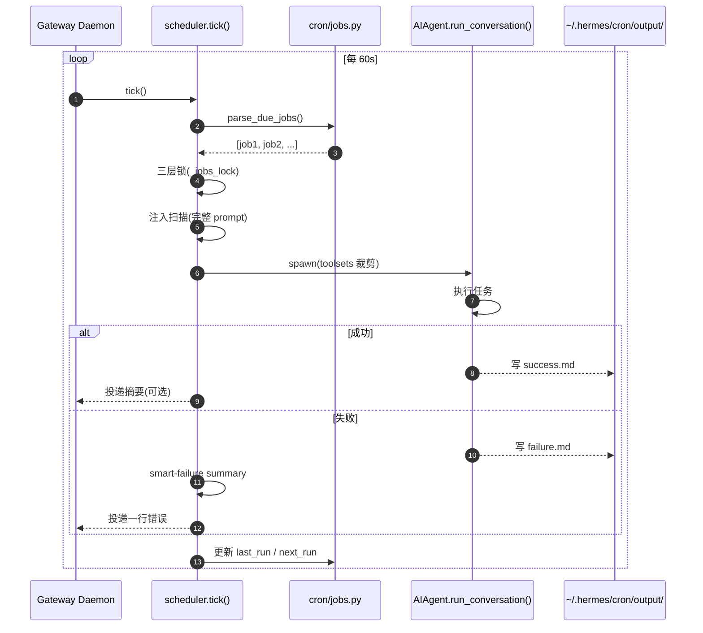

# 05 · 定时任务系统(Cron)

## 概述

Hermes 的 cron **不是简单的"定时调提示词"**,而是一个**完整的生产级调度系统**:
- 独立子模块 `cron/`,可单独使用
- 三层锁保证并发安全
- 注入扫描防 cron 任务被劫持
- 工具集强制裁剪,防止递归
- 网关内置 60s ticker
- 输出写 markdown 文件,失败有 smart summary

**核心文件**:
- `cron/__init__.py`(公共 API)
- `cron/jobs.py`(任务定义、parse_schedule、3 层锁)
- `cron/scheduler.py`(tick()、prompt-injection scanner)
- `cron/scheduler_provider.py`(进程内 ticker)
- `cron/suggestions.py`(调度建议)
- `cron/blueprint_catalog.py`(28 KB 蓝图库)
- `tools/cronjob_tools.py`(57 KB,模型端工具)

---

## 公共 API

```python
# cron/__init__.py
from cron import (
    create_job,
    get_job,
    list_jobs,
    remove_job,
    update_job,
    pause_job,
    resume_job,
    trigger_job,
    tick,                 # 手动触发一次 tick
    JOBS_FILE,            # 常量
)
```

---

## 调度类型

`parse_schedule`(`cron/jobs.py:406-503`)支持:

| 输入 | 含义 | kind |
|------|------|------|
| `"30m"` | 30 分钟后一次 | `once` |
| `"2h"` | 2 小时后一次 | `once` |
| `"1d"` | 1 天后一次 | `once` |
| `"every 30m"` | 每 30 分钟 | `interval` |
| `"every 2h"` | 每 2 小时 | `interval` |
| `"0 9 * * *"` | 标准 5/6 字段 cron(走 `croniter`) | `cron` |
| `"2026-02-03T14:00"` | ISO 时间戳 | `once` |

---

## 三层并发锁(关键设计)

`cron/jobs.py:151-246` `_jobs_lock()`:



**设计原则**:
1. **进程内 RLock**:同一进程多线程安全
2. **跨进程文件锁**:防止多实例(网关 + CLI 同时跑 ticker)冲突
3. **30s 超时 + 降级**:POSIX/Windows 行为差异 + 防 ticker 冻结(`#60703`)

---

## 网关 Ticker

```python
# cron/scheduler.py
def tick():
    """每 60s 由 Gateway daemon 调用"""
    due_jobs = parse_due_jobs()
    for job in due_jobs:
        with _jobs_lock():
            spawn_job_agent(job)
```

心跳文件:
- `TICKER_HEARTBEAT_FILE`:每次 tick 写入
- `TICKER_SUCCESS_FILE`:仅成功 tick 写入

**为什么两个**:`#32612`, `#32895` —— 需要区分"ticker 死了"和"ticker 在失败"。

---

## 注入扫描(防 cron 任务被劫持)

```python
# cron/scheduler.py:103-113
def _scan_for_prompt_injection(prompt: str) -> bool:
    """扫描 cron prompt(包含加载的 skill 内容)"""
```

**关键**:扫描的是**完整组装后的 prompt**(包含 skill 注入),不仅仅是用户填写的 prompt 字段。
**解决**:`恶意 skill 可能携带注入 payload 到达 auto-approve cron agent`。

---

## 子代理隔离(防递归)

```python
# cron/scheduler.py:116-200
def spawn_job_agent(job):
    """强制禁用某些工具集"""
    job_toolsets = job.toolsets - {
        "cronjob",     # 不能创建更多 cron
        "messaging",   # 不能跨平台发消息
        "clarify",     # 不能追问用户
    }
    agent = AIAgent(toolsets=job_toolsets, ...)
    agent.run_conversation(...)
```

**为什么**:cron 任务无人值守,不能让 agent 等待用户输入或越权操作。

---

## MCP fallback(每个 cron job)

```python
# cron/scheduler.py:139-167
def _merge_mcp_into_per_job_toolsets(job):
    """
    job.toolsets 包含 native toolset 时,
    自动叠加 MCP servers
    (除非有 no_mcp sentinel)
    """
```

---

## 输出与失败投递

### 输出位置
```
~/.hermes/cron/output/{job_id}/{timestamp}.md
```

`_job_output_dir`(`cron/jobs.py:255-268`)做 path-escape 拒绝。

### Smart Failure Summary

```python
# cron/scheduler.py:50-100
def _summarize_cron_failure_for_delivery(error) -> str:
    """
    把 429 / 401 / 403 / timeout 等
    映射为一行可读消息
    """
```

完整错误保留在 cron output 文件,只把摘要发到用户消息。

---

## 一次性任务回收

```python
ONESHOT_RUN_CLAIM_TTL_SECONDS = derive_from("HERMES_CRON_TIMEOUT")
```

回收"running 状态卡住"的一次性任务。

---

## 调度时序图



---

## 蓝图库(`cron/blueprint_catalog.py`)

28 KB,提供开箱即用的调度模板:

- "每天 9 点拉 GitHub trending"
- "每小时汇总 cron 失败"
- "每个工作日 17:00 生成日报"
- ...

用户可通过 `/blueprint`(别名 `/bp`)或 `/suggestions`(别名 `/suggest`)浏览。

---

## 工具:模型端 `cronjob` 工具集

`tools/cronjob_tools.py`(57 KB)提供:

```python
cronjob_create   # 创建任务
cronjob_list     # 列出任务
cronjob_update   # 修改任务
cronjob_remove   # 删除任务
cronjob_pause    # 暂停
cronjob_resume   # 恢复
cronjob_trigger  # 立即触发
```

---

## Hermes vs Claude Code Routines(README 自述)

`hermes-already-has-routines.md` 文档自述:
- Hermes 早在 2026 年 3 月就支持 cron / webhooks / API triggers
- MIT 协议、模型无关、不限次数/天
- 不绑定任何特定 LLM

---

## 关键设计原则

1. **三层锁**:进程内 + 跨进程 + 优雅降级
2. **两个心跳文件**:区分"死了"和"在失败"
3. **注入扫描**:扫描完整组装后 prompt,不只 user 字段
4. **工具集强制裁剪**:防递归/越权
5. **路径转义拒绝**:防止输出写到计划外位置
6. **smart failure summary**:用户体验优先
7. **per-job MCP 叠加**:原生 + MCP 灵活组合
8. **蓝图库**:降低首次使用门槛
9. **独立子模块**:可单独 pip install
10. **不绑定 LLM**:用户可指定 provider/model

---

## 常见坑 / 面试考点

- Q:**多实例同时跑 ticker 怎么办?**
  A:跨进程文件锁 + 30s 超时 + 降级
- Q:**cron 任务被 prompt 注入怎么办?**
  A:扫描完整 prompt(包含 skill 注入),不只 user 字段
- Q:**cron 任务能不能创建更多 cron?**
  A:不能,工具集强制裁剪
- Q:**失败怎么通知?**
  A:smart summary 一行 + 完整错误写文件
- Q:**一次性任务卡死怎么回收?**
  A:`ONESHOT_RUN_CLAIM_TTL_SECONDS` 派生自 `HERMES_CRON_TIMEOUT`

详见 `18-interview-questions.md` 中"调度"类题目。