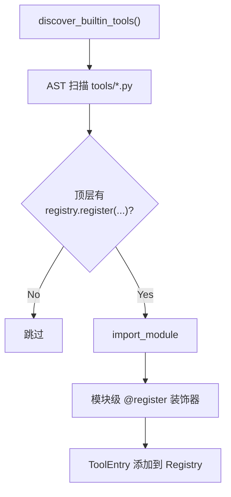

# 06 · 工具注册与分发

## 概述

Hermes 工具系统有 **80+ 内置工具**,通过**自注册**机制零配置发现,
通过**统一的 JSON Schema + 函数调用协议**与 LLM 交互,
通过 **`check_fn` TTL 缓存**解决冷启动/瞬时故障问题,
通过**Tool Search bridge**让超大规模工具集不被 prompt 撑爆。

**核心文件**:
- `tools/registry.py`(自注册机制)
- `model_tools.py:1019` `handle_function_call()`(分发入口)
- `tools/environments/base.py` `BaseEnvironment` ABC(执行环境)
- `tools/tool_guardrails.py`、`tool_output_limits.py` 等(辅助)

---

## 自注册机制(AST 扫描)

```python
# tools/registry.py
def discover_builtin_tools():
    """扫描 tools/*.py,AST 检测顶层 registry.register(...) 调用"""
    for path in glob("tools/*.py"):
        if has_registry_register_call(path):
            import_module(path)  # 触发模块级 register()
```



**优势**:
- 新增工具**只需**创建一个 `tools/my_tool.py`,文件顶层有 `registry.register(...)` 即可
- 无需手动修改中心注册表
- 删除工具 = 删文件

---

## ToolEntry 数据结构

```python
@dataclass
class ToolEntry:
    name: str                              # 'terminal'
    toolset: str                           # 'terminal'
    schema: dict                           # OpenAI function-calling JSON
    handler: Callable                      # 实际执行函数
    check_fn: Optional[Callable]           # 启用检查(返回 bool)
    requires_env: Optional[List[str]]      # 依赖环境变量
    is_async: bool                         # 同步/异步
    dynamic_schema_overrides: Callable     # 动态 schema 调整
```

---

## JSON Schema 工具定义

OpenAI function-calling 格式:

```json
{
  "type": "function",
  "function": {
    "name": "terminal",
    "description": "Execute a shell command on the configured environment",
    "parameters": {
      "type": "object",
      "properties": {
        "command": {"type": "string"},
        "timeout": {"type": "integer"}
      },
      "required": ["command"]
    }
  }
}
```

**Strict Provider 兼容**:
```python
# agent/memory_manager.py:49-79
def normalize_tool_schema(schema):
    """某些 provider 返回已包装的 schema,
    双重包装会被 DeepSeek 等拒绝(HTTP 400,#47707)"""
```

---

## check_fn TTL 缓存(关键设计)

```python
# tools/registry.py:134-197
class CheckFnCache:
    """
    30s 主缓存 + 60s last-good 宽限
    """
```

**问题场景**:子代理(Docker daemon busy / probe timeout)导致 `check_fn` 暂时返回 False,
工具被从子代理的工具集中默默剔除,出现 "Tool read_file does not exist" 错误。

**解决**:
- 主缓存 30s 过期
- 即使过期,若最近一次结果是 True,**额外保留 60s** 作为"last-good"
- 防止瞬时抖动静默降级

---

## 动态 Schema 覆盖

```python
@dataclass
class ToolEntry:
    dynamic_schema_overrides: Callable = None
    """返回 dict,在 get_definitions() 时合并进 schema"""
```

**用例**:`delegate_task` 工具的 description 反映用户当前的 `max_concurrent_children` / `max_spawn_depth`。
模型不会看到错误的限制。

---

## 工具分发流程

```mermaid
sequenceDiagram
    participant LLM as LLM Response
    participant Loop as Conversation Loop
    participant MT as model_tools.handle_function_call
    participant Reg as Tool Registry
    participant Hook as Hooks
    participant Env as Environment
    participant Tool as Tool 实现

    LLM-->>Loop: tool_calls[i] (name, args)
    Loop->>Hook: pre_tool_call(name, args)
    Hook-->>Loop: allow / block / inject

    alt 允许
        Loop->>MT: handle_function_call(name, args)
        MT->>Reg: lookup(name)
        Reg-->>MT: ToolEntry
        MT->>MT: normalize args
        MT->>Hook: pre_execute?
        MT->>Env: get_environment()
        Env-->>MT: BaseEnvironment
        MT->>Tool: handler(**args, env=env)
        Tool-->>MT: result
        MT->>MT: classify result (ok/error/blocked)
        MT->>Hook: post_tool_call(result, status, duration_ms)
        MT-->>Loop: wrapped result
    else 阻止
        Loop->>Loop: 跳过 + 记录阻断原因
    end
```

---

## Tool Search bridge(应对工具过多)

`model_tools.py:1065-1098`:

```python
tool_search(query)        # 按 query 找工具
tool_describe(name)       # 取详细 schema
tool_call(name, args)     # 直接调用
```

**问题**:80+ 工具的 JSON schema 全塞 system prompt 会很贵。
**解决**:模型先用 `tool_search` 找到要用的工具,再用 `tool_describe` 拿详细 schema,然后才 `tool_call`。

---

## 工具集(Toolsets)

`toolsets.py`(971 行)+ `toolset_distributions.py`(358 行)。

```python
hermes-cli       # 复合工具集
terminal
file
web
mcp              # MCP servers
memory
delegation       # 子代理
cronjob          # cron
moa              # Mixture-of-Agents
clarify
messaging
kanban
homeassistant
rl
image_gen
video_gen
tts
transcription
web_search
browser
computer_use
discord
feishu
spotify
teams
google_meet
...
```

**CLI**:`hermes tools` 切换启用的工具集。

---

## 工具分类

| 类别 | 代表 |
|------|------|
| **终端** | `terminal`(6 backend)+ `process`(registry) |
| **文件** | `file_tools`、`file_operations`、`patch`、`search_files`、`read_extract` |
| **网络** | `web_search`、`web_extract`、`browser_*`(210 KB) |
| **代码** | `execute_code`(80 KB,Python sandbox) |
| **记忆** | `memory`、`session_search` |
| **技能** | `skill_view`、`skills_list`、`skill_manage` |
| **定时** | `cronjob`(57 KB) |
| **子代理** | `delegate_task`(157 KB) |
| **MCP** | 每个 MCP server 一个 `mcp_<name>` |
| **视觉** | `image_generation`、`video_generation`、`vision_analyze`、`text_to_speech`、`transcription` |
| **平台** | `discord_tool`、`feishu_*`、`x_search` |
| **通信** | `send_message`(跨平台)、`clarify` |
| **任务** | `todo`(任务列表) |
| **进程** | `process`(进程 registry) |
| **会话** | `session_search`(FTS5) |
| **安全** | `tirith`(URL 安全) |

---

## Tool Guardrails / Output Limits / Classification

```python
# tools/tool_guardrails.py      # 输入校验、参数限制
# tools/tool_output_limits.py   # 输出截断(token / 行数 / 字节)
# tools/tool_result_storage.py  # 结果持久化
# tools/tool_result_classification.py  # 结果分类 ok/error/blocked
```

---

## `file_state.py` 缓存

独立的文件元数据缓存(不属于任何具体工具)。
用于让 `patch` 操作**幂等安全**(检测文件是否被改过)。

---

## 关键设计原则

1. **AST 自注册**:新增工具零配置
2. **OpenAI 标准 schema**:跨 provider 兼容
3. **strict provider normalize**:防双重包装 HTTP 400
4. **check_fn TTL + last-good**:防瞬时抖动
5. **动态 schema**:环境变化反映到工具定义
6. **Tool Search bridge**:应对超大规模工具集
7. **统一分发入口**:`model_tools.py:1019`
8. **pre/post hook 链**:可观测、可拦截
9. **Toolset 抽象**:可批量启用/禁用
10. **独立 file_state**:让 patch 幂等

---

## 常见坑 / 面试考点

- Q:**如何新增一个工具?**
  A:写 `tools/my_tool.py`,顶层 `registry.register(...)`,无需改其它代码
- Q:**工具 schema 怎么跨 provider?**
  A:OpenAI 标准格式 + normalize 防双重包装
- Q:**check_fn 抖动怎么办?**
  A:30s 主缓存 + 60s last-good 宽限
- Q:**工具太多导致 prompt 太大?**
  A:Tool Search bridge,运行时按需加载 schema
- Q:**patch 操作安全吗?**
  A:独立 `file_state` 缓存,做幂等检测

详见 `18-interview-questions.md` 中"工具"类题目。