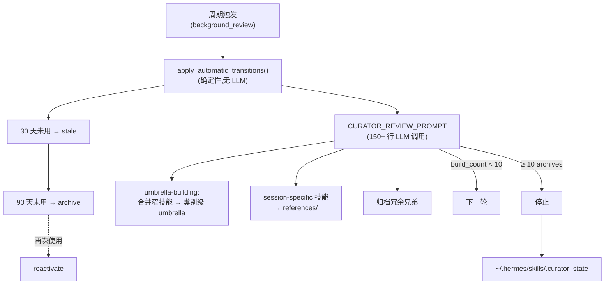
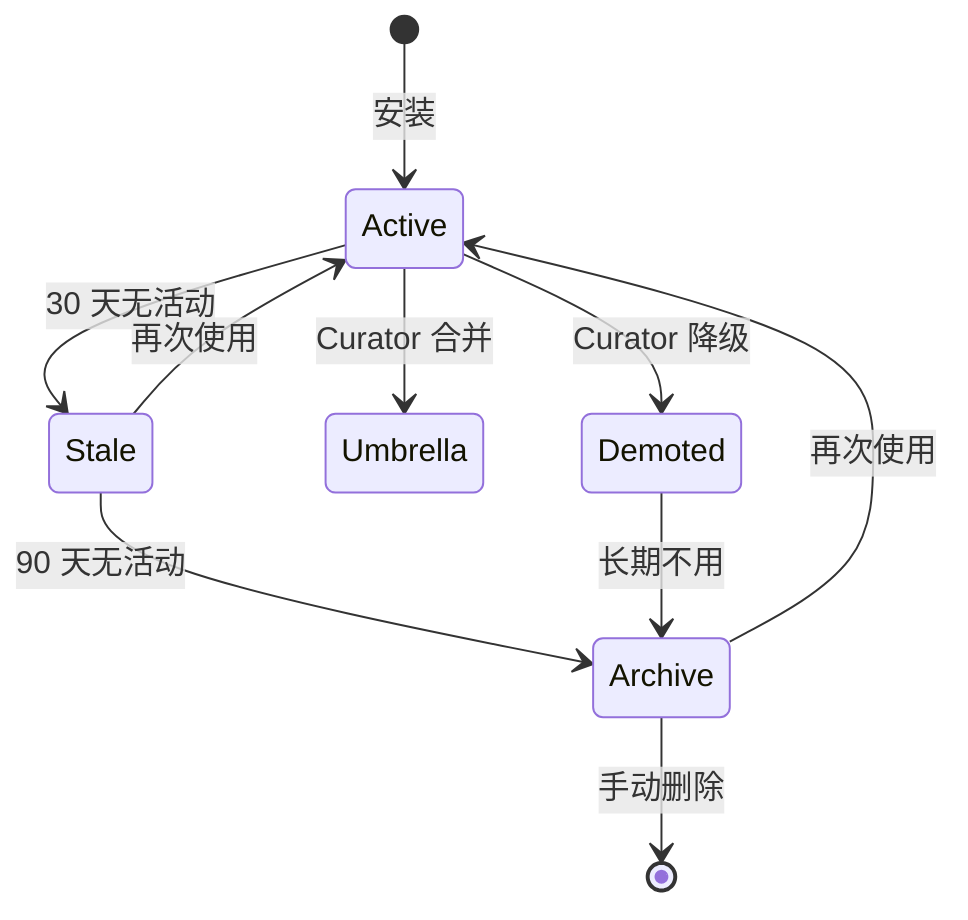

# 07 · 技能系统(Skills)

## 概述

Hermes 的技能系统是其**最具特色**的部分之一:
- 兼容 **agentskills.io** 开放标准
- 技能 = `~/.hermes/skills/<name>/SKILL.md` + 可选 `references/`、`templates/`、`scripts/`、`assets/`
- 通过 **slash 命令**调用(`/<skill-name>`)
- **支持 Bundle**:一个 slash 加载多个技能
- **自演化**:Curator 周期性复盘 → 合并 / 归档 / 复活
- 有 AST 审计、Hub 安装、Guard 保护等周边能力

**164 个内置 SKILL.md** + `optional-skills/` 大量可选技能。

---

## 技能结构

```
skills/
├── <skill-name>/
│   ├── SKILL.md          # 必需,YAML frontmatter + Markdown
│   ├── references/       # 可选,文档/参考
│   ├── templates/        # 可选,模板文件
│   ├── scripts/          # 可选,辅助脚本
│   └── assets/           # 可选,资源文件
└── ...
```

### SKILL.md 样例

```markdown
---
name: my-skill
description: 一句话说明
platforms: [macos, linux, win32]   # 平台过滤
environments: [kanban, docker, s6]  # 环境相关性
---

# Skill body

Here is what the skill does.
```

---

## YAML frontmatter(`agent/skill_utils.py`)

```python
parse_frontmatter(skill_md) -> {
    "name": str,
    "description": str,
    "platforms": List[str],      # macos/linux/win32
    "environments": List[str],   # kanban/docker/s6
    "disabled": bool,
}
```

**Termux 特殊情况**:`linux` 平台在 Android Termux 上可用(特殊处理)。

**禁用列表**:`config.yaml` 的 `disabled` + `platform_disabled`。

**外部技能目录**:`skills.external_dirs` 可加额外根,排除重复检查,路径解析走 `HERMES_HOME`。

---

## 调用方式

```bash
/my-skill              # 调用单个技能
/my-bundle             # 调用 bundle(多个技能聚合)
/search query          # 模糊搜索
```

`agent/skill_commands.py` 实现命令解析 + `extract_user_instruction_from_skill_message` 提取用户指令。

**关键**:技能展开有**字节级一致的标记**(单技能 vs bundle),测试断言这些标记匹配。

---

## Bundle 系统(`agent/skill_bundles.py`)

`~/.hermes/skill-bundles/*.yaml`:

```yaml
name: research
description: 科研 bundle
skills:
  - web-search
  - arxiv-fetch
  - paper-summary
  - citation-format
```

**Bundle 解析优先于单技能 slug 冲突**(用户取 `research` 当 bundle 名是有意的)。

---

## 预处理(`agent/skill_preprocessing.py`)

```python
expand_inline_shell       # $(command) 风格 shell 替换
load_skills_config
substitute_template_vars  # {{var}} 替换
```

允许技能作者在 SKILL.md 里嵌入命令输出,提高复用性。

---

## **Curator 自演化**(`agent/curator.py`,87 KB)

这是 Hermes 技能系统的**皇冠宝石**。



### 自动转换(`apply_automatic_transitions`)
- **30 天无活动** → `stale`
- **90 天无活动** → `archive`(可恢复)
- **再次使用** → `reactivate`
- **被 cron 引用的技能** → 保护,免自动转换

### LLM Review(`CURATOR_REVIEW_PROMPT`)
- **umbrella-building**:把窄技能合并到 umbrella 技能
- **demotion**:session-specific 技能 → `references/`
- **archival**:归档冗余兄弟技能
- **保护 pinned 技能**

**设计哲学**:**从不删除**,归档可恢复。

### Build Count 规则
至少 10 archives per pass,否则"stopped too early"。

### 状态持久化
`~/.hermes/skills/.curator_state`

### 备份/恢复
`agent/curator_backup.py`(28 KB)支持迁移。

---

## 周边能力

### Skills Hub(`tools/skills_hub.py`)
安装社区 / 远程 registry 的技能。

### Skill Usage Tracking(`tools/skill_usage.py`)
- 每次使用计数
- 最后活动时间
- 当前状态
- pinned 标志

### Skill Guard(`tools/skills_guard.py`)
保护内置技能不被误删。

### Skill AST Audit(`tools/skills_ast_audit.py`)
安全审计:分析技能文件是否有 prompt 注入 / 不安全模式。

### Skill Manager 工具(`tools/skill_manager_tool.py`)
模型端接口:`create` / `patch` / `delete` / `list` / `view`。

### Skill Sync(`tools/skills_sync.py`)
跨 profile / 跨安装同步。

### Learning Graph(`agent/learning_graph.py` + `learning_graph_render.py`)
技能使用图谱,可视化"什么技能在什么时候被用"。

---

## 技能生命周期



---

## 内置技能分类(15 大类)

```
skills/
├── apple/                # Apple 生态
├── autonomous-ai-agents/ # 自主 AI agent
├── computer-use/         # 电脑控制
├── creative/             # 创意
├── data-science/         # 数据科学
├── dogfood/              # 自家产品演示
├── email/                # 邮件
├── github/               # GitHub 工作流
├── media/                # 多媒体
├── mlops/                # MLOps
├── note-taking/          # 笔记
├── productivity/         # 生产力
├── research/             # 科研
├── smart-home/           # 智能家居
├── social-media/         # 社交媒体
├── software-development/ # 软件开发
└── yuanbao/              # 元宝集成
```

---

## Optional Skills

`optional-skills/` 包含重量级 / 特殊技能:

- blockchain / EVM / Solana / Hyperliquid(加密)
- creative / autonomous-ai-agents(创意 + 自主)

---

## 索引缓存(`skills/index-cache/`)

社区 / 第三方 registry 的快照:
- `anthropics_skills_skills_.json`
- `claude_marketplace_anthropics_skills.json`
- `lobehub_index.json`
- `openai_skills_skills_.json`

---

## 关键设计原则

1. **agentskills.io 兼容**:开放标准,生态可复用
2. **frontmatter 元数据**:平台 / 环境 / 禁用过滤
3. **Bundle 聚合**:一个 slash 触发多个技能
4. **预处理替换**:$(cmd) + {{var}} 提高复用
5. **CURATOR 自演化**:LLM-as-architect,自动合并
6. **从不删除**:归档可恢复,降低运维风险
7. **Cron 引用保护**:防止自动转换掉生产技能
8. **AST 审计**:安全第一
9. **Hub 安装**:与社区生态打通
10. **learning graph**:让用户看到自己的使用模式

---

## 常见坑 / 面试考点

- Q:**技能和工具有什么区别?**
  A:工具是低层能力(执行动作),技能是高层工作流(模板 + 指令)
- Q:**技能如何自演化?**
  A:Curator 周期 LLM 合并 + 自动 stale/archive
- Q:**技能被误删怎么办?**
  A:归档而非删除,可恢复;Skill Guard 保护内置
- Q:**Bundle 怎么解析?**
  A:`skill-bundles/*.yaml`,Bundle 优先于单技能 slug
- Q:**技能被 prompt 注入怎么办?**
  A:AST audit + 围栏机制 + skill 内容扫描

详见 `18-interview-questions.md` 中"技能"类题目。