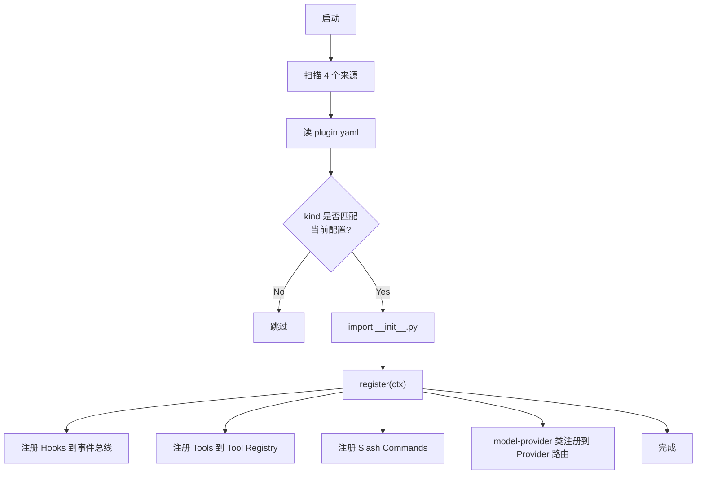

# 08 · 插件系统(Plugins)

## 概述

Hermes 有 **两套扩展机制**:
1. **Skills**(基于 markdown,见 `07-skills.md`)
2. **Plugins**(基于 Python,见本文)

插件更"重":可以**注册工具、Hook、中间件、命令**,甚至**接管整个 provider**。
**4 个加载来源**,**17 个类别**,**88 个 plugin.yaml**。

**核心文件**:
- `hermes_cli/plugins.py`(加载、注册、生命周期)
- `hermes_cli/plugins.py:135-213` `VALID_HOOKS`(40+ 事件)
- `agent/plugin_llm.py`(40 KB,trusted plugin LLM 门面)

---

## 4 个加载来源(后赢覆盖)

`hermes_cli/plugins.py:5-17`:

```python
PLUGIN_SOURCES = [
    # 1. Bundled - 仓库自带
    "<repo>/plugins/<name>/",

    # 2. User - 用户级
    "~/.hermes/plugins/<name>/",

    # 3. Project - 项目级(opt-in)
    "./.hermes/plugins/<name>/",   # HERMES_ENABLE_PROJECT_PLUGINS

    # 4. Pip - pip 包
    # entry-point group: hermes_agent.plugins
]
```

**规则**:**后加载的覆盖先加载的**(later wins)。

---

## 插件目录结构

```
plugins/
└── <plugin-name>/
    ├── plugin.yaml     # 清单(必需)
    └── __init__.py      # 入口(必需,含 register(ctx))
```

### plugin.yaml 样例

```yaml
name: my-plugin
kind: backend          # standalone / backend / exclusive / platform / model-provider
version: 1.0.0
description: ...
author: ...
```

### __init__.py 样例

```python
def register(ctx):
    """ctx = PluginContext 门面"""
    ctx.register_tool(my_tool, toolset="my-toolset")
    ctx.register_hook("pre_tool_call", my_callback)
    ctx.register_command("/my-cmd", my_handler)
```

---

## 插件 Kind

`hermes_cli/plugins.py:275-306`:

| Kind | 说明 | 示例 |
|------|------|------|
| `standalone` | 独立功能插件 | `disk-cleanup`,`hermes-achievements` |
| `backend` | 后端实现变体 | `cron_providers/*` |
| `exclusive` | 互斥插件(同 category 只一个激活) | `memory/*` |
| `platform` | 平台集成 | `platforms/*` |
| `model-provider` | LLM provider | `model-providers/*`(30+) |

`exclusive` 例:`memory` 类别的 8 个 provider 中只能选一个,通过 `<category>.provider` 配置选定。

---

## PluginContext 门面

```python
class PluginContext:
    """插件可见的接口集"""
    def register_tool(tool, toolset): ...
    def register_hook(event_name, callback): ...
    def register_middleware(mw): ...
    def register_command(slash_cmd, handler): ...

    @property
    def llm(self) -> PluginLlm:
        """trusted 插件可发起 host-owned LLM 调用"""
```

`agent/plugin_llm.py`(40 KB)提供 `PluginLlm` 门面,用**用户的 active model + 凭证**发请求,**避免插件私藏 API key**。

---

## 插件生命周期 Hooks

`hermes_cli/plugins.py:135-213` `VALID_HOOKS`(40+ 事件)。

### 工具生命周期
- `pre_tool_call` —— 工具调用前(可 block)
- `post_tool_call` —— 工具调用后(result, status, duration_ms, ...)
- `transform_terminal_output` —— 改 terminal 输出
- `transform_tool_result` —— 改 tool 结果
- `transform_llm_output` —— 改 LLM 输出
- `pre_approval_request` —— 审批请求前(只能观察)
- `post_approval_response` —— 审批响应后

### LLM 生命周期
- `pre_llm_call` —— 可注入 `{"context": "..."}`
- `post_llm_call`
- `pre_api_request` / `post_api_request` / `api_request_error`
- `pre_verify` —— 验证循环门控(默认 3 次)

### 会话生命周期
- `on_session_start` / `on_session_end` / `on_session_finalize` / `on_session_reset`

### 子代理
- `subagent_start` / `subagent_stop`(含 parent_turn_id, child_session_id, child_role, child_summary, ...)

### Kanban
- `kanban_task_claimed` / `kanban_task_completed` / `kanban_task_blocked`

### 网关
- `pre_gateway_dispatch` —— 入站消息前,可 skip / rewrite / allow

更多见 `12-hooks.md`。

---

## 工具覆盖(`PluginToolOverrideError`)

```python
@register(
    name="my_custom_terminal",
    override=True,           # 需显式允许
)
def my_terminal(...):
    ...
```

需 `plugins.entries.<id>.allow_tool_override: true` 才允许覆盖内置工具,否则 `PluginToolOverrideError`。

---

## 插件加载流程



---

## **Shell 脚本 Hook Bridge**(`agent/shell_hooks.py`,35 KB)

不仅 Python 插件可以监听 hook,**外部 shell 脚本也可以**。

### cli-config.yaml 配置

```yaml
hooks:
  pre_tool_call: "~/.hermes/hooks/check_dangerous.sh"
  post_tool_call: "~/.hermes/hooks/log_tool.sh"
```

### Wire Protocol

**stdin**:
```json
{
  "hook_event_name": "pre_tool_call",
  "tool_name": "terminal",
  "tool_input": {"command": "rm -rf /"},
  "session_id": "...",
  "cwd": "/home/user",
  "extra": {}
}
```

**stdout**(可选):
```json
{"decision": "block", "reason": "dangerous command"}
```
或
```json
{"context": "injected context"}
```

### 安全要点

- `shlex.split(os.path.expanduser(command))` + `shell=False`(无 shell 注入)
- 首次使用需 consent(`~/.hermes/shell-hooks-allowlist.json`)
- 幂等注册(CLI + gateway 都可调)

---

## 插件类别(`plugins/` 目录)

| 类别 | 说明 |
|------|------|
| `model-providers/` | 30+ LLM provider |
| `memory/` | 8 个外部 memory provider(互斥) |
| `context_engine/` | 替代 ContextEngine 实现(预留) |
| `cron_providers/` | cron 后端变体 |
| `image_gen/`, `video_gen/` | 多模态生成 |
| `browser/` | 浏览器变体 |
| `kanban/` | 看板后端 |
| `observability/` | langfuse, nemo_relay |
| `disk-cleanup/` | 磁盘清理 |
| `dashboard_auth/` | Dashboard 认证 |
| `security-guidance/` | 安全提示 |
| `hermes-achievements/` | 成就系统 |
| `platforms/` | 平台集成 |
| `google_meet/`, `spotify/`, `teams_pipeline/` | 第三方集成 |
| `web/` | Web 增强 |

---

## pre_tool_call Allow/Block 协议

支持**两种格式**(自动规范化):

```json
// Claude-Code 风格
{"decision": "block", "reason": "..."}

// Hermes-canonical 风格
{"action": "block", "message": "..."}
```

---

## 关键设计原则

1. **4 来源加载**:bundled/user/project/pip
2. **后赢覆盖**:用户可覆盖 bundled
3. **PluginContext 门面**:插件不可越权访问内部
4. **PluginLlm**:插件用 host-owned 凭证
5. **40+ hooks**:Python + shell 都能介入
6. **kind 分类**:standalone/backend/exclusive/platform/model-provider
7. **互斥插件**:防止 schema 冲突
8. **allow_tool_override 显式开关**:防止误覆盖
9. **wire protocol 文档化**:shell 脚本接入门槛低
10. **幂等注册**:多接入面调用不冲突

---

## 常见坑 / 面试考点

- Q:**插件和工具有什么区别?**
  A:工具是单文件、零配置;插件是完整 Python 包、可注册 hook/命令
- Q:**插件能越权吗?**
  A:PluginContext 门面限制了可见接口;PluginLlm 用 host 凭证
- Q:**互斥插件怎么选?**
  A:`<category>.provider` 配置,后注册的覆盖先注册的
- Q:**Shell 脚本安全吗?**
  A:`shell=False` + 首次 consent + 路径白名单
- Q:**hook 能改变 prompt cache 吗?**
  A:`transform_llm_output` 会;`pre_llm_call` 通过 `{"context": "..."}` 注入也会

详见 `18-interview-questions.md` 中"插件"类题目。