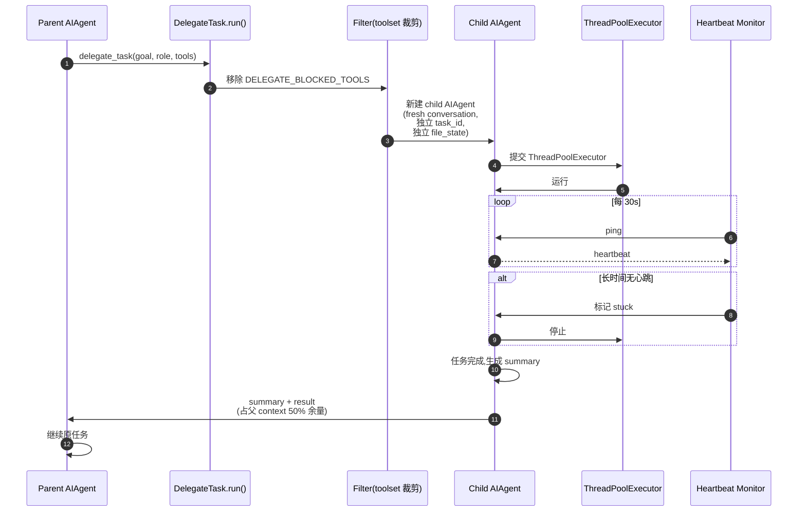

# 10 · 子代理(Sub-agents / Multi-Agent)

## 概述

Hermes 的 `delegate_task` 工具是 OSS 生态里**最复杂**的子代理实现之一(`tools/delegate_tool.py`, 157 KB):
- 每个子 agent 有**全新会话**(无父历史)
- 工具集**强制裁剪**(`DELEGATE_BLOCKED_TOOLS`)
- **角色**(leaf / orchestrator)区分
- **心跳检测**替代 wall-clock 超时
- **同步 + 异步**两种模式
- **摘要回传**控制父 context 占用
- **完整事件流** + CLI overlay

---

## 核心数据

| 项 | 值 |
|----|----|
| `MAX_DEPTH` | 1(默认,扁平) |
| `max_concurrent_children` | 3(默认) |
| `_HEARTBEAT_STALE_CYCLES_IDLE` | 15(15 × 30s = 450s idle) |
| `_HEARTBEAT_STALE_CYCLES_IN_TOOL` | 40(40 × 30s = 1200s on same tool) |
| `_SUMMARY_HEADROOM_FRACTION` | 0.5(子代理摘要占父余量一半) |

---

## DELEGATE_BLOCKED_TOOLS(强制裁剪)

`tools/delegate_tool.py:45-54`:

```python
DELEGATE_BLOCKED_TOOLS = frozenset([
    "delegate_task",    # 不能递归委派
    "clarify",          # 不能追问用户
    "memory",           # 不能写共享 MEMORY.md
    "send_message",     # 不能跨平台副作用
    "execute_code",     # 不写脚本,逐步推理
    "cronjob",          # 不能以父名义调度
])
```

**设计哲学**:**子代理是"纯计算单元"**,不能产生副作用或用户交互。

---

## 角色

| Role | 默认工具 | 何时启用 delegate |
|------|----------|-------------------|
| `leaf`(默认) | DELEGATE_BLOCKED_TOOLS 后剩余 | 不能再委派 |
| `orchestrator` | leaf + delegation 工具集(条件) | 当 `max_spawn_depth >= 2` |

`tools/delegate_tool.py:337-351, 506-520` 区分。

---

## 子代理委派时序



---

## 子代理构造

```python
# tools/delegate_tool.py
child_agent = AIAgent(
    conversation=fresh_conversation(),   # 全空
    task_id=new_task_id(),                # 独立 terminal session
    file_state=FileState(),                # 独立缓存
    toolsets=filtered_toolsets,            # 已裁剪
    system_prompt=focused_system_prompt,  # 针对目标定制
    parent_session_id=self.session_id,     # 血缘追踪
    parent_turn_id=self.turn_id,
)
```

---

## 子代理 Approval Callback 修复

```python
# tools/delegate_tool.py:60-112
def _subagent_auto_deny(): pass
def _subagent_auto_approve(): pass

ThreadPoolExecutor(initializer=install_callback)
```

**问题**:子代理在 ThreadPoolExecutor 上跑,**不继承** CLI 的 threading-local approval callback。
若 worker 调 `input()` 会**死锁父 TUI**。

**解决**:
- 默认 `_subagent_auto_deny`(安全)
- opt-in `_subagent_auto_approve`(YOLO,需 `delegation.subagent_auto_approve: true`)

---

## 心跳监测(替代 wall-clock 超时)

```python
_HEARTBEAT_STALE_CYCLES_IDLE = 15       # 450s idle
_HEARTBEAT_STALE_CYCLES_IN_TOOL = 40    # 1200s on same tool
```

**为什么不用 wall-clock 超时**:
- 深度 review / 慢推理模型 → 长任务
- blanket 超时会**误杀**真在工作的子代理
- 心跳监测只杀**真卡死**的

详见 `18-interview-questions.md` 中"心跳 vs wall-clock"题。

---

## 异步模式(`tools/async_delegation.py`,24 KB)

```python
delegate_task(goal="...", background=True)
# 立即返回 handle,不阻塞
```

- 后台 daemon executor 执行
- 完成事件 push 到共享 `process_registry.completion_queue`,`type="async_delegation"`
- CLI 和 gateway 现有 idle-pump drain 队列作为新 turn
- **容量上限**:满则**拒绝**(不排队)

---

## Summary Headroom 控制

```python
_SUMMARY_HEADROOM_FRACTION = 0.5

# 每个 batch 的摘要预算 = 父剩余 context × 50% / batch size
```

**问题**(`#9126`):N 个子代理并发回传,**总摘要撑爆父 context → 429 死亡螺旋**。

**解决**:总预算恒定,均摊到 batch。

---

## 事件类型(`DelegateEvent` enum)

`tools/delegate_tool.py:624-653`:

```python
class DelegateEvent(Enum):
    TASK_SPAWNED
    TASK_PROGRESS
    TASK_COMPLETED
    TASK_FAILED
    TASK_THINKING
    TASK_TOOL_STARTED
    TASK_TOOL_COMPLETED
```

兼容历史字符串(`_thinking`、`tool.started` 等),内部规范化。

---

## CLI Overlay / 中断

```python
list_active_subagents()         # 当前活跃列表
interrupt_subagent(sid)          # 单个停止
set_spawn_paused(bool)           # 全局暂停新建
```

CLI 显示活跃子代理 overlay,用户可一键中断。

---

## Subagent Hooks

`hermes_cli/plugins.py:164-165`:

```python
"subagent_start",
"subagent_stop",
```

`extra` 字段:`parent_turn_id, child_session_id, child_role, child_summary, child_status, duration_ms`。

`on_delegation` hook 在 `MemoryProvider` ABC 中也存在。

---

## 血缘追踪

`hermes_state.py`(`state.db`):
- `parent_session_id` 链
- `_delegate_from` 标记 → 级联删除子代理 run
- compression splits 保留 lineage

---

## 关键设计原则

1. **DELEGATE_BLOCKED_TOOLS 强制裁剪**:纯计算单元
2. **角色区分**:leaf vs orchestrator
3. **心跳监测 > wall-clock**:防误杀
4. **subagent auto-deny 默认**:防 TUI 死锁
5. **summary headroom 控制**:防 429 死亡螺旋
6. **async 模式复用 completion_queue**:不发明新 drain
7. **事件枚举统一**:TUI overlay 友好
8. **血缘追踪**:可级联清理 / 追溯
9. **CLI overlay**:用户可见、可中断
10. **MEMORY.md 不共享**:父子隔离

---

## 常见坑 / 面试考点

- Q:**子代理工具有什么限制?**
  A:6 个 blocked(委派 / 追问 / 写记忆 / 跨平台 / 写代码 / 调度)
- Q:**为什么不用 wall-clock 超时?**
  A:深度任务会误杀;心跳监测只杀真卡死的
- Q:**父 context 会被子代理撑爆吗?**
  A:summary 占父余量 50%,batch 均摊
- Q:**子代理能异步吗?**
  A:可以,挂到 `process_registry.completion_queue`
- Q:**子代理能写 MEMORY.md 吗?**
  A:不能,memory 工具被 blocked

详见 `18-interview-questions.md` 中"子代理"类题目。