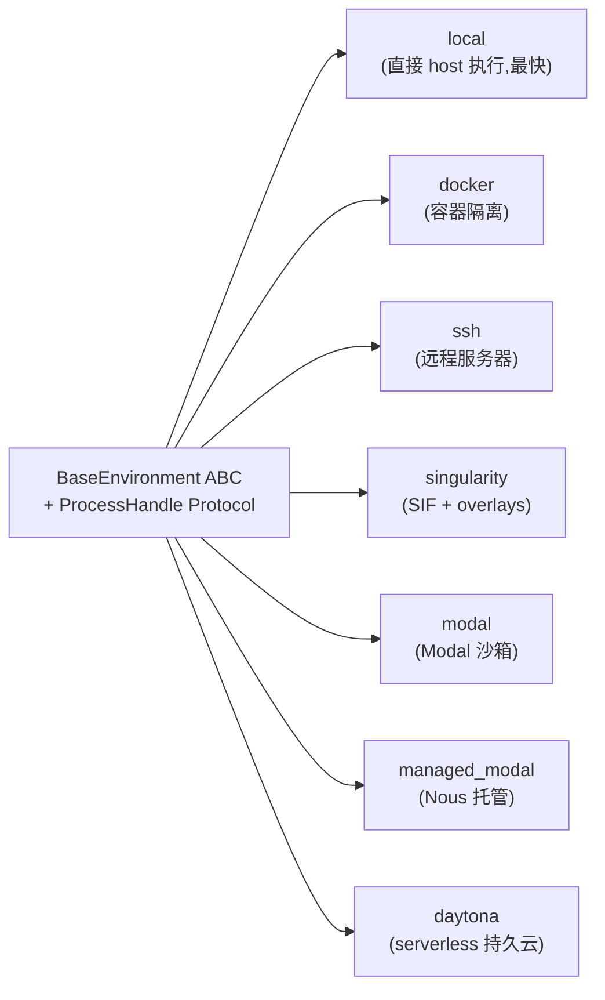

# 11 · 沙箱与执行环境(Harness)

## 概述

Hermes 提供 **6 种执行 backend**,共享统一的 `BaseEnvironment` ABC 和 `ProcessHandle` Protocol。
可以在 `local`(默认)→ `docker` → `ssh` → `singularity` → `modal` → `daytona` 之间无缝切换,**业务代码无需修改**。

配合完整的 `approval` 系统、YOLO 冻结、prompt-injection 扫描、credential 隔离,
构成生产级 harness。

**核心文件**:
- `tools/environments/base.py` —— `BaseEnvironment` ABC
- `tools/environments/{local,docker,ssh,singularity,modal,managed_modal,daytona}.py`
- `tools/approval.py`(148 KB,巨大)
- `tools/threat_patterns.py`
- `agent/file_safety.py`(28 KB)
- `agent/secret_scope.py`
- `agent/credential_persistence.py`

---

## BaseEnvironment ABC

```python
# tools/environments/base.py
class BaseEnvironment(ABC):
    """所有沙箱后端的统一接口"""

    @abstractmethod
    def execute(self, command: str, **kwargs) -> ProcessHandle: ...

    @abstractmethod
    def write_file(self, path: str, content: bytes): ...

    @abstractmethod
    def read_file(self, path: str) -> bytes: ...

    @abstractmethod
    def kill(self, handle: ProcessHandle): ...

    def set_activity_callback(self, cb): ...
        # 长任务定期 ping 网关,防 inactivity timeout
```

---

## ProcessHandle Protocol

```python
@runtime_checkable
class ProcessHandle(Protocol):
    pid: int
    stdout: BinaryIO
    stderr: BinaryIO
    returncode: Optional[int]
    is_alive: bool
```

**关键**:rest of agent **与 backend 解耦**,只看 `ProcessHandle`。

---

## 6 种 Backend



| Backend | 隔离强度 | 启动 | 适用 |
|---------|----------|------|------|
| local | 无(同 host) | 0 | 开发 / 受信 |
| docker | 中 | 快 | 通用 |
| ssh | 中(取决于 host) | 中 | 远程 / 集群 |
| singularity | 中 | 中 | HPC / SIF 镜像 |
| modal | 高 | 慢 | 云端隔离 |
| managed_modal | 高 + Nous 维护 | 中 | 多用户 / 托管 |
| daytona | 高 + 持久 | 慢 | 长会话 / 协作 |

**选型通过**:
- `TERMINAL_ENV` 环境变量
- `config.yaml` 的 `terminal.modal_mode` 开关

---

## Sandbox 存储

```python
# tools/environments/base.py:82-94
def get_sandbox_dir() -> Path:
    return Path(
        os.environ.get("TERMINAL_SANDBOX_DIR", "~/.hermes/sandboxes/")
    ).expanduser()
```

---

## 统一 Spawn-per-Call 模型

每个命令 spawn 一个**全新 `bash -c` 进程**。
**会话快照**(env vars, functions, aliases)**只在 init 时抓一次**,后续每次命令前 re-source。

**CWD 持久化**:
- 远程(SSH / docker):用 in-band stdout markers
- local:用临时文件

---

## Liveness Polling

```python
# tools/environments/base.py:47-79
def set_activity_callback(self, callback):
    """
    长任务 _wait_for_process 循环定期 ping
    网关的 elapsed-time 消息
    防 inactivity timeout 误杀
    """

def touch_activity_if_due(self):
    """默认 10s 节流"""
```

**意义**:长命令(rsync 大文件、ML 训练)期间,定期告诉网关"我在工作",避免 inactivity timeout 触发。

---

## Windows 兼容(`_pipe_stdin`, `windows_hide_flags`)

```python
# tools/environments/base.py:102-133
def _pipe_stdin(proc, data):
    """通过 proc.stdin.buffer 写入,
    绕过 Python 文本模式的 \\n → \\r\\n 转换
    (Windows 上会破坏 write_file)"""
```

**问题**:Windows 默认 Python stdin/stdout 是文本模式,`\n` 自动转 `\r\n`,破坏二进制协议(如 file write)。
**解决**:`proc.stdin.buffer` 走 binary mode。

---

## **审批系统**(`tools/approval.py`,148 KB)

### YOLO 模式 import 时冻结

```python
# tools/approval.py:31-34
YOLO_MODE = os.environ.get("HERMES_YOLO_MODE", "0") == "1"
# ⚠️ 在 import 时一次性读取,后续 env var 修改无效
```

**目的**:防止恶意 skill 在运行时设 env var,绕过所有审批检查。

### 状态管理

```python
# 基于 contextvars(不是 process-global env vars)
session_key: ContextVar[str]
approval_state: ContextVar[Dict]
```

**意义**:多 session 并发(ACP + gateway + CLI)各自独立审批状态。
`GHSA-96vc-wcxf-jjff` —— 不能用 process-global。

### 危险命令检测

```python
DANGEROUS_PATTERNS = [
    r"rm\s+-rf\s+/",
    r":(){ :|:& };:",        # fork bomb
    r"dd\s+if=/dev/zero",
    # ...
]

def detect_dangerous_command(cmd) -> Tuple[bool, str]:
    """返回 (is_dangerous, reason)"""
```

### Smart Approval(辅助 LLM)

```python
def should_auto_approve(cmd) -> bool:
    """用辅助 LLM 判断风险等级"""
```

低风险命令自动放行,高风险命令需要用户确认。

### 永久白名单

```python
# config.yaml
approval:
  allowlist:
    - command: "git status"
      match: exact
    - command: "npm test"
      match: prefix
```

匹配的命令**永远不需要审批**。

---

## 文件安全(`agent/file_safety.py`,28 KB)

- 路径越界检测
- 软链接解析 + 检查
- 危险路径(`.ssh`、`.aws`、`.gnupg`)默认拒绝

---

## 凭证隔离

- `agent/secret_scope.py` —— 凭证作用域
- `agent/credential_persistence.py` —— 持久化策略

```python
# 凭证只能在指定 scope 内被读取
# 插件不可越权访问其他插件的凭证
```

---

## `process_registry.py`

```python
@dataclass
class TrackedProcess:
    pid: int
    command: str
    started_at: datetime
    last_activity: datetime
    session_id: str

# 全局 registry
processes: Dict[int, TrackedProcess]
```

模型可通过 `process` 工具查看 / 中止 / 列出进程。

---

## 中断支持(`agent/interrupt.py`)

```python
interrupt_event: threading.Event()

def interrupt():
    interrupt_event.set()
```

terminal tool 在执行期间**轮询** `interrupt_event`,用户 Ctrl+C 时立即 kill 当前子进程。

---

## Write Approval(`tools/write_approval.py`)

文件写入有独立的审批流(与命令审批分开)。

---

## Threat Patterns(`tools/threat_patterns.py`)

**单一权威源** for:
- prompt injection 检测
- exfiltration 模式
- 工具结果围栏
- memory 注入扫描

被 memory / context-files / cron-scanner 共享。

---

## Tirith URL 安全(`tools/tirith_security.py`)

可选第三方 URL 安全扫描工具,集成在 tool 调用前。

---

## 关键设计原则

1. **6 backend + 共享 Protocol**:可热切换
2. **统一 spawn-per-call**:简单一致
3. **Liveness Polling**:防误杀长任务
4. **Windows 兼容**:binary mode bypass
5. **YOLO import 时冻结**:防运行时绕过
6. **contextvars 状态**:多 session 并发安全
7. **Dangerous Patterns**:静态扫描
8. **Smart Approval**:辅助 LLM 自动分级
9. **永久白名单**:信任的命令无需审批
10. **interrupt_event**:用户优先

---

## 常见坑 / 面试考点

- Q:**如何切换沙箱 backend?**
  A:`TERMINAL_ENV` 环境变量 / `config.yaml` `terminal.modal_mode`
- Q:**YOLO 模式如何被绕过?**
  A:**不能**,import 时冻结
- Q:**长任务会被 inactivity timeout 误杀吗?**
  A:`set_activity_callback` 定期 ping 网关
- Q:**多 session 共享审批状态吗?**
  A:不,**contextvars 隔离**
- Q:**Windows 上有什么坑?**
  A:binary mode bypass(`proc.stdin.buffer`)
- Q:**如何设计可切换的 sandbox?**
  A:`BaseEnvironment` ABC + `ProcessHandle` Protocol

详见 `18-interview-questions.md` 中"沙箱"类题目。