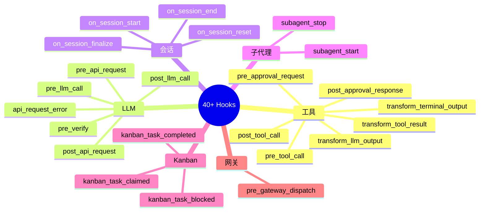
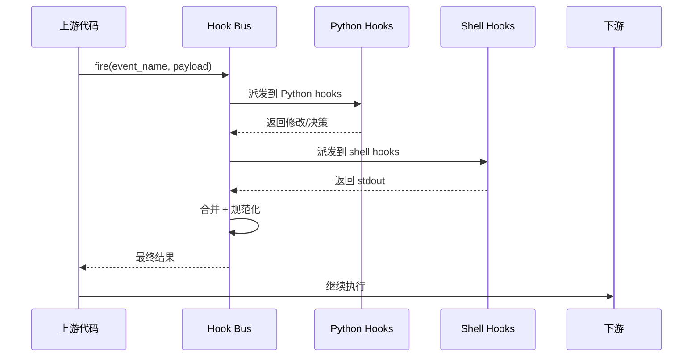

# 12 · Hooks 与中间件

## 概述

Hermes 提供 **40+ 生命周期事件**,支持 **Python 插件** 和 **Shell 脚本** 两种接入方式。
这构成了完整的**可观测 + 可拦截 + 可扩展**体系。

**核心文件**:
- `hermes_cli/plugins.py:135-213` `VALID_HOOKS`
- `agent/shell_hooks.py`(35 KB)Shell bridge
- `agent/verify_hooks.py` `pre_verify` 门控
- `gateway/hooks.py` 网关事件
- `agent/verify_hooks.py` + `DEFAULT_MAX_VERIFY_NUDGES = 3`

---

## Hook 分类全景



---

## 完整 Hook 列表

### 工具生命周期

| Hook | 触发时机 | 可阻塞 | 返回值 |
|------|----------|--------|--------|
| `pre_tool_call` | 工具调用前 | ✅ | `{decision: allow/block, reason}` |
| `post_tool_call` | 工具调用后 | ❌ | result, status, duration_ms |
| `transform_terminal_output` | terminal 输出后 | ❌ | 转换后的输出 |
| `transform_tool_result` | tool 结果后 | ❌ | 转换后的结果 |
| `transform_llm_output` | LLM 输出后 | ❌ | 转换后的输出 |
| `pre_approval_request` | 审批请求前 | ❌(观察) | - |
| `post_approval_response` | 审批响应后 | ❌(观察) | - |

### LLM 生命周期

| Hook | 触发时机 | 可注入 | 返回值 |
|------|----------|--------|--------|
| `pre_llm_call` | LLM 调用前 | ✅ | `{context: "..."}` |
| `post_llm_call` | LLM 调用后 | ❌ | - |
| `pre_api_request` | HTTP 请求前 | ❌ | - |
| `post_api_request` | HTTP 响应后 | ❌ | - |
| `api_request_error` | HTTP 错误 | ❌ | - |
| `pre_verify` | 验证循环门控 | ✅ | `{action: continue, message}` |

### 会话生命周期

| Hook | 触发时机 |
|------|----------|
| `on_session_start` | session 开始 |
| `on_session_end` | session 结束 |
| `on_session_finalize` | session 最终化(写盘) |
| `on_session_reset` | session 重置(`/new`) |

### 子代理

| Hook | 触发时机 | extra 字段 |
|------|----------|------------|
| `subagent_start` | 子代理启动 | parent_turn_id, child_session_id, child_role |
| `subagent_stop` | 子代理停止 | child_summary, child_status, duration_ms |

### Kanban(看 `12-kanban` 章节)

| Hook | 触发进程 |
|------|----------|
| `kanban_task_claimed` | dispatcher |
| `kanban_task_completed` | worker |
| `kanban_task_blocked` | worker |

### 网关

| Hook | 触发时机 | 可控 |
|------|----------|------|
| `pre_gateway_dispatch` | 入站消息 | skip / rewrite / allow |

---

## Allow / Block 协议(双重格式)

`pre_tool_call` 接受**两种格式**:

```json
// Claude-Code 风格
{"decision": "block", "reason": "..."}

// Hermes-canonical 风格
{"action": "block", "message": "..."}
```

内部规范化,插件作者可任选。

---

## `pre_verify` 验证循环

```python
# agent/verify_hooks.py
DEFAULT_MAX_VERIFY_NUDGES = 3

def fire_pre_verify(response, context) -> Optional[dict]:
    """
    插件可返回 {"action": "continue", "message": "..."}
    让 agent 继续(给模型一个"再想想"的机会)
    
    累计 N 次后强制结束(N = DEFAULT_MAX_VERIFY_NUDGES)
    """
```

**用例**:模型回复太短 / 没引用工具结果 / 漏了关键步骤 → 插件可"再推一下"。

---

## Shell 脚本 Hook Bridge

详见 `08-plugins.md`。Wire protocol:

**stdin**:
```json
{
  "hook_event_name": "pre_tool_call",
  "tool_name": "terminal",
  "tool_input": {"command": "rm -rf /"},
  "session_id": "...",
  "cwd": "/home/user",
  "extra": {}
}
```

**stdout**(可选):
```json
{"decision": "block", "reason": "dangerous"}
```
或
```json
{"context": "injected"}
```

---

## 关联 ID 透传

```python
# tools/observability
set_current_observability_context(
    turn_id=...,
    tool_call_id=...,
)
# 用 contextvars 透传
```

**意义**:网关 / 审批 / hook 链路共享同一组关联 ID,便于追踪和审计。

---

## 可观测性契约(`docs/observability/README.md`)

```yaml
telemetry_schema_version: "hermes.observer.v1"
correlation_ids:
  - session_id
  - task_id
  - turn_id
  - api_request_id
  - api_call_count
  - tool_call_id
  - parent_session_id
  - child_session_id
  - parent_subagent_id
  - child_subagent_id
  - parent_turn_id
```

### Fail-Open
```python
try:
    fire_hook(event_name, payload)
except Exception as e:
    log.error(f"hook failed: {e}")
    # 继续执行,不因 hook 失败阻塞
```

---

## 实现示例

### Python 插件

```python
# plugins/observability/langfuse/__init__.py
def register(ctx):
    ctx.register_hook("pre_llm_call", on_pre_llm_call)
    ctx.register_hook("post_tool_call", on_post_tool_call)

def on_pre_llm_call(payload):
    langfuse.trace(
        session_id=payload["session_id"],
        turn_id=payload["turn_id"],
        model=payload["model"],
        messages=payload["messages"],
    )

def on_post_tool_call(payload):
    langfuse.span(
        name=payload["tool_name"],
        duration_ms=payload["duration_ms"],
        status=payload["status"],
    )
```

### Shell Hook

```yaml
# cli-config.yaml
hooks:
  pre_tool_call: "~/.hermes/hooks/check_dangerous.sh"
```

```bash
#!/bin/bash
# ~/.hermes/hooks/check_dangerous.sh
INPUT=$(cat)
CMD=$(echo "$INPUT" | jq -r '.tool_input.command')

if echo "$CMD" | grep -qE 'rm\s+-rf\s+/'; then
  echo '{"decision": "block", "reason": "dangerous rm -rf /"}'
fi
```

---

## Hook 触发流程



---

## 关键设计原则

1. **40+ 事件**:覆盖全生命周期
2. **双格式兼容**:Claude-Code + Hermes-canonical
3. **Fail-Open**:hook 失败不阻塞主流程
4. **关联 ID 透传**:session_id / turn_id / tool_call_id
5. **Python + Shell 双接入**:降低门槛
6. **首次使用 consent**:shell hook 安全
7. **wire protocol 文档化**:在 docstring
8. **`pre_verify` 门控**:防"模型偷懒"
9. **transform_***:可改输出,不只观察
10. **observability 契约**:schema 统一

---

## 常见坑 / 面试考点

- Q:**hook 失败会阻塞主流程吗?**
  A:**不会**,Fail-Open
- Q:**如何审计 agent 行为?**
  A:`post_tool_call` + `post_llm_call` hook,持久化到 trace
- Q:**插件和 shell hook 优先级?**
  A:Python 先,shell 后,首个非 None 返回值生效
- Q:**pre_verify 跑几次?**
  A:`DEFAULT_MAX_VERIFY_NUDGES = 3`
- Q:**如何防止模型偷懒?**
  A:`pre_verify` hook + 业务逻辑判断
- Q:**关联 ID 怎么透传?**
  A:`set_current_observability_context()` + `contextvars`

详见 `18-interview-questions.md` 中"可观测性"类题目。