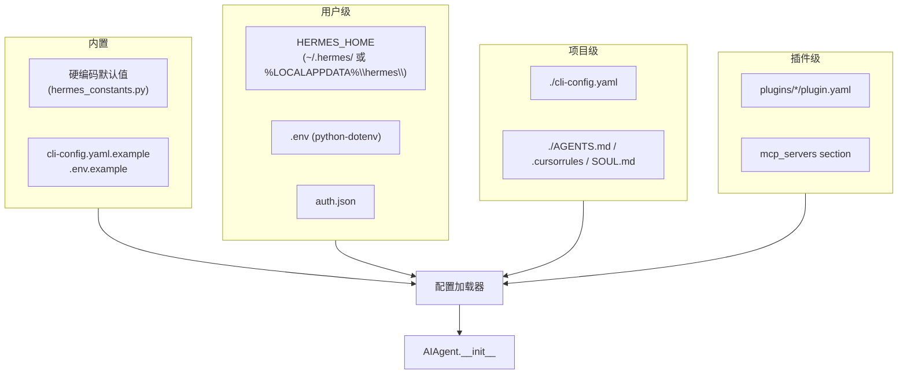
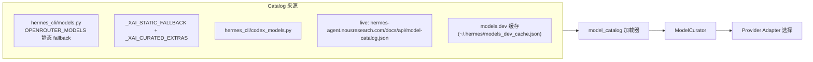
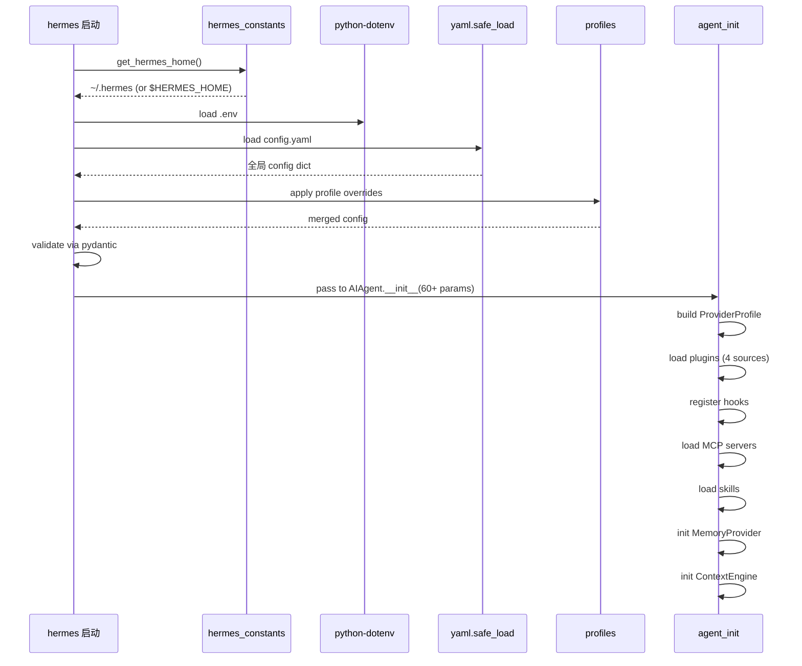

# 13 · 配置管理

## 概述

Hermes 的配置系统采用**多源、优先级明确**的设计:
- **YAML** + **`.env`** + **JSON** + **plugin.yaml**
- 用户级 / 项目级 / 内置 三层
- 通过 `HERMES_HOME` 环境变量切换 profile
- `ProviderProfile` 抽象统一 provider 配置
- 每个子系统(memory / context_engine / skills / mcp / cron)都有独立 section

---

## 配置源全景



---

## 关键路径常量(`hermes_constants.py`)

```python
# POSIX
HERMES_HOME = "~/.hermes/"

# Windows
HERMES_HOME = "%LOCALAPPDATA%\\hermes\\"

# Override
HERMES_HOME = os.environ.get("HERMES_HOME", default)

def get_config_path() -> Path:
    return Path(HERMES_HOME) / "config.yaml"
```

---

## `cli-config.yaml` 完整结构(节选自 `cli-config.yaml.example` 77 KB)

### 顶层

```yaml
# 模型
model:
  default: anthropic/claude-3.5-sonnet
  provider: openrouter
  base_url: https://openrouter.ai/api/v1
  api_key: ${OPENROUTER_API_KEY}
  extra_headers: {}
  context_length: 200000
  max_tokens: 8192

# Provider 路由(OpenRouter)
provider_routing:
  sort: price            # price / throughput / latency
  only: [...]            # 白名单
  ignore: [...]          # 黑名单
  order: [...]           # 顺序
  require_parameters: {}
  data_collection: deny

# Provider 配置
providers:
  anthropic:
    request_timeout_seconds: 600
    stale_timeout_seconds: 90
    models:
      claude-3.5-sonnet:
        timeout_seconds: 600

# Fallback 链
fallback_providers:
  - provider: anthropic
    model: claude-3.5-sonnet
  - provider: openai-codex
    model: gpt-4o

# OpenRouter 缓存
openrouter:
  response_cache: true
  response_cache_ttl: 300

# 其他
worktree: {}
worktree_sync: {}
auxiliary: {}
compression: {}
reasoning_effort: high        # none/minimal/low/medium/high/xhigh
personalities: {}
api_max_retries: 3
verify_on_stop: true
coding_instructions: ""
max_verify_nudges: 3
verbose: false
```

### 子系统 section

```yaml
# Cron
cron:
  enabled: true
  tick_interval_seconds: 60
  one_shot_timeout: 1800

# Memory
memory:
  provider: builtin       # 或 honcho / hindsight / mem0 / ...
  max_memory_chars: 2200
  max_user_chars: 1375

# Context Engine
context:
  engine: compressor      # 或 lcm / ...
  threshold_percent: 0.75
  protect_first_n: 3
  protect_last_n: 6

# Skills
skills:
  external_dirs: []
  disabled: []
  platform_disabled: {}

# Plugins
plugins:
  entries:
    my-plugin:
      enabled: true
      allow_tool_override: false
      config: {}

# Hooks
hooks:
  pre_tool_call: "~/.hermes/hooks/check_dangerous.sh"
  post_tool_call: null

# Approval
approval:
  allowlist:
    - command: "git status"
      match: exact

# Delegation(子代理)
delegation:
  max_concurrent_children: 3
  max_spawn_depth: 1
  child_timeout_seconds: null
  subagent_auto_approve: false

# MCP Servers
mcp_servers:
  - name: github
    command: npx
    args: ["-y", "@modelcontextprotocol/server-github"]
    env: {}
    timeout: 30
    supports_parallel_tool_calls: true
    sampling: {}
  - name: linear
    url: https://mcp.linear.app/sse
    transport: sse
    oauth: {}
```

---

## `.env` 配置(`.env.example` ~24 KB,30+ provider keys)

```bash
# OpenRouter
OPENROUTER_API_KEY=sk-or-v1-...

# Anthropic
ANTHROPIC_API_KEY=sk-ant-...

# OpenAI
OPENAI_API_KEY=sk-...

# Bedrock
AWS_ACCESS_KEY_ID=...
AWS_SECRET_ACCESS_KEY=...

# Vertex
GOOGLE_APPLICATION_CREDENTIALS=/path/to/sa.json

# Azure
AZURE_OPENAI_API_KEY=...
AZURE_OPENAI_ENDPOINT=...

# Mistral
MISTRAL_API_KEY=...

# ... 共 30+ provider
```

`python-dotenv==1.2.2` 自动加载。

---

## `auth.json`

```json
{
  "providers": {
    "anthropic": {"api_key": "...", "account": "..."},
    "openai": {"oauth": {...}}
  },
  "oauth_grants": {
    "mcp:linear": {"access_token": "...", "refresh_token": "..."}
  }
}
```

---

## Profile 系统(`hermes_cli/profiles.py`)

```bash
export HERMES_HOME=~/.hermes-work   # 切到 work profile
export HERMES_HOME=~/.hermes-personal
```

每个 profile 完全隔离:
- config.yaml
- memories/
- skills/
- cron jobs
- state.db
- logs/

适合"工作 / 个人 / 测试"等场景分离。

---

## Model Catalog(`hermes_cli/model_catalog.py`)



### Live Catalog Schema v1

```json
{
  "version": 1,
  "providers": {
    "openrouter": {
      "models": [
        {"id": "anthropic/claude-3.5-sonnet", "context": 200000, ...}
      ]
    },
    "nous": {
      "models": [...]
    }
  }
}
```

---

## `ProviderProfile`(`providers/base.py`)

**核心理念**:一切关于 provider 的信息集中在一个 dataclass,而不是 20+ 布尔参数:

```python
@dataclass
class ProviderProfile:
    # Auth
    api_key: Optional[str]
    oauth_token: Optional[str]

    # Endpoints
    base_url: str
    chat_completions_path: str = "/chat/completions"

    # Client quirks
    require_message_id: bool = False
    strip_empty_assistant: bool = True
    convert_thinking_blocks: bool = False

    # Request-time quirks
    extra_headers: Dict = field(default_factory=dict)
    extra_body: Dict = field(default_factory=dict)
    timeout_seconds: int = 600

    # Reasoning
    supports_reasoning_effort: bool = True
    reasoning_param_name: str = "reasoning_effort"
```

**好处**:transport 层只读这个 dataclass,不再传 20+ 散参数。

---

## Plugin 加载配置(`plugin.yaml`)

```yaml
name: langfuse-observability
kind: standalone           # standalone / backend / exclusive / platform / model-provider
version: 1.0.0
description: Langfuse LLM observability
author: Langfuse
config_schema:
  type: object
  properties:
    public_key: {type: string}
    secret_key: {type: string}
```

加载时:`plugins/<name>/config.yaml`(用户可覆盖默认)。

---

## MCP 配置(嵌套在主 config 中)

```yaml
mcp_servers:
  - name: github
    command: npx
    args: ["-y", "@modelcontextprotocol/server-github"]
    env:
      GITHUB_TOKEN: ${GITHUB_TOKEN}
    timeout: 30
    connect_timeout: 10
    keepalive_interval: 60
    idle_timeout_seconds: 300
    max_lifetime_seconds: 3600
    supports_parallel_tool_calls: true
    sampling:
      enabled: true
      model: anthropic/claude-3.5-sonnet
      max_tokens_cap: 4000
      timeout: 60
      max_rpm: 30
      allowed_models: [...]
      max_tool_rounds: 3
      log_level: info
    headers:
      Authorization: Bearer ...
```

---

## Skill 配置(`skills.external_dirs`)

```yaml
skills:
  external_dirs:
    - ~/.hermes/custom-skills/
    - /opt/team-skills/
  disabled:
    - some-skill
  platform_disabled:
    my-skill: [win32]
```

---

## 配置加载顺序



---

## Fallback 链配置

```yaml
fallback_providers:
  - provider: anthropic
    model: claude-3.5-sonnet
  - provider: openai-codex
    model: gpt-4o
  - provider: openrouter
    model: anthropic/claude-3.5-sonnet
```

`hermes_cli/fallback_config.py:get_fallback_chain()`:
- 合并 `fallback_providers` + 旧版 `fallback_model`
- 旧版兼容
- 实时刷新(`tests/gateway/test_fallback_chain_reload.py` 覆盖)

CLI:
```bash
hermes fallback list
hermes fallback add --provider x --model y
hermes fallback remove
hermes fallback clear
```

---

## 关键设计原则

1. **多源 + 优先级**:YAML > .env > built-in default
2. **Profile 隔离**:`HERMES_HOME` 一键切换
3. **ProviderProfile 抽象**:集中所有 provider 信息
4. **pydantic 校验**:启动时 fail-fast
5. **Plugin config_schema**:插件可声明自己的 schema
6. **Live catalog**:从远端动态同步模型
7. **MCP 嵌套**:与主配置统一
8. **Fallback 链**:自动切换
9. **OpenRouter sort**:可按价格 / 延迟 / 吞吐排序
10. **`only`/`ignore`/`order`**:模型白黑名单 + 顺序

---

## 常见坑 / 面试考点

- Q:**配置加载顺序?**
  A:`.env` → `cli-config.yaml` → profile override → plugin.yaml
- Q:**如何切换 profile?**
  A:`HERMES_HOME=~/.hermes-work`
- Q:**Provider 配置为什么用 dataclass?**
  A:集中表达,避免 20+ 散参数
- Q:**fallback 链如何工作?**
  A:每轮 on-error 切换,失败恢复 primary
- Q:**Live catalog 是必须的吗?**
  A:否,有静态 fallback
- Q:**插件如何声明配置 schema?**
  A:`plugin.yaml` 的 `config_schema` 字段,pydantic 校验

详见 `18-interview-questions.md` 中"配置管理"类题目。