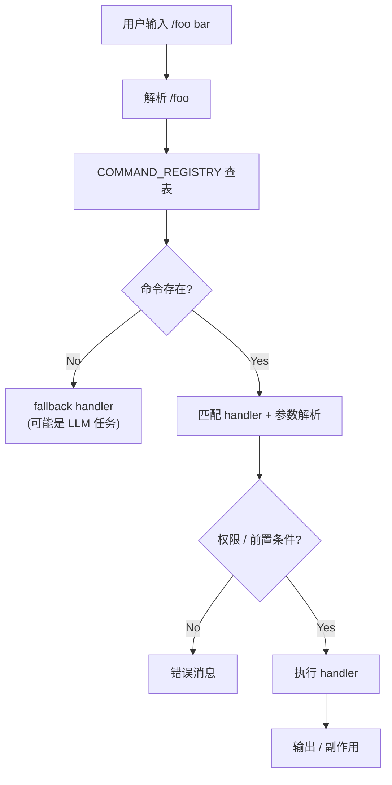
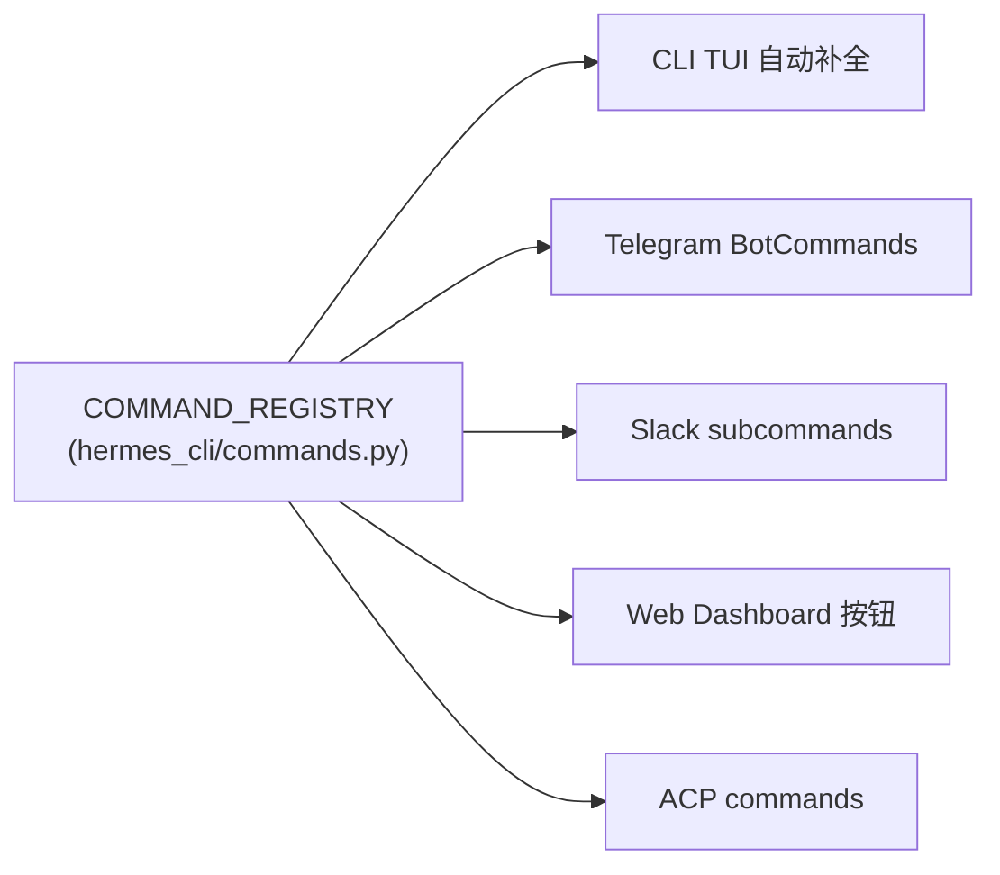

# 14 · CLI / TUI / Slash 命令

## 概述

Hermes 的 CLI 是 **prompt_toolkit** 驱动的全功能 TUI:
- 多行编辑
- 流式工具输出
- 中断-重定向
- 80+ slash 命令
- 自动补全 / 建议
- 多平台消息接入复用同一命令注册表

**核心文件**:
- `cli.py`(764 KB,TUI 主程序)
- `hermes_cli/main.py`(CLI 入口)
- `hermes_cli/commands.py` `COMMAND_REGISTRY`(80+ slash 命令)
- `hermes_cli/*.py`(147 个文件)

---

## 入口

```python
# pyproject.toml:307-310
hermes        -> hermes_cli.main:main
hermes-agent  -> run_agent:main
hermes-acp    -> acp_adapter.entry:main
```

---

## 顶层命令(`hermes_cli/main.py:1-50` docstring)

```
hermes                       # 默认进入 TUI
hermes chat                  # 一次性 chat
hermes gateway start         # 启动网关
hermes gateway stop
hermes gateway status
hermes gateway install       # 安装 systemd/launchd 服务
hermes gateway uninstall
hermes setup                 # 首次配置向导
hermes logout
hermes status
hermes cron ...              # cron 子命令
hermes doctor                # 自检
hermes honcho ...            # Honcho 用户建模
hermes version
hermes update
hermes uninstall
hermes acp                   # ACP server
hermes sessions browse       # 浏览历史会话
hermes claw migrate --dry-run
```

---

## TUI 特性(README 引用)

> Full TUI with multiline editing, slash-command autocomplete, conversation history, interrupt-and-redirect, and streaming tool output.

- **多行编辑**:prompt_toolkit
- **slash 命令自动补全**:`SlashCommandCompleter`、`SlashCommandAutoSuggest`
- **历史记录**:上下方向键
- **中断-重定向**:Ctrl+C 不杀 agent,改向输入
- **流式工具输出**:实时显示

---

## 80+ Slash 命令(`hermes_cli/commands.py:64` `COMMAND_REGISTRY`)

### Session 类

| 命令 | 别名 | 功能 |
|------|------|------|
| `/new` | `/reset` | 新 session |
| `/clear` | | 清屏(不清 session) |
| `/history` | | 浏览历史 |
| `/save` | | 手动保存 |
| `/retry` | | 重试上一轮 |
| `/undo` | | 撤回 |
| `/title` | | 改 session 标题 |
| `/handoff` | | 跨 session 移交 |
| `/branch` | `/fork` | 分支 |
| `/compress` | `/compact` | 触发压缩 |
| `/rollback` | | 回滚 N 步 |
| `/snapshot` | `/snap` | 快照 |
| `/stop` | | 停止当前任务 |
| `/approve` | | 显式批准 |
| `/deny` | | 显式拒绝 |
| `/background` | `/bg`, `/btw` | 后台模式 |
| `/agents` | `/tasks` | 列活跃子代理 |
| `/journey` | `/learning`, `/memory-graph` | 技能使用图谱 |
| `/queue` | `/q` | 查看后台队列 |
| `/steer` | | 转向提示 |
| `/goal` | | 设置长目标 |
| `/moa` | | Mixture-of-Agents 跑 |
| `/subgoal` | | 子目标 |
| `/status` | | 状态 |
| `/whoami` | | 当前 user |
| `/profile` | | 切 profile |
| `/sethome` | `/set-home` | 改 HERMES_HOME |
| `/resume` | | 恢复 session |

### Configuration 类

| 命令 | 功能 |
|------|------|
| `/config` | 查看 / 改 config |
| `/model` | 切模型(`--provider` `--global/--session`) |
| `/codex-runtime` | Codex runtime 模式 |
| `/personality` | 切换 personality |
| `/statusbar` | 状态栏 |
| `/timestamps` | 时间戳显示 |
| `/verbose` | 详细日志 |
| `/footer` | 页脚 |
| `/yolo` | YOLO 开关(import 时已冻结,这是显示) |
| `/reasoning` | reasoning_effort |
| `/fast` | 快速模式 |
| `/skin` | 主题 |
| `/indicator` | 状态指示 |
| `/voice` | TTS |
| `/busy` | 忙时显示 |

### Tools & Skills 类

| 命令 | 功能 |
|------|------|
| `/tools` | 启用的工具 |
| `/toolsets` | 启用的工具集 |
| `/skills` | 子命令:`search`, `browse`, `inspect`, `install`, `audit`, `pending`, `approve`, `reject`, `diff`, `approval` |
| `/memory` | 记忆管理 |
| `/bundles` | skill bundle |
| `/pet` | Honcho dialectic |
| `/hatch` | 创建技能 |
| `/learn` | 学习模式 |
| `/cron` | cron 子命令 |
| `/suggestions` | `/suggest` 调度建议 |
| `/blueprint` | `/bp` 蓝图库 |
| `/curator` | 手动触发 Curator |
| `/kanban` | 看板 |
| `/reload` | 重载配置 |
| `/reload-mcp` | 重载 MCP |
| `/reload-skills` | 重载技能 |
| `/browser` | 浏览器 |
| `/plugins` | 插件管理 |

### Info 类

| 命令 | 功能 |
|------|------|
| `/commands` | 列所有命令 |
| `/help` | 帮助 |
| `/restart` | 重启 |
| `/usage` | 用量统计 |
| `/credits` | 积分 |
| `/billing` | 计费 |
| `/insights` | 洞察 |
| `/platforms` | `/gateway` 平台列表 |
| `/platform` | 单平台设置 |
| `/copy` | 复制最后输出 |
| `/paste` | 粘贴 |
| `/image` | 图像上传 |
| `/update` | 更新 |
| `/version` | `/v` 版本 |

---

## 命令派发



**复用**:同一 `COMMAND_REGISTRY` 被:
- CLI TUI
- Telegram BotCommands
- Slack subcommands
- 自动补全

**单一来源真理**(Single Source of Truth)。

---

## 自动补全

```python
# hermes_cli/commands.py:858
class SlashCommandCompleter(Completer):
    """prompt_toolkit Completer,基于 COMMAND_REGISTRY"""

class SlashCommandAutoSuggest(AutoSuggest):
    """prompt_toolkit AutoSuggest,基于历史 / 上下文"""
```

---

## 多接入面复用



**好处**:新增 slash 命令 → 自动在 5 个接入面可用。

---

## `cli.py`(764 KB)结构

```python
# cli.py
class HermesREPL:
    """主 TUI 循环"""

    def run(self):
        self._init_prompt_toolkit()
        self._register_completers()
        self._bind_keys()
        while True:
            try:
                user_input = self.prompt()
                self._handle_input(user_input)
            except KeyboardInterrupt:
                # interrupt-redirect,不退出
                self._redirect_prompt()
```

**特性实现**:
- **interrupt-redirect**:Ctrl+C 改成"插入新指令"
- **流式输出**:async generator + 实时渲染
- **多行编辑**:prompt_toolkit multiline mode

---

## Gateway CLI 子命令

```bash
hermes gateway start         # 前台启动
hermes gateway start --bg    # 后台
hermes gateway stop          # 停止
hermes gateway status        # 状态
hermes gateway install       # 安装系统服务
hermes gateway uninstall     # 卸载
hermes gateway logs          # 看日志
```

**系统服务集成**:
- Linux: systemd unit
- macOS: launchd plist
- Windows: scheduled task / service

详见 `gateway/install.py`。

---

## ACP(Agent Client Protocol)

```bash
hermes acp
```

启动 ACP server,让 Zed / VSCode 等编辑器通过 ACP 协议接入 Hermes。

详见 `acp_adapter/`。

---

## 关键设计原则

1. **COMMAND_REGISTRY 单一来源**:5 个接入面共享
2. **prompt_toolkit**:成熟 TUI 框架
3. **Slash 命令自动补全**:基于 Registry 派生
4. **interrupt-redirect**:不杀 agent,改向输入
5. **流式输出**:async generator + 实时渲染
6. **多行编辑**:支持复杂输入
7. **gateway install/uninstall**:系统服务集成
8. **ACP 协议**:编辑器友好
9. **CLI doctor**:自检命令
10. **`--dry-run`**:关键操作可预览

---

## 常见坑 / 面试考点

- Q:**命令如何跨接入面复用?**
  A:`COMMAND_REGISTRY` 单一来源
- Q:**interrupt-redirect 是什么?**
  A:Ctrl+C 不杀 agent,改成插入新指令
- Q:**如何添加新命令?**
  A:在 `COMMAND_REGISTRY` 注册
- Q:**TUI 用什么框架?**
  A:`prompt_toolkit`(Python 标准 TUI)
- Q:**ACP 是什么?**
  A:Agent Client Protocol,Zed/VSCode 接入协议

详见 `18-interview-questions.md` 中"CLI"类题目。