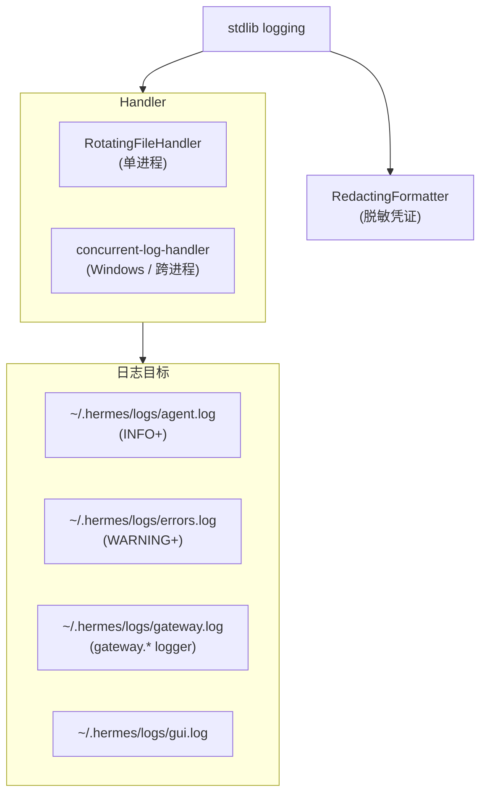

# 15 · 可观测性

## 概述

Hermes 提供**多层可观测性**:
- **日志**:stdlib `logging` + `RotatingFileHandler` + 跨进程 `concurrent-log-handler`
- **关联 ID**:`session_id` / `turn_id` / `tool_call_id` 通过 `contextvars` 透传
- **Observer Hooks**:40+ 事件,plugin 可观测 / 拦截
- **结构化 Trace**:可推到 Langfuse / NeMo Relay
- **可观测性插件**:`plugins/observability/{langfuse,nemo_relay}/`
- **Fail-Open**:hook 异常不阻塞主流程

**核心文件**:
- `hermes_logging.py`(日志)
- `docs/observability/README.md`(契约)
- `plugins/observability/*`(实现)
- `agent/redact.py`(脱敏)

---

## 日志架构



**`hermes_logging.py:9-22`**:
- `agent.log`:所有 INFO+
- `errors.log`:WARNING+
- `gateway.log`:只 `gateway.*` logger
- `gui.log`:Dashboard / TUI Gateway

---

## 脱敏(`agent/redact.py`,37 KB)

```python
class RedactingFormatter(logging.Formatter):
    """包装所有 handler,自动脱敏凭证"""

    SENSITIVE_PATTERNS = [
        r"sk-[a-zA-Z0-9-]+",          # OpenAI
        r"sk-ant-[a-zA-Z0-9-]+",       # Anthropic
        r"sk-or-v1-[a-zA-Z0-9-]+",     # OpenRouter
        r"Bearer [a-zA-Z0-9._-]+",
        # ...
    ]
```

日志中凭证**自动替换**为 `***REDACTED***`,避免泄露。

---

## 会话上下文

```python
# hermes_logging.py:25-27
threading.local()
set_session_context(session_id: str)
# 日志前缀变为 [session_id] ...
```

**好处**:多 session 并发时,日志可按 session 过滤。

---

## Observer Hooks 契约(`docs/observability/README.md`)

```yaml
telemetry_schema_version: "hermes.observer.v1"
```

### 关联 ID

```python
correlation_ids = {
    "session_id",
    "task_id",
    "turn_id",
    "api_request_id",
    "api_call_count",
    "tool_call_id",
    "parent_session_id",
    "child_session_id",
    "parent_subagent_id",
    "child_subagent_id",
    "parent_turn_id",
}
```

### Hook 事件

```python
# 行为可影响
"pre_llm_call"          # 可注入 context
"transform_tool_result"  # 改 tool 结果
"transform_llm_output"   # 改 LLM 输出

# 观察用
"pre_api_request"
"post_api_request"
"pre_tool_call"
"post_tool_call"
```

### Fail-Open

```python
try:
    fire_hook(event_name, payload)
except Exception as e:
    log.error(f"hook failed: {e}")
    # 继续执行,不阻塞主流程
```

---

## 实现:Langfuse 插件(`plugins/observability/langfuse/`)

```python
def register(ctx):
    ctx.register_hook("pre_llm_call", on_pre_llm_call)
    ctx.register_hook("post_tool_call", on_post_tool_call)

def on_pre_llm_call(payload):
    langfuse.trace(
        session_id=payload["session_id"],
        turn_id=payload["turn_id"],
        model=payload["model"],
        messages=payload["messages"],
    )

def on_post_tool_call(payload):
    langfuse.span(
        name=payload["tool_name"],
        duration_ms=payload["duration_ms"],
        status=payload["status"],
    )
```

## 实现:NeMo Relay(`plugins/observability/nemo_relay/`)

类似结构,推到 NVIDIA NeMo。

---

## 可观测的"什么"

| 维度 | 数据源 | 例子 |
|------|--------|------|
| **会话级** | session lifecycle hook | 启动 / 结束 / 重置 |
| **轮次级** | turn hook | 每轮延迟、token |
| **API 级** | pre/post_api_request | HTTP 状态、延迟 |
| **工具级** | pre/post_tool_call | 调用次数、成功率、duration |
| **LLM 级** | pre/post_llm_call | 模型选择、context 大小、reasoning_effort |
| **子代理级** | subagent_start/stop | 并发数、单 task 耗时 |
| **Kanban 级** | kanban_task_* | 任务流转 |
| **网关级** | pre_gateway_dispatch | 入站消息 |

---

## Insight 命令

`/insights` 触发 `agent/insights.py`(40 KB)聚合分析:
- token 消耗趋势
- 工具调用热点
- 错误率
- cron 成功率

---

## 用量统计

```bash
/usage           # agent/account_usage.py
/credits         # agent/credits_tracker.py
/billing         # agent/billing_view.py
```

**多账户**:`agent/credential_pool.py`(112 KB)管理凭证轮转,统计按账户聚合。

---

## 关键设计原则

1. **四类日志**:不同用途,不同详细级别
2. **RedactingFormatter**:凭证脱敏
3. **关联 ID 透传**:contextvars + 格式化
4. **Observer Hooks 契约**:schema 统一 + 文档化
5. **Fail-Open**:hook 失败不阻塞
6. **可插拔 backend**:Langfuse / NeMo / 自定义
7. **维度齐全**:session / turn / API / tool / LLM / subagent / kanban / gateway
8. **Insight 命令**:聚合分析
9. **多账户追踪**:用 credential pool
10. **脱敏第一**:凭证永远不进日志

---

## 常见坑 / 面试考点

- Q:**如何追踪一次请求的全链路?**
  A:关联 ID(`session_id` / `turn_id` / `tool_call_id` / `api_request_id`)
- Q:**hook 失败会影响主流程吗?**
  A:**不会**,Fail-Open
- Q:**如何对接第三方观测平台?**
  A:实现 Observer Hooks 契约的 plugin
- Q:**凭证泄露风险?**
  A:RedactingFormatter 自动脱敏
- Q:**多 session 怎么区分?**
  A:`set_session_context()` + threading.local
- Q:**怎么设计可观测的 agent?**
  A:分层 hooks + 关联 ID + 结构化 trace + 凭证脱敏

详见 `18-interview-questions.md` 中"可观测性"类题目。