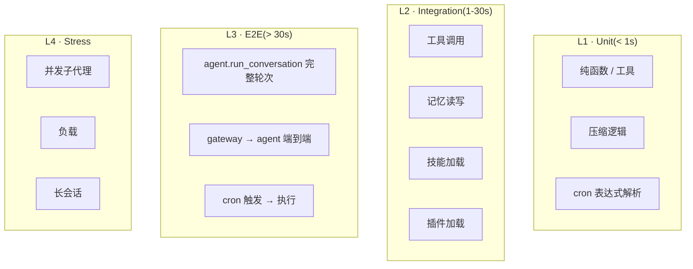

# 16 · 测试

## 概述

Hermes 的测试体系:
- **~2,000 个 `test_*.py`** 文件
- **pytest 9.0.2** + **pytest-asyncio 1.3.0**
- 完整分层:**unit / integration / e2e / stress / manual**
- **Fakes / Fixtures**(`tests/fakes/`、`tests/fixtures/`)
- **Markers**:`integration`、`real_concurrent_gate`
- **conftest.py**(35 KB)统一 fixtures
- **CI**:`tests/ci/`
- **轨迹生成**:`batch_runner.py`(用于 RL / 评测)

---

## 测试统计

```
tests/
├── conftest.py                 # 35 KB
├── acp/  acp_adapter/          # ACP 协议
├── agent/  agent/lsp/  agent/transports/   # 核心 agent
├── ci/                         # CI 集成
├── cli/                        # CLI 测试
├── computer_use/               # computer use
├── cron/                       # cron 子系统
├── dashboard/  docker/         # dashboard + docker
├── e2e/  e2e/matrix_xsign_bootstrap/   # 端到端
├── fakes/  fixtures/           # 测试替身
├── gateway/  gateway/platforms/  gateway/relay/   # 网关
├── hermes_cli/  hermes_state/  # CLI + state
├── honcho_plugin/  openviking_plugin/   # 外部 provider
├── integration/  manual/       # 集成 + 手动
├── plugins/
│   ├── browser/
│   ├── dashboard_auth/
│   ├── image_gen/
│   ├── memory/
│   ├── model_providers/
│   ├── platforms/photon/
│   └── video_gen/
├── providers/                  # provider 抽象
├── run_agent/                  # run_agent 主入口
├── scripts/  secret_sources/   # 脚本 + 密钥源
├── skills/                     # 技能
└── stress/                     # 压力测试
```

---

## pytest 配置(`pyproject.toml:359-366`)

```toml
[tool.pytest.ini_options]
testpaths = ["tests"]
markers = [
    "integration: marks tests as integration (deselect with '-m \"not integration\"')",
    "real_concurrent_gate: real concurrent test gate",
]
addopts = "-m 'not integration'"
```

**默认跳过 integration**,需显式 `-m integration` 启用。

---

## conftest.py(35 KB)

统一 fixtures:
- `temp_hermes_home`
- `mock_provider`
- `fake_anthropic_client`
- `session_factory`
- `cron_lock_holder`

```python
# tests/conftest.py
@pytest.fixture
def temp_hermes_home(tmp_path):
    """临时 HERMES_HOME,完全隔离"""
    home = tmp_path / ".hermes"
    home.mkdir()
    monkeypatch.setenv("HERMES_HOME", str(home))
    return home
```

---

## Fakes 模式(`tests/fakes/`)

不 mock 整个 client,而是 fake 整层:

- `FakeAnthropicClient`
- `FakeOpenAIChatCompletion`
- `FakeMcpServer`
- `FakeCronRunner`

**好处**:更接近真实行为,测试更稳健。

---

## 分层策略



---

## 关键测试模式

### AST 工具自注册测试

```python
def test_all_tools_registered():
    registry = ToolRegistry()
    discover_builtin_tools()
    assert len(registry) >= 80
```

### Frozen Snapshot 测试

```python
def test_memory_snapshot_frozen():
    m = MemoryTool()
    m.handle_tool_call(action="add", entry="...")
    assert m._snapshot == original  # 不变
```

### Heartbeat Stale 测试

```python
@pytest.mark.real_concurrent_gate
def test_subagent_stuck_detected():
    # 让子代理 hang
    # 验证心跳检测触发
```

### MCP 三 Transport 测试

```python
@pytest.mark.parametrize("transport", ["stdio", "http", "sse"])
def test_mcp_transport(transport):
    ...
```

### Cron 三层锁测试

```python
def test_cron_cross_process_lock():
    # 起两个进程,一个抢锁,一个等待
```

### Compression Round-trip

```python
def test_compress_decompress_idempotent():
    messages = build_long_conversation()
    compressed = compressor.compress(messages)
    assert not has_unclosed_strings(compressed)
```

---

## 轨迹生成 / RL(`batch_runner.py`,1321 行)

```python
# batch_runner.py
def run_batch(tasks: List[Task]) -> List[Trajectory]:
    """批量跑任务,收集完整 trajectory(用于 RL / 评测)"""
```

相关:
- `trajectory_compressor.py`(70 KB,轨迹压缩)
- `agent/trajectory.py`
- `mini_swe_runner.py`(SWE-bench 风格)

---

## 评测指标

虽然 README 没明确标注 benchmarks,但代码里已有:

- `batch_runner.py` 支持批量跑 + 聚合
- `tests/stress/` 压测
- `agent/insights.py` 聚合分析

详见 `19-quantifiable-metrics.md`。

---

## 关键设计原则

1. **分层清晰**:unit / integration / e2e / stress
2. **markers 控制**:默认跳过 integration
3. **Fakes > Mocks**:fake 整层更稳健
4. **conftest 集中**:统一 fixtures
5. **AST 自注册可测**:白盒验证
6. **三 transport 并行测试**:MCP
7. **跨进程锁测试**:cron
8. **轨迹生成**:RL ready
9. **stress 套件**:生产级验证
10. **CI 独立目录**:CI 行为可单独测

---

## 常见坑 / 面试考点

- Q:**为什么用 fakes 而非 mocks?**
  A:fake 整层更接近真实行为,不易因内部重构而失效
- Q:**如何测试 AST 自注册?**
  A:直接验证 registry 的 size / 内容
- Q:**跨进程锁怎么测?**
  A:起两个进程,一个抢锁
- Q:**integration 默认跳过?**
  A:`addopts = "-m 'not integration'"`,需显式 opt-in
- Q:**评测怎么跑?**
  A:`batch_runner.py` 批量 + 聚合

详见 `19-quantifiable-metrics.md` 量化指标。