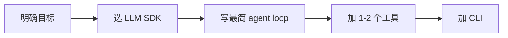
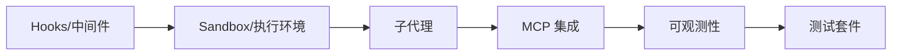
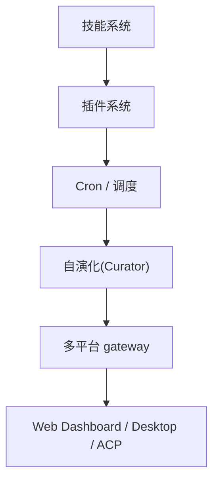

# 17 · 从零构建一个 Agent

> 站在 Hermes Agent 的肩膀上,梳理"如果要自己做一个 agent"应该怎么开始。

---

## 阶段 0:MVP(1-2 周)



### 步骤

1. **明确目标**:agent 解决什么问题?
   - 代码辅助?浏览器自动化?数据处理?
2. **选 LLM SDK**:OpenAI Python / Anthropic / LiteLLM
3. **写最简 loop**:
   ```python
   def run_turn(user_msg):
       messages.append({"role": "user", "content": user_msg})
       response = client.messages.create(
           model=model,
           messages=messages,
           tools=tool_schemas,
       )
       while response.stop_reason == "tool_use":
           tool_result = execute_tool(response.tool_use)
           messages.append(tool_result_msg(response.tool_use, tool_result))
           response = client.messages.create(...)
       return response
   ```
4. **加 1-2 个工具**:terminal / file_read / file_write
5. **加 CLI**:最小 prompt_toolkit 或 input()

---

## 阶段 1:中级(2-4 周)


### 步骤

6. **工具注册抽象**:
   ```python
   @registry.register(name="my_tool", toolset="file")
   def my_tool(path: str) -> str:
       ...
   ```
7. **多模型 provider**:LiteLLM 或自写 adapter
8. **错误恢复**:tenacity 重试 + fallback 链
9. **基础日志 + 关联 ID**:logging + threading.local
10. **approval 系统**:简单白名单 + 危险模式扫描

---

## 阶段 2:进阶(1-2 月)


### 步骤

11. **上下文管理**:
    - token 计数
    - 简单截断(头部保留 + 尾部保留)
    - 后续升级到摘要
12. **记忆(短期/长期)**:
    - 短期:进程内 messages
    - 长期:文件 / SQLite
    - frozen snapshot 模式
13. **工具权限 per-role**:不同 agent 角色不同工具集
14. **流式输出 + 中断**:async generator + KeyboardInterrupt
15. **基础 TUI**:prompt_toolkit + 自动补全

---

## 阶段 3:生产级(2-3 月)



### 步骤

16. **Hooks / 中间件**:5-10 个核心事件
17. **Sandbox / 执行环境**:`BaseEnvironment` ABC + 2-3 backend(local / docker / ssh)
18. **子代理**:`delegate_task` + 工具集裁剪
19. **MCP 集成**:stdio + HTTP,基础 OAuth
20. **可观测性**:结构化日志 + 关联 ID + 一个外部 backend
21. **测试套件**:分层 + fakes + 跨进程锁测试

---

## 阶段 4:扩展(持续)



### 步骤

22. **技能系统**:SKILL.md + slash 命令
23. **插件系统**:Python 包 + hooks 注册
24. **Cron / 调度**:完整 cron 表达式 + 三层锁
25. **自演化**:后台任务复盘 + LLM 合并
26. **多平台 gateway**:Telegram / Discord / Slack
27. **Web Dashboard / Desktop / ACP**:多接入面

---

## 关键技术决策(踩坑指南)

### 1. 工具注册:AST vs 显式
**AST 自注册**:零配置,但需测试覆盖
**显式注册**:可见但易遗漏

→ 推荐 **AST + 显式 fallback**(重要工具显式)

### 2. 上下文压缩:立即上 vs 后续加
**立即上**:省事,但早期 debug 信息丢失
**后续加**:先跑通,再加压缩

→ 推荐 **先简单截断 → 5 阶段压缩 → 上下文引擎 ABC**

### 3. Provider 抽象:何时做
**过早**:增加开发成本
**过晚**:被多 provider 兼容性拖死

→ 推荐 **3+ provider 时做 adapter**(Anthropic / OpenAI / OpenRouter)

### 4. 子代理:何时引入
**过早**:增加复杂度
**过晚**:长任务并发难做

→ 推荐 **任务类型多样 + 性能瓶颈时引入**

### 5. MCP:何时集成
**过早**:协议学习成本
**过晚**:错过生态

→ 推荐 **有 1-2 个外部服务需求时集成**

### 6. 沙箱:何时做
**过早**:拖慢开发
**过晚**:本地安全风险

→ 推荐 **local → docker → 多种 backend** 渐进

---

## 推荐学习资源

### 论文 / 博客
- "Toolformer" / "ReAct" / "Reflexion"
- Claude Code 的 system prompt(可借鉴)
- LangChain / LlamaIndex 源码(架构对比)

### 类似项目参考
- Hermes Agent(本文)
- Claude Code(Anthropic)
- LangGraph(LangChain)
- AutoGen(Microsoft)
- OpenHands(原 OpenDevin)
- SWE-Agent(Princeton)

### 实操
- 跑 Hermes 的 `hermes-cli`,体验完整 TUI
- 读 `agent/conversation_loop.py` 头部 200 行
- 读 `tools/registry.py` 看自注册
- 写一个自己的小 skill + 简单 tool

---

## 关键里程碑检查清单

- [ ] **MVP**:能跑通 user → LLM → tool → response 的最小循环
- [ ] **多模型**:至少 3 个 provider
- [ ] **错误恢复**:重试 + fallback
- [ ] **上下文**:能跑 50 轮对话不爆
- [ ] **记忆**:跨 session 召回
- [ ] **流式输出**:不等全部完成
- [ ] **审批**:危险命令需用户确认
- [ ] **关联 ID**:日志可追踪
- [ ] **测试**:50% 覆盖率
- [ ] **沙箱**:Docker 隔离可用
- [ ] **子代理**:复杂任务可拆
- [ ] **MCP**:至少 1 个外部服务
- [ ] **可观测**:结构化 trace
- [ ] **技能**:SKILL.md 标准
- [ ] **插件**:可外部扩展
- [ ] **Cron**:定时任务
- [ ] **多平台**:至少 Telegram/Discord
- [ ] **自演化**:有 LLM 复盘机制

---

## 推荐代码组织

```
my-agent/
├── agent/
│   ├── loop.py              # 主循环
│   ├── init.py              # AIAgent __init__
│   ├── context.py           # 上下文管理
│   ├── memory.py            # 记忆
│   └── providers/           # provider 抽象
│       ├── base.py
│       ├── openai.py
│       └── anthropic.py
├── tools/
│   ├── registry.py
│   ├── terminal.py
│   ├── file.py
│   └── ...
├── skills/
│   └── my-skill/
│       └── SKILL.md
├── plugins/
│   └── my-plugin/
│       ├── plugin.yaml
│       └── __init__.py
├── sandbox/
│   ├── base.py
│   ├── local.py
│   └── docker.py
├── tests/
│   ├── conftest.py
│   ├── unit/
│   ├── integration/
│   └── e2e/
├── config.yaml
├── pyproject.toml
└── README.md
```

---

## 反模式(不要做)

1. ❌ **一刀切压缩**:简单场景不需要 5 阶段
2. ❌ **没有 approval**:本地执行不能完全 YOLO
3. ❌ **没有日志关联 ID**:调试地狱
4. ❌ **没有重试/fallback**:网络抖动直接死
5. ❌ **没有 token 计数**:cost 失控
6. ❌ **没有围栏**:memory 内容直接拼 prompt
7. ❌ **过深的子代理**:MAX_DEPTH = 1 是合理默认
8. ❌ **YOLO 模式**:生产不要,即使 Hermes 也只在 dev 用
9. ❌ **没有冻结 snapshot**:prompt cache 失效,成本爆炸
10. ❌ **没有 Sandbox**:代码 agent 没沙箱 = 灾难

---

## 成功标准

### 最小可行
- 1 个 LLM provider
- 5-10 个工具
- 简单 CLI
- 基础上下文管理

### 生产可用
- 3+ provider
- 30+ 工具
- TUI + Web
- 5 阶段压缩
- 记忆 + 关联 ID
- approval + sandbox
- 测试覆盖率 > 60%
- 可观测 backend

### 行业领先
- 完整 hooks 体系
- 多 sandbox backend
- 子代理 + 心跳
- MCP 客户端 + 服务端
- 多平台 gateway
- 自演化能力
- 测试覆盖率 > 80%
- 完整 Observer Hooks 契约

→ Hermes 在第三档。

详见 `18-interview-questions.md` 和 `19-quantifiable-metrics.md`。