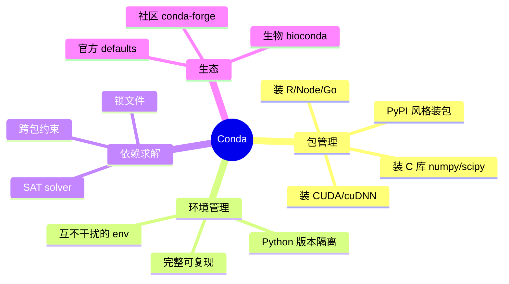
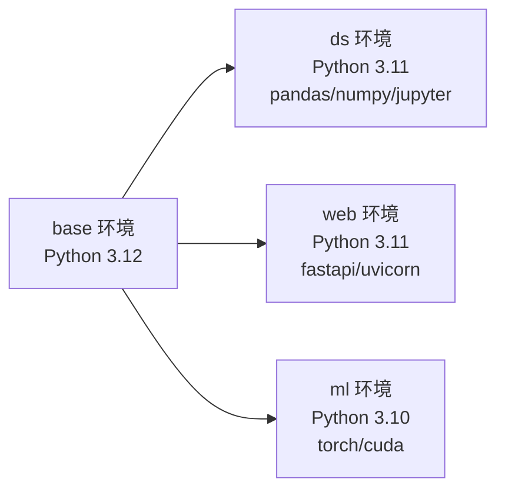
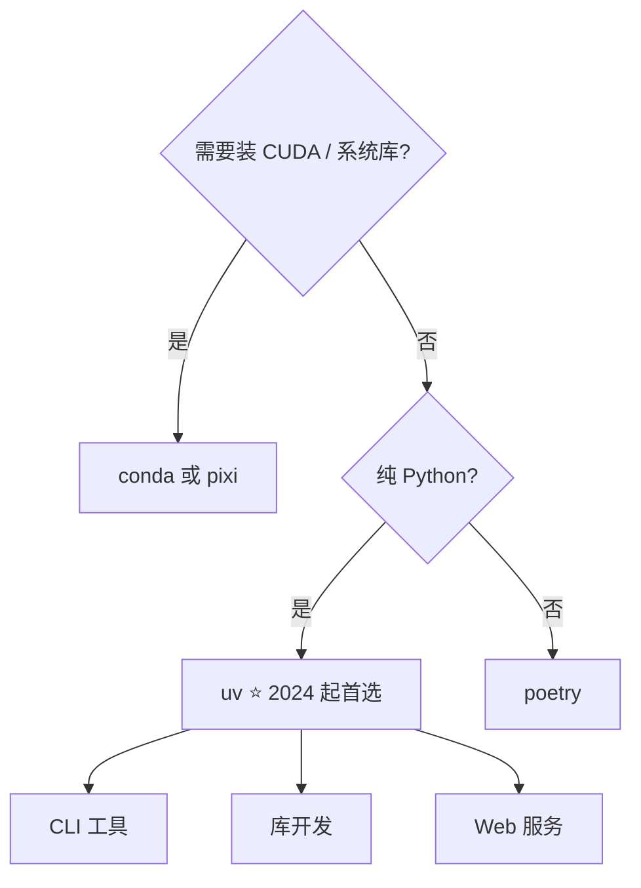

> Conda 是 Python 生态里事实标准的**跨平台包 + 环境管理工具**。但它的命令多、概念杂（env / channel / solver / lock file），网上资料又老又乱。这篇只讲**实战**——装完之后怎么用，能解决 90% 的日常场景。

## 〇、目录

- [1. Conda 到底是什么](#1-conda-到底是什么)
- [2. 装哪个版本](#2-装哪个版本)
- [3. 三个核心概念](#3-三个核心概念)
- [4. 日常 80% 场景会用到的命令](#4-日常-80-场景会用到的命令)
- [5. 典型工作流](#5-典型工作流)
- [6. 跟 pip / venv / poetry 的取舍](#6-跟-pip--venv--poetry-的取舍)
- [7. 加速器：mamba / micromamba / pixi](#7-加速器mamba--micromamba--pixi)
- [8. 常见坑](#8-常见坑)
- [9. 速查卡](#9-速查卡)

---

## 1. Conda 到底是什么

Conda 不是 Python 工具——它是**跨语言**的包与环境管理器。最早由 Anaconda 公司为 Python/R 数据科学社区开发，特点是：



**一句话**：Conda = `pip + venv + 系统级包管理器`（apt / brew / yum）的合体。

### Conda vs pip

| 维度 | Conda | pip |
|------|-------|-----|
| 装 Python 包 | ✅ | ✅ |
| 装 C/C++ 库 | ✅（自带二进制） | ❌（要 wheel / 源码编译） |
| 装 CUDA/cuDNN/MKL | ✅ | ❌（要自己装） |
| 环境隔离 | ✅ | 需要 `venv` 配合 |
| 依赖求解 | 全局 SAT 求解 | 顺序解析（容易冲突） |
| 锁文件 | `conda-lock` | `pip-compile`（uv / pip-tools） |
| 速度 | 慢（求解 + 解压） | 快（只装 Python 包） |

---

## 2. 装哪个版本

| 发行版 | 大小 | 内置 | 适合 |
|--------|------|------|------|
| **Miniconda** | ~100 MB | Python + conda | 大多数人（**推荐**） |
| Anaconda Distribution | ~3 GB | 250+ 科学包 | 不想自己装包的人（学生/教学） |
| Miniforge | ~100 MB | conda + conda-forge 默认 channel | 想避开 Anaconda 商业条款 |
| **Mambaforge** | ~100 MB | mamba + conda-forge | 装 mamba 的最快途径 |

> 2024 年起，Anaconda 对企业商用开始收订阅费。如果你在意 license，选 **Miniforge** 或 **Mambaforge**——默认 channel 是 `conda-forge`（社区维护），跟 Anaconda 没关系。

### 推荐安装（Miniforge，Windows / macOS / Linux 一致）

```bash
# Linux / macOS
curl -L -O "https://github.com/conda-forge/miniforge/releases/latest/download/Miniforge3-$(uname)-$(uname -m).sh"
bash Miniforge3-$(uname)-$(uname -m).sh
# 一路回车,遇到 Do you wish to update your shell profile? 选 yes

# Windows: 下载 .exe 装包,勾选 "Add to PATH"
# https://github.com/conda-forge/miniforge/releases/latest
```

装完验证：

```bash
conda --version
# conda 24.x.x
```

---

## 3. 三个核心概念

### 3.1 Environment（环境）

每个 env 是一份**独立的 Python 解释器 + 独立的包集合**，互不干扰。



激活哪个环境就用哪个的 Python。`base` 是默认环境，**不推荐往里装业务包**——永远新建一个独立 env。

### 3.2 Channel（渠道）

Channel 是包的**下载源**。同一个包可以从不同 channel 装到不同版本：

| Channel | 谁维护 | 内容 | 优先级建议 |
|---------|--------|------|-----------|
| `conda-forge` | 社区 | 包最多、更新最快、CI 严 | **主用** |
| `defaults` | Anaconda | 官方默认，商用受限 | 不用 |
| `pytorch` | PyTorch 团队 | `pytorch` / `torchvision` 带 CUDA | 装 PyTorch 用 |
| `nvidia` | NVIDIA | CUDA toolkit / cuDNN | 装 CUDA 用 |
| `bioconda` | 生物信息社区 | 生信工具 | 做生信用 |

**channel 优先级很重要**——`conda-forge` 装一半被 `defaults` 的旧版本覆盖是常见翻车原因（见 §8）。

### 3.3 Package（包）

一个 conda package 不只是 Python wheel，而是一个**完整的 tar.bz2 / tar.zst**，包含：

- 编译好的二进制
- 元数据（依赖、版本、checksum）
- 链接脚本（conda 装完会 `bin/` 软链到 env）

这就是为什么 conda 能装 `cuda` / `mkl` / `openssl` 这种"系统级"东西。

---

## 4. 日常 80% 场景会用到的命令

### 4.1 看版本 & 配置

```bash
conda --version
conda info
conda config --show          # 看所有配置
conda config --show channels # 看 channel 优先级
```

### 4.2 环境管理

```bash
# 创建
conda create -n myenv python=3.11
conda create -n myenv python=3.11 numpy pandas     # 顺便装包

# 列出
conda env list              # 列出所有环境
conda info --envs           # 同上

# 激活(不同 shell 写法略不同,conda 4.6+ 都支持 conda activate)
conda activate myenv        # Linux / macOS
conda activate myenv        # Windows PowerShell / CMD

# 退出
conda deactivate

# 删除
conda env remove -n myenv
# 或者
conda remove -n myenv --all
```

### 4.3 包管理

```bash
# 装
conda install numpy
conda install -c conda-forge numpy     # 临时指定 channel
conda install numpy=1.26               # 指定版本
conda install "numpy>=1.26"            # 指定范围
conda install --update-deps numpy      # 升级依赖

# 看
conda list                # 当前 env 所有包
conda list numpy          # 特定包
conda search numpy        # 搜索可用版本
conda info numpy          # 看详细信息

# 删
conda remove numpy
conda remove numpy pandas scipy  # 一次多个

# 升级
conda update numpy
conda update --all         # 整个 env 全升级
```

### 4.4 导出与复现

```bash
# 导出
conda env export > environment.yml          # 完整 (含 channel)
conda env export --from-history > env.yml   # 只列你显式装的(推荐放 git)

# 从文件复现
conda env create -f environment.yml
```

### 4.5 清理

```bash
conda clean --all           # 清缓存 tarball
conda clean -y --packages   # 清未用包(慎用)
```

---

## 5. 典型工作流

### 5.1 一个数据科学项目

```bash
# 1. 建项目专属环境
conda create -n ds-project python=3.11

# 2. 激活
conda activate ds-project

# 3. 装包(用 conda-forge)
conda install -c conda-forge pandas numpy scikit-learn jupyter

# 4. 装 PyTorch(GPU 版)—— pytorch channel 优先
conda install pytorch torchvision torchaudio pytorch-cuda=12.1 -c pytorch -c nvidia

# 5. 用 pip 补一些 conda 没有的
pip install some-pypi-only-package

# 6. 写代码...

# 7. 收工:导出环境
conda env export > environment.yml
git add environment.yml
git commit -m "Add ds-project env spec"
```

### 5.2 一个 Web 服务

```bash
conda create -n web python=3.12
conda activate web
conda install -c conda-forge fastapi uvicorn pydantic
pip install -e .  # 自己项目以 editable 模式装
```

### 5.3 跨机器复现

把 `environment.yml` 拷到另一台机器：

```bash
# 弱网环境推荐:用 conda-lock 锁住所有子依赖
conda install -n base conda-lock
conda-lock -f environment.yml -p linux-64 -p osx-64
# 拿到 conda-lock.yml 后:
conda-lock install -n myenv conda-lock.yml
```

`conda-lock` 把每个 channel 上每个子依赖的精确 URL/版本都锁死——**保证两台机器装出来 hash 一致**。

---

## 6. 跟 pip / venv / poetry 的取舍

Python 生态的依赖管理工具一抓一把。怎么选？

| 工具 | 装系统库 | 环境隔离 | 锁文件 | 速度 | 适合 |
|------|---------|---------|--------|------|------|
| **conda** | ✅ | ✅ | `conda-lock` | 慢 | 数据科学 / 装 CUDA / 跨语言 |
| **venv + pip** | ❌ | ✅ | `requirements.txt` | 快 | 纯 Python 简单项目 |
| **poetry** | ❌ | ✅ | `poetry.lock` | 中 | 库开发、CLI、纯 Python 服务 |
| **uv** | ❌ | ✅ | `uv.lock` | **极快** | 任何场景，**现代首选** |
| **pixi** | ✅（用 conda 包） | ✅ | `pixi.lock` | **极快** | Conda 用户的现代替代 |
| **pyenv + poetry** | ❌ | ✅ | `.python-version` + lock | 中 | 需多 Python 版本管理 |

### 推荐组合



**我个人当前的推荐（2026 年）**：

- **新项目** → **uv**：极致快、自带 venv、lock 文件现代、兼容 pip
- **数据科学 / 装 PyTorch+CUDA** → **pixi**（conda 包的现代前端）或直接 conda
- **老项目维护** → 继续用原来的工具，别换

---

## 7. 加速器：mamba / micromamba / pixi

Conda 原生 solver 慢得令人发指——装一个 PyTorch 可能要算 5 分钟。三个现代替代品：

### 7.1 mamba

Conda 的**直接替代**，用 C++ 写的 solver（libmamba），快 10-50 倍。

```bash
# 装 mamba(用 conda 装 conda,很套娃)
conda install -n base -c conda-forge mamba

# 之后所有 conda install 换成 mamba install,命令完全兼容
mamba install -c conda-forge pytorch torchvision -c pytorch
```

### 7.2 micromamba

**单文件可执行**，没有 Python 依赖，~50 MB。适合 CI / 容器 / 不想装 conda 的人。

```bash
# Linux 一行装
curl -L https://micro.mamba.pm/api/micromamba/linux-64/latest | tar -xvj bin/micromamba
./bin/micromamba create -n myenv python=3.11 -c conda-forge
./bin/micromamba activate myenv
```

### 7.3 pixi（**新势力**）

Rust 写的现代 conda 替代品，**最推荐**给 conda 用户做迁移：

- 配置文件用 `pyproject.toml`（poetry 风格）
- lock 文件 `pixi.lock` 跨平台可重现
- 速度比 mamba 还快
- 同时支持 conda 包和 PyPI 包

```toml
# pixi.toml
[project]
name = "myproject"
version = "0.1.0"
channels = ["conda-forge", "pytorch"]
platforms = ["linux-64", "osx-64", "osx-arm64", "win-64"]

[dependencies]
python = "3.11.*"
numpy = ">=1.26"
pytorch = "*"

[pypi-dependencies]
fastapi = "*"

[environments]
gpu = { features = ["gpu"], solve-group = "default" }

[feature.gpu.dependencies]
pytorch-cuda = "12.1.*"
```

```bash
pixi install
pixi run python
pixi run --environment gpu python train.py
```

> 如果你今天新开一个用 conda 包的项目，**直接用 pixi**——它就是 conda 的"现代继任者"。

---

## 8. 常见坑

### 8.1 Channel 优先级冲突

```text
CondaVerificationError: The package 'numpy' is in conflict.
```

**原因**：`defaults` 和 `conda-forge` 都有 `numpy` 但版本不一致，solver 懵了。

**修法**：把 `conda-forge` 设为**唯一**最高优先级 channel：

```bash
conda config --add channels conda-forge
conda config --set channel_priority strict   # 严格模式
# 永远不要在 conda-forge 之后还加 defaults
```

或加 `--override-channels`：

```bash
conda install -c conda-forge numpy  # 临时只从 conda-forge 找
```

### 8.2 `Solving environment: failed`

Conda 求解失败，常见原因：

```bash
# 1. 包确实冲突 → 拆分装,先装约束少的
conda install python=3.11
conda install numpy pandas
# 别一次 conda install numpy pandas scipy torch 容易爆

# 2. Solver 限制太严 → 放宽
conda install "numpy>=1.20"  # 不用写死小版本

# 3. 用 mamba / micromamba 替代,libmamba solver 强得多
mamba install numpy pandas scipy torch
```

### 8.3 `pip install` 后 conda 装包报错

你刚 `pip install xxx`，然后 `conda install yyy` 报错 `inconsistent`——因为 pip 装的不在 conda 元数据里。

**修法**：在同一个环境里，**要么纯 conda 要么纯 pip**。实在要混，**先 conda 后 pip**。

### 8.4 装完 import 不到包

```bash
# 1. 看激活的是不是预期的 env
conda env list   # 当前激活的会带 *
which python
which pip        # 这俩必须在同一个 env 的 bin/ 里

# 2. 不一致?可能 PATH 被改坏了
# 删掉 .bashrc / .zshrc 里手动加的 PATH 改动
```

### 8.5 base 环境越用越臃肿

**别往 base 装东西**。新建独立 env：

```bash
conda create -n project python=3.11
conda activate project
# 在这装
```

如果 base 已经乱：

```bash
# 列出 base 里所有非默认装的包
conda list --revisions
# 找到上一个干净的 revision,然后:
conda install --revision 3
```

### 8.6 CondaHTTPError / SSL 错误

**国内常见**：

```bash
# 临时换镜像
conda config --add channels https://mirrors.tuna.tsinghua.edu.cn/anaconda/pkgs/main
conda config --add channels https://mirrors.tuna.tsinghua.edu.cn/anaconda/pkgs/free
conda config --add channels https://mirrors.tuna.tsinghua.edu.cn/anaconda/cloud/conda-forge

# 或者用 mamba + 阿里云镜像(更快)
```

或者用 [mamba-org/mamba](https://github.com/mamba-org/mamba) 配 `MAMBA_USE_OFFLINE_INDEX` 走 OSS 镜像。

### 8.7 Windows 装 PyTorch+CUDA 麻烦

Windows 上 PyTorch 官方推荐用 pip 装（带 CUDA 的 wheel 一应俱全），conda 反而绕。**Windows + GPU → 直接 pip 装 PyTorch**：

```bash
pip install torch torchvision torchaudio --index-url https://download.pytorch.org/whl/cu121
```

---

## 9. 速查卡

```bash
# ── 环境 ──
conda env list
conda create -n NAME python=3.11 PKG1 PKG2
conda activate NAME
conda deactivate
conda env remove -n NAME
conda env export > environment.yml
conda env create -f environment.yml

# ── 包 ──
conda install PKG
conda install -c conda-forge PKG
conda install PKG=1.2.3
conda list
conda search PKG
conda remove PKG
conda update --all

# ── 配置 ──
conda config --show
conda config --add channels conda-forge
conda config --set channel_priority strict
conda config --remove channels NAME

# ── 清理 ──
conda clean --all
```

### 一句话决策树

> **新项目用 uv；装 CUDA 用 conda 或 pixi；老项目别动。**

---

## 附：推荐的入门路径

1. **第一次用** → 装 Miniforge + `conda install jupyter` 跑通
2. **多项目** → 每个项目独立 env + 导出 yml
3. **装 PyTorch/CUDA** → 用 mamba 或 micromamba，避免原生 conda 的慢
4. **想升级体验** → 试 pixi（conda 包的现代前端）
5. **跨机器复现** → 装 conda-lock 锁文件
