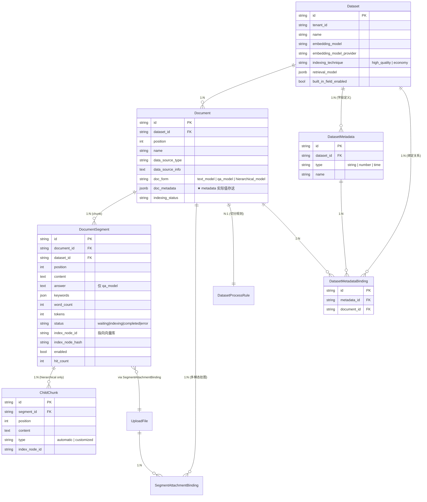
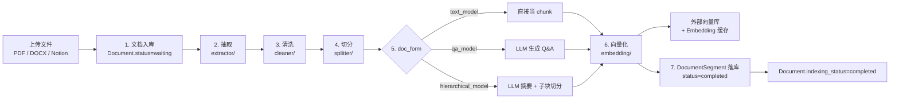
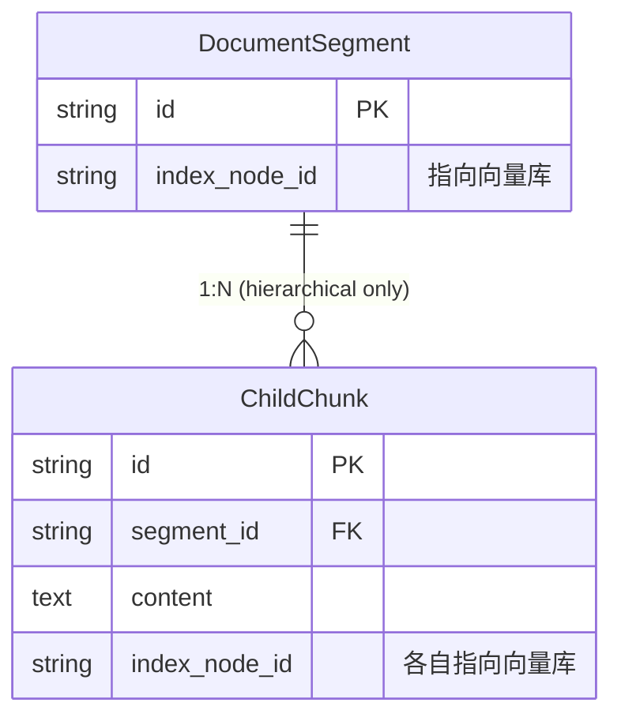
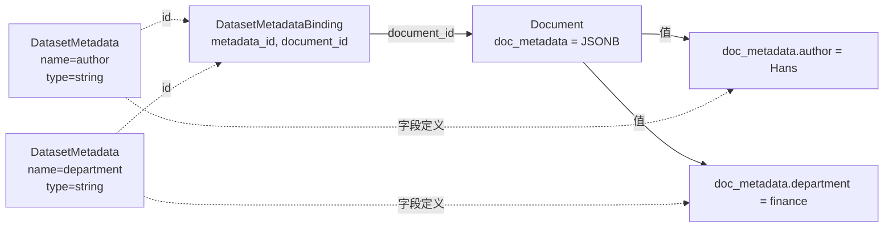
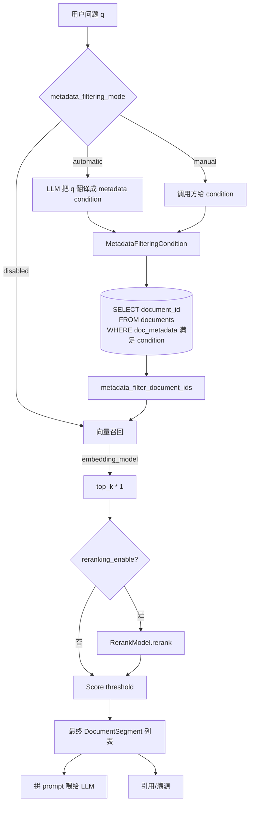

> 本文配套源码：`D:\hans\proj\dify`（Dify v1.15）。所有 schema、API 路径、副作用均核对过源码，可以直接作为二次开发的参考。
>
> 阅读建议：先看 §0 的对象关系图，再按需跳到对应章节。

## 〇、目录

- [0. 一张图：核心对象的关系](#0-一张图核心对象的关系)
- [1. 索引管道：Chunk 是怎么被生产出来的](#1-索引管道chunk-是怎么被生产出来的)
- [2. `DocumentSegment` 完整 Schema](#2-documentsegment-完整-schema)
- [3. Chunk / Segment 的 CURD](#3-chunk--segment-的-curd)
- [4. `ChildChunk`（hierarchical 模式专属）](#4-childchunkhierarchical-模式专属)
- [5. Metadata 的两套表：`DatasetMetadata` + `DatasetMetadataBinding`](#5-metadata-的两套表datasetmetadata--datasetmetadatabinding)
- [6. Metadata 的 CURD](#6-metadata-的-curd)
- [7. 下游：Chunk + Metadata 在检索中怎么被消费](#7-下游chunk--metadata-在检索中怎么被消费)
- [8. 常见坑（建议开发前通读）](#8-常见坑建议开发前通读)

---

## 0. 一张图：核心对象的关系



**一句话概括**：
- **Chunk（DocumentSegment）** = 真正被检索、被 embedding、被喂给 LLM 的最小单位
- **Metadata** = 文档级别的"标签"，**字段定义**在 `dataset_metadatas`、**实际值**在 `documents.doc_metadata` JSONB 里
- **ChildChunk** = hierarchical 模式下的"parent 之内的子块"，parent 命中后被当作细粒度上下文塞给 LLM

---

## 1. 索引管道：Chunk 是怎么被生产出来的

Chunk 不是凭空冒出来的，它是一条**异步管道**的产物。理解这条管道能帮你预判：手动改一个 chunk 时，哪些字段会"自动跟着变"。



### 1.1 阶段详解

| # | 阶段 | 模块 | 输出 / 写回字段 |
|---|------|------|----------------|
| 1 | 入库 | `services/dataset_service.py` | `documents.data_source_type`, `dataset_process_rule_id` |
| 2 | 抽取 | `core/rag/extractor/` | 纯文本，写回 `parsing_completed_at`, `word_count` |
| 3 | 清洗 | `core/rag/cleaner/` | 去 emoji / 合连续空格，写回 `cleaning_completed_at` |
| 4 | 切分 | `core/rag/splitter/` | N 个 chunk 文本 + 关键词，写回 `splitting_completed_at` |
| 5 | 分叉 | `IndexProcessor` | 按 `doc_form` 走不同分支 |
| 6 | 向量化 | `core/rag/embedding/` | 写 Embedding 缓存 + 外部向量库 + 写回 `tokens` |
| 7 | 落库 | `DocumentSegment` | `status=completed`, `index_node_id` 回填 |

### 1.2 `doc_form` 三种模式

枚举源：`api/core/rag/index_processor/constant/index_type.py:4`

```python
from enum import StrEnum

class IndexStructureType(StrEnum):
    PARAGRAPH_INDEX = "text_model"        # 文本切块,直接当 chunk
    QA_INDEX = "qa_model"                 # LLM 把每个 chunk 拆成 Q&A
    PARENT_CHILD_INDEX = "hierarchical_model"  # 父块摘要 + 子块切分
```

### 1.3 索引技术（`indexing_technique`）

```python
class IndexTechniqueType(StrEnum):
    ECONOMY = "economy"           # 倒排 + 关键词
    HIGH_QUALITY = "high_quality"  # 向量检索
```

> 这两个维度**正交**：`doc_form` 决定"怎么切"，`indexing_technique` 决定"怎么索引"。

---

## 2. `DocumentSegment` 完整 Schema

源：`api/models/dataset.py:843`

```python
class DocumentSegment(TypeBase):
    __tablename__ = "document_segments"
    __table_args__ = (
        sa.PrimaryKeyConstraint("id", name="document_segment_pkey"),
        sa.Index("document_segment_dataset_id_idx", "dataset_id"),
        sa.Index("document_segment_document_id_idx", "document_id"),
        sa.Index("document_segment_tenant_dataset_idx", "dataset_id", "tenant_id"),
        sa.Index("document_segment_tenant_document_idx", "document_id", "tenant_id"),
        sa.Index("document_segment_node_dataset_idx", "index_node_id", "dataset_id"),
        sa.Index("document_segment_tenant_idx", "tenant_id"),
    )

    # ── 标识 ──
    id: Mapped[str]            # uuid, default uuid4
    tenant_id: Mapped[str]
    dataset_id: Mapped[str]
    document_id: Mapped[str]
    position: Mapped[int]      # 文档内顺序,从 1 开始

    # ── 文本 ──
    content: Mapped[str]       # LongText,主文本
    answer: Mapped[str | None] # LongText,仅 qa_model 有效
    keywords: Mapped[Any]      # JSON,关键词(用于 ECONOMY 倒排)
    word_count: Mapped[int]
    tokens: Mapped[int]        # embedding 模型计算的 token 数

    # ── 索引状态 ──
    index_node_id:   Mapped[str | None]   # 指向向量库/倒排库的 doc id
    index_node_hash: Mapped[str | None]   # helper.generate_text_hash(content)
    enabled:         Mapped[bool]         # False 时不进检索
    disabled_at:     Mapped[datetime | None]
    disabled_by:     Mapped[str | None]
    status: Mapped[SegmentStatus]          # waiting|indexing|completed|error|paused|re_segment

    # ── 命中与时间戳 ──
    hit_count: Mapped[int]    # 被检索命中的累计次数
    indexing_at: Mapped[datetime | None]
    completed_at: Mapped[datetime | None]
    stopped_at: Mapped[datetime | None]
    error: Mapped[str | None]  # 索引失败原因
```

### 2.1 容易混淆的字段

| 字段 | 是什么 | 什么时候该看它 |
|------|--------|----------------|
| `content` | 用户能读到的文本 | 编辑/展示 chunk 时 |
| `sign_content`（property） | 把 `content` 里的 `/files/xxx/image-preview` 换成带 HMAC 签名的 URL | 渲染/给 LLM 看时 |
| `index_node_id` | 向量库或倒排库里的 doc id | 排查"向量库里没有"问题时，去向量库用这个 id 查 |
| `index_node_hash` | `helper.generate_text_hash(content)` | 改 chunk 后对比是否真改了内容 |
| `Segment.status` | 这条 segment 自己的状态 | UI 显示"索引中" |
| `Document.indexing_status` | 整篇文档的聚合状态 | 文档级"已索引完成" |

### 2.2 `index_node_id` 不在 DB 里写死

注意 `index_node_id` **只是个字符串**，**实际指向外部向量库**（PG vector / Weaviate / Qdrant 等）。删 / 改 segment 时，必须**双写**（DB + 向量库），否则会出现"DB 里没了但向量还在"的脏数据。

### 2.3 `sign_content` 签名逻辑

源：`api/models/dataset.py:950`

```python
def get_sign_content(self) -> str:
    signed_urls: list[tuple[int, int, str]] = []
    text = self.content
    # For data before v0.10.0
    pattern = r"/files/([a-f0-9\-]+)/image-preview(?:\?.*?)?"
    matches = re.finditer(pattern, text)
    for match in matches:
        upload_file_id = match.group(1)
        nonce = os.urandom(16).hex()
        timestamp = str(int(time.time()))
        data_to_sign = f"image-preview|{upload_file_id}|{timestamp}|{nonce}"
        secret_key = dify_config.SECRET_KEY.encode()
        # ... HMAC 签名后拼回 URL
```

——把 5 分钟过期的 HMAC 签名 URL 拼回 `content`，给 LLM 看时不会因为图链接过期而访问失败。

---

## 3. Chunk / Segment 的 CURD

源：`api/controllers/service_api/dataset/segment.py` + `api/services/dataset_service.py:3326-3879`

### 3.1 Payload 模型

```python
class SegmentCreateItemPayload(BaseModel):
    content: str                              # 必填
    answer: str | None = None                 # qa_model 必填
    keywords: list[str] | None = None
    attachment_ids: list[str] | None = None   # 多模态挂图

class SegmentCreatePayload(BaseModel):
    segments: list[SegmentCreateItemPayload]  # 批量

class SegmentUpdateArgs(BaseModel):
    content: str | None = None
    answer:  str | None = None
    keywords: list[str] | None = None
    enabled: bool | None = None               # false=下架
    attachment_ids: list[str] | None = None
    regenerate_child_chunks: bool | None = None  # hierarchical 模式专用
    summary: str | None = None                # 摘要索引
```

### 3.2 端点清单

| 操作 | Method + Path | 备注 |
|------|---------------|------|
| **批量新增** | `POST /v1/datasets/{ds}/documents/{doc}/segments` | body `{segments:[...]}`，QA 模式必须给 `answer` |
| **列出** | `GET /v1/datasets/{ds}/documents/{doc}/segments?page=&limit=&status=&keyword=` | 服务端 `limit` 上限 100 |
| **取单个** | `GET /v1/datasets/{ds}/documents/{doc}/segments/{seg}` | 含 `sign_content` 和 `attachments` |
| **改** | `POST /v1/datasets/{ds}/documents/{doc}/segments/{seg}` | body `{segment: SegmentUpdateArgs}`，**改 content 会触发重索引** |
| **删** | `DELETE /v1/datasets/{ds}/documents/{doc}/segments/{seg}` | 走 `delete_segment` 异步任务 |
| **批量删** | `POST /v1/datasets/{ds}/documents/{doc}/segments/batch` | body `{segment_ids: [...]}` |

### 3.3 改 chunk 的源码（关键副作用全在这）

源：`api/services/dataset_service.py:3516`

```python
@classmethod
def update_segment(cls, args, segment, document, dataset, session):
    indexing_cache_key = f"segment_{segment.id}_indexing"
    cache_result = redis_client.get(indexing_cache_key)
    if cache_result is not None:
        raise ValueError("Segment is indexing, please try again later")  # ★ 锁
    if args.enabled is not None:
        action = args.enabled
        if segment.enabled != action and not action:
            segment.enabled = action
            segment.disabled_at = naive_utc_now()
            segment.disabled_by = current_user.id
            session.add(segment); session.commit()
            redis_client.setex(indexing_cache_key, 600, 1)
            disable_segment_from_index_task.delay(segment.id)            # ★ 异步删向量
            return segment
    if not segment.enabled:
        raise ValueError("Can't update disabled segment")               # ★ 下架后不能改 content
    try:
        word_count_change = segment.word_count
        content = args.content or segment.content
        if segment.content == content:
            # ... 更新 word_count / answer / keywords ...
            segment.enabled = True
            session.add(segment); session.commit()
            # ── hierarchical 模式重新生成子块 ──
            if document.doc_form == IndexStructureType.PARENT_CHILD_INDEX and args.regenerate_child_chunks:
                VectorService.generate_child_chunks(
                    segment, document, dataset, embedding_model_instance, processing_rule, True
                )
            # ── text_model / qa_model 重建向量/倒排 ──
            elif document.doc_form in (IndexStructureType.PARAGRAPH_INDEX, IndexStructureType.QA_INDEX):
                if args.enabled or keyword_changed:
                    VectorService.update_segment_vector(args.keywords, segment, dataset)
            # ── summary 索引 ──
            if args.summary is not None:
                # ... 向量化新 summary
        # 失败兜底：try/except 里 status=ERROR, enabled=False
```

### 3.4 5 个关键副作用

1. **Redis 锁**：`redis_client.get(f"segment_{id}_indexing")` 非空就拒绝。前端 UI 上"保存中"就是这个原因。
2. **`enabled=false` 的 chunk 不能再改 content**：`raise ValueError("Can't update disabled segment")`。
3. **改 content 会重算 tokens 并调 embedding 计费**：`embedding_model.get_text_embedding_num_tokens(texts=[content])[0]`。
4. **改 content 不重排 position**：position 不变，UI 上的分页顺序不变。
5. **失败兜底**：try/except 里 `status=ERROR, enabled=False, error=str(e)`。

### 3.5 QA 模式专属规则

源：`api/services/dataset_service.py:3326`

```python
def segment_create_args_validate(cls, args: dict[str, Any], document: Document):
    if document.doc_form == IndexStructureType.QA_INDEX:
        if "answer" not in args or not args["answer"]:
            raise ValueError("Answer is required")
        if not args["answer"].strip():
            raise ValueError("Answer is empty")
    if "content" not in args or not args["content"] or not args["content"].strip():
        raise ValueError("Content is empty")
    # 多模态挂图数量限制
    single_chunk_attachment_limit = dify_config.SINGLE_CHUNK_ATTACHMENT_LIMIT
    if len(args.get("attachment_ids", [])) > single_chunk_attachment_limit:
        raise ValueError(f"Exceeded maximum attachment limit of {single_chunk_attachment_limit}")
```

——`qa_model` 不给 `answer` 直接拒绝；token 计算会把 `content + answer` 一起算。

### 3.6 多模态挂图

`DocumentSegment` 表本身不存图片，图片存在 `UploadFile` 表里，通过 `SegmentAttachmentBinding` 关联：

```python
class SegmentAttachmentBinding(TypeBase):
    __tablename__ = "segment_attachment_bindings"
    id, tenant_id, dataset_id, document_id, segment_id
    attachment_id  # → UploadFile.id
```

读出来时通过 `DocumentSegment.attachments` property 现签 HMAC URL。**改 `attachment_ids` 等于触发一次多模态重向量化**（用 LLM 把图转成描述再 embedding）。

### 3.7 curl 示例

```bash
HOST=https://api.dify.ai
KEY=<DATASET_API_KEY>
DS=<dataset_id>

# 改一个 chunk 的内容(text_model)
curl -X POST "$HOST/v1/datasets/$DS/documents/$DOC/segments/$SEG" \
  -H "Authorization: Bearer $KEY" \
  -H "Content-Type: application/json" \
  -d '{
    "segment": {
      "content": "Dify 是一个开源 LLM 应用开发平台。",
      "keywords": ["Dify", "LLM", "开源"]
    }
  }'

# 下架一个 chunk(不进检索,但库行不删)
curl -X POST "$HOST/v1/datasets/$DS/documents/$DOC/segments/$SEG" \
  -H "Authorization: Bearer $KEY" -H "Content-Type: application/json" \
  -d '{"segment": {"enabled": false}}'
```

---

## 4. `ChildChunk`（hierarchical 模式专属）

源：`api/models/dataset.py:1057`

```python
class ChildChunk(TypeBase):
    __tablename__ = "child_chunks"
    id, tenant_id, dataset_id, document_id
    segment_id: Mapped[str]      # → DocumentSegment.id
    position: Mapped[int]
    content: Mapped[str] = mapped_column(LongText)
    word_count: Mapped[int]
    type: Mapped[SegmentType]    # automatic | customized(用户改过变 customized)
    index_node_id: Mapped[str | None]
    index_node_hash: Mapped[str | None]
    indexing_at / completed_at / error
```

### 4.1 关系



### 4.2 触发条件

`DocumentSegment.child_chunks` property（`api/models/dataset.py:916`）的判定：

```python
@property
def child_chunks(self):
    if not self.document:
        return []
    process_rule = self.document.dataset_process_rule
    if process_rule and process_rule.mode == "hierarchical":
        rules_dict = process_rule.rules_dict
        if rules_dict:
            rules = Rule.model_validate(rules_dict)
            if rules.parent_mode and rules.parent_mode != ParentMode.FULL_DOC:
                child_chunks = db.session.scalars(
                    select(ChildChunk).where(ChildChunk.segment_id == self.id)
                    .order_by(ChildChunk.position.asc())
                ).all()
                return child_chunks or []
    return []
```

——`parent_mode = FULL_DOC`（整篇文档作为一个 parent）时，根本没建 ChildChunk。

### 4.3 端点

| 操作 | Path |
|------|------|
| 新建子块 | `POST /v1/datasets/{ds}/documents/{doc}/segments/{seg}/child_chunks` |
| 列出子块 | `GET .../child_chunks?page=&limit=&keyword=` |
| 删子块 | `DELETE .../child_chunks/{child_chunk_id}` |
| 改子块 | `PATCH .../child_chunks/{child_chunk_id}` |

### 4.4 检索时的用法

parent chunk 命中后，拿 `child_chunks` 当"细粒度上下文"塞给 LLM（parent 提供主题，children 提供细节）——这正是 hierarchical 模式的核心收益。

---

## 5. Metadata 的两套表：`DatasetMetadata` + `DatasetMetadataBinding`

**核心认知：metadata 在 Dify 里是"字段定义 + 文档值"两表分离。**

### 5.1 字段定义：`DatasetMetadata`

源：`api/models/dataset.py:1524`

```python
class DatasetMetadata(TypeBase):
    __tablename__ = "dataset_metadatas"
    __table_args__ = (
        sa.PrimaryKeyConstraint("id", name="dataset_metadata_pkey"),
        sa.Index("dataset_metadata_tenant_idx", "tenant_id"),
        sa.Index("dataset_metadata_dataset_idx", "dataset_id"),
    )

    id: Mapped[str]
    tenant_id: Mapped[str]
    dataset_id: Mapped[str]              # 作用域是 dataset
    type: Mapped[str]                    # DatasetMetadataType 枚举
    name: Mapped[str]                    # 字段名(如 "author", "department")
    created_at / updated_at
    created_by / updated_by
```

**支持的类型**（`models/enums.py::DatasetMetadataType`）：

```python
class DatasetMetadataType(StrEnum):
    STRING = "string"
    NUMBER = "number"
    TIME   = "time"
```

——**没有 `single_select` / `array` / `boolean`**，跟飞书多维表格那种"下拉单选"不是一个体系。要做分类标签，就用 `string`，值约束靠业务侧。

### 5.2 内置字段

不算在 `dataset_metadatas` 表里，而是 `Dataset.built_in_field_enabled` 这个开关。启用后拿到 5 个固定字段：

| name | type | 来源 |
|------|------|------|
| `document_name` | string | `Document.name` |
| `uploader` | string | `Document.created_by` → `Account.name` |
| `upload_date` | time | `Document.created_at` |
| `last_update_date` | time | `Document.updated_at` |
| `source` | string | `data_source_type`（upload_file / notion_import / website_crawl...） |

### 5.3 文档值：`Document.doc_metadata` + `DatasetMetadataBinding`

```python
# Document 模型里(api/models/dataset.py:565)
doc_metadata = mapped_column(AdjustedJSON, nullable=True)   # JSONB
```

```python
# 关联表(api/models/dataset.py:1553)
class DatasetMetadataBinding(TypeBase):
    __tablename__ = "dataset_metadata_bindings"
    id, tenant_id, dataset_id
    metadata_id: Mapped[str]    # → DatasetMetadata.id
    document_id: Mapped[str]    # → Document.id
    created_at, created_by
```

### 5.4 实际数据流



**所以"加 metadata"其实是两步**：

1. 在 dataset 上注册字段定义（`DatasetMetadata`）—— 一次
2. 在每个 Document 上写值（`Document.doc_metadata` 里的 JSON）—— N 次

清掉字段定义（DELETE）会把所有 binding 一起删，**`Document.doc_metadata` 里的值不会被自动清**（业务侧自己处理）。见 `MetadataService.delete_metadata`。

---

## 6. Metadata 的 CURD

源：`api/controllers/service_api/dataset/metadata.py` + `api/services/entities/knowledge_entities/knowledge_entities.py:270`

### 6.1 Payload 模型

```python
class MetadataArgs(BaseModel):
    type: Literal["string", "number", "time"]
    name: str

class MetadataUpdateArgs(BaseModel):
    name: str                            # 改字段名
    value: str | int | float | None      # 改字段值(单文档)

class MetadataDetail(BaseModel):
    id: str
    name: str
    value: str | int | float | None

class DocumentMetadataOperation(BaseModel):
    document_id: str
    metadata_list: list[MetadataDetail]
    partial_update: bool = Field(
        default=False,
        description="Whether to partially update metadata, keeping existing values for unspecified fields.",
    )

class MetadataOperationData(BaseModel):
    operation_data: list[DocumentMetadataOperation]
```

### 6.2 端点清单

| 操作 | Method + Path | 说明 |
|------|---------------|------|
| **建字段** | `POST /v1/datasets/{ds}/metadata` | body `{type, name}` |
| **列字段** | `GET /v1/datasets/{ds}/metadata` | 返回 `{doc_metadata, built_in_field_enabled, count}` |
| **改字段名** | `PATCH /v1/datasets/{ds}/metadata/{meta_id}` | body `{name}`，**值不动** |
| **删字段** | `DELETE /v1/datasets/{ds}/metadata/{meta_id}` | 删字段定义 + 全部 binding；doc_metadata 里的值不删 |
| **取内置字段** | `GET /v1/datasets/{ds}/metadata/built-in` | 固定返回那 5 个 |
| **启停内置字段** | `POST /v1/datasets/{ds}/metadata/built-in/{enable|disable}` | 全局开关 |
| **批量给文档写值** | `POST /v1/datasets/{ds}/documents/metadata` | body `{operation_data:[...]}` |
| **单文档 metadata**（1.10+） | `PUT /v1/datasets/{ds}/documents/{doc_id}/metadata` | 单文档写值 |

### 6.3 `partial_update` 是个大坑

```python
class DocumentMetadataOperation(BaseModel):
    document_id: str
    metadata_list: list[MetadataDetail]
    partial_update: bool = Field(default=False)   # ← 默认 False = 全量覆盖
```

**默认行为**：发 `{author: "Hans"}` 会**清空**这个文档所有其他 metadata 字段。
**要保留**必须显式 `partial_update: true`，或者把现有 metadata 都带上。

```bash
# ❌ 危险:会清掉 department 字段
curl -X POST .../datasets/$DS/documents/metadata -d '{
  "operation_data": [{
    "document_id": "<doc_id>",
    "metadata_list": [{"id":"<author_field>","name":"author","value":"Hans"}]
  }]
}'

# ✅ 保留
curl -X POST .../datasets/$DS/documents/metadata -d '{
  "operation_data": [{
    "document_id": "<doc_id>",
    "metadata_list": [...所有字段...],
    "partial_update": true
  }]
}'
```

### 6.4 改字段名 vs 改值

| 操作 | 影响 |
|------|------|
| `PATCH /metadata/{id}` body `{name: "new"}` | 只改 `dataset_metadatas.name`，**`Document.doc_metadata` 里的 key 不自动改**。如果你查的是 `doc_metadata["author"]`，改名后**值找不到了**——得自己迁移。 |
| `POST /documents/metadata` body 含 `value` | 改 `Document.doc_metadata[name] = value`，`dataset_metadatas` 表**不动**。 |

——一个改"字段名"，一个改"字段值"，别混。

---

## 7. 下游：Chunk + Metadata 在检索中怎么被消费

源：`api/core/rag/retrieval/dataset_retrieval.py`

### 7.1 检索管线全景



### 7.2 metadata 过滤的"先于检索"特性（关键）

`metadata_filtering_mode` 在**向量召回之前**生效：先算出"哪些文档 ID 满足条件"，向量召回时只查这些文档的向量。

源：`api/core/rag/retrieval/dataset_retrieval.py:1391`

```python
def get_metadata_filter_condition(
    self, session, dataset_ids, query, tenant_id, user_id,
    metadata_filtering_mode, metadata_model_config,
    metadata_filtering_conditions, inputs,
):
    document_query = select(DatasetDocument).where(
        DatasetDocument.dataset_id.in_(dataset_ids),
        DatasetDocument.indexing_status == "completed",
        DatasetDocument.enabled == True,
        DatasetDocument.archived == False,
    )
    filters = []
    metadata_condition = None
    if metadata_filtering_mode == "disabled":
        return None, None
    elif metadata_filtering_mode == "automatic":
        # 调 LLM 把 query 翻译成 condition
        automatic_metadata_filters = self._automatic_metadata_filter_func(...)
        ...
    elif metadata_filtering_mode == "manual":
        # 调用方直接给 condition
        for sequence, condition in enumerate(metadata_filtering_conditions.conditions):
            filters = self.process_metadata_filter_func(...)
    # 拼到 document_query 上
    if filters:
        if metadata_filtering_conditions.logical_operator == "and":
            document_query = document_query.where(and_(*filters))
        else:
            document_query = document_query.where(or_(*filters))
    documents = session.scalars(document_query).all()
    # ── 按 dataset_id 聚合 ──
    metadata_filter_document_ids = defaultdict(list)
    for document in documents:
        metadata_filter_document_ids[document.dataset_id].append(document.id)
    return metadata_filter_document_ids, metadata_condition
```

> 之后这段 `metadata_filter_document_ids` 会**作为限定条件传给向量检索**，把"全库 N 万 chunk"缩成"先筛到 200 文档 → 再召 800 向量"。

### 7.3 三种模式

| 模式 | 行为 | 成本 |
|------|------|------|
| `disabled` | 不过滤 | 0 |
| `automatic` | LLM 把 `q` 翻译成 metadata condition | **多一次 LLM 调用** |
| `manual` | 调用方直接给 condition | 0 |

### 7.4 `MetadataFilteringCondition` 完整结构

```python
# 类型示例:
metadata_filtering_conditions = {
    "logical_operator": "and",
    "conditions": [
        {"name": "department", "comparison_operator": "is",       "value": "finance"},
        {"name": "upload_date", "comparison_operator": "after",   "value": "2025-01-01T00:00:00Z"},
        {"name": "author",      "comparison_operator": "contains","value": "Hans"}
    ]
}
```

支持的 `comparison_operator` 取决于 `DatasetMetadataType`：

| type | operators |
|------|-----------|
| string | `contains`, `is`, `is not`, `empty`, `not empty` |
| number | `=`, `≠`, `>`, `<`, `≥`, `≤`, `empty`, `not empty` |
| time | `before`, `after`, `on or before`, `on or after`, `empty`, `not empty` |

### 7.5 模板变量替换（manual 模式）

源：`api/core/rag/retrieval/dataset_retrieval.py:1481`

```python
def _replace_metadata_filter_value(self, text: str, inputs: dict[str, Any]) -> str:
    def replacer(match):
        key = match.group(1)
        return str(inputs.get(key, f"{{{{{key}}}}}"))
    pattern = re.compile(r"\{\{(\w+)\}\}")
    return pattern.sub(replacer, text)
```

——manual 模式里 `value` 写 `{{user_role}}` 会被替换成当前 app inputs 里的 `user_role`，**做权限隔离**（每个用户只能查自己部门的文档）就靠它。

### 7.6 chunk 的"被消费方式"汇总

| 消费方 | 用到 segment 哪些字段 |
|--------|------------------------|
| 检索（向量/倒排） | `index_node_id`, `index_node_hash`, `enabled`, `content` |
| Rerank | `content`（含 answer 拼接） |
| LLM prompt | `content`, `sign_content`, `attachments`, `answer` (qa_model) |
| 引用/溯源 | `document_id`, `position`, `Document.name`, `Document.doc_metadata` |
| 命中统计 | `hit_count` |
| 多模态展示 | `attachments[]`（带签名的图 URL） |
| Summary index | `DocumentSegmentSummary`（额外的 summary chunk） |

---

## 8. 常见坑（建议开发前通读）

| 坑 | 现象 | 正确做法 |
|----|------|----------|
| 改 chunk 改了一半又被改 | 第二次改失败 / 500 | 等前端"保存中"结束；后端有 Redis 锁 |
| 改 chunk 后向量没变 | 检索还能召回旧内容 | 改 `content` 才会触发重索引；只改 `keywords` 在 HIGH_QUALITY 模式下不会重建向量（只在 ECONOMY 倒排下生效） |
| 改 chunk 后 `Document.word_count` 漂了 | UI 显示文档字数不准 | Dify 内部会维护 `Document.word_count += Δ`，但**手动 SQL 改 segment 不会维护**，要走 API |
| QA 模式没传 `answer` | 422 / ValueError | `qa_model` 必填 `answer`；前端会自动补 |
| `partial_update` 忘了写 | 其他 metadata 全被清空 | 永远显式带 `partial_update: true` |
| 改了 metadata 字段名 | `Document.doc_metadata` 里的 key 没动 → 检索/列表显示不出值 | 改名后**手动**把 `Document.doc_metadata` 里的 key 也改掉 |
| 删了 metadata 字段定义 | `Document.doc_metadata` 里的值还在 | 业务侧需要自己清；Dify 不主动清 |
| hierarchical 模式改 parent 不想重建 child | `regenerate_child_chunks` 不传默认 False | 想重建就显式 `"regenerate_child_chunks": true`，会触发 LLM 重新切分 |
| 大批量改 chunk | 烧钱 | 改 content 会调 embedding 计费接口算 tokens |
| 自托管 1.9.x 找不到 `PUT /documents/{id}/metadata` | 404 | 那个端点是 1.10+ 加的，老版本只有 `POST /documents/metadata` 批量写 |
| 内置 metadata 改不了 | `uploader` 是系统字段 | 内置字段值由系统维护；想覆盖就关掉内置，用自定义字段 |
| `Dataset.doc_form` 看不到 | doc_form 在 Document 上不在 Dataset 上 | 改 chunk 行为看 `Document.doc_form` |
| metadata 过滤想用 `OR` | 拼不对 condition | `logical_operator: "or"`，conditions 是 list |
| 检索不到任何结果但向量库里有 | 文档被 archive 了 | `Document.archived=False` 是过滤条件之一 |

---

## 附：API 一句话速查

```text
# Segment
POST   /v1/datasets/{ds}/documents/{doc}/segments
GET    /v1/datasets/{ds}/documents/{doc}/segments?page=&limit=&status=&keyword=
GET    /v1/datasets/{ds}/documents/{doc}/segments/{seg}
POST   /v1/datasets/{ds}/documents/{doc}/segments/{seg}      # update
DELETE /v1/datasets/{ds}/documents/{doc}/segments/{seg}
POST   /v1/datasets/{ds}/documents/{doc}/segments/batch      # 批量删

# ChildChunk
POST   /v1/datasets/{ds}/documents/{doc}/segments/{seg}/child_chunks
GET    /v1/datasets/{ds}/documents/{doc}/segments/{seg}/child_chunks
PATCH  /v1/datasets/{ds}/documents/{doc}/segments/{seg}/child_chunks/{cc}
DELETE /v1/datasets/{ds}/documents/{doc}/segments/{seg}/child_chunks/{cc}

# Metadata
GET    /v1/datasets/{ds}/metadata
POST   /v1/datasets/{ds}/metadata
PATCH  /v1/datasets/{ds}/metadata/{meta_id}
DELETE /v1/datasets/{ds}/metadata/{meta_id}
GET    /v1/datasets/{ds}/metadata/built-in
POST   /v1/datasets/{ds}/metadata/built-in/{enable|disable}
POST   /v1/datasets/{ds}/documents/metadata                  # 批量写文档值
PUT    /v1/datasets/{ds}/documents/{doc}/metadata            # 单文档写值(1.10+)

# 检索(要 metadata 过滤就用它)
POST   /v1/datasets/{ds}/retrieve
```

---

## 附：本文涉及到的源码定位

| 主题 | 文件 | 行 |
|------|------|-----|
| `DocumentSegment` 模型 | `api/models/dataset.py` | 843 |
| `ChildChunk` 模型 | `api/models/dataset.py` | 1057 |
| `DatasetMetadata` 模型 | `api/models/dataset.py` | 1524 |
| `DatasetMetadataBinding` 模型 | `api/models/dataset.py` | 1553 |
| `Document.doc_metadata` 字段 | `api/models/dataset.py` | 565 |
| `IndexStructureType` / `IndexTechniqueType` | `api/core/rag/index_processor/constant/index_type.py` | 4 |
| `SegmentService.create_segment` | `api/services/dataset_service.py` | 3343 |
| `SegmentService.update_segment` | `api/services/dataset_service.py` | 3516 |
| `SegmentService.segment_create_args_validate` | `api/services/dataset_service.py` | 3326 |
| `MetadataArgs` / `MetadataUpdateArgs` / `DocumentMetadataOperation` | `api/services/entities/knowledge_entities/knowledge_entities.py` | 270 |
| `DatasetRetrieverService.retrieve` | `api/core/rag/retrieval/dataset_retrieval.py` | 353 |
| `get_metadata_filter_condition` | `api/core/rag/retrieval/dataset_retrieval.py` | 1391 |
| `_replace_metadata_filter_value` | `api/core/rag/retrieval/dataset_retrieval.py` | 1481 |
| Segment API 路由 | `api/controllers/service_api/dataset/segment.py` | — |
| Metadata API 路由 | `api/controllers/service_api/dataset/metadata.py` | — |
