> 随着 LLM 应用的深入，传统向量 RAG 的"语义近视"问题日益突出——只能检索语义相似的文本块，却无法理解跨文档的实体关联和全局主题。**图增强检索生成（GraphRAG）** 通过在 RAG 中引入知识图谱结构，解决了这一痛点。本文对比两大主流方案：微软 **GraphRAG** 与港大 **LightRAG**。

## 一、前置概念：知识图谱与本体建模

在深入具体方案之前，有必要了解两个基础概念。

### 1.1 什么是知识图谱？

知识图谱（Knowledge Graph）是一种用**图结构**组织和表示知识的方式。它由**节点**（实体）和**边**（关系）组成：

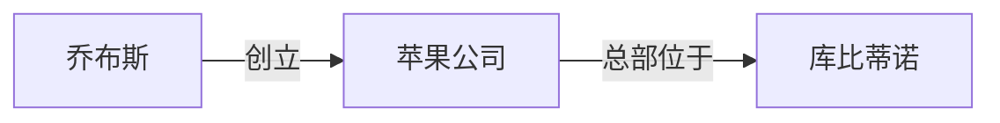

与关系型数据库的"表格思维"不同，知识图谱以**实体为中心**组织信息，天然支持多跳推理和关联发现。

### 1.2 什么是本体建模？

**本体（Ontology）** 是知识图谱的"蓝图"——它定义了领域中存在哪些**概念类别**、概念之间有哪些**语义关系**、以及需要遵守哪些**逻辑约束**。

| 要素 | 说明 | 示例 |
|------|------|------|
| **概念 (Classes)** | 领域实体的抽象分类 | Person、Organization、Event |
| **关系 (Relations)** | 概念间的语义关联 | founded(X, Y)、located_in(X, Y) |
| **属性 (Properties)** | 实体的描述特征 | name、founding_date、revenue |
| **公理 (Axioms)** | 逻辑规则与约束 | "一家公司的总部只能位于一个城市" |

### 1.3 本体在 RAG 中的作用

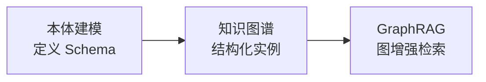

- **指导知识抽取**：本体定义了"该抽什么"，避免 LLM 随意发挥
- **统一语义空间**：同一实体在不同文档中的不同称呼（如"乔帮主"和"Steve Jobs"）被对齐
- **支持逻辑推理**：通过本体约束实现多跳推理（"乔布斯创立的公司总部在哪？"）

### 1.4 两种构建路径

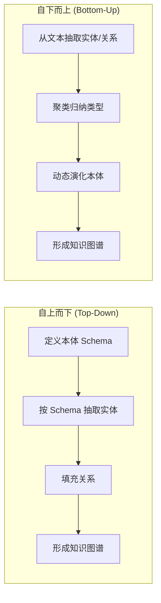

- **自上而下**：适合领域知识明确、有行业专家的场景（如医疗、金融）
- **自下而上**：适合非结构化文本多、探索性场景——GraphRAG 和 LightRAG 都属此类

---

## 二、GraphRAG：微软的全局语义理解方案

[GraphRAG](https://github.com/microsoft/graphrag) 由微软研究院于 2024 年开源，核心思想是将文档集转化为**层次化社区结构的知识图谱**，通过社区摘要实现跨文档的全局语义理解。

### 2.1 核心架构

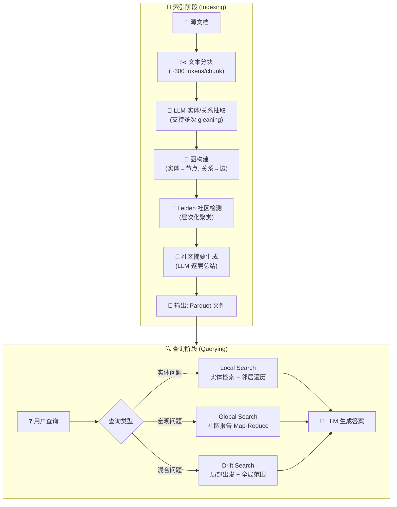

### 2.2 索引流程详解

**Step 1 — 实体/关系抽取**：每个文本块送入 LLM，抽取结构化三元组 `(主体, 关系, 客体)`。支持多轮 gleaning（逐步要求 LLM 补充遗漏实体）。

**Step 2 — 图构建**：实体去重后成为节点，关系成为边，形成加权无向图。

**Step 3 — Leiden 社区检测**：对图执行层次化 Leiden 聚类，生成多层社区结构——底层社区粒度细（具体话题），高层社区粒度粗（宏观主题）。

**Step 4 — 社区摘要**：对每个社区的实体和关系集合，用 LLM 生成一段自然语言摘要，这是 GraphRAG 最核心的创新——**将图结构"翻译"回可读文本**。

### 2.3 三种查询模式

| 模式 | 适用场景 | 原理 | Token 消耗 |
|------|----------|------|-----------|
| **Local Search** | "Elon Musk 和 OpenAI 的关系？" | 实体向量匹配 → 邻居实体扩展 → 关联社区摘要 → 生成 | 低 |
| **Global Search** | "这批文档的核心主题是什么？" | 所有社区报告 Map-Reduce → 评分排序 → 综合生成 | 极高 |
| **Drift Search** | 大规模图的折中方案 | 局部起步，逐步漂移到相关社区 | 中 |

### 2.4 核心创新与局限

**创新点**：
- 社区摘要将图结构转化为 LLM 可理解的文本格式
- Leiden 层次聚类提供多粒度语义抽象
- Global Search 能做传统 RAG 无法做到的"总结整个数据集"

**主要局限**：
- 索引成本极高（一本书可消耗 $30-46 API 费用）
- 不支持增量更新，数据变更需要全量重建
- 查询延迟高（Global Search 需 8-15 秒）
- 默认英语优化，中文需手动调优 prompt

---

## 三、LightRAG：港大的轻量高效方案

[LightRAG](https://github.com/HKUDS/LightRAG) 由香港大学黄超团队提出，发表于 EMNLP 2025 Findings。设计目标是**在不牺牲准确性的前提下，大幅降低索引成本和查询延迟**。

### 3.1 核心架构

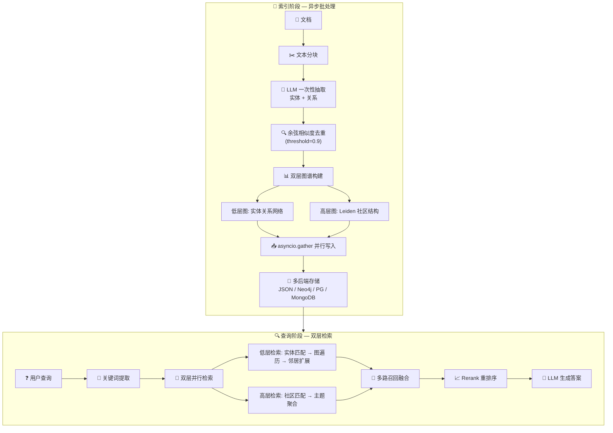

### 3.2 与 GraphRAG 的架构差异对比

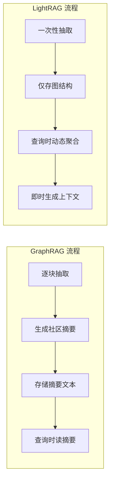

**关键差异**：GraphRAG 在**索引时**生成社区摘要（"预计算"），LightRAG 在**查询时**动态聚合（"懒计算"）。这使得 LightRAG 的索引速度达到 GraphRAG 的 **10 倍**。

---

## 四、LightRAG 的关键优化深度解析

LightRAG 的效率优势来自一系列精心设计的优化策略，下面逐一分析。

### 4.1 双层检索范式

这是 LightRAG 最核心的学术贡献：

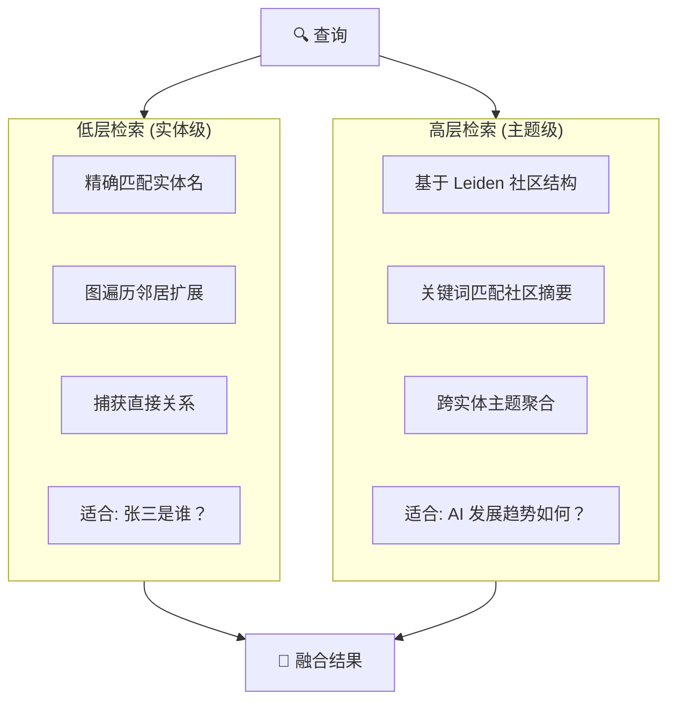

消融实验证明：**仅低层检索**会丢失全局主题信息；**仅高层检索**在具体实体问题上精度不足。双层并行检索后融合，覆盖了从微观到宏观的全部语义层面。

### 4.2 异步批处理架构

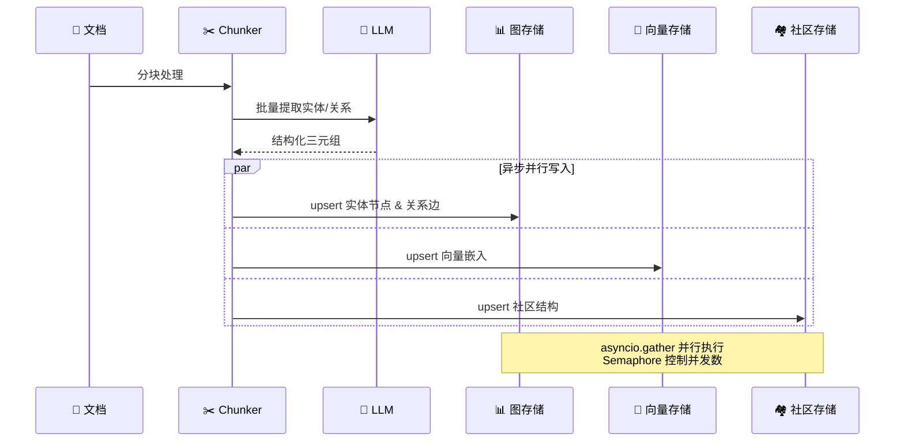

- **`asyncio.gather`** 并行写入三层存储，避免串行阻塞
- **`asyncio.Semaphore`** 控制并发 LLM 调用数，防止 API 限流
- 相比 GraphRAG 的串行流水线，索引吞吐量提升一个数量级

### 4.3 实体去重与模糊合并

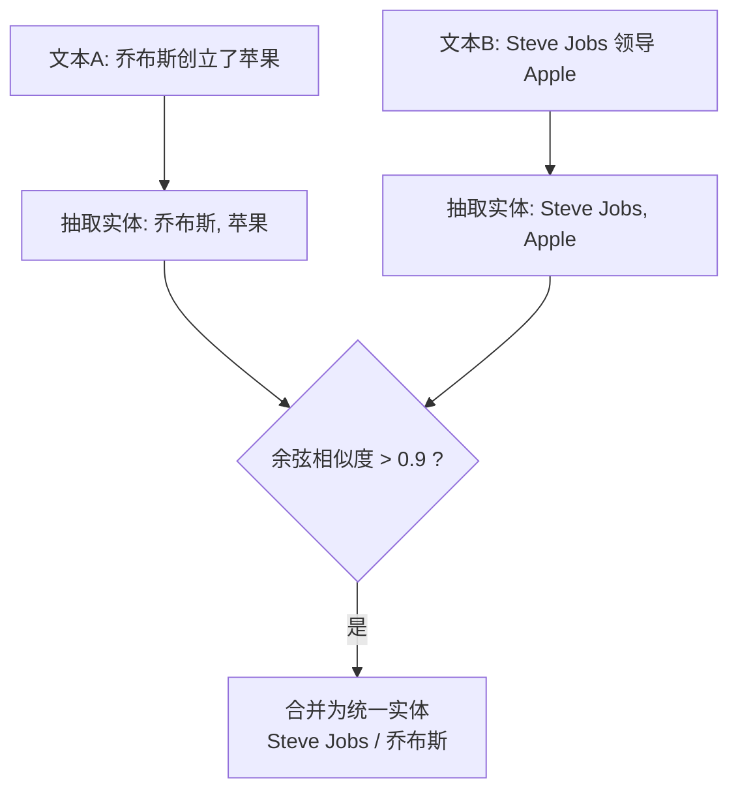

不去重会导致知识图谱碎片化，同一个实体被拆成多个节点，严重影响检索质量。LightRAG 使用**嵌入向量余弦相似度（阈值 0.9）**进行实体消歧，在精度和召回间取得平衡。

### 4.4 增量更新机制

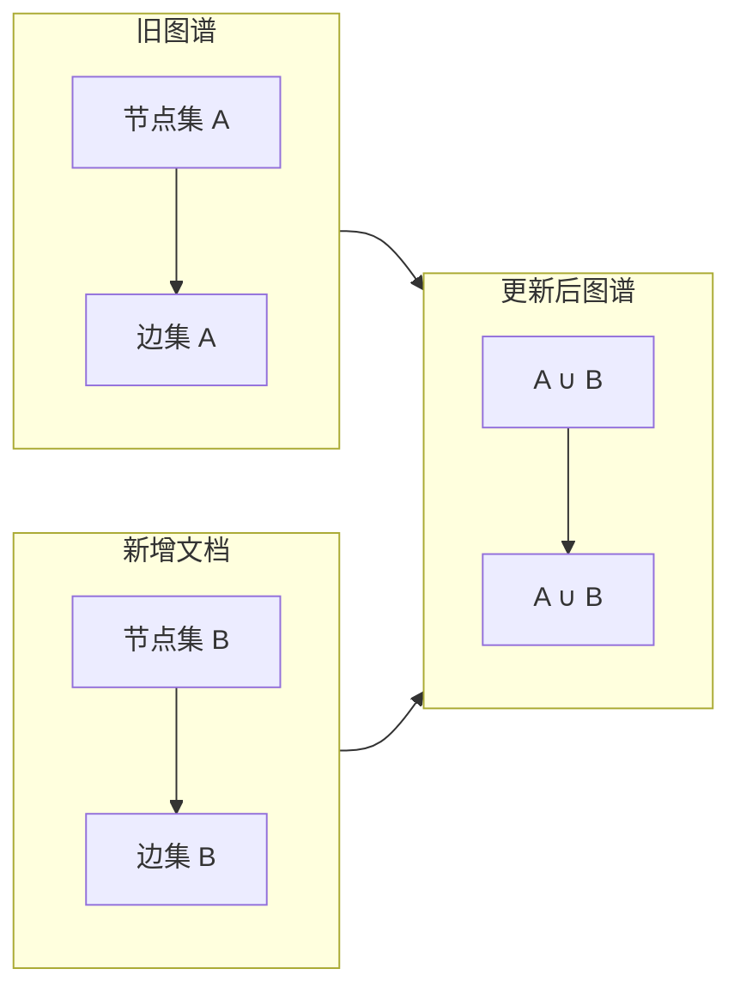

- 新增文档只生成**增量节点和边**，通过**集合并集**合并到现有图谱
- 删除文档时级联移除关联节点和边
- **不需要重新索引全部文档**——这是 GraphRAG 最大的痛点，LightRAG 原生解决了

### 4.5 图与向量的混合检索

| 环节 | 技术 | 作用 |
|------|------|------|
| 关键词提取 | 从查询中提取实体词和主题词 | 确定检索锚点 |
| 向量匹配 | 嵌入余弦相似度 | 找到语义相近的候选实体 |
| 图遍历 | 从候选实体沿边扩展邻居 | 补全隐含关联 |
| 高阶连接 | 利用社区结构聚合相关节点 | 捕获跨文档的间接关系 |
| Rerank | 对多路召回结果重排序 | 过滤噪声，提升 Top-K 精度 |

这种"向量定位 + 图扩展 + 社区聚合"的三段式检索，兼顾了语义泛化能力和结构化推理能力。

### 4.6 多后端存储抽象

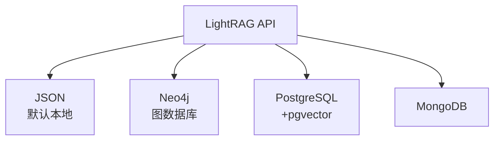

统一接口设计使得从本地原型到生产环境只需切换配置，无需改动业务代码。

---

## 五、综合性能对比

### 5.1 基准测试数据

| 指标 | LightRAG | GraphRAG |
|------|----------|----------|
| **索引速度** | 基准 **10 倍** | 基准 1 倍 |
| **查询延迟** | **< 2 秒** | 8–15 秒（Global Search） |
| **Token 消耗** | 仅 1 次 LLM 抽取调用 | 多轮 gleaning + 社区摘要生成 |
| **农业领域综合得分** | **54.8%** | 45.2% |
| **计算机科学得分** | **52.0%** | 48.0% |
| **法律领域得分** | **52.8%** | 47.2% |
| **多样性得分** | **70%+** | 30%+ |
| **增量更新** | ✅ 原生支持 | ❌ 需全量重建 |

> 数据来源：EMNLP 2025 LightRAG 论文 + 帕多瓦大学 2025 硕士论文基准测试 + CSDN 2025 独立评测

### 5.2 核心差异总结

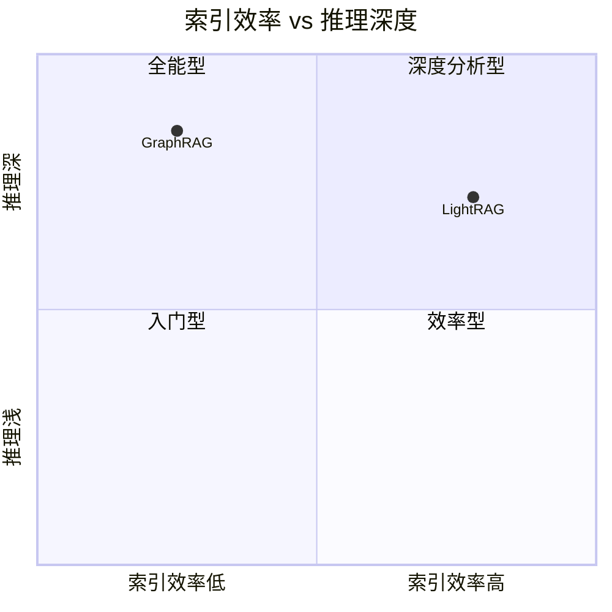

- **GraphRAG**：推理深度更深（社区摘要提供更强的全局理解），但索引效率低
- **LightRAG**：在几乎不牺牲推理深度的情况下，将效率提升了一个数量级

---

## 六、选型建议

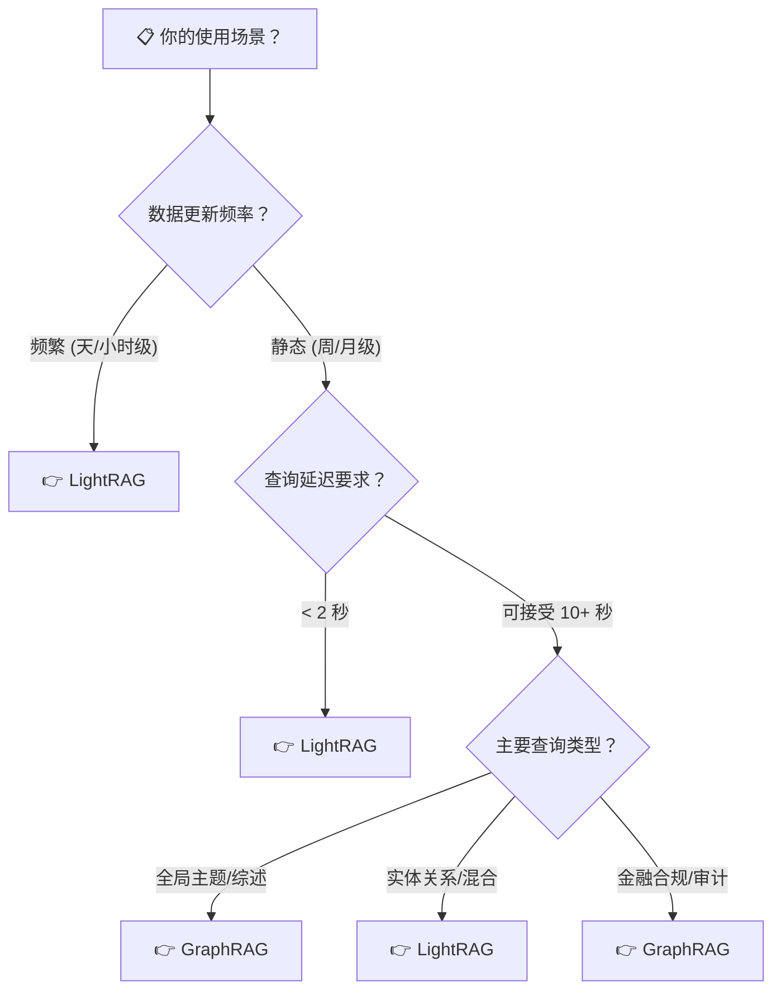

| 场景 | 推荐 | 理由 |
|------|------|------|
| 快速原型 / MVP | **LightRAG** | 异步批处理 + 增量更新，迭代快 |
| 客服 / 知识库问答 | **LightRAG** | 低延迟、多后端易集成 |
| 科研文献综述 | **GraphRAG** | Global Search 的深度理解能力不可替代 |
| 金融审计 / 合规 | **GraphRAG** | 推理链可追溯，满足合规要求 |
| 多模态文档处理 | **LightRAG** | 原生支持 PDF/图片 |
| 动态知识库 | **LightRAG** | 增量更新，无需全量重建 |

---

## 七、总结

> **GraphRAG** 是"深度优先"的图增强 RAG——通过层次化社区摘要实现强大的全局理解，代价是高昂的索引成本和延迟。适合数据量适中、对分析深度要求极高的场景。

> **LightRAG** 是"效率优先"的图增强 RAG——通过双层检索、异步批处理、增量更新等优化，将索引速度提升 10 倍，同时在多数基准上保持甚至超越 GraphRAG 的准确率。适合大多数实际工程场景。

两者的关系不是替代，而是互补。2025 年的前沿趋势是构建**混合路由系统**：以 LightRAG 为默认引擎处理 80% 的常规查询，将需要深度推理的复杂任务路由至 GraphRAG，兼顾效率与深度。

---

*参考来源：[GraphRAG GitHub](https://github.com/microsoft/graphrag) | [LightRAG 论文](https://arxiv.org/abs/2410.05779) | [LightRAG GitHub](https://github.com/HKUDS/LightRAG) | EMNLP 2025 Findings*
