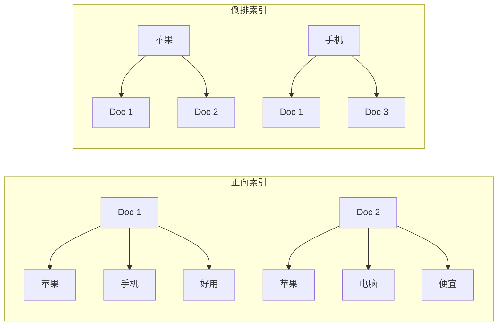
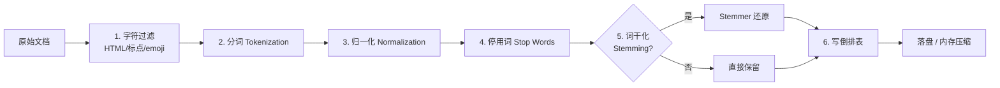
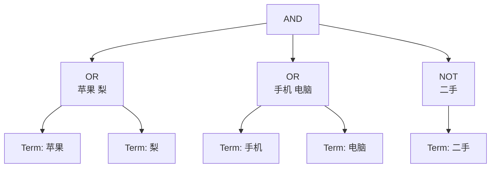
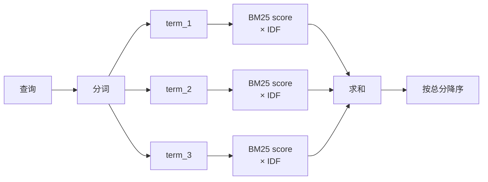
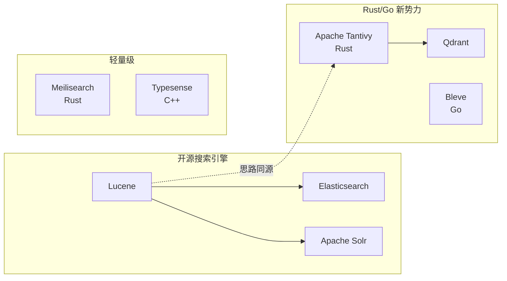
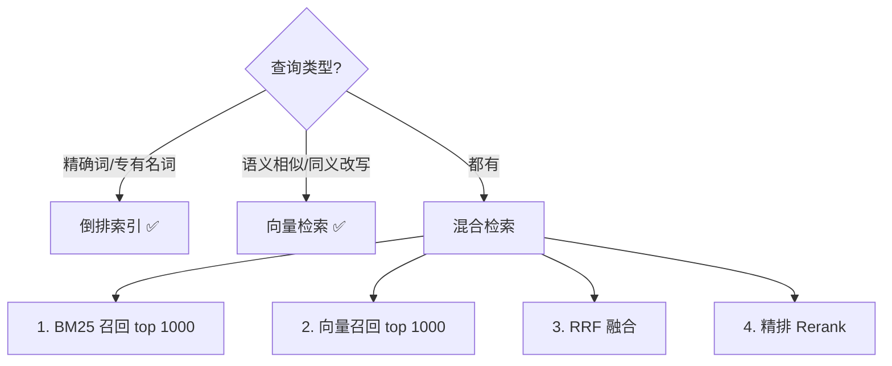
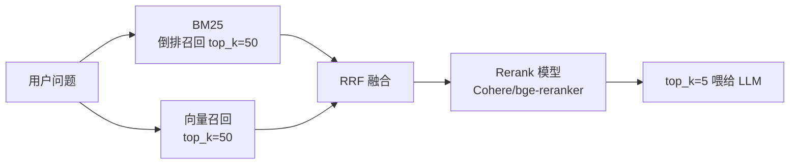

> 关键词搜索听起来很古老——在 LLM / 向量检索火起来之后显得有点"古典"。但你打开的每一个搜索引擎（ES、Solr、Postgres FTS、Meilisearch、Typesense……）**底层都是倒排索引**。哪怕是 RAG 系统里的 BM25 召回，也跑的是它。
>
> 本文从"什么是倒排索引"出发，用 **可运行的 Python 代码** 走通最小实现，再讲清楚 TF-IDF / BM25 / 跳表 / 位置索引等核心机制，最后对比工业实现与向量检索的取舍。

## 〇、目录

- [1. 概念：为什么叫"倒排"？](#1-概念为什么叫倒排)
- [2. 一个最小可运行的倒排索引](#2-一个最小可运行的倒排索引)
- [3. 索引构建流水线](#3-索引构建流水线)
- [4. 查询处理：布尔操作怎么做？](#4-查询处理布尔操作怎么做)
- [5. 相关性评分：TF-IDF 与 BM25](#5-相关性评分tf-idf-与-bm25)
- [6. 工程优化：跳表、压缩、位置索引](#6-工程优化跳表压缩位置索引)
- [7. 工业级实现对照](#7-工业级实现对照)
- [8. 倒排索引 vs 向量检索](#8-倒排索引-vs-向量检索)
- [9. 一句话总结](#9-一句话总结)

---

## 1. 概念：为什么叫"倒排"？

### 1.1 正向索引

你有一堆文档，最朴素的存储方式是 **文档 → 它包含的词**：

```text
Doc 1 → ["苹果", "手机", "好用"]
Doc 2 → ["苹果", "电脑", "便宜"]
Doc 3 → ["手机", "信号", "好"]
```

——这叫**正向索引**（forward index）。要查"包含'手机'的文档"得**遍历所有文档**，O(N)。文档库一上百万就崩。

### 1.2 倒排索引

把上面的关系**反过来**：**词 → 出现过这个词的文档列表**。

```text
"苹果" → [Doc 1, Doc 2]
"手机" → [Doc 1, Doc 3]
"电脑" → [Doc 2]
"信号" → [Doc 3]
"好用" → [Doc 1]
...
```

这个 `词 → 文档列表` 的映射就是**倒排索引**（inverted index）。要查"包含'手机'的文档"直接定位到 `手机` 这个 key，取出它的列表即可——O(1)~O(log V)，V 是词表大小。



> "倒排"是相对"正向"来说的——**把\"主语\"和\"宾语\"对调了**。文档不再是主体，词成了主体。

### 1.3 术语约定

| 术语 | 英文 | 含义 |
|------|------|------|
| 词项 | term | 索引的最小单位（通常归一化后的词） |
| 文档 | document | 被检索的对象（一篇网页 / 一条记录） |
| 文档集 | corpus / collection | 全部文档 |
| 倒排表 / 倒排列表 | posting list | 某个词项对应的"出现过它的文档 ID 列表" |
| 倒排记录 | posting | posting list 里的一项，通常是 `(doc_id, tf, positions...)` |
| 词项字典 | term dictionary | 所有词项的有序集合（一般用 B+ 树或 FST 实现） |
| 词频 | term frequency, TF | 某个词在某个文档里出现的次数 |

---

## 2. 一个最小可运行的倒排索引

下面这个实现不到 50 行，能处理"包含 X 的文档"和"包含 X 或 Y 的文档"两种查询。完整可跑：

```python
import re
from collections import defaultdict

# ── 1. 一份超小的"语料" ──
corpus = {
    1: "苹果手机好用 信号也好",
    2: "苹果电脑便宜 性能强",
    3: "手机信号差 苹果手机不便宜",
    4: "笔记本电脑 性能好",
}

# ── 2. 分词（中文用 jieba,这里为了零依赖写个超简陋的按字切） ──
def tokenize(text: str) -> list[str]:
    # 实际生产用 jieba / HanLP / IK Analyzer
    # 这里按"非中文字符"切,纯中文输入会切成单字,够演示
    return [c for c in text if c.strip()]

# ── 3. 建索引 ──
def build_index(corpus: dict[int, str]) -> dict[str, list[int]]:
    index: dict[str, list[int]] = defaultdict(list)
    for doc_id, text in corpus.items():
        for term in set(tokenize(text)):        # set 去重,同 doc 内不重复登记
            index[term].append(doc_id)
    for term in index:                          # 排序,方便后面做"有序列表求交"
        index[term].sort()
    return index

INV_INDEX = build_index(corpus)
# → {
#     "苹": [1, 2, 3], "果": [1, 2, 3], "手": [1, 3, 4], ...
#   }

# ── 4. 布尔查询:AND / OR ──
def intersect(p1: list[int], p2: list[int]) -> list[int]:
    """两个 posting list 求交集(有序列表双指针)"""
    result, i, j = [], 0, 0
    while i < len(p1) and j < len(p2):
        if p1[i] == p2[j]:
            result.append(p1[i]); i += 1; j += 1
        elif p1[i] < p2[j]:
            i += 1
        else:
            j += 1
    return result

def union(p1: list[int], p2: list[int]) -> list[int]:
    """两个 posting list 求并集"""
    return sorted(set(p1) | set(p2))

# ── 5. 用起来 ──
print(union(INV_INDEX["苹"], INV_INDEX["手"]))
# → [1, 2, 3, 4]   ← 包含"苹"或"手"的文档

print(intersect(INV_INDEX["苹"], INV_INDEX["手"]))
# → [1, 3]         ← 同时包含"苹"和"手"的文档
```

跑一下输出 `[1, 2, 3, 4]` 和 `[1, 3]`，是不是和直觉一致？

> 这段代码是**学习用玩具**——生产环境的倒排索引要考虑的事情远不止这些（详见 §6）。但核心结构就是这三块：**分词 → 建索引 → 列表运算**。

---

## 3. 索引构建流水线

把 §2 里的 `tokenize` 展开成完整的工业级 pipeline：



### 3.1 各阶段在做什么

```python
import re
import jieba
from typing import Iterable

STOP_WORDS = {"的", "了", "是", "在", "和", "也", "就", "都", "而", "及"}

# 1. 字符过滤：去 HTML 标签
def strip_html(text: str) -> str:
    return re.sub(r"<[^>]+>", " ", text)

# 2. 中文分词
def tokenize_zh(text: str) -> list[str]:
    return [t for t in jieba.cut(strip_html(text)) if t.strip()]

# 3. 归一化：英文统一小写、去标点
def normalize(tokens: Iterable[str]) -> list[str]:
    out = []
    for t in tokens:
        t = t.lower()
        t = re.sub(r"[^一-鿿a-z0-9]+", "", t)
        if t:
            out.append(t)
    return out

# 4. 去停用词
def remove_stop(tokens: list[str]) -> list[str]:
    return [t for t in tokens if t not in STOP_WORDS]

# 5. (可选)英文词干化：Porter / Snowball
from nltk.stem.snowball import SnowballStemmer
stemmer = SnowballStemmer("english")
def stem(tokens: list[str]) -> list[str]:
    return [stemmer.stem(t) if re.match(r"^[a-z]+$", t) else t for t in tokens]
```

**注意：中文几乎没有"词干"概念**，分词本身就在做归一化；英文才需要 stemming（`running` / `runs` / `ran` → `run`）。

### 3.2 落盘结构

内存里的 `dict[term, list[doc_id]]` 写到磁盘要解决两个问题：

1. **term 字典**怎么存？——B+ 树（磁盘友好）或 **FST**（Finite State Transducer，只读、内存小、前缀查快）
2. **posting list** 怎么存？——按 doc_id 排序后用**变长整数压缩**（VarInt、Frame-of-Reference、RoaringBitmap）

```text
磁盘布局（简化）:
┌────────────────────────────┐
│  term dictionary (FST)     │  ← 内存常驻,支持 prefix 查
│  "苹果" → offset 0         │
│  "手机" → offset 12        │
│  "信号" → offset 24        │
├────────────────────────────┤
│  posting list 0 (VarInt)   │  ← 按段压缩,mmap 读
│  [1, 3, 7, 12, 89, ...]    │
├────────────────────────────┤
│  posting list 1            │
│  [2, 5, 8, 13, ...]        │
└────────────────────────────┘
```

---

## 4. 查询处理：布尔操作怎么做？

倒排索引的查询本质上是 **posting list 的集合运算**：

| 查询 | 运算 | 实现 |
|------|------|------|
| `苹果 AND 手机` | 交集 | 双指针 O(a + b) |
| `苹果 OR 手机` | 并集 | merge 后去重 |
| `苹果 NOT 手机` | 差集 | 全集 ∩ 补 |
| `"苹果手机"`（短语） | 位置相交 | 见 §6.3 |
| `苹果*`（前缀） | 字典树遍历 | FST / Trie |

### 4.1 性能对比

设两个 posting list 长度分别为 a、b：

| 操作 | 朴素 (set) | 有序合并 | 跳表加速 |
|------|-----------|---------|---------|
| AND | O(a + b) | O(a + b) | O(√a + √b) |
| OR | O(a + b) | O(a + b) | — |

实际工业实现**两个都上**：
- AND 优先用**跳表**（§6.1）跳过无关 doc_id
- OR 走有序 merge
- 最后再用**倒排表大小启发式**——先算小的那个 posting list

### 4.2 完整布尔表达式

现实里用户输入的不是单个 AND/OR，而是 `(苹果 OR 梨) AND (手机 OR 电脑) AND NOT 二手`。工业系统用**查询解析树**（AST）：



执行顺序：**叶子 → 根，自底向上**。每个节点的结果都是 posting list，根节点的结果就是最终候选文档集。

---

## 5. 相关性评分：TF-IDF 与 BM25

光返回"包含 X 的文档"还不够——得排个序。倒排索引里每个 posting 通常会带**评分所需的所有元数据**。

### 5.1 TF-IDF（经典）

```python
import math
from collections import defaultdict

# 倒排表里每条 posting 存 (doc_id, tf)
index: dict[str, list[tuple[int, int]]] = defaultdict(list)

def tf(term: str, doc_id: int) -> int:
    """词项在文档里的原始词频"""
    for d, f in index[term]:
        if d == doc_id:
            return f
    return 0

def idf(term: str, total_docs: int) -> float:
    """逆文档频率:log(总文档数 / 包含该词的文档数)"""
    df = len(index[term])
    return math.log((total_docs + 1) / (df + 1)) + 1  # 加 1 平滑

def tfidf_score(term: str, doc_id: int, total_docs: int) -> float:
    return tf(term, doc_id) * idf(term, total_docs)
```

直觉：
- **TF 高** → 这个词在这篇文档里反复出现 → 相关
- **IDF 高** → 这个词在语料里稀少 → 区分度强
- 两者相乘就是"相关度"

### 5.2 BM25（现代默认）

TF-IDF 早就过时了，工业界 99% 的场景用 **BM25**。它在 TF 上加了一个**饱和函数**——一个词出现 100 次和出现 10 次，对相关性的贡献**不应该**差 10 倍：

```python
# BM25 公式(简化版)
def bm25(tf: float, df: float, total_docs: int, doc_len: int, avg_doc_len: float,
         k1: float = 1.5, b: float = 0.75) -> float:
    """
    tf:        词在本文档的频率
    df:        包含该词的文档数
    total_docs:总文档数
    doc_len:   本文档长度(词数)
    avg_doc_len:平均文档长度
    k1, b:     超参(经验值 k1=1.5, b=0.75)
    """
    idf = math.log((total_docs - df + 0.5) / (df + 0.5) + 1)
    tf_norm = (tf * (k1 + 1)) / (tf + k1 * (1 - b + b * doc_len / avg_doc_len))
    return idf * tf_norm
```

**直觉**：
- `(1 - b + b * doc_len / avg_doc_len)` 是**长度归一化**——长文档天然 TF 高，要惩罚
- `k1` 控制**饱和速度**——越大越接近"线性 TF"
- **加 1 平滑** IDF 保证所有词都可计算



### 5.3 倒排表元数据

为了让评分能在 posting list 上**流式算**，每条 posting 通常带这些字段：

```python
@dataclass
class Posting:
    doc_id: int
    tf: int                  # 词频,TF-IDF / BM25 都要
    positions: list[int]     # 词在文档中的位置(短语查询要用)
    field_norm: float        # 字段长度归一化因子(Lucene 风格)
    # 还可以存: payload、词偏移、char offset...
```

---

## 6. 工程优化：跳表、压缩、位置索引

### 6.1 跳表（Skip Pointers）

posting list 可能很长（热门词可能有上百万 doc_id），做 AND 求交时如果两个 list 长度差很大，朴素双指针会很慢。

**解法**：在长 list 上每隔 √n 个元素放一个**跳表指针**：

```python
import math

def build_skips(p: list[int]) -> list[tuple[int, int]]:
    """每隔 sqrt(n) 记一个跳表项:(index, doc_id)"""
    step = max(1, int(math.sqrt(len(p))))
    return [(i, p[i]) for i in range(0, len(p), step)]

def intersect_with_skips(p1: list[int], p2: list[int],
                          s1: list[tuple[int, int]],
                          s2: list[tuple[int, int]]) -> list[int]:
    """带跳表的 posting list 求交"""
    result = []
    i = j = 0
    while i < len(p1) and j < len(p2):
        if p1[i] == p2[j]:
            result.append(p1[i]); i += 1; j += 1
        elif p1[i] < p2[j]:
            # 看看 p1 能不能跳
            skip = next((idx for idx, v in reversed(s1) if v <= p2[j]), -1)
            if skip > i: i = skip
            else: i += 1
        else:
            skip = next((idx for idx, v in reversed(s2) if v <= p1[i]), -1)
            if skip > j: j = skip
            else: j += 1
    return result
```

**复杂度**：从 O(a + b) 降到 O(√a + √b)。

### 6.2 倒排表压缩

posting list 里的 doc_id 总是有序的，相邻差值（gap）远小于原始值。把**差值**用变长整数存（VarInt），小数字用 1 字节、大数字多字节：

```python
def varint_encode(n: int) -> bytes:
    """变长整数:每 7 bit 一组,最高位作延续标志"""
    buf = bytearray()
    while n > 0x7F:
        buf.append((n & 0x7F) | 0x80)
        n >>= 7
    buf.append(n & 0x7F)
    return bytes(buf)

def varint_decode(buf: bytes) -> tuple[int, int]:
    n, shift, i = 0, 0, 0
    while True:
        b = buf[i]; i += 1
        n |= (b & 0x7F) << shift
        if not (b & 0x80):
            return n, i
        shift += 7
```

实际工业界更常用 **RoaringBitmap**——32-bit 整数集上压缩率与查询速度都接近最优。

### 6.3 位置索引（短语查询）

布尔查询只能告诉你"包含 X 和 Y"，但**不知道是不是连在一起**。要支持 `"苹果手机"` 这种**短语查询**，posting 里得存**位置**：

```python
# 位置倒排:term → {doc_id: [pos_1, pos_2, ...]}
positional_index: dict[str, dict[int, list[int]]] = defaultdict(lambda: defaultdict(list))

def add_positional(term: str, doc_id: int, position: int):
    positional_index[term][doc_id].append(position)

# "苹果 手机" 作为短语查询:term_1 在 pos p, term_2 必须在 p+1
def phrase_query(terms: list[str]) -> list[int]:
    if not terms:
        return []
    # 1. 先用 posting list 求交缩小候选集
    candidate_docs = set.intersection(*[
        set(positional_index[t].keys()) for t in terms
    ])
    # 2. 对每个候选文档,验证位置相邻
    result = []
    for d in candidate_docs:
        positions_lists = [positional_index[t][d] for t in terms]
        i = j = 0
        while i < len(positions_lists[0]) and j < len(positions_lists[1]):
            if positions_lists[1][j] == positions_lists[0][i] + 1:
                # 三词以上短语继续往后检查
                match = _check_k_phrase(positions_lists, i)
                if match:
                    result.append(d)
                    break
                i += 1
            elif positions_lists[1][j] < positions_lists[0][i] + 1:
                j += 1
            else:
                i += 1
    return result
```

代价：posting 大小**翻几倍**。所以生产环境用**可选项**——只在"短语查询"这个特性被打开时才建位置索引。

### 6.4 优化效果对照

| 优化 | 节省 | 代价 |
|------|------|------|
| 跳表 | 求交时间 √n 加速 | posting list 多存指针 |
| VarInt / RoaringBitmap | 磁盘 5-10× 压缩 | CPU 一点点 |
| 位置索引 | 支持短语 | posting 3-5× 膨胀 |
| FST 字典 | 内存省 50%+ | 构建稍慢 |

---

## 7. 工业级实现对照

| 系统 | 底层 | 字典结构 | Posting 压缩 | 评分 | 特色 |
|------|------|---------|-------------|------|------|
| **Lucene / Elasticsearch** | Java | FST | VarInt + PFOR-Delta | BM25 + 可插拔 | 事实标准 |
| **Solr** | Java (Lucene 上层) | FST | 同上 | BM25 | 偏传统企业搜索 |
| **Meilisearch** | Rust | 倒排 + 自适应 | — | BM25 + 自定义 | 轻量、API 友好 |
| **Typesense** | C++ | 倒排 | — | BM25 | 比 Meili 更丰富的过滤 |
| **Postgres FTS** | C | GIN | 数组 + tsvector | `ts_rank` (BM25-like) | 数据库内置 |
| **Bleve** | Go | FST | RoaringBitmap | BM25 | Go 生态 |
| **Tantivy** | Rust | FST | VarInt | BM25 | Lucene 的 Rust 移植 |



**共同点**：
- 底层数据结构全是**倒排索引 + FST 字典 + 压缩 posting list**
- 评分默认都是 **BM25**
- 都支持布尔查询、短语查询、范围查询、高亮

**差异**：分布式能力、生态、易用性、内存占用。选哪个看你团队栈。

---

## 8. 倒排索引 vs 向量检索

最近几年"语义搜索"火起来，embedding + 向量检索似乎要替代一切。但事实是**两者各有所长**：

| 维度 | 倒排索引 | 向量检索 |
|------|---------|---------|
| **擅长** | 精确关键词、专有名词、代码/ID | 语义相似、同义改写、跨语言 |
| **不擅长** | 同义词改写（"iPhone" vs "苹果手机"） | 精确词匹配、专有名词、罕见术语 |
| **数据** | 文本 → token → posting list | 文本 → embedding → 高维向量 |
| **存储** | 紧凑（GB 级） | 庞大（每条 1-2KB 向量） |
| **可解释** | ✅ 完全可解释 | ❌ 黑盒（top-k 是"算出来的"） |
| **冷启动** | 即时 | 需要 embedding 模型 |
| **可重建** | 离线 rebuild 即可 | 模型升级 → 全部重算 |
| **速度** | 极快（亚毫秒） | 受维度影响（毫秒级） |
| **成本** | 低 | 高（GPU / 大内存） |

### 8.1 实战选择



**结论**：
- **关键词明确**（搜索"Transformer 论文 PDF"）→ 倒排完胜
- **意图模糊**（搜索"那个关于注意力的东西"）→ 向量更懂
- **生产环境 RAG** → 几乎都用 **BM25 + 向量双路召回 + Rerank**，单独用任何一边都不够

RAG 系统的典型 pipeline：



> **不要因为向量检索热，就忘了倒排索引**。它是 BM25 的基础、是关键词场景的王者、是和向量互补的另一半。

---

## 9. 一句话总结

> **倒排索引 = 把"文档→词"反过来变成"词→文档列表"，是关键词搜索的"心脏"。工业实现配上 FST 字典、压缩 posting、BM25 评分后，能在毫秒级从百万文档里找出最相关的 Top K。和向量检索是互补关系，不是替代关系。**

---

## 附：自己动手实验

想真跑一下？三个零成本路径：

1. **Python 玩具** → 把 §2 的代码复制到一个文件，加几条文档试试
2. **Postgres FTS** → `CREATE INDEX ... USING GIN (to_tsvector('english', body))`，直接 SQL 玩
3. **Meilisearch** → `docker run -p 7700:7700 getmeili/meilisearch`，一行起服务

推荐路径：**Postgres FTS → Meilisearch → Lucene/ES**，由浅入深。
