> 字符串匹配是计算机科学最基础的问题之一。本文从最朴素的暴力匹配出发，逐步推导出 KMP 算法的核心思想，再扩展到多模式匹配利器——AC 自动机。**所有算法都配有具体例子和 Mermaid 图表**，力求让刚接触算法的同学也能看懂。

## 一、问题引入

### 1.1 字符串匹配是什么？

给定一个**文本串** `text`（长度 n）和一个**模式串** `pattern`（长度 m），要求找出 `pattern` 在 `text` 中**所有出现的位置**。

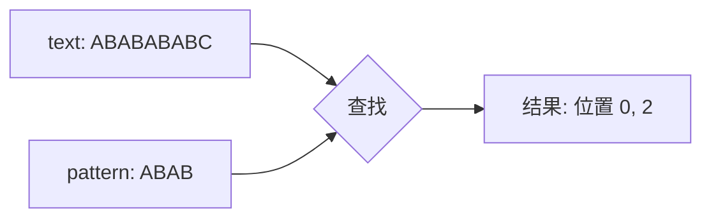

### 1.2 朴素匹配：暴力法

最直接的想法是：把模式串对准文本串的每一位，逐字符比较。

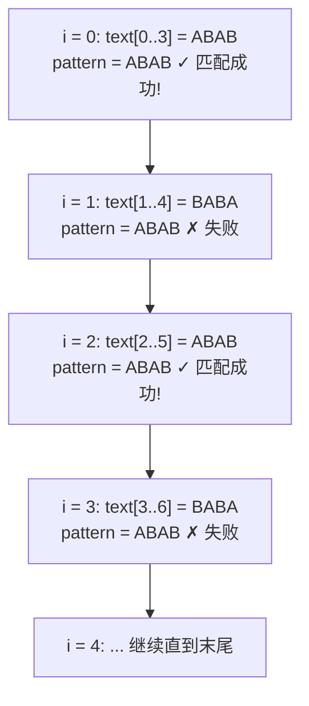

**复杂度分析**：每次对齐最多比较 m 个字符，总共要对齐 n−m+1 次。

| 项 | 复杂度 |
|---|---|
| 最坏时间复杂度 | **O(n × m)** |
| 最好时间复杂度 | O(n) |
| 空间复杂度 | O(1) |

> 暴力法在文本为 `AAAAAAAAAA`、模式为 `AAAB` 时退化为 O(n×m)。KMP 就是为了解决这种**回退浪费**而诞生的。

---

## 二、KMP 算法

KMP 由 **Knuth**、**Morris**、**Pratt** 三人于 1977 年共同提出，是字符串匹配史上**第一个线性时间**的算法。

### 2.1 核心思想

暴力法最大的浪费是**失配后从头开始比较**。但实际上，前面已经匹配上的部分里藏着大量"已知信息"。

> **KMP 的核心：永不回退文本指针 i，只回退模式指针 j。**

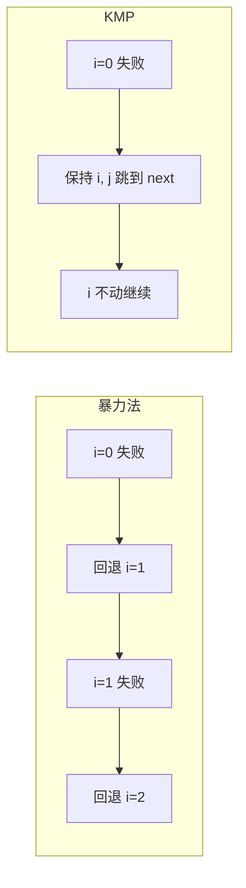

### 2.2 关键概念：前缀与后缀

要理解 KMP，必须先理解两个概念：

- **真前缀**：除字符串本身外，从头开始的连续子串
- **真后缀**：除字符串本身外，从尾开始的连续子串

以 `pattern = "ABAB"` 为例：

| 子串 | 真前缀 | 真后缀 | 最长相等真前后缀 |
|------|--------|--------|-----------------|
| `A`   | （空）   | （空）   | 长度 0           |
| `AB`  | `A`     | `B`     | 长度 0           |
| `ABA` | `A`, `AB` | `A`, `BA` | `A`，长度 1     |
| `ABAB` | `A`, `AB`, `ABA` | `B`, `AB`, `BAB` | `AB`，长度 2 |

### 2.3 next 数组：KMP 的灵魂

`next[i]` 表示：**当模式串第 i 个字符失配时，模式指针 j 应该跳到哪里继续比较。**

其值等于 `pattern[0..i-1]` 这段字符串的**最长相等真前后缀长度**。

#### 模式串 `"ABAB"` 的 next 数组计算

| i | 字符 | 模式串前缀 | 真前缀 ∩ 真后缀 | next[i] |
|---|------|------------|----------------|---------|
| 0 | A    | `A`        | ∅              | **0**   |
| 1 | B    | `AB`       | ∅              | **0**   |
| 2 | A    | `ABA`      | `{A}`          | **1**   |
| 3 | B    | `ABAB`     | `{A, AB}`      | **2**   |

> 约定 `next[0] = -1`（或 0，本教程使用 -1），表示"没有任何可回退的位置"。

#### 模式串 `"ABCAB"` 的 next 数组

| i | 字符 | 模式串前缀 | 真前缀 ∩ 真后缀 | next[i] |
|---|------|------------|----------------|---------|
| 0 | A    | `A`        | ∅              | -1      |
| 1 | B    | `AB`       | ∅              | 0       |
| 2 | C    | `ABC`      | ∅              | 0       |
| 3 | A    | `ABCA`     | `{A}`          | 1       |
| 4 | B    | `ABCAB`    | `{A, AB}`      | 2       |

#### 模式串 `"AAAAA"` 的 next 数组

| i | 字符 | 模式串前缀 | 最长相等前后缀 | next[i] |
|---|------|------------|----------------|---------|
| 0 | A    | `A`        | ∅              | -1      |
| 1 | A    | `AA`       | `A`            | 1       |
| 2 | A    | `AAA`      | `AA`           | 2       |
| 3 | A    | `AAAA`     | `AAA`          | 3       |
| 4 | A    | `AAAAA`    | `AAAA`         | 4       |

### 2.4 手把手推 next 数组

把 next 数组的构建流程画出来。设 i 是当前处理位置，j 是上一轮的最长前缀长度。

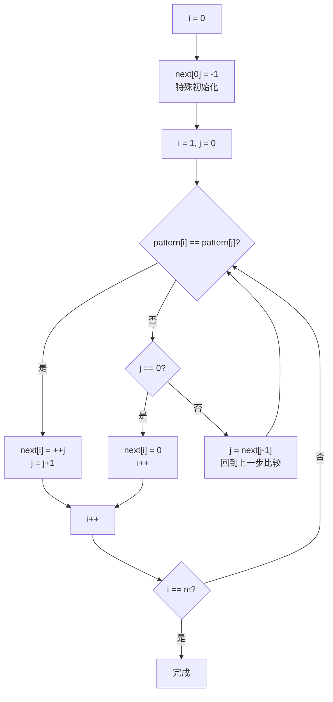

#### 实例：构建 `pattern = "ABABC"` 的 next 数组

| 步骤 | i | j | pattern[i] | pattern[j] | 操作 | next 数组 |
|------|---|---|------------|------------|------|-----------|
| 1 | 0 | - | A | - | 初始化 | `[-1, ?, ?, ?, ?]` |
| 2 | 1 | 0 | B | A | 不等，j=0 → next[1]=0 | `[-1, 0, ?, ?, ?]` |
| 3 | 2 | 0 | A | A | **相等**，++j=1 → next[2]=1 | `[-1, 0, 1, ?, ?]` |
| 4 | 3 | 1 | B | B | **相等**，++j=2 → next[3]=2 | `[-1, 0, 1, 2, ?]` |
| 5 | 4 | 2 | C | A | 不等，j=next[1]=0 | - |
| 6 | 4 | 0 | C | A | 不等，j=0 → next[4]=0 | `[-1, 0, 1, 2, 0]` |

最终 `next = [-1, 0, 1, 2, 0]`。

### 2.5 完整匹配过程实例

**例题**：`text = "ABABCABABA"`，`pattern = "ABABC"`，`next = [-1, 0, 1, 2, 0]`。

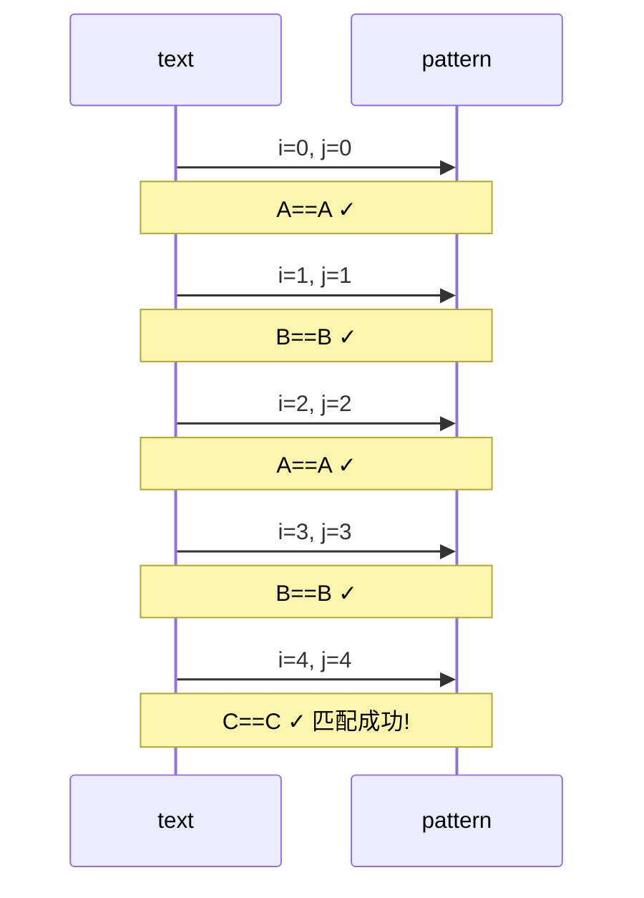

| 步骤 | i | j | text[i] | pattern[j] | 动作 | 说明 |
|------|---|---|---------|------------|------|------|
| 1 | 0 | 0 | A | A | i++, j++ | 匹配 |
| 2 | 1 | 1 | B | B | i++, j++ | 匹配 |
| 3 | 2 | 2 | A | A | i++, j++ | 匹配 |
| 4 | 3 | 3 | B | B | i++, j++ | 匹配 |
| 5 | 4 | 4 | C | C | i++, j++ | **匹配成功！** |
| 6 | 5 | 5 | - | - | 模式串完整匹配，记录位置 0 | j 回退到 next[4]=0 |
| 7 | 5 | 0 | A | A | 继续比较 | 寻找下一处匹配 |

### 2.6 失配时的优雅跳转

**例题**：`text = "ABACABAB"`，`pattern = "ABAB"`，`next = [-1, 0, 1, 2]`。

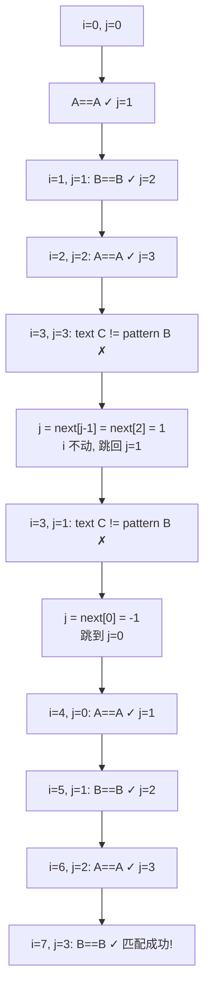

**关键观察**：i 从头到尾**只前进不后退**，每次失败 j 沿着 next 链回退（最多回退 m 次），总开销仍是 O(n+m)。

### 2.7 KMP 代码实现（Python）

```python
def build_next(pattern: str) -> list[int]:
    """构建 next 数组：next[i] = pattern[0..i-1] 的最长相等真前后缀长度"""
    m = len(pattern)
    next_arr = [0] * m
    next_arr[0] = -1  # 哨兵
    i, j = 1, 0       # i 是当前计算位置，j 是"上一个最长前缀长度"

    while i < m:
        if j == -1 or pattern[i] == pattern[j]:
            i += 1
            j += 1
            next_arr[i - 1] = j
        else:
            j = next_arr[j]  # 回退到次长前缀

    return next_arr


def kmp_search(text: str, pattern: str) -> list[int]:
    """返回 pattern 在 text 中所有出现的位置（0-indexed）"""
    if not pattern:
        return []

    n, m = len(text), len(pattern)
    next_arr = build_next(pattern)
    result, i, j = [], 0, 0

    while i < n:
        if j == -1 or text[i] == pattern[j]:
            i += 1
            j += 1
        else:
            j = next_arr[j]

        if j == m:  # 完全匹配
            result.append(i - j)
            j = next_arr[j - 1]  # 继续寻找下一个匹配

    return result


# === 测试 ===
if __name__ == "__main__":
    text, pattern = "ABABCABABABC", "ABABC"
    print(f"next 数组: {build_next(pattern)}")
    print(f"匹配位置: {kmp_search(text, pattern)}")
    # 输出: next 数组: [-1, 0, 1, 2, 0]
    # 输出: 匹配位置: [0, 5]
```

### 2.8 KMP 代码实现（Java）

```java
public class KMP {
    public static int[] buildNext(String pattern) {
        int m = pattern.length();
        int[] next = new int[m];
        next[0] = -1;
        int i = 1, j = 0;
        while (i < m) {
            if (j == -1 || pattern.charAt(i) == pattern.charAt(j)) {
                i++;
                j++;
                next[i - 1] = j;
            } else {
                j = next[j];
            }
        }
        return next;
    }

    public static java.util.List<Integer> search(String text, String pattern) {
        java.util.List<Integer> result = new java.util.ArrayList<>();
        int n = text.length(), m = pattern.length();
        if (m == 0) return result;
        int[] next = buildNext(pattern);
        int i = 0, j = 0;
        while (i < n) {
            if (j == -1 || text.charAt(i) == pattern.charAt(j)) {
                i++;
                j++;
            } else {
                j = next[j];
            }
            if (j == m) {
                result.add(i - j);
                j = next[j - 1];
            }
        }
        return result;
    }

    public static void main(String[] args) {
        System.out.println(search("ABABCABABABC", "ABABC"));
        // 输出: [0, 5]
    }
}
```

### 2.9 KMP 复杂度分析

| 项 | 复杂度 | 说明 |
|---|---|---|
| 构建 next 数组 | **O(m)** | i 单调递增，j 总回退次数 ≤ i |
| 文本匹配 | **O(n)** | i 单调递增，j 总回退次数 ≤ n |
| 空间 | O(m) | 存储 next 数组 |
| **总计** | **O(n + m)** | 首次达到线性的字符串匹配算法 |

---

## 三、AC 自动机（Aho-Corasick）

KMP 解决的是**单模式串**匹配。现实中我们常常要在一段文本中**同时查找多个关键字**，例如敏感词过滤、病毒特征码扫描、搜索引擎的多关键词检索。

**AC 自动机**就是解决多模式匹配问题的利器，由 **Alfred Aho** 和 **Margaret Corasick** 于 1975 年提出。

### 3.1 问题定义

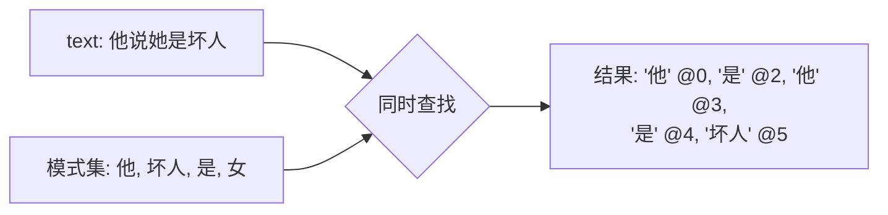

> **输入**：文本串 S（长度 n）+ 模式串集合 {P₁, P₂, ..., Pₖ}（总长 m）
> **输出**：每个模式串在文本中出现的所有位置

### 3.2 三大核心数据结构

AC 自动机是**字典树（Trie）+ 失败指针（fail）+ 输出指针（output）** 的组合体。

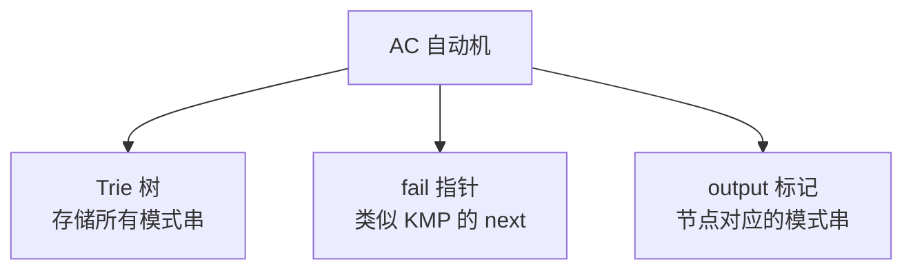

### 3.3 字典树（Trie）回顾

Trie 是一种**前缀树**，把每个模式串的每个字符看作一层。

#### 实例：插入模式串 `["he", "she", "his", "hers"]`

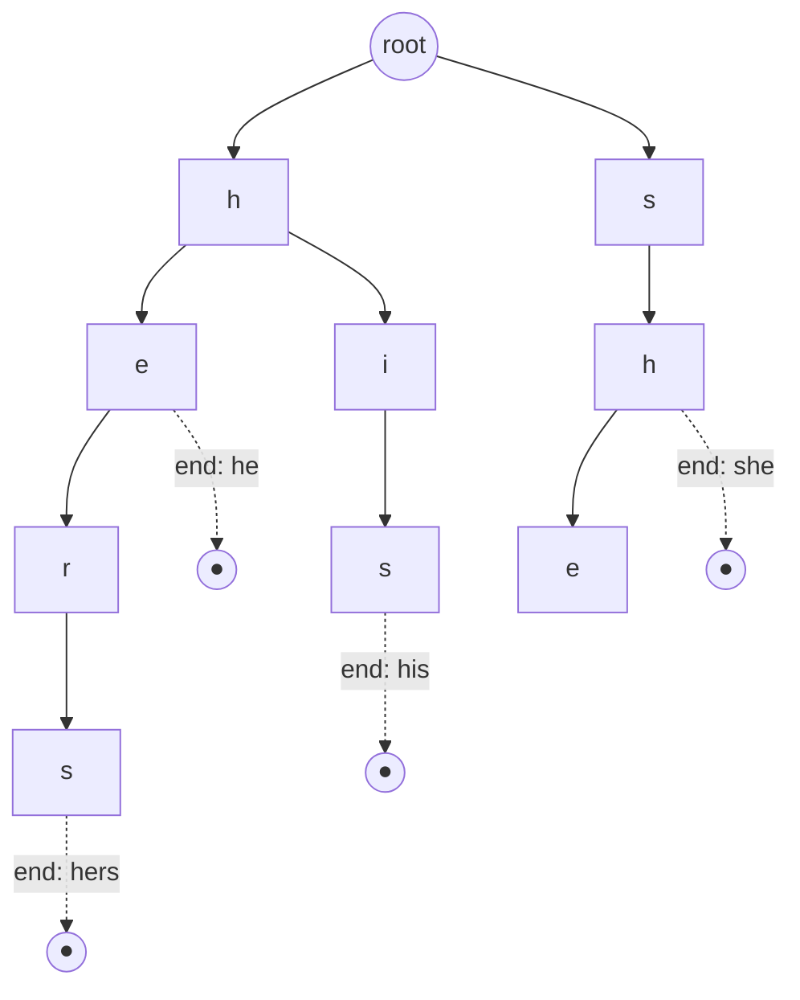

**节点说明**：
- 实线箭头：`children[c]` 指针（树边）
- 圆点 ●：标记该节点是一个**模式串的结尾**
- `fail` 指针：图中未画出，下面专门讲

### 3.4 失败指针（fail）：AC 的灵魂

**定义**：`fail[u]` 指向节点 u 的**最长真后缀**对应的节点（即在 Trie 中也能匹配的最长后缀）。

**作用**：当字符失配时，沿 `fail` 链回退，类似 KMP 的 next，但这里是**在 Trie 上回退**。

#### BFS 构建 fail 指针

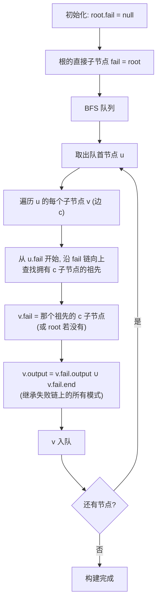

### 3.5 完整实例：手把手构建 AC 自动机

**模式串集合**：`{"he", "she", "his", "hers"}`

**目标文本**：`"ushers"`（期望找出 "he"、"she"、"hers" 出现的位置）

#### Step 1: 构建 Trie

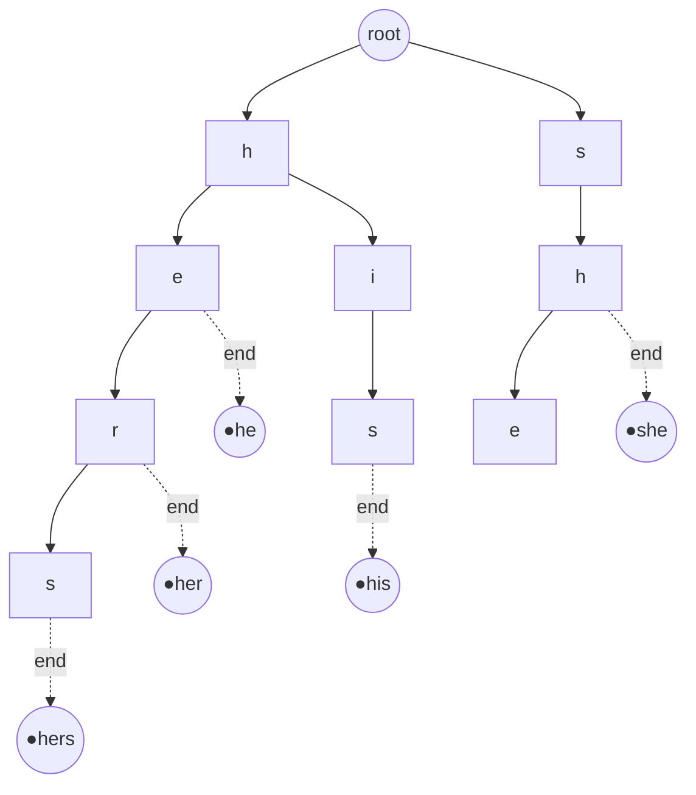

#### Step 2: 计算 fail 指针（分层 BFS）

| 节点 | 含义 | fail 指针指向 | 理由 |
|------|------|--------------|------|
| root | - | null | 约定 |
| h | 根的子节点 | root | 根的直接子节点，fail 指向根 |
| s | 根的子节点 | root | 同上 |
| he | h 的子节点 e | **root.e? 不存在 → root** | "he" 的真后缀 `"e"` 不在 Trie 中 |
| hi | h 的子节点 i | root | 同上 |
| her | e 的子节点 r | h.r? 不存在 → **h** | "her" 的真后缀 `"er"` 不在 Trie 中；再回退到 h 后看 `h.r` 也不存在；最后回 root？让我们详细算 |
| sh | s 的子节点 h | h | "sh" 的真后缀 `"h"` 在 Trie 中（节点 h 存在） |
| she | sh 的子节点 e | **he** | "she" 的真后缀 `"he"` 在 Trie 中（节点 he 存在） |
| his | hi 的子节点 s | h.s? 不存在 → root | "his" 的真后缀在 Trie 中都没有 |
| hers | her 的子节点 s | he.s? 不存在 → h.s? 不存在 → root | "hers" 的真后缀都不在 Trie 中 |

> **关键细节**：计算节点 v 的 fail 时，从 `v.parent.fail` 开始，沿 fail 链向上查找**第一个拥有字符 c 子节点的祖先**。该祖先的 c 子节点就是 v.fail。

#### 修正后的 fail 指针表

| 节点 | fail 指向 | output 集合（沿 fail 链累加） |
|------|-----------|------------------------------|
| root | null | {} |
| h | root | {} |
| s | root | {} |
| he | root | {he} |
| hi | root | {hi → 失败链无末尾} |
| her | h | {her} |
| sh | h | {} |
| **she** | **he** | **{he, she}** ← 继承 he |
| his | root | {his} |
| hers | root | {hers} |

#### 带 fail 指针的最终图

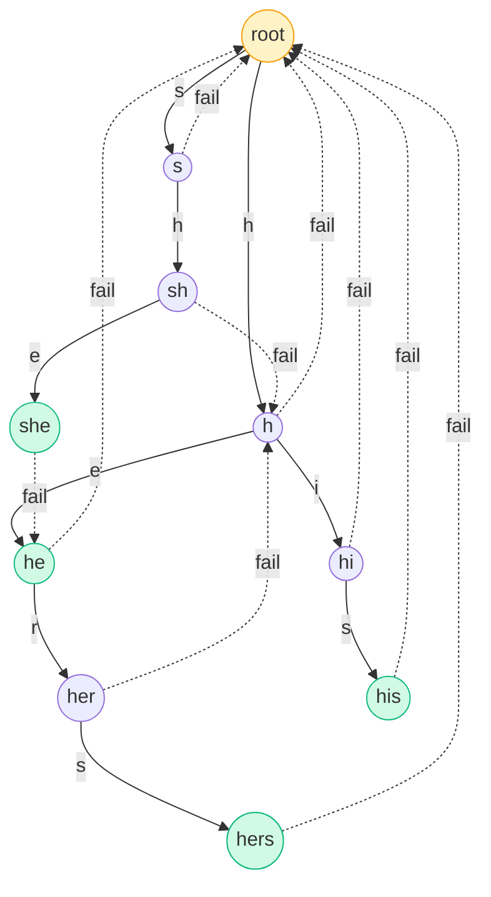

> 图中虚线箭头是 fail 指针，实线是 Trie 边，绿色节点是模式串结尾。

### 3.6 匹配过程演示

**文本**：`"ushers"`，从 root 开始。

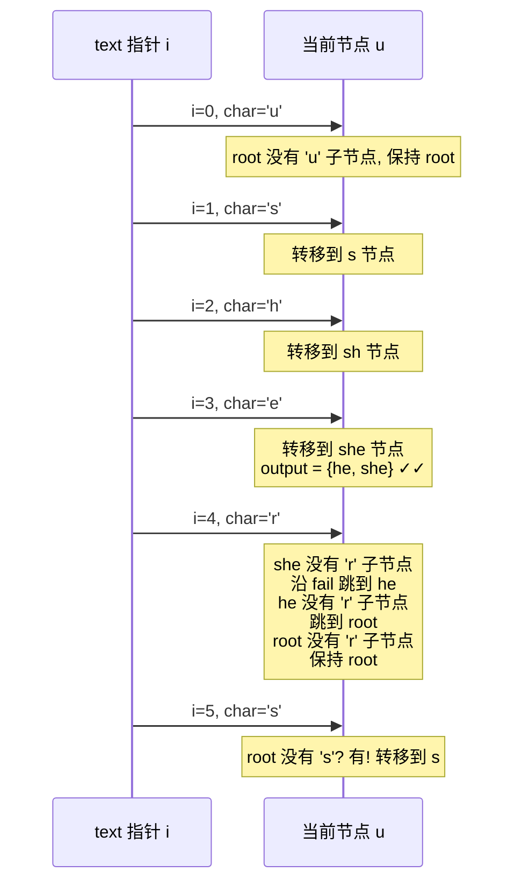

#### 详细状态表

| i | 字符 | 当前节点 | 失配跳转 | 新节点 | 该节点 output | 命中模式 | 位置 |
|---|------|----------|----------|--------|---------------|----------|------|
| 0 | u | root | - | root | {} | - | - |
| 1 | s | root | - | s | {} | - | - |
| 2 | h | s | - | sh | {} | - | - |
| 3 | e | sh | - | **she** | {he, she} | he, she | 1, 1 |
| 4 | r | she | she→he→root | root | {} | - | - |
| 5 | s | root | - | s | {} | - | - |

**结果**：`"he"` 在位置 1 出现，`"she"` 在位置 1 出现（覆盖范围 `text[1..3]`）。

### 3.7 失配时的"优雅滑行"

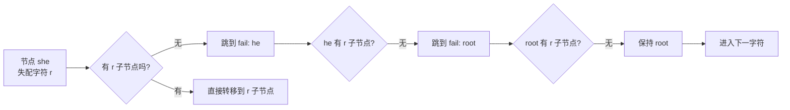

> 这种**沿 fail 链回退再尝试匹配**的机制，本质上是 KMP 在 Trie 上的推广。

### 3.8 AC 自动机代码实现（Python）

```python
from collections import deque
from typing import List, Tuple


class AhoCorasick:
    def __init__(self):
        self.children: List[dict] = [{}]   # children[v][c] = u
        self.fail: List[int] = [0]         # fail[v] = u
        self.output: List[List[int]] = [[]]  # output[v] = [模式串索引列表]
        self.patterns: List[str] = []

    def add_pattern(self, pattern: str, idx: int):
        """将模式串插入 Trie"""
        node = 0
        for ch in pattern:
            if ch not in self.children[node]:
                self.children[node][ch] = len(self.children)
                self.children.append({})
                self.fail.append(0)
                self.output.append([])
            node = self.children[node][ch]
        self.output[node].append(idx)
        self.patterns.append(pattern)

    def build(self):
        """BFS 构建 fail 指针和 output 继承"""
        queue = deque()
        # 第二层节点的 fail 全部指向 root
        for ch, u in self.children[0].items():
            queue.append(u)
            self.fail[u] = 0

        while queue:
            u = queue.popleft()
            # 继承 fail 链上的所有 output
            self.output[u].extend(self.output[self.fail[u]])

            for ch, v in self.children[u].items():
                queue.append(v)
                # 找 v 的 fail
                f = self.fail[u]
                while f != 0 and ch not in self.children[f]:
                    f = self.fail[f]
                self.fail[v] = self.children[f].get(ch, 0)

    def search(self, text: str) -> List[Tuple[int, int]]:
        """返回所有 (位置, 模式串索引) 命中记录"""
        results = []
        node = 0
        for i, ch in enumerate(text):
            while node != 0 and ch not in self.children[node]:
                node = self.fail[node]
            node = self.children[node].get(ch, 0)
            for pidx in self.output[node]:
                # 命中: 模式串 self.patterns[pidx] 在 text 中以 i - len + 1 结尾
                start = i - len(self.patterns[pidx]) + 1
                results.append((start, pidx))
        return results


# === 测试 ===
if __name__ == "__main__":
    patterns = ["he", "she", "his", "hers"]
    ac = AhoCorasick()
    for idx, p in enumerate(patterns):
        ac.add_pattern(p, idx)
    ac.build()

    text = "ushers"
    hits = ac.search(text)
    print(f"文本: {text!r}")
    print(f"模式: {patterns}")
    print(f"命中: {[(pos, patterns[idx]) for pos, idx in hits]}")
    # 输出: 命中: [(1, 'he'), (1, 'she')]
```

### 3.9 AC 自动机复杂度分析

| 项 | 复杂度 | 说明 |
|---|---|---|
| 构建 Trie | O(m) | m 为所有模式串总长 |
| 构建 fail | O(m × σ) | σ 为字符集大小（用数组可优化到 O(m)） |
| 文本扫描 | **O(n)** | 每个字符最多触发常数次 fail 回退 |
| 报告命中 | O(总命中数) | 每个位置可能命中多个模式 |
| **总计** | **O(n + m + 总命中数)** | 与模式串数量 k 无关！ |

> **这才是 AC 自动机最厉害的地方**：**同时查找 1000 个关键字和查找 1 个关键字的时间复杂度是一样的**。

### 3.10 应用场景

| 场景 | 说明 |
|------|------|
| **敏感词过滤** | 聊天/评论系统中高效屏蔽违禁词 |
| **病毒特征码扫描** | 在文件中同时匹配成千上万个病毒签名 |
| **搜索引擎** | 多关键词检索、文档分类 |
| **生物信息学** | DNA 序列中查找多个基因模式 |
| **日志分析** | 一次性监控数百个错误模式 |
| **拼音/汉字输入法** | 输入前缀时快速匹配候选词 |

---

## 四、KMP 与 AC 自动机对比

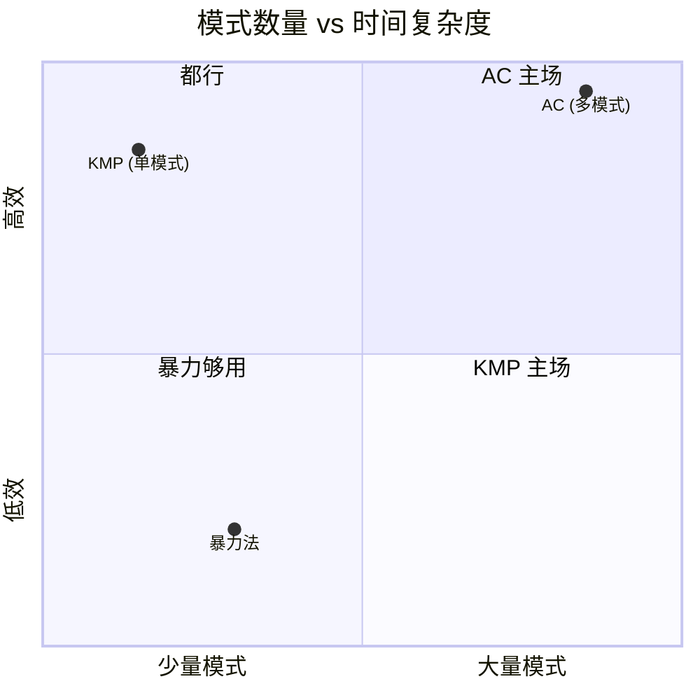

| 维度 | KMP | AC 自动机 |
|------|-----|-----------|
| **模式数** | 1 个 | k 个（任意多个） |
| **预处理** | O(m) | O(总模式长) |
| **匹配时间** | O(n) | O(n) |
| **总时间** | O(n + m) | O(n + m + 命中数) |
| **核心思想** | next 数组 | Trie + fail 指针 |
| **本质** | 单模式串的"自我跳转" | 多模式串的"集体跳转" |
| **关系** | AC 是 KMP 在 Trie 上的推广 | - |

---

## 五、实战建议与练习

### 5.1 学习路线

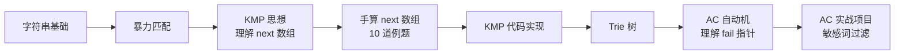

### 5.2 推荐练习题

| 平台 | 题目 | 算法 |
|------|------|------|
| LeetCode 28 | 实现 strStr() | KMP |
| LeetCode 459 | 重复的子字符串 | KMP 变形 |
| LeetCode 1392 | 最长快乐前缀 | KMP 变形 |
| HDU 1711 | Number Sequence | KMP 入门 |
| HDU 2222 | Keywords Search | **AC 自动机模板题** |
| POJ 1204 | Word Puzzles | AC + 矩阵 |
| LeetCode 745 | 前缀和后缀搜索 | Trie 变体 |

### 5.3 常见易错点

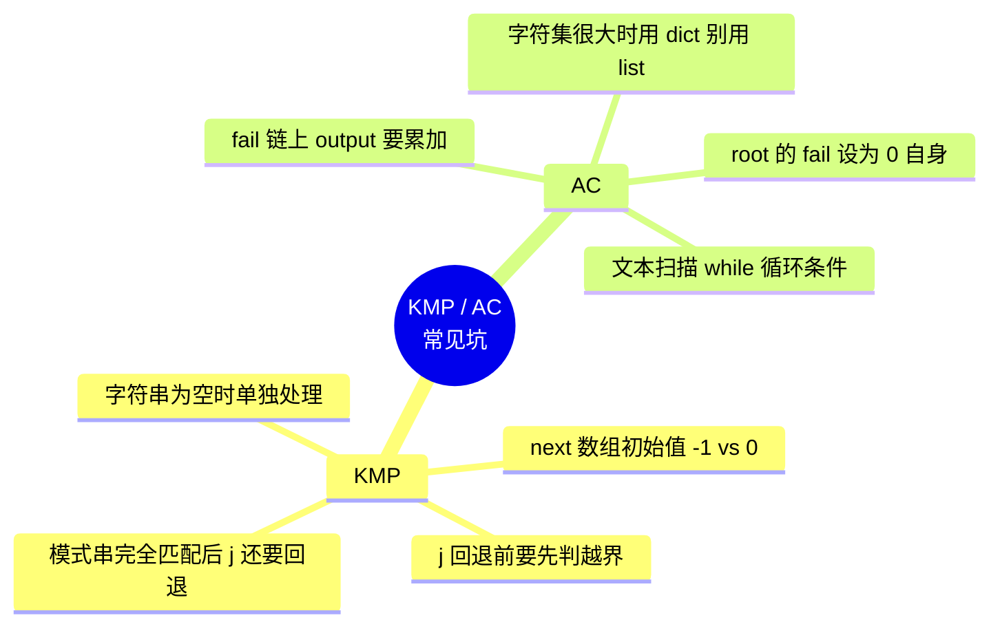

---

## 六、总结

> **KMP** 用一个 `next` 数组记录"已经知道的匹配信息"，让文本指针永不回退，把单模式匹配的最坏复杂度从 O(n×m) 降到 **O(n+m)**。

> **AC 自动机** 把 KMP 的思想搬上 Trie 树，配合 BFS 构建的 `fail` 指针，让**多模式匹配也能在线性时间**内完成——查询 1000 个关键字和查询 1 个关键字一样快。


**下一步学习**：

- **Z 算法**（Z-Algorithm）：另一种线性字符串匹配，与 KMP 等价但思路不同
- **扩展 KMP**（Z-Algorithm on pattern）：求模式串所有后缀与文本的最长公共前缀
- **后缀数组（SA）/ 后缀自动机（SAM）**：处理"子串类"问题
- **回文树（Palindromic Tree）**：处理回文子串问题

字符串匹配的世界远不止 KMP 和 AC 自动机，但**掌握这两个，你已经能解决 80% 的字符串匹配题了**。

---

*参考资料：[CP-Algorithms KMP](https://cp-algorithms.com/string/prefix-function.html) | [AC 自动机原理](https://cp-algorithms.com/string/aho_corasick.html) | 《算法导论》第 32 章 字符串匹配*
