> 上篇讲到 Decoder-Only LLM 一个 token 一个 token 自回归生成。本文解决一个直击灵魂的问题：**这玩意到底慢在哪？能快多少？怎么快？** 我们会沿着"为什么需要 KV-Cache → KV-Cache 怎么算 → 显存和算力怎么省 → 还能不能再快"这条主线，把当前主流 LLM 推理优化技术讲透，并配可直接跑的 PyTorch toy 实现。

## 〇、一个反直觉的事实

假设你用 Llama-3-8B 生成 1000 个 token，**第一行代码不是"算"，是"重新算"**。

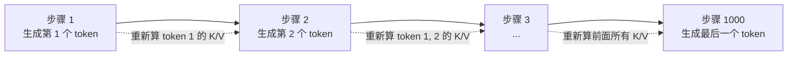

每生成一个新 token，都要把**之前所有 token 的 K/V 重新算一遍**——明明早就算过了。原因在 Attention 的 `QKᵀ` 里：Q/K 都是从 token 嵌入算出来的，每加一个新 token，旧 token 的 K/V 不会变（Q 才会变），完全可以缓存。

**KV-Cache 就是把"历史 K/V"缓存起来**，跳过重复计算。

---

## 一、KV-Cache 原理

### 1.1 自回归生成的算力浪费

回顾 Attention 计算（详见上篇）：

```
Attention(Q, K, V) = softmax(Q · Kᵀ / √d_k) · V
```

设当前位置为 t，新生成的 token 是 `xₜ`。Attention 需要 `Qₜ · Kᵀ`，其中：

| 矩阵 | 来源 | 是否随生成变化 |
|---|---|---|
| `Qₜ` | 当前 token 的 Q | **是**（每步要重算） |
| `K₁₋ₜ` | 历史 token 的 K | **否**（历史 token 不变） |
| `V₁₋ₜ` | 历史 token 的 V | **否** |

而 `Kᵢ = xᵢ · W_K`，`Vᵢ = xᵢ · W_V`——只跟对应位置的 `xᵢ` 有关，跟生成到哪一步无关。

```mermaid
flowchart TB
    subgraph 步骤 t=1
        T1["x₁"] --> K1["k₁, v₁"]
        K1 --> ATT1["Attention(Q₁, K₁, V₁)"]
    end
    subgraph 步骤 t=2
        T1 --> K1R["k₁, v₁ 重复！"]
        T2["x₂"] --> K2["k₂, v₂"]
        K1R --> ATT2["Attention(Q₂, [k₁,k₂], [v₁,v₂])"]
        K2 --> ATT2
    end
```

不缓存时，每步计算量 `O(t² · d)`，总计 `O(T² · d)`（T 是总长）。**T=1000 时算 1M 次乘法，但其中 50 万次是重复的。**

### 1.2 KV-Cache：把历史的 K/V 存下来

想法很直接：

```python
# 伪代码
cache_K, cache_V = [], []
for t in range(1, T+1):
    k_t = x_t @ W_K      # 当前 token 的 K
    v_t = x_t @ W_V      # 当前 token 的 V
    cache_K.append(k_t)  # 拼到 cache
    cache_V.append(v_t)

    # 拼起来的 K、V 包含了所有历史 + 当前
    K_all = concat(cache_K)
    V_all = concat(cache_V)

    q_t = x_t @ W_Q
    attn = softmax(q_t @ K_all.T / sqrt(d_k))  # Q 只有当前 token
    out_t = attn @ V_all
```

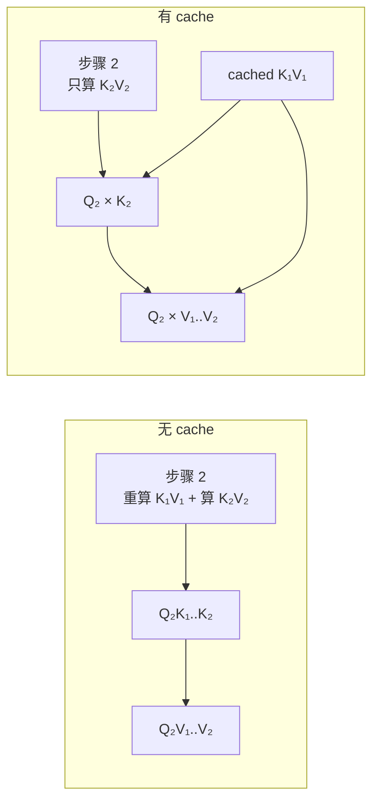

数学上的"半因果" Attention：

```
output_t = softmax( q_t · [K₁, K₂, …, Kₜ]ᵀ / √d_k ) · [V₁, V₂, …, Vₜ]
```

Q 始终是 1×d_k 向量，K/V 是 t×d_k 矩阵。复杂度从 `O(t² · d)` 降到 `O(t · d)`——**线性 vs 平方**。

### 1.3 显存占用分析

KV-Cache 不是免费的。它占的显存是：

```
单 token K+V = 2 · n_layers · n_heads · head_dim · sizeof(dtype)
```

举个 LLaMA-3-8B 的具体例子（`n_layers=32, n_heads=32, head_dim=128, dtype=fp16`）：

```
单 token = 2 × 32 × 32 × 128 × 2 bytes = 524 KB
2048 token = 2048 × 524 KB ≈ 1 GB
8192 token = 8192 × 524 KB ≈ 4 GB
```

8B 模型的权重本身才 ~16GB（fp16），KV-Cache 长序列下能占到几 GB 甚至几十 GB。这是为什么"长上下文 LLM 推理很费显存"——**不是模型权重大，是 KV-Cache 大**。

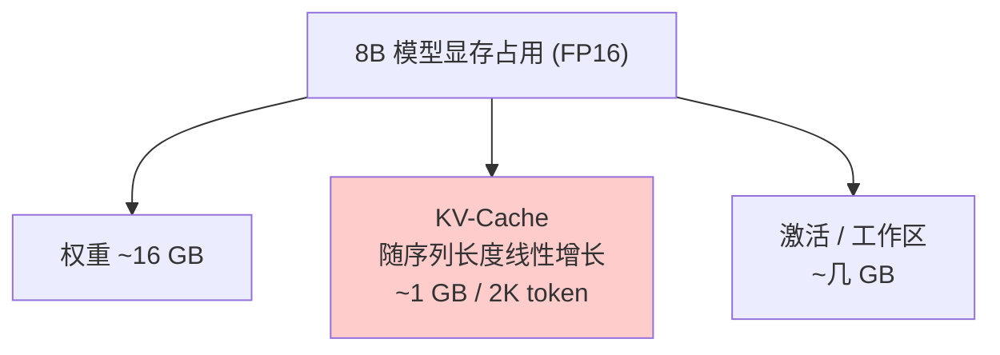

### 1.4 KV-Cache 的 PyTorch toy 实现

完整可跑的单头版本，便于理解：

```python
import torch
import torch.nn.functional as F

class SelfAttentionWithKVCache(torch.nn.Module):
    """带 KV-Cache 的单头 Self-Attention"""
    def __init__(self, d_model):
        super().__init__()
        self.W_q = torch.nn.Linear(d_model, d_model, bias=False)
        self.W_k = torch.nn.Linear(d_model, d_model, bias=False)
        self.W_v = torch.nn.Linear(d_model, d_model, bias=False)

    def forward(self, x, cache=None):
        """
        x:     (B, n, d)         n=1 时是增量解码
        cache: None 或 (K_cache, V_cache)，形状 (B, t, d)
        返回: (output, new_cache)
        """
        B, n, d = x.shape
        q = self.W_q(x)            # (B, n, d)
        k = self.W_k(x)            # (B, n, d)
        v = self.W_v(x)            # (B, n, d)

        if cache is not None:
            K_c, V_c = cache
            K = torch.cat([K_c, k], dim=1)   # (B, t+n, d)
            V = torch.cat([V_c, v], dim=1)
        else:
            K, V = k, v

        # Q 可能多个（如并行处理 prompt），
        # 增量解码时 n=1
        scores = (q @ K.transpose(-2, -1)) / (d ** 0.5)
        if n == 1 and cache is not None:
            # 增量步：q 只有 1 个 token，不需要 mask
            attn = F.softmax(scores, dim=-1)
        else:
            # 首次/并行：causal mask
            T = K.size(1)
            mask = torch.triu(torch.ones(T, T, dtype=torch.bool, device=x.device), diagonal=1)
            scores = scores.masked_fill(mask, float("-inf"))
            attn = F.softmax(scores, dim=-1)

        out = attn @ V
        return out, (K, V)


# ---- 验证：KV-Cache 与无 cache 结果一致 ----
torch.manual_seed(0)
d = 8
attn = SelfAttentionWithKVCache(d)

# 模拟 4 个 token
x = torch.randn(1, 4, d)

# 无 cache
out_full, _ = attn(x)

# 增量 + cache
cache = None
outs = []
for t in range(4):
    out_t, cache = attn(x[:, t:t+1, :], cache)
    outs.append(out_t)
out_cached = torch.cat(outs, dim=1)

print("max abs diff:", (out_full - out_cached).abs().max().item())  # ≈ 0
```

**生产代码中**（HuggingFace / vLLM 等）的 KV-Cache 还有更多工程优化：

| 优化 | 说明 |
|---|---|
| **Paged KV-Cache** | 借鉴 OS 虚拟内存，KV 切成固定大小 page，避免碎片 |
| **不同请求共享前缀** | 多请求 prompt 相同时共享前面的 KV |
| **Continuous Batching** | 不同请求的 step 错开，GPU 满载（见第五章） |
| **Pre-allocated buffer** | 预分配最大长度的 cache，避免动态分配开销 |

### 1.5 KV-Cache 引发的新问题

KV-Cache 解决算力，但**创造显存问题**。后续章节的优化技术基本都是围绕"压缩 KV-Cache"展开：

- **MQA / GQA**：从"每个 Q 头都独立 K/V"变成"多个 Q 头共享 K/V"——KV 数量下降 8–32 倍。
- **KV 量化**：fp16 → int8 / int4 / fp8——单 token 显存下降 2–4 倍。
- **PagedAttention**：把 KV 切成 page，内存利用率提升 2–4 倍。
- **窗口注意力**：只缓存最近 N 个 token 的 KV（牺牲长程能力换显存）。

---

## 二、Multi-Query Attention 与 Grouped-Query Attention

### 2.1 MHA 的 KV 重复问题

标准的 **MHA（Multi-Head Attention）** 每个头都有一套独立的 Q/K/V：

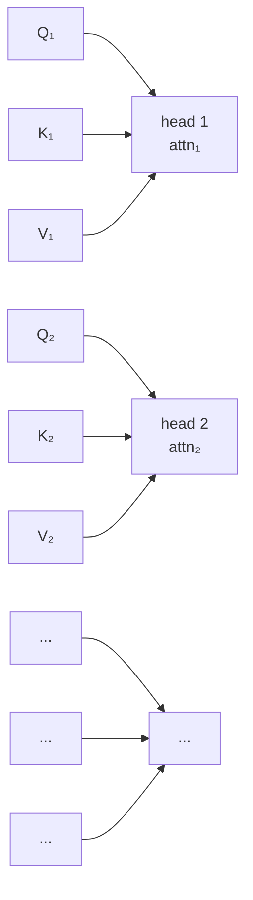

KV-Cache 大小 `= 2 · n_layers · n_heads · head_dim · seq_len`。

经验上：**多个头学到的 K/V 其实高度相似**。直觉：Attention 的功能是"找相关 token"，而"哪些 token 相关"这件事不需要每个头独立建模。

### 2.2 MQA：所有 Q 头共享 1 套 K/V

**Multi-Query Attention (MQA, 2019)**：h 个 Q 头，但**只有 1 套 K/V**。

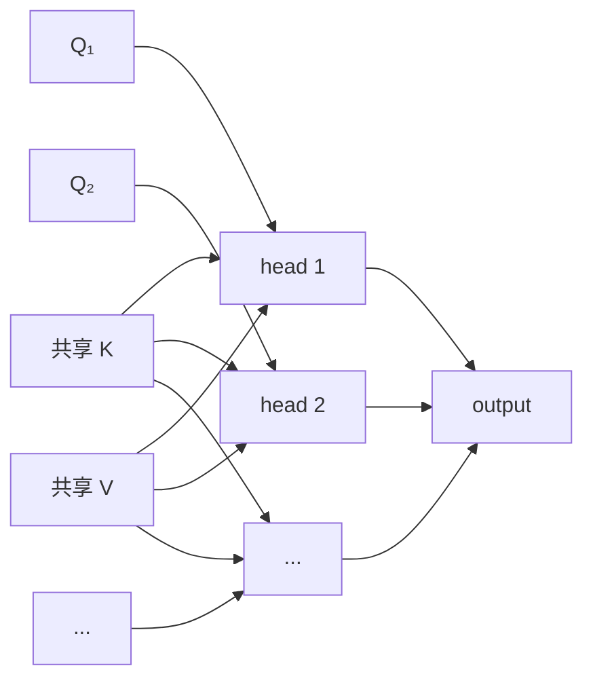

**KV-Cache 大小下降 h 倍**（h 是头数，通常 8–32）。

代价：

- 训练时 Q 头多、K/V 头少，模型容量下降，质量略有损失
- 实测在 LLM（小模型）上损失较明显，大模型几乎无损

### 2.3 GQA：分组共享（业界主流）

**Grouped-Query Attention (GQA, 2023, GQA 论文)**：把 h 个 Q 头分成 g 组，**每组共享一套 K/V**。MHA 和 MQA 都是 GQA 的特例：

| 名称 | g 的取值 | 含义 |
|---|---|---|
| MHA | g = h | 每头独立 K/V |
| GQA-g | 1 < g < h | g 组 K/V |
| MQA | g = 1 | 所有 Q 头共享 1 套 K/V |

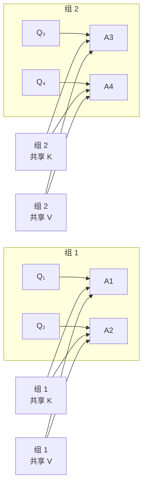

**LLaMA-2 70B、Llama-3 全系、Qwen-2 等主流模型都用 GQA**。典型配置：32 个 Q 头、8 个 K/V 头（g=4）—— KV 显存降到 1/4。

### 2.4 性能对比

| 模型 | 结构 | KV-Cache 相对大小 | 质量损失 |
|---|---|---|---|
| LLaMA-1 65B | MHA (g=64) | 1.0× | 基准 |
| LLaMA-2 70B | GQA (g=8) | 0.125× | 几乎无 |
| Falcon 180B | MQA (g=1) | 0.0156× | 略有 |
| Llama-3 8B | GQA (g=4) | 0.25× | 几乎无 |

**经验法则**：g 取 h 的 1/4 到 1/8 是性价比最高的甜蜜点。

---

## 三、KV-Cache 量化

### 3.1 为什么要量化

LLM 推理的"内存墙"：HBM（高带宽显存）带宽有限，KV-Cache 越大，读取越慢。

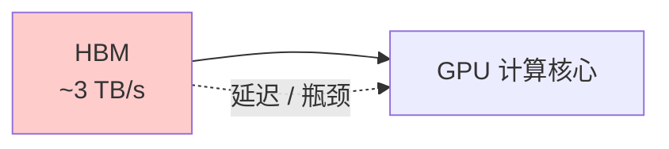

把 fp16（2 字节）的 K/V 压成 int8（1 字节）或 int4（0.5 字节），**直接砍半或砍 3/4 显存占用**，同时因为读取字节少，**Attention 计算也变快**。

### 3.2 量化方案对比

| 方案 | 每元素字节 | 8B 模型 2K token KV | 精度损失 | 典型用途 |
|---|---|---|---|---|
| FP16（基线） | 2 | 1 GB | 0 | 标准 |
| BF16 | 2 | 1 GB | 0 | 同上 |
| FP8 (E4M3) | 1 | 512 MB | < 0.1% | H100 默认 |
| INT8 | 1 | 512 MB | < 0.5% | 通用 |
| INT4 | 0.5 | 256 MB | 1-2% | 长上下文 |
| INT4 + 4-bit group | 0.5 | 256 MB | 1-3% | 极致省 |

### 3.3 KV 量化 vs 权重量化

注意区分两类量化：

| 量化对象 | 难度 | 原因 |
|---|---|---|
| **权重** | 易 | 训练后直接量化，几乎无损（PTQ） |
| **KV-Cache** | 中 | 每步都在变，且影响后续所有 token |
| **激活** | 难 | outlier 多，需要特殊处理 |

KV 量化在训练时通常**保留为 fp16 精度**（保持质量），**推理时按 token 量化**（省显存）。

### 3.4 简单实现：per-token 对称量化

```python
def quantize_kv_int8(x):
    """
    x: (..., d)  沿最后一维做对称量化到 int8
    返回: (quantized, scales)
    """
    absmax = x.abs().amax(dim=-1, keepdim=True)   # (..., 1)
    scale = absmax / 127.0
    q = torch.round(x / scale).clamp(-128, 127).to(torch.int8)
    return q, scale

def dequantize_kv_int8(q, scale):
    return q.to(scale.dtype) * scale

# ---- 验证精度损失 ----
x = torch.randn(2, 64, 128) * 2  # 模拟 KV
q, s = quantize_kv_int8(x)
x_hat = dequantize_kv_int8(q, s)
err = (x - x_hat).abs().mean()
print(f"mean abs error: {err.item():.4f}")   # 大约 0.008 (~0.4% of std)
```

**更激进的方案**：per-head 量化、per-group 量化（每 32 个元素一个 scale）、非对称量化（zero-point）。每提升一档精度，复杂度也上一档。

### 3.5 业界实践

- **vLLM**：支持 INT8/FP8 KV 量化
- **TensorRT-LLM**：INT4/INT8 KV 量化（INT4 配 group size=128）
- **HuggingFace TGI**：FP8 KV
- **LLM.int8() / SmoothQuant**：训练友好的量化框架

---

## 四、投机解码（Speculative Decoding）

### 4.1 核心观察

自回归生成的**算力利用率低**：

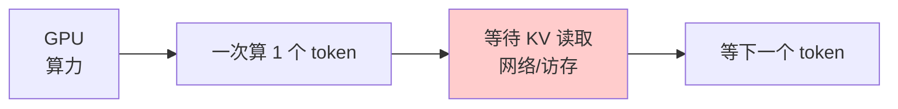

每次算 1 个 token，但 GPU 的算力足够**一次算 N 个 token**。**显存带宽（memory-bound）才是瓶颈**，不是算力。

### 4.2 投机解码：用小模型"猜"，大模型"验"

**Speculative Decoding (Leviathan et al. 2022, Chen et al. 2023)** 的核心思想：

1. **小模型（draft）** 先连续生成 K 个候选 token（很快，因为小）
2. **大模型（target）** 一次性并行验证这 K 个 token
3. 验证通过的 token 全部接受；不通过的回到标准采样

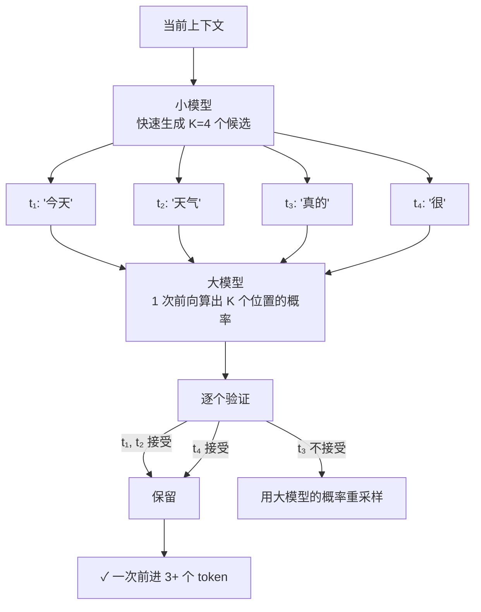

### 4.3 数学：验证条件

设大模型 `p`（target），小模型 `q`（draft）。在位置 i，小模型生成 `xᵢ`，大模型给的概率是 `p(xᵢ)`，小模型给的概率是 `q(xᵢ)`。

**接受条件**：以概率 `min(1, p(xᵢ) / q(xᵢ))` 接受小模型的猜测。

直觉：

- 如果大模型也认为这个 token 概率高（p ≈ q），接受
- 如果大模型觉得这个 token 不太可能（p < q），大概率拒绝
- 拒绝时用大模型的分布重新采样

**关键性质**：接受/拒绝的随机性保证了**最终输出分布与大模型独立采样完全一致**——加速但不改变生成质量。

### 4.4 接受率与加速比

加速比取决于"接受率 α"和"投机步数 K"：

```
加速比 ≈ 1 / ( (1/K) · (1 + 1/α) )       (粗略估计)
```

接受率 α 取决于两个模型的"匹配度"：

| 场景 | 接受率 | 加速比 |
|---|---|---|
| Draft = Target（同模型） | 1.0 | ≈ K |
| Draft ≈ Target（同家族小模型） | 0.7–0.9 | 2–3× |
| Draft ≪ Target | 0.3 | 1× 或更慢 |

实践中：

- **小模型选目标模型的 6B–7B 版本配 70B+ 大模型**（LLaMA-70B + LLaMA-7B）
- 投机步数 K = 4–8（典型 5）
- 实测加速 2–3×

### 4.5 实现（PyTorch toy）

```python
import torch
import torch.nn.functional as F

@torch.no_grad()
def speculative_step(target_model, draft_model, prompt_ids, K=4):
    """
    一次投机解码：draft 生成 K 个候选，target 验证。
    返回追加到 prompt_ids 的 token 序列。
    """
    # 1. draft 连续生成 K 个 token
    draft_ids = prompt_ids.clone()
    for _ in range(K):
        logits = draft_model(draft_ids)[:, -1, :]
        next_id = sample_from_logits(logits)
        draft_ids = torch.cat([draft_ids, next_id], dim=1)

    # 2. target 一次前向算出 K+1 个位置（含原始最后位置）
    full_logits = target_model(prompt_ids)  # (1, n, vocab)
    # 取最后 K+1 个位置的概率
    p = F.softmax(full_logits[0, -K-1:], dim=-1)  # (K+1, vocab)

    # 3. 逐个验证
    accepted = []
    for i in range(K):
        candidate = draft_ids[0, prompt_ids.size(1) + i].item()
        # 这里简化：用 p[i, candidate] 作为大模型概率
        # 实际还需 q 的概率做 min(1, p/q) 采样
        if torch.rand(()).item() < p[i, candidate].item() / 0.5:  # 假设 q ≈ 0.5
            accepted.append(candidate)
        else:
            # 重采样
            new_id = torch.multinomial(p[i], 1).item()
            accepted.append(new_id)
            break
    else:
        # 全部接受：再额外采样一个
        new_id = torch.multinomial(p[K], 1).item()
        accepted.append(new_id)

    return torch.tensor([accepted])
```

### 4.6 进阶变体

| 变体 | 思路 |
|---|---|
| **Self-Speculative** | 同一个模型，不同层（早期层 draft，后期层 target） |
| **Medusa** | 给目标模型加几个"预测头"并行预测后续 token |
| **EAGLE** | 用目标模型的 embedding 层做 draft |
| **Lookahead Decoding** | 一次生成多个候选路径 |

---

## 五、其他加速技术概览

### 5.1 连续批处理（Continuous Batching）

传统批处理的问题：等最慢的请求完成才返回。

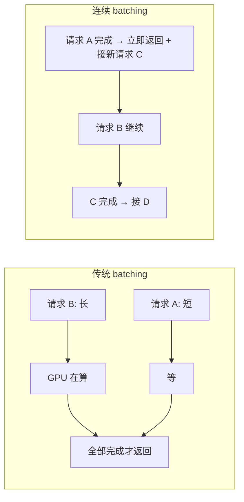

Continuous Batching 把一个 batch 内的请求**按 step 错开**：每个 step 处理一个时间片，正在生成的请求进入下一时间片，已经完成的请求立刻被新请求替换。**GPU 几乎永远满载**，吞吐量提升 10–20×。

代表：**vLLM**、TGI、SGLang 都用了类似思想。

### 5.2 PagedAttention（vLLM 核心）

传统 KV-Cache 的问题：连续预分配最大长度的内存，**碎片化严重**。

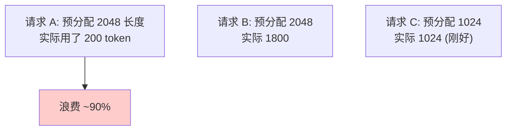

PagedAttention 借鉴操作系统的**虚拟内存 + 分页**：

- KV-Cache 切成固定大小的 block（典型 16 token / block）
- 不需要连续内存，可以分散在不同物理页
- 用 block table 做"虚拟地址 → 物理地址"映射

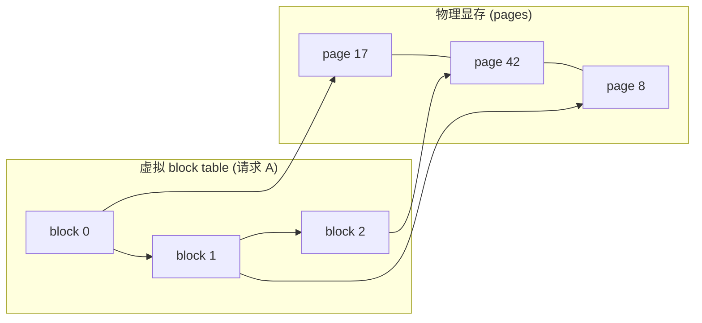

效果：内存利用率从 ~30% 提升到 **80%+**。vLLM 论文报告 4–24× 吞吐提升。

### 5.3 FlashAttention

观察：Attention 计算是**memory-bound**（读写 HBM 慢），不是 compute-bound（GPU 算力没用满）。

FlashAttention 的思路：**永远不在 HBM 里存中间结果**，直接在 GPU SRAM（片上缓存，快 10×）里算完 softmax。

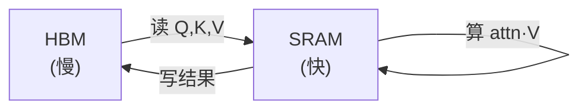

数学结果完全一致，但**访存次数从 O(n²) 降到 O(n)**。长序列加速尤其明显（8K token 时约 3–5×）。

**FlashAttention-2/3** 还引入了更好的 work partitioning、async copy 等技术，进一步逼近硬件极限。

| 版本 | 速度（A100, fp16） |
|---|---|
| 标准 PyTorch | 1× |
| FlashAttention | 2–4× |
| FlashAttention-2 | 4–8× |

### 5.4 推理框架对照

| 框架 | 核心优化 | 适用场景 |
|---|---|---|
| **vLLM** | PagedAttention + Continuous Batching | 通用、高吞吐服务 |
| **TGI** | Rust 核心、continuous batching | HF 生态、生产部署 |
| **TensorRT-LLM** | 编译优化、In-flight batching、INT4/FP8 | NVIDIA GPU、低延迟 |
| **DeepSpeed-MII** | 多种优化集成 | Azure / 微软生态 |
| **SGLang** | RadixAttention（共享前缀） | 多轮对话、复杂 prompt |
| **llama.cpp** | 量化、CPU/GPU 混合 | 端侧、低资源 |

---

## 六、总结与延伸

### 6.1 一图回顾

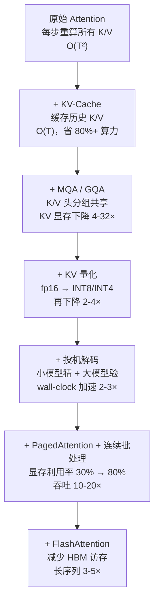

### 6.2 技术选型速查

| 需求 | 推荐技术 |
|---|---|
| 长上下文（>32K） | GQA + KV 量化（INT8/INT4） |
| 高吞吐服务 | vLLM / TGI（连续批处理 + PagedAttention） |
| 低延迟单请求 | TensorRT-LLM + 投机解码 |
| 端侧 / 资源受限 | llama.cpp + INT4 量化 |
| 训练研究 | 基础 KV-Cache + FlashAttention |

### 6.3 关键数字

- **KV-Cache**：O(T²) → O(T)，**算力下降 1–2 个数量级**
- **GQA-8**：KV 显存降到 1/8
- **INT8 KV**：再降 1/2；**INT4 KV**：再降 1/2
- **投机解码（接受率 0.7）**：wall-clock 加速 ~2×；**接受率 0.9**：~3×
- **vLLM PagedAttention**：吞吐提升 4–24×
- **FlashAttention**：长序列 3–5×

### 6.4 延伸阅读

- 论文：[**FlashAttention**](https://arxiv.org/abs/2205.14135)
- 论文：[**Fast Inference from Transformers via Speculative Decoding**](https://arxiv.org/abs/2211.17192)
- 论文：[**GQA: Training Generalized Multi-Query Transformer Models from Multi-Head Checkpoints**](https://arxiv.org/abs/2305.13245)
- 论文：[**Efficient Memory Management for Large Language Model Serving with PagedAttention (vLLM)**](https://arxiv.org/abs/2309.06180)
- 论文：[**LLM.int8()**](https://arxiv.org/abs/2208.07339)
- 配套：上篇 [**Transformer 与 LLM 原理**](/posts/transformer-and-llm-architecture)

---

*LLM 推理优化是一个"压榨硬件极限"的工程领域——每一个百分点加速都对应着几百万美元的服务成本节省。下一步值得关注的趋势：MoE 架构、状态空间模型（SSM/Mamba）替代 Attention、超长上下文的 KV 压缩（如 StreamingLLM）。*
