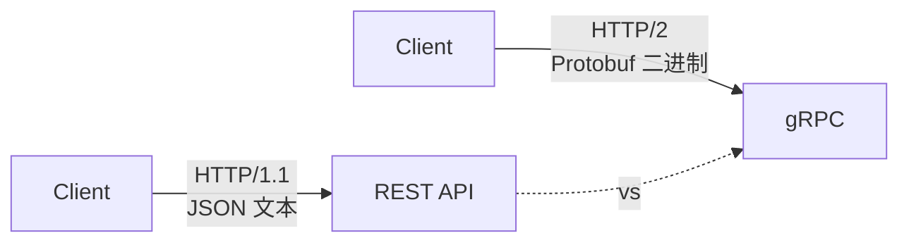
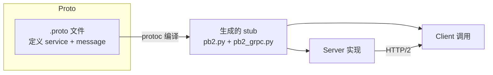
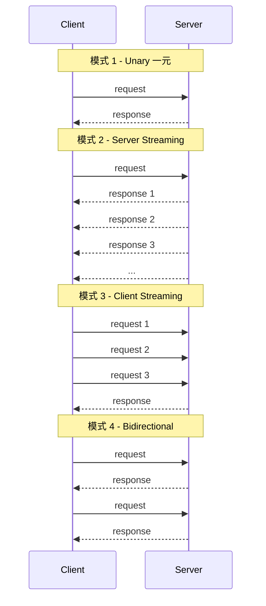

> gRPC 是 Google 开源的高性能 RPC 框架,基于 HTTP/2 + Protocol Buffers,在微服务、移动端、低延迟场景几乎是默认选择。本文用一份**可运行**的 `greeter` 服务走通完整流程,然后扩展到流式 RPC、错误处理、鉴权、拦截器,最后给生产环境的最佳实践。
>
> 适用读者:用过 REST API、想了解 gRPC 优势或正在做服务间通信选型的 Python 后端工程师。

## 〇、目录

- [1. gRPC vs REST:为什么用它](#1-grpc-vs-rest为什么用它)
- [2. 核心概念 30 秒](#2-核心概念-30-秒)
- [3. 环境准备](#3-环境准备)
- [4. 定义第一个 .proto 文件](#4-定义第一个-proto-文件)
- [5. 生成 Python 代码](#5-生成-python-代码)
- [6. 实现 Server](#6-实现-server)
- [7. 实现 Client](#7-实现-client)
- [8. 四类 RPC 模式](#8-四类-rpc-模式)
- [9. 错误处理与 Status Code](#9-错误处理与-status-code)
- [10. 鉴权:TLS + Metadata Token](#10-鉴权tls--metadata-token)
- [11. 拦截器(Interceptor)](#11-拦截器interceptor)
- [12. 异步(AsyncIO)版本](#12-异步asyncio-版本)
- [13. 可观测性:Trace + Logging](#13-可观测性trace--logging)
- [14. 生产最佳实践](#14-生产最佳实践)
- [15. 速查清单](#15-速查清单)

---

## 1. gRPC vs REST:为什么用它



| 维度 | REST + JSON | gRPC + Protobuf |
|------|-------------|-----------------|
| 传输 | HTTP/1.1 (文本) | **HTTP/2** (二进制,多路复用) |
| 序列化 | JSON (可读但臃肿) | **Protobuf** (小 3-10×,快 5-100×) |
| 契约 | OpenAPI(可选) | **.proto(强制)** |
| 流式 | 需 WebSocket / SSE | **原生 4 种流** |
| 性能 | 一般 | **极快** |
| 可读性 | ⭐⭐⭐(curl 就能调) | ⭐(需要工具如 grpcurl) |
| 浏览器 | ⭐⭐⭐(直接 fetch) | ⭐(需 grpc-web 代理) |
| 适用 | 对外 API、CRUD | **服务间通信、移动端、低延迟** |

> **经验法则**:对外的 API 用 REST,服务内部用 gRPC。如果一个项目从零开始全栈 gRPC,加 grpc-web 也能让浏览器调,但配置成本不低。

---

## 2. 核心概念 30 秒



- **`.proto`**: 用 IDL 定义 service(接口)和 message(数据结构),一份契约两端共用
- **`protoc`**: Protobuf 编译器,`.proto` → 各语言代码
- **Stub**: 生成出来的客户端基类(`GreeterStub`)和服务端基类(`GreeterServicer`)
- **Channel**: 客户端到服务端的连接,基于 HTTP/2
- **Metadata**: 类似 HTTP Header 的 key-value 对,用来传 token、trace id 等
- **Interceptor**: 中间件,可在调用前后插入逻辑(鉴权、日志、重试)

---

## 3. 环境准备

```bash
# Python 库(核心 + 编译工具)
pip install grpcio grpcio-tools

# 验证
python -c "import grpc; print(grpc.__version__)"
```

`grpcio` 是运行时,`grpcio-tools` 里包含 `protoc` + Python 生成插件。**生产环境**只装 `grpcio`,**开发环境**装两者。

---

## 4. 定义第一个 .proto 文件

新建 `protos/hello.proto`:

```protobuf
syntax = "proto3";                  // 必须,proto3 是当前主流

package helloworld;                  // 防命名冲突

// ── 选项 ──
option py_generic_services = true;  // 兼容性选项(grpc 1.49+ 已无必要)

// ── 数据结构 ──
message HelloRequest {
  string name = 1;                   // 字段编号(用于二进制编码),1-15 用 1 字节
  int32  age  = 2;                   // 16-2047 用 2 字节,越往后越大
}

message HelloReply {
  string message = 1;
  int64  server_time = 2;            // 服务器时间戳
}

// ── 服务 ──
service Greeter {
  // 一元 RPC:客户端发一个,服务端返回一个
  rpc SayHello (HelloRequest) returns (HelloReply);
}
```

**字段编号一旦定下来,永远不要改**——它就是二进制协议的"身份证",改了线上就崩。新增字段用新编号,废弃字段标 `reserved`:

```protobuf
message HelloRequest {
  reserved 3, 5 to 10;              // 这些编号被永久占用,即使删字段也不能复用
  reserved "old_field";
  string name = 1;
  int32  age  = 2;
  string email = 11;                 // 新字段用新编号
}
```

---

## 5. 生成 Python 代码

```bash
# 把 hello.proto 编成 hello_pb2.py(消息类) + hello_pb2_grpc.py(服务端/客户端基类)
python -m grpc_tools.protoc \
  -I protos \
  --python_out=. \
  --grpc_python_out=. \
  protos/hello.proto
```

生成两个文件:
- `hello_pb2.py` — `HelloRequest` / `HelloReply` 等消息类
- `hello_pb2_grpc.py` — `GreeterStub`(客户端)+ `GreeterServicer`(服务端抽象类)

> 生成的代码**不要手改**,每次改 .proto 重新生成覆盖。

### 项目目录推荐

```
project/
├── protos/
│   └── hello.proto
├── gen/                  # 生成代码(建议加 .gitignore 或干脆 commit)
│   ├── hello_pb2.py
│   └── hello_pb2_grpc.py
├── server.py
├── client.py
└── README.md
```

把生成代码放单独目录,业务代码从 `gen/` import:

```python
# 把 gen/ 当作 package
touch gen/__init__.py
```

---

## 6. 实现 Server

`server.py`:

```python
import logging
import time
from concurrent import futures

import grpc

from gen import hello_pb2, hello_pb2_grpc


class GreeterServicer(hello_pb2_grpc.GreeterServicer):
    """实现 .proto 里定义的 Greeter 服务"""

    def SayHello(self, request, context):
        # request  是 HelloRequest 实例
        # context  用来读 metadata、设 status code、abort 等
        logging.info("Received: name=%s age=%d", request.name, request.age)

        # 业务校验(失败抛 abort)
        if not request.name:
            context.set_code(grpc.StatusCode.INVALID_ARGUMENT)
            context.set_details("name 不能为空")
            raise grpc.RpcError()  # 实际不会执行到这里

        return hello_pb2.HelloReply(
            message=f"你好,{request.name}!",
            server_time=int(time.time() * 1000),
        )


def serve():
    logging.basicConfig(level=logging.INFO)
    server = grpc.server(futures.ThreadPoolExecutor(max_workers=10))
    hello_pb2_grpc.add_GreeterServicer_to_server(GreeterServicer(), server)

    # 监听:本地 50051 端口,明文(开发用)
    server.add_insecure_port("[::]:50051")
    server.start()
    logging.info("Server started on :50051")
    server.wait_for_termination()


if __name__ == "__main__":
    serve()
```

跑起来:

```bash
python server.py
# Server started on :50051
```

---

## 7. 实现 Client

`client.py`:

```python
import logging
import grpc

from gen import hello_pb2, hello_pb2_grpc


def run():
    with grpc.insecure_channel("localhost:50051") as channel:
        stub = hello_pb2_grpc.GreeterStub(channel)

        try:
            response = stub.SayHello(
                hello_pb2.HelloRequest(name="Hans", age=30)
            )
            print(f"Server said: {response.message}")
            print(f"Server time: {response.server_time}")
        except grpc.RpcError as e:
            print(f"gRPC error: {e.code()} - {e.details()}")


if __name__ == "__main__":
    logging.basicConfig(level=logging.INFO)
    run()
```

跑:

```bash
python client.py
# Server said: 你好,Hans!
# Server time: 1752057600000
```

`grpc.insecure_channel`/`add_insecure_port` 是**明文 HTTP/2**,只用于本地开发。生产见 §10。

---

## 8. 四类 RPC 模式

gRPC 一共支持 4 种通信模式,远超 REST 的"一问一答":



### 8.1 在 .proto 里定义

```protobuf
service Greeter {
  // 1. 一元
  rpc SayHello      (HelloRequest)              returns (HelloReply);

  // 2. 服务端流(参数用 stream 标记)
  rpc LotsOfReplies (HelloRequest)              returns (stream HelloReply);

  // 3. 客户端流(返回值用 stream 标记)
  rpc LotsOfGreetings(stream HelloRequest)      returns (HelloReply);

  // 4. 双向流(两边都 stream)
  rpc BidiHello     (stream HelloRequest)       returns (stream HelloReply);
}
```

### 8.2 服务端实现

```python
class GreeterServicer(hello_pb2_grpc.GreeterServicer):

    def SayHello(self, request, context):
        return hello_pb2.HelloReply(message=f"hi {request.name}")

    def LotsOfReplies(self, request, context):
        """服务端流:返回多个"""
        for i in range(5):
            yield hello_pb2.HelloReply(message=f"reply {i} for {request.name}")
            time.sleep(1)

    def LotsOfGreetings(self, request_iterator, context):
        """客户端流:聚合多个请求"""
        names = []
        for req in request_iterator:
            names.append(req.name)
        return hello_pb2.HelloReply(message=f"hi {','.join(names)}")

    def BidiHello(self, request_iterator, context):
        """双向流:每收到一个就回一个"""
        for req in request_iterator:
            yield hello_pb2.HelloReply(message=f"echo: {req.name}")
```

### 8.3 客户端调用

```python
# 1. 一元:同 §7
stub.SayHello(req)

# 2. 服务端流:用 for 循环消费
for reply in stub.LotsOfReplies(req):
    print(reply.message)

# 3. 客户端流:用生成器/yield 发送
def gen():
    for name in ["a", "b", "c"]:
        yield hello_pb2.HelloRequest(name=name)
reply = stub.LotsOfGreetings(gen())

# 4. 双向流:发送一个生成器,迭代返回的迭代器
def send():
    for i in range(3):
        yield hello_pb2.HelloRequest(name=f"msg{i}")
for reply in stub.BidiHello(send()):
    print(reply.message)
```

---

## 9. 错误处理与 Status Code

gRPC 有标准化的错误码,跨语言一致:

| Code | 数字 | 含义 |
|------|------|------|
| `OK` | 0 | 成功 |
| `CANCELLED` | 1 | 客户端取消 |
| `UNKNOWN` | 2 | 未知错误 |
| `INVALID_ARGUMENT` | 3 | 参数不合法 |
| `DEADLINE_EXCEEDED` | 4 | 超时 |
| `NOT_FOUND` | 5 | 资源不存在 |
| `ALREADY_EXISTS` | 6 | 重复创建 |
| `PERMISSION_DENIED` | 7 | 权限不足 |
| `UNAUTHENTICATED` | 16 | 未认证 |
| `INTERNAL` | 13 | 内部错误 |
| `UNAVAILABLE` | 14 | 服务不可用 |

### 9.1 服务端 abort

```python
from grpc import StatusCode

def SayHello(self, request, context):
    if request.age < 0:
        context.abort(
            StatusCode.INVALID_ARGUMENT,
            f"age 不能小于 0,收到 {request.age}",
        )
        # abort 直接抛异常返回,不会执行到 return
    if not self._user_exists(request.name):
        context.abort(StatusCode.NOT_FOUND, f"user '{request.name}' not found")
    return hello_pb2.HelloReply(message=f"hi {request.name}")
```

### 9.2 客户端捕获

```python
try:
    response = stub.SayHello(req)
except grpc.RpcError as e:
    # e.code()    → grpc.StatusCode 枚举
    # e.details() → 字符串描述
    # e.debug_error_string() → 详细调试信息
    if e.code() == grpc.StatusCode.NOT_FOUND:
        print("用户不存在")
    else:
        print(f"调用失败: {e.code().name} - {e.details()}")
```

### 9.3 自定义错误详情(protobuf Any)

如果只 status code + string 不够,可以塞结构化数据:

```python
from google.protobuf import any_pb2
from google.rpc import error_details_pb2

# 在 context 里塞 metadata
context.set_trailing_metadata([
    ("error-reason", "user_banned"),
])
```

或者用 [`google.rpc.Status`](https://github.com/googleapis/googleapis/blob/master/google/rpc/status.proto) 配合 Any。Python 端可以直接 `e.trailing_metadata()` 拿到。

---

## 10. 鉴权:TLS + Metadata Token

### 10.1 TLS(必须)

明文 `insecure_channel` 等于把数据裸着发,**生产环境禁用**。

```bash
# 自签证书(开发用)
openssl req -x509 -newkey rsa:4096 -nodes \
  -keyout server.key -out server.crt \
  -days 365 -subj "/CN=localhost"
```

```python
# Server 端
with open("server.key", "rb") as f:
    private_key = f.read()
with open("server.crt", "rb") as f:
    certificate_chain = f.read()

server_credentials = grpc.ssl_server_credentials([
    (private_key, certificate_chain),
])
server.add_secure_port("[::]:50051", server_credentials)

# Client 端
with open("server.crt", "rb") as f:
    cert = f.read()
channel_credentials = grpc.ssl_channel_credentials(cert)
with grpc.secure_channel("localhost:50051", channel_credentials) as ch:
    ...
```

**生产环境**用 Let's Encrypt 或内部 PKI 颁发的证书。

### 10.2 Token 鉴权(Metadata)

最常见的鉴权模式是 **JWT/Bearer Token**,塞到 metadata 里:

```python
# ── Client:塞 token 到 metadata ──
TOKEN = "eyJhbGciOiJIUzI1NiIs..."  # 从 SSO 拿到的 JWT

metadata = (("authorization", f"Bearer {TOKEN}"),)
response = stub.SayHello(req, metadata=metadata)


# ── Server:从 context 读 metadata ──
import grpc
from grpc import StatusCode

def _verify(token: str) -> bool:
    # 调 JWT lib 验签,查过期,查黑名单...
    return True

class GreeterServicer(hello_pb2_grpc.GreeterServicer):
    def SayHello(self, request, context):
        # metadata 是 tuple of (key, value)
        md = dict(context.invocation_metadata())
        token = md.get("authorization", "").removeprefix("Bearer ")
        if not _verify(token):
            context.abort(StatusCode.UNAUTHENTICATED, "invalid token")
        return hello_pb2.HelloReply(message=f"hi {request.name}")
```

`context.invocation_metadata()` 拿到客户端发的 header,`context.set_trailing_metadata(...)` 回给客户端。

---

## 11. 拦截器(Interceptor)

拦截器就是 gRPC 的"中间件",用来横切鉴权/日志/重试/trace。

### 11.1 客户端拦截器

```python
import grpc


class AuthClientInterceptor(
    grpc.UnaryUnaryClientInterceptor,
    grpc.UnaryStreamClientInterceptor,
):
    """自动给每个 RPC 调用塞 Bearer Token"""

    def __init__(self, token_getter):
        self._token_getter = token_getter

    def _add_auth(self, client_call_details):
        md = list(client_call_details.metadata or [])
        md.append(("authorization", f"Bearer {self._token_getter()}"))
        return client_call_details._replace(metadata=md)

    # 一元 → 一元
    def intercept_unary_unary(self, continuation, client_call_details, request):
        return continuation(self._add_auth(client_call_details), request)

    # 一元 → 流(其他三种模式类似)
    def intercept_unary_stream(self, continuation, client_call_details, request):
        return continuation(self._add_auth(client_call_details), request)


# 用法
token_getter = lambda: "my-jwt-token"
channel = grpc.insecure_channel("localhost:50051")
intercepted_channel = grpc.intercept_channel(channel, AuthClientInterceptor(token_getter))
stub = hello_pb2_grpc.GreeterStub(intercepted_channel)
# 现在 stub.SayHello(req) 自动带 token
```

四种 RPC 模式对应四种拦截器方法:
- `intercept_unary_unary`
- `intercept_unary_stream`
- `intercept_stream_unary`
- `intercept_stream_stream`

可以都实现,也可以只实现你用到的。

### 11.2 服务端拦截器

```python
import grpc
from grpc import StatusCode


class LoggingServerInterceptor(grpc.ServerInterceptor):
    """服务端:每个 RPC 调用前后打 log"""

    def intercept_service(self, continuation, handler_call_details):
        method = handler_call_details.method
        print(f"→ {method}")
        try:
            response = continuation(handler_call_details)
            print(f"← {method} OK")
            return response
        except Exception as e:
            print(f"← {method} ERROR: {e}")
            raise


server = grpc.server(
    futures.ThreadPoolExecutor(max_workers=10),
    interceptors=(LoggingServerInterceptor(),),  # ← 这里塞
)
```

服务端拦截器更强大——可以**直接拦截请求不进入 handler**(做 IP 白名单、限流等)。

---

## 12. 异步(AsyncIO)版本

高并发场景用 `grpc.aio`,基于 asyncio:

```python
# ── Async Server ──
import asyncio
import grpc

from gen import hello_pb2, hello_pb2_grpc


class GreeterServicer(hello_pb2_grpc.GreeterServicer):
    async def SayHello(self, request, context):
        # 注意:context 是 ServicerContext
        # 用 context.set_code / abort / invocation_metadata 都一样
        return hello_pb2.HelloReply(
            message=f"async hi {request.name}",
        )


async def serve():
    server = grpc.aio.server()
    hello_pb2_grpc.add_GreeterServicer_to_server(GreeterServicer(), server)
    server.add_insecure_port("[::]:50051")
    await server.start()
    print("Async server on :50051")
    await server.wait_for_termination()


# ── Async Client ──
async def run():
    async with grpc.aio.insecure_channel("localhost:50051") as channel:
        stub = hello_pb2_grpc.GreeterStub(channel)
        response = await stub.SayHello(hello_pb2.HelloRequest(name="Hans"))
        print(response.message)


# ── 入口 ──
if __name__ == "__main__":
    asyncio.run(serve())
```

**优势**:一个线程处理上千并发连接,不像同步 `ThreadPoolExecutor` 要为每个连接起一个线程。

**注意**:同步 `grpc` 和异步 `grpc.aio` 用的 server **不能混**——服务端要么全同步要么全异步。客户端可以分别连接。

---

## 13. 可观测性:Trace + Logging

### 13.1 用 OpenTelemetry

```bash
pip install opentelemetry-api \
            opentelemetry-sdk \
            opentelemetry-instrumentation-grpc
```

```python
# 服务端
from opentelemetry import trace
from opentelemetry.sdk.trace import TracerProvider
from opentelemetry.sdk.trace.export import BatchSpanProcessor, ConsoleSpanExporter
from opentelemetry.instrumentation.grpc import GrpcInstrumentorServer

trace.set_tracer_provider(TracerProvider())
trace.get_tracer_provider().add_span_processor(
    BatchSpanProcessor(ConsoleSpanExporter())
)

server = grpc.server(futures.ThreadPoolExecutor(max_workers=10))
GrpcInstrumentorServer().instrument_server(server)
# 之后每个 RPC 自动产生 trace span,带 method / status / 时长
```

OpenTelemetry 的 gRPC 拦截器会自动给每个 RPC 加 span,带 `rpc.system=grpc`、`rpc.service`、`rpc.method` 等标准属性,可以无缝对接 Jaeger / Tempo / Zipkin。

### 13.2 Prometheus metrics

```python
from prometheus_client import Counter, Histogram, start_http_server

rpc_calls = Counter(
    "grpc_server_calls_total",
    "Total gRPC calls",
    ["method", "status"],
)
rpc_latency = Histogram(
    "grpc_server_latency_seconds",
    "gRPC call latency",
    ["method"],
)


class MetricsInterceptor(grpc.ServerInterceptor):
    def intercept_service(self, continuation, handler_call_details):
        method = handler_call_details.method
        with rpc_latency.labels(method=method).time():
            try:
                response = continuation(handler_call_details)
                rpc_calls.labels(method=method, status="OK").inc()
                return response
            except Exception:
                rpc_calls.labels(method=method, status="ERROR").inc()
                raise


# 启动 Prometheus 抓取端点
start_http_server(8000)
```

---

## 14. 生产最佳实践

### 14.1 必做清单

- [ ] **永远用 TLS**(`secure_channel` / `ssl_server_credentials`),`insecure_*` 只限本地
- [ ] **设 deadline**:`stub.SayHello(req, timeout=2.0)`,防止服务端卡死拖垮客户端
- [ ] **用 channel pool**:高频调用别每次新建 channel,复用一个长连接
- [ ] **健康检查**:实现 `grpc.health.v1.Health` 服务,k8s 会自动用它判断 pod 状态
- [ ] **优雅关停**:捕获 `SIGTERM` → `server.stop(grace=5)`,让正在处理的请求跑完
- [ ] **限流**:用 interceptor + token bucket,防止一个客户端打爆服务端
- [ ] **重试**:`grpc.enable_retries()` 或业务层显式重试(注意幂等性)
- [ ] **生成代码不手改**:`.proto` 才是 source of truth,生成的 `.py` 可以 commit 但不手改

### 14.2 健康检查示例

```python
from grpc_health.v1 import health, health_pb2, health_pb2_grpc

health_servicer = health.HealthServicer()
health_pb2_grpc.add_HealthServicer_to_server(health_servicer, server)
health_servicer.set("", health_pb2.HealthCheckResponse.SERVING)
health_servicer.set("helloworld.Greeter", health_pb2.HealthCheckResponse.SERVING)
```

```python
# k8s readinessProbe 配置
readinessProbe:
  exec:
    command: ["/bin/grpc_health_probe", "-addr=:50051"]
  initialDelaySeconds: 5
```

### 14.3 优雅关停

```python
def serve():
    server = grpc.server(futures.ThreadPoolExecutor(max_workers=10))
    hello_pb2_grpc.add_GreeterServicer_to_server(GreeterServicer(), server)
    server.add_insecure_port("[::]:50051")
    server.start()

    import signal
    def shutdown(signum, frame):
        logging.info("Shutting down...")
        # 5s 宽限:正在处理的 RPC 跑完,新请求直接拒绝
        stopped = server.stop(grace=5).wait()
        logging.info("Stopped")

    signal.signal(signal.SIGTERM, shutdown)
    signal.signal(signal.SIGINT, shutdown)
    server.wait_for_termination()
```

### 14.4 deadline

```python
# 客户端:总耗时 2 秒,超过就 DEADLINE_EXCEEDED
try:
    response = stub.SayHello(req, timeout=2.0)
except grpc.RpcError as e:
    if e.code() == grpc.StatusCode.DEADLINE_EXCEEDED:
        print("调用超时")
```

```python
# 服务端:知道客户端给的 deadline,主动检查剩余时间
def SlowMethod(self, request, context):
    remaining = context.time_remaining()
    if remaining < 0.5:
        context.abort(grpc.StatusCode.DEADLINE_EXCEEDED, "too late")
    # ... 处理逻辑 ...
```

### 14.5 常见踩坑

| 坑 | 现象 | 修法 |
|----|------|------|
| 改 .proto 字段编号 | 老客户端解析新消息全错 | **字段编号永不重用**,废弃用 `reserved` |
| 同步/异步混用 | `RuntimeError: Cannot use sync stub on async channel` | 客户端分开,server 统一(全 sync 或全 async) |
| 复用 channel | 高并发下 channel 是瓶颈 | 一个进程一个 channel,跨线程/协程安全 |
| 没设 deadline | 服务端卡死后客户端永久等 | 所有调用必须带 `timeout` |
| `insecure_*` 上生产 | 数据裸奔 | 一律 TLS |
| protoc 版本不匹配 | 生成的代码跑不起来 | `grpcio-tools` 装哪个版本就编哪个版本的 .proto |

---

## 15. 速查清单

```text
# ── 安装 ──
pip install grpcio grpcio-tools
pip install grpcio-health-checking   # 可选:健康检查
pip install opentelemetry-instrumentation-grpc  # 可选:trace

# ── 编译 ──
python -m grpc_tools.protoc \
  -I protos \
  --python_out=. \
  --grpc_python_out=. \
  protos/*.proto

# ── Server 骨架 ──
server = grpc.server(ThreadPoolExecutor(max_workers=10))
add_MyServicer_to_server(impl, server)
server.add_insecure_port("[::]:50051")     # 开发
# server.add_secure_port("[::]:50051", ssl_creds)  # 生产
server.start()
server.wait_for_termination()

# ── Client 骨架 ──
with grpc.insecure_channel("host:50051") as ch:
    stub = MyServiceStub(ch)
    response = stub.MyMethod(req, timeout=2.0)

# ── 流 ──
stub.ServerStream(req)              → iterator[Response]
stub.ClientStream(iter([req, ...]))  → Response
stub.BidiStream(iter([req, ...]))    → iterator[Response]

# ── 错误 ──
context.abort(StatusCode.NOT_FOUND, "msg")
try: stub.X(req)
except grpc.RpcError as e: e.code(), e.details()

# ── Metadata ──
md = dict(context.invocation_metadata())
context.set_trailing_metadata([("k", "v")])

# ── Async ──
grpc.aio.server()
grpc.aio.insecure_channel(...)
await stub.MyMethod(req)
```

---

## 附:本文涉及的官方资源

| 资源 | 链接 |
|------|------|
| gRPC 官方文档 | https://grpc.io/docs/languages/python/ |
| Protobuf proto3 指南 | https://protobuf.dev/programming-guides/proto3/ |
| Status codes | https://grpc.io/docs/guides/status-codes/ |
| gRPC health checking | https://github.com/grpc/grpc/blob/master/doc/health-checking.md |
| OpenTelemetry gRPC | https://opentelemetry.io/docs/languages/python/instrumentation/#grpc |
| gRPC Python API 参考 | https://grpc.github.io/grpc/python/ |

---

## 附:一个完整可跑的 demo 项目结构

```
grpc-demo/
├── protos/
│   └── hello.proto
├── gen/
│   ├── __init__.py
│   ├── hello_pb2.py          # ← 编译生成
│   └── hello_pb2_grpc.py     # ← 编译生成
├── server.py                 # ← 本文 §6
├── client.py                 # ← 本文 §7
├── requirements.txt          # grpcio / grpcio-tools
└── README.md
```

照着本文把代码粘过去就能跑——一个端到端可工作的 gRPC 服务,十分钟内搞定。