> Transformer 是过去 7 年深度学习最重要的架构创新——它不仅统一了 NLP，还把触角伸到了视觉、语音、生物乃至通用智能。本文从最朴素的"序列是什么"出发，沿着"为什么要 Attention → Attention 怎么算 → Transformer 长什么样 → LLM 怎么训出来"这条主线，把整条链路讲透。所有公式都用纯文本 + 表格呈现，关键流程配 Mermaid 图，注意力模块附完整可运行的 PyTorch 实现。

## 〇、写在前面

如果你打开 ChatGPT、文心一言、通义千问、DeepSeek 的"技术报告"，会发现一个共同点：底层都跑着同一种骨架——**Transformer**。这个 2017 年 Google 在论文 [《Attention Is All You Need》](https://arxiv.org/abs/1706.03762) 中提出的架构，彻底改变了序列建模的范式。

但从论文到能用、到 ChatGPT 那种水准的对话，**中间隔了 7 年的工程积累**：海量的预训练数据、几亿到几千亿参数的规模、RLHF/DPO 等对齐技术、KV-Cache 等推理优化……每一环都大有文章。

本文目标：

- **看图能懂**——所有抽象概念配 Mermaid 图。
- **看公式能算**——核心公式用纯文本 + 表格拆开，不靠数学排版。
- **看代码能跑**——Self-Attention 给出完整 PyTorch 实现，可直接 `python` 跑。
- **看全貌**——从 RNN 局限一路讲到 DPO 训练 + 推理采样。

读者画像：假设你**懂 Python**，**听说过张量、矩阵乘法、梯度下降**，但**没用过 Attention**。

---

## 一、序列建模的演化

### 1.1 什么是"序列"？

**序列（Sequence）** 是按某种顺序排列的一组元素。在 NLP 中，最典型的序列是**句子**——一串离散的 token（词或子词）：

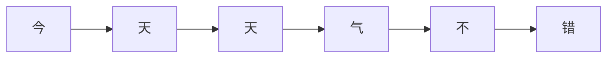

机器学习要处理序列，必须把它变成能算的**数字张量**。最朴素的方案是**独热编码**：

| 词 | 词表索引 | 独热向量 (词表大小 = 6) |
|---|---|---|
| 今 | 0 | [1, 0, 0, 0, 0, 0] |
| 天 | 1 | [0, 1, 0, 0, 0, 0] |
| 气 | 3 | [0, 0, 0, 1, 0, 0] |
| 不 | 4 | [0, 0, 0, 0, 1, 0] |
| 错 | 5 | [0, 0, 0, 0, 0, 1] |

独热向量又长又稀疏（50000 维只有一个 1）。实践中会先用一个**嵌入层（Embedding）** 把每个 token 投影到低维稠密空间，比如 512 维：

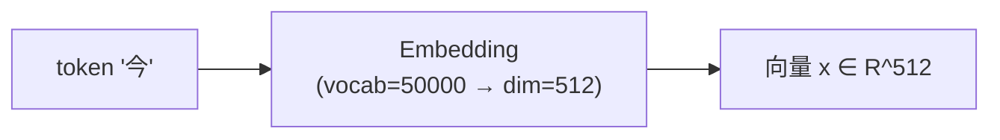

我们后面说的"序列建模"，目标就是：**给一串 token 嵌入 `x₁, x₂, …, xₙ`（n 通常几十到几万个），学出一个模型，能完成"翻译、问答、写代码"等任务。**

### 1.2 RNN/LSTM 及其局限

2017 年之前，序列建模的标配是 **RNN（循环神经网络）** 及其改进版 **LSTM/GRU**。核心思想一句话：**逐个 token 处理，每一步把上一步的"记忆"传下来。**

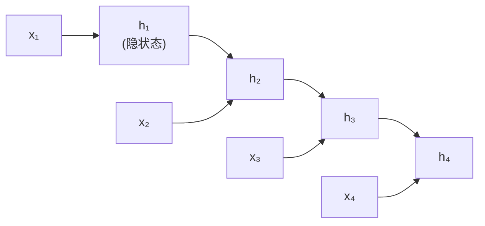

数学表达：

```
hₜ = f(W·hₜ₋₁ + U·xₜ + b)
```

其中 `hₜ` 是第 t 步的隐状态，`f` 是 tanh 或 ReLU 这种激活函数。整条序列的"信息"都被压进 `hₜ` 这个固定维度的向量里。

**RNN 的三大致命问题：**

| 问题 | 表现 | 后果 |
|---|---|---|
| **顺序依赖** | 第 t 步必须等 t-1 步算完 | GPU/TPU 无法并行，训练慢 |
| **长距离遗忘** | `hₜ` 容量固定，离得远的 token 信息被"稀释" | 100 个 token 之后，前面的内容基本丢了 |
| **梯度消失/爆炸** | 跨时间步反向传播，Jacobian 连乘 | 长序列训练不稳定 |

LSTM/GRU 通过门控机制（Gates）缓解了遗忘和梯度问题，但**顺序依赖**这条硬伤没法解决——因为计算图本身就是个链。

### 1.3 Seq2Seq + Attention：第一次"看一眼全部"

2014 年，Bahdanau 等人提出 **Seq2Seq + Attention**。核心改动：

1. 编码器仍然是 RNN，但**输出每一步的隐状态** `h₁, h₂, …, hₙ`（不只是最后那个）。
2. 解码器每生成一个 token 时，**对所有编码器隐状态做加权求和**，得到"上下文向量" `cₜ`。
3. 权重由"当前解码状态 vs 每个编码状态"算出来——这就是 **Attention** 的雏形。

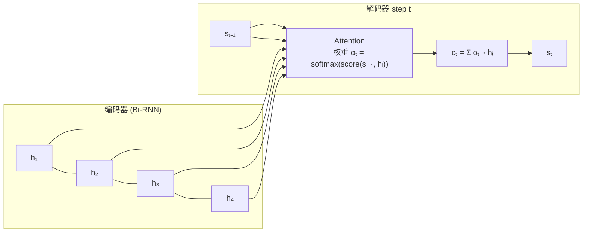

直觉：**解码器每一步都"看一眼"全部编码状态，然后重点关注跟当前生成相关的那些。** 但解码器本身还是 RNN，没解决顺序依赖。

Transformer 的大胆之处：**把 RNN 整个砍掉，Attention 自己扛全部。**

---

## 二、Self-Attention 机制

### 2.1 直观理解：键值对查找

先放下数学，从"查字典"的类比出发。

想象你有一段文本，想知道"每个词在上下文中应该被怎么表示"。最自然的方式：

> **让每个词去"问"序列里所有其他词："你跟我有多相关？"——然后把其他词的表示按相关度加权求和，当作自己新的表示。**

这就是 **Self-Attention（自注意力）** 的核心思想。Self = 序列自己对自己做 attention。

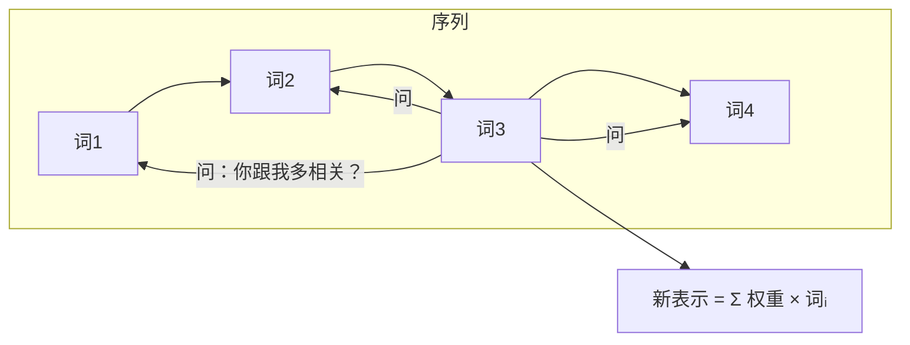

这跟数据库的**键值对查找**完全同构：

- **Key（键）**：每个词提供的"索引"，用来跟查询匹配。
- **Value（值）**：每个词提供的"内容"，是被取出的真正信息。
- **Query（查询）**：当前词提出的"问题"。

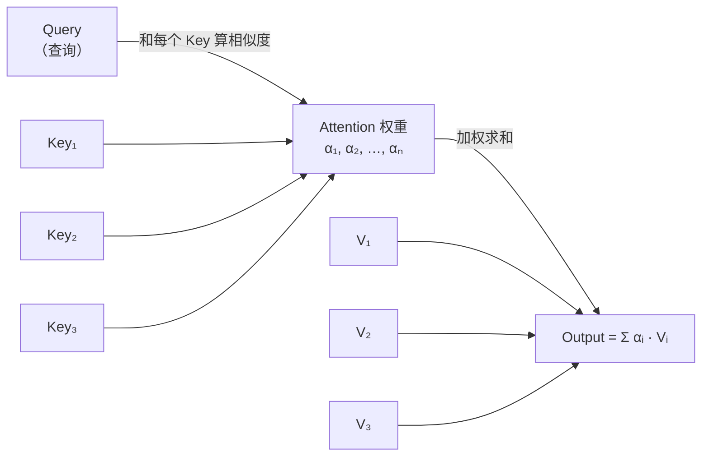

### 2.2 Q/K/V 从哪来？

每个 token 的输入是嵌入向量 `x ∈ R^d`。Self-Attention 把它线性变换出三份：

| 符号 | 公式 | 含义 |
|---|---|---|
| Query | `q = x · W_Q` | 当前 token 想"问"的内容 |
| Key | `k = x · W_K` | 当前 token 提供给别人的"索引" |
| Value | `v = x · W_V` | 当前 token 提供给别人的"内容" |

其中 `W_Q, W_K, W_V ∈ R^{d × d_k}` 是可学习的参数矩阵。

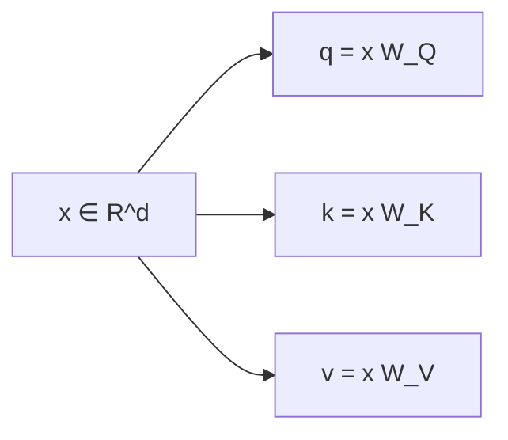

整个序列的 Q/K/V 矩阵就是把这三个操作对所有 token 同时做一遍（矩阵化）：

| 符号 | 形状 | 来源 |
|---|---|---|
| `Q` | `(n, d_k)` | `[q₁; q₂; …; qₙ]` |
| `K` | `(n, d_k)` | `[k₁; k₂; …; kₙ]` |
| `V` | `(n, d_k)` | `[v₁; v₂; …; vₙ]` |

### 2.3 缩放点积注意力（Scaled Dot-Product Attention）

把上面的类比写成公式：

```
步骤 1：算相似度   scores = Q · Kᵀ        (n × n) 矩阵
步骤 2：归一化     α = softmax(scores / √d_k)
步骤 3：加权求和   output = α · V          (n × d_k)
```

最终公式（**整个 Transformer 的核心**）：

```
Attention(Q, K, V) = softmax( Q · Kᵀ / √d_k ) · V
```

**为什么除以 `√d_k`？**

直觉：`Q · Kᵀ` 的方差大致是 `d_k`。当 `d_k` 很大（比如 128），`Q · Kᵀ` 的数值也会很大，导致 softmax 输出接近 one-hot——梯度几乎传不下去。除以 `√d_k` 把方差拉回 1，softmax 回到"有梯度"的甜区。

数学验证（假设 q、k 各分量独立、均值 0、方差 1）：

```
E[qᵢkᵢ] = 0,  Var[qᵢkᵢ] = 1
Var[Σᵢ qᵢkᵢ] = d_k
```

所以除以 `√d_k` 后方差归一。

### 2.4 因果掩码（Causal Mask）

上面的公式对**任意位置**的 token 都计算注意力——也就是说，位置 3 的 token 在算自己的新表示时，能"看到"位置 5 的 token。

这在做**编码器**（理解整个句子）时是合理的。但在**生成式 LLM** 中，训练时模型在位置 t 应该只能"看到"位置 ≤ t 的 token（不能偷看未来的答案）。

解决方案：**加一个上三角掩码**，把"未来位置"的注意力分数设成 `-∞`，softmax 之后就变成 0：

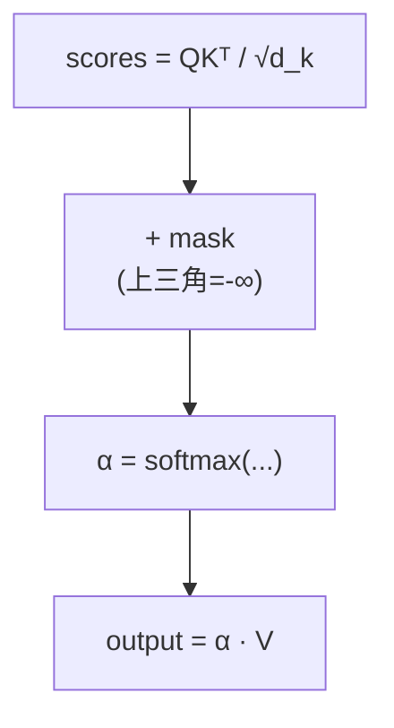

掩码矩阵（`n=4`，`■` 表示屏蔽）：

```
        key: 1   2   3   4
query 1:  0   ■   ■   ■
query 2:  0   0   ■   ■
query 3:  0   0   0   ■
query 4:  0   0   0   0
```

数学表达：

```
mask[i,j] = 0           if j ≤ i    （可见）
mask[i,j] = -∞          if j > i    （不可见）
scores_masked = scores + mask
```

### 2.5 多头注意力（Multi-Head Attention）

单头注意力有个问题：softmax 强制所有权重加起来 = 1，导致模型被迫在多个相关位置中"分摊"注意力。一个直观的想法：**让模型同时从多个"子空间"看，自己决定每个子空间关注什么。**

多头注意力 = h 个独立的 Self-Attention 头，结果拼起来再线性投影：

```
head_i = Attention(Q·W_Qⁱ, K·W_Kⁱ, V·W_Vⁱ)    i = 1..h
MultiHead(Q, K, V) = Concat(head_1, …, head_h) · W_O
```

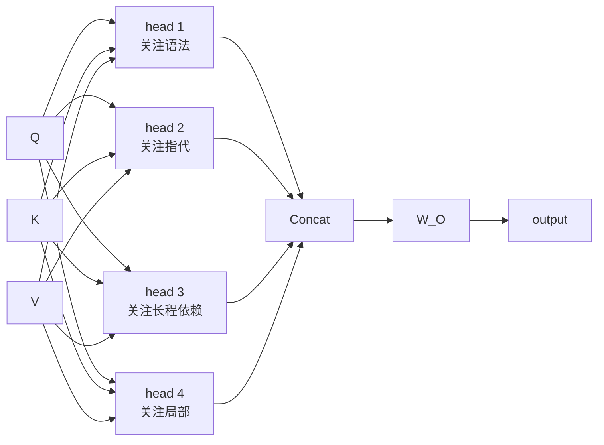

**关键设计**：总参数量跟单头一样。设 `d_k = d / h`（总维度按头数均分），这样 h 个头的拼接结果维度仍是 d。

直观上每个头会学到不同模式：

| 头 | 典型学习到的模式（来自文献观察） |
|---|---|
| 头 1 | 句法关系（主谓一致） |
| 头 2 | 指代消解（"it" 指代前文的哪个名词） |
| 头 3 | 局部短语结构（相邻 token 的搭配） |
| 头 4 | 远程依赖（隔了 100 个 token 的关联） |

具体哪个头学什么没人能控制，是训练中涌现的。

### 2.6 Self-Attention 的 PyTorch 完整实现

下面是单头带 Causal Mask 的 Self-Attention，可直接 `python` 跑：

```python
import torch
import torch.nn.functional as F

def self_attention(X, W_q, W_k, W_v, mask=None):
    """
    X:    (batch, n, d)     序列嵌入
    W_q:  (d, d_k)          Query 投影
    W_k:  (d, d_k)          Key 投影
    W_v:  (d, d_k)          Value 投影
    mask: (n, n) 或 (batch, n, n)，True 表示屏蔽
    """
    Q = X @ W_q              # (B, n, d_k)
    K = X @ W_k              # (B, n, d_k)
    V = X @ W_v              # (B, n, d_k)

    d_k = Q.size(-1)
    scores = (Q @ K.transpose(-2, -1)) / (d_k ** 0.5)   # (B, n, n)

    if mask is not None:
        scores = scores.masked_fill(mask, float("-inf"))

    attn = F.softmax(scores, dim=-1)   # (B, n, n)
    return attn @ V, attn               # 输出 + 注意力权重（可可视化）

# ---- 验证：随机输入 + 因果掩码 ----
torch.manual_seed(0)
B, n, d = 2, 5, 8
X = torch.randn(B, n, d)
W_q, W_k, W_v = [torch.randn(d, d) * 0.1 for _ in range(3)]

# 因果掩码：上三角 True 表示屏蔽
causal_mask = torch.triu(torch.ones(n, n, dtype=torch.bool), diagonal=1)

out, attn = self_attention(X, W_q, W_k, W_v, mask=causal_mask)
print("output shape:", out.shape)   # (2, 5, 8)
print("attn row 0 sums to:", attn[0, 0].sum().item())  # ≈ 1.0
print("attn[0,0,3] (看未来):", attn[0, 0, 3].item())   # 0.0
```

多头版本（生产代码就用这个）：

```python
class MultiHeadAttention(torch.nn.Module):
    def __init__(self, d_model, n_heads):
        super().__init__()
        assert d_model % n_heads == 0
        self.n_heads = n_heads
        self.d_k = d_model // n_heads
        self.W_q = torch.nn.Linear(d_model, d_model)
        self.W_k = torch.nn.Linear(d_model, d_model)
        self.W_v = torch.nn.Linear(d_model, d_model)
        self.W_o = torch.nn.Linear(d_model, d_model)

    def forward(self, X, mask=None):
        B, n, _ = X.shape
        # 投影 + 拆多头
        Q = self.W_q(X).view(B, n, self.n_heads, self.d_k).transpose(1, 2)
        K = self.W_k(X).view(B, n, self.n_heads, self.d_k).transpose(1, 2)
        V = self.W_v(X).view(B, n, self.n_heads, self.d_k).transpose(1, 2)
        # (B, h, n, d_k)

        scores = (Q @ K.transpose(-2, -1)) / (self.d_k ** 0.5)
        if mask is not None:
            scores = scores.masked_fill(mask, float("-inf"))
        attn = F.softmax(scores, dim=-1)

        out = (attn @ V).transpose(1, 2).contiguous().view(B, n, -1)
        return self.W_o(out)

# 测试
mha = MultiHeadAttention(d_model=64, n_heads=8)
X = torch.randn(2, 10, 64)
print(MultiHeadAttention(64, 8)(X).shape)   # (2, 10, 64)
```

---

## 三、Transformer 整体架构

Self-Attention 解决了"序列内部怎么互相看"的问题。但要搭一个能用的模型，还需要解决：

- **位置信息**：Attention 本身是**置换不变**的（输入打乱顺序结果一样），必须显式注入位置。
- **深度堆叠**：单层 Attention 学不到复杂模式，需要叠很多层。
- **非线性**：纯线性堆叠等价于一个大线性变换，需要 FFN 提供非线性。
- **训练稳定**：几十上百层的网络极易梯度爆炸/消失，需要残差 + Norm。

### 3.1 位置编码（Positional Encoding）

Attention 的 `QKᵀ` 计算只跟 token 之间的内容相似度有关，跟"位置 0"和"位置 5"无关。这意味着**如果打乱输入顺序，输出不变**——这对语言来说是灾难（"狗咬人"≠"人咬狗"）。

解决方案：把位置信息加到输入嵌入上。

**方案 1：正弦位置编码（原 Transformer）**

```
PE(pos, 2i)   = sin(pos / 10000^(2i/d))
PE(pos, 2i+1) = cos(pos / 10000^(2i/d))
```

其中 `pos` 是位置索引，`i` 是维度索引。每个维度对应不同频率的正弦波。

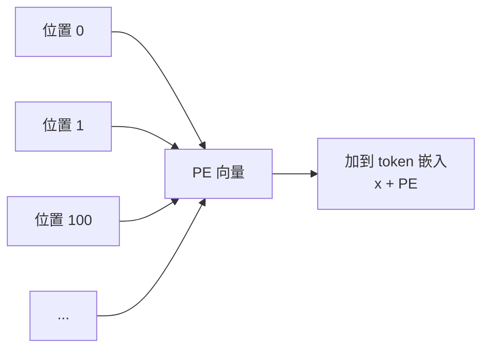

直觉：低维度（i 小）变化快（捕捉"相邻位置"差异），高维度（i 大）变化慢（捕捉"远距离"差异）。相对位置差可以通过三角恒等式从 PE 算出来。

**方案 2：可学习位置编码（GPT-2 等）**

直接把每个位置的 embedding 当参数学：`P ∈ R^{n_max × d}`。简单粗暴，n_max 受限于训练时见过的长度。

**方案 3：旋转位置编码 RoPE（现今主流）**

不把位置加到 embedding 上，而是**旋转** Q 和 K。对位置 m 的 q，旋转 m 角度；对位置 n 的 k，旋转 n 角度。两者内积自动只跟 (m-n) 有关——天然具备**相对位置**信息。

```
q̃ₘ = R(m) · qₘ       k̃ₙ = R(n) · kₙ
q̃ₘ · k̃ₙᵀ = qₘ · R(m-n) · kₙᵀ     ← 只跟相对位置 m-n 有关
```

LLaMA、Qwen、DeepSeek 等主流开源 LLM 全部用 RoPE。

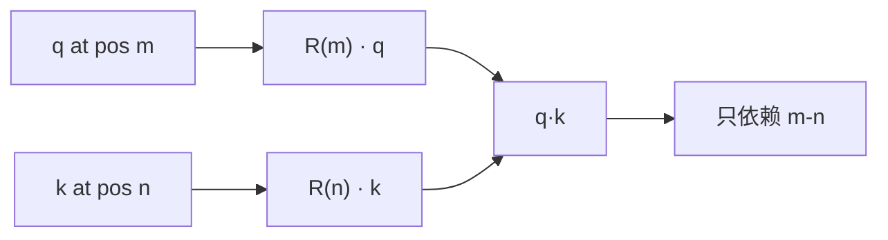

### 3.2 残差连接 + LayerNorm

直接堆几十层 Self-Attention，梯度会爆炸或消失。两个互补的机制：

**残差连接（Residual）**：把输入直接加到子层输出上：

```
output = Sublayer(x) + x
```

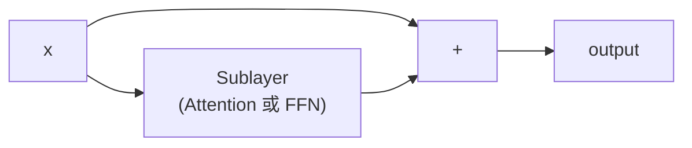

这样梯度可以直接走"短路"传回去，绕开复杂的子层。

**LayerNorm**：对每个 token 单独做归一化（不像 BatchNorm 跨样本归一化）：

```
LayerNorm(x) = γ · (x - μ) / σ + β
```

其中 μ、σ 是单个 token 在 d 维上的均值和标准差。这让训练对学习率不那么敏感。

Transformer 一层（block）的完整结构：

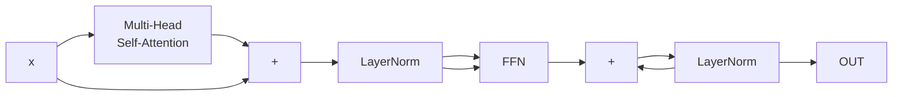

> 上面是 **Post-LN**（原始论文）。现代实现多用 **Pre-LN**（LN 在子层前），训练更稳定。

### 3.3 前馈网络（FFN）

每个 Transformer block 在 Attention 之后还有一个 **FFN（Feed-Forward Network）**——其实就是两层全连接 + 激活函数：

```
FFN(x) = W₂ · σ(W₁ · x + b₁) + b₂
```

其中 `W₁ ∈ R^{d × d_ff}`，`W₂ ∈ R^{d_ff × d}`，通常 `d_ff = 4d`。激活函数 `σ` 现在基本都用 **SwiGLU**（LLaMA 之后的主流）：

```
SwiGLU(x) = (x · W_gate) ⊙ swish(x · W_up)
FFN(x)   = SwiGLU(x) · W_down
```

FFN 提供了非线性——纯 Attention + 残差 + LN 仍然是线性的（因为 attention 输出是 q,k,v 的线性加权，加了残差后还是线性的）。没有 FFN，整个 Transformer 退化为一个线性变换，学不出复杂模式。

直觉分工：

| 组件 | 作用 |
|---|---|
| Self-Attention | **通信**：让 token 之间交换信息 |
| FFN | **计算**：每个 token 独立地"思考"它刚拿到的信息 |

### 3.4 编码器 vs 解码器

原始 Transformer 是为机器翻译设计的，所以有**编码器**（理解输入句子）和**解码器**（生成目标句子）两部分。

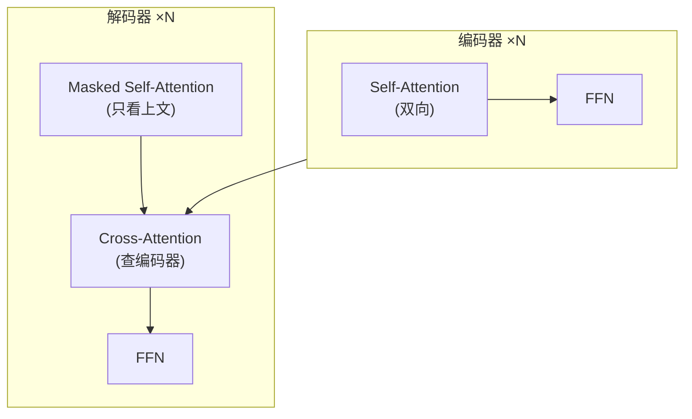

三种注意力的区别：

| 类型 | Q 来自 | K/V 来自 | 用途 |
|---|---|---|---|
| 编码器 Self-Attn | 编码 token | 同序列编码 token | 双向理解 |
| 解码器 Masked Self-Attn | 解码 token | **同序列**解码 token（带因果掩码） | 自回归生成 |
| 解码器 Cross-Attn | 解码 token | **编码器输出** | 翻译时查源句 |

### 3.5 一个最小的 Transformer Block

```python
class TransformerBlock(torch.nn.Module):
    def __init__(self, d_model, n_heads, d_ff, dropout=0.1):
        super().__init__()
        self.ln1 = torch.nn.LayerNorm(d_model)
        self.attn = MultiHeadAttention(d_model, n_heads)
        self.ln2 = torch.nn.LayerNorm(d_model)
        # SwiGLU FFN
        self.w_gate = torch.nn.Linear(d_model, d_ff, bias=False)
        self.w_up   = torch.nn.Linear(d_model, d_ff, bias=False)
        self.w_down = torch.nn.Linear(d_ff, d_model, bias=False)
        self.drop = torch.nn.Dropout(dropout)

    def forward(self, x, mask=None):
        # Pre-LN + 残差
        x = x + self.drop(self.attn(self.ln1(x), mask))
        h = self.ln2(x)
        x = x + self.drop(self.w_down(F.silu(self.w_gate(h)) * self.w_up(h)))
        return x
```

`d_model=512, n_heads=8, d_ff=2048` 是经典的小配置（LLaMA-7B 用 `d=4096, n=32, d_ff=11008`）。

---

## 四、LLM：从 Transformer 到 GPT

2017 年的 Transformer 是 Seq2Seq（有编/解码器）。2018 年 OpenAI 的 GPT 和 Google 的 BERT 把它拆成两个方向：

| 模型 | 结构 | 目标 | 代表 |
|---|---|---|---|
| **Encoder-Only** | 只用编码器 | 看懂上下文（分类、检索、抽取） | BERT、RoBERTa |
| **Decoder-Only** | 只用解码器 | 一个 token 一个 token 生成 | GPT、LLaMA、Qwen |
| **Encoder-Decoder** | 两者都用 | 翻译、摘要 | T5、BART |

今天的大语言模型（ChatGPT、文心、Qwen、DeepSeek、Llama）**基本都是 Decoder-Only**。

### 4.1 Decoder-Only 架构

其实就是把 Transformer 的解码器**单独拿出来**，N 层堆叠：

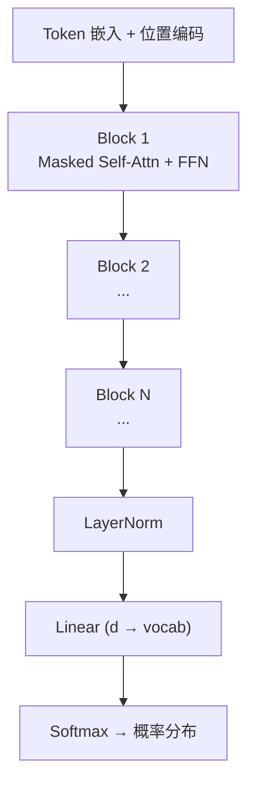

**跟原始 Transformer 解码器的两点区别**：
1. **没有 Cross-Attention**——不需要"看编码器"，因为是自回归生成。
2. **Pre-LN + RMSNorm** + **SwiGLU** + **RoPE**——这些是 LLaMA 之后的主流改进。

### 4.2 因果语言建模（CLM）预训练

Decoder-Only LLM 的训练目标极其简单：**给定前 t-1 个 token，预测第 t 个 token。**

```
输入:   [BOS] 今 天 天 气 不 错
目标:   今  天  天 气  不  错  [EOS]
                ↑  每次右移一位
```

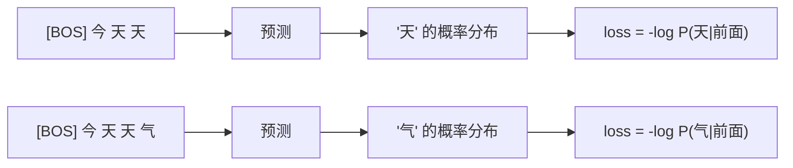

数学上就是**交叉熵**：

```
L = -1/n · Σₜ log P_θ(xₜ | x₁, …, xₜ₋₁)
```

**为什么这一招就够**？从海量文本（万亿 token）学这个目标，模型被迫学会：
- 语法、词义、句法
- 常识、事实知识
- 推理、类比、代码模式

**涌现能力**：当模型大到某个规模（数百亿参数、训练 token 数超过 1T），会突然出现训练目标里没有直接要求的能力（少样本学习、推理、规划）。

### 4.3 主流 LLM 家族

| 家族 | 公司 | 关键设计 | 开源 |
|---|---|---|---|
| **GPT** | OpenAI | 早期 Decoder-Only、密集 | 否 |
| **LLaMA** | Meta | RoPE + SwiGLU + GQA（v2 起） | 是 |
| **Qwen** | 阿里 | 动态 NTK 位置插值、多 token 预测 | 是 |
| **DeepSeek** | 幻方 | MLA（多头潜在注意力）、MoE | 是 |
| **GLM** | 智谱 | 双向注意力 + 空白填充 | 是 |
| **Mistral** | Mistral AI | 滑动窗口注意力 + GQA | 是 |

它们在 Transformer 主干上各有优化，但**自回归 + 因果语言建模**这个核心完全一致。

### 4.4 Tokenization：BPE 基础

在 token 进入 embedding 层之前，要先切成子词。主流方案是 **BPE（Byte Pair Encoding）**——一种数据压缩启发的算法：

1. 把所有文本切成单字节（或 unicode 字符）。
2. 统计相邻对的出现频率，合并频率最高的那一对为一个新 token。
3. 重复 2，直到词表大小达标（典型 32K–128K）。

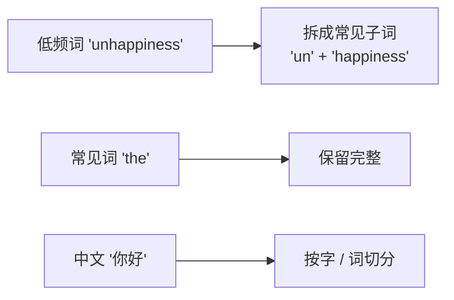

为什么 BPE 好：

- 词表小（32K–128K）→ embedding 矩阵小
- 罕见词也能拆 → **OOV（Out-Of-Vocabulary）问题消失**
- 数字、代码、emoji 都能统一表示

举个具体例子（GPT-2 BPE 风格）：

```
"Tokenization" → ["Token", "ization"]    (2 个 token)
"你好世界"    → ["你", "好", "世", "界"] (4 个 token)
"   "         → [" "×3]                 (1 个 token，3 个空格)
```

> 注：不同 LLM 的 tokenizer 不同，会出现"同文本不同 token 数"的现象。中文 LLM 通常词表更大（10 万+）以减少每句话的 token 数。

---

## 五、训练：预训练 → SFT → RLHF → DPO

一个 LLM 从零到能对话，要经过**四个阶段**：

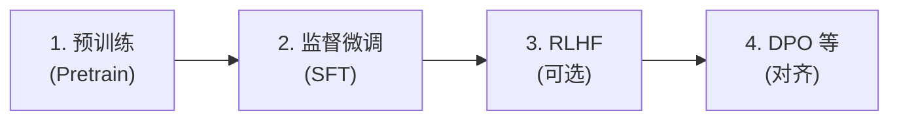

### 5.1 预训练（Pretraining）

**目标**：用海量无标注文本（万亿 token 级）训练，让模型学会"续写"。

**数据**：网页（Common Crawl）、书籍、新闻、代码（GitHub）、论文、对话……通常要做严格清洗（去重、过滤有毒内容、平衡语言比例）。

**规模感**：

| 模型 | 参数量 | 训练 token | GPU 月（估算） |
|---|---|---|---|
| LLaMA-7B | 7B | 1T | ~80K A100-hours |
| LLaMA-2-70B | 70B | 2T | ~1.7M A100-hours |
| GPT-4（传闻） | ~1.8T | ~13T | 巨 |

**优化技巧**（仅列名，详细另文）：
- AdamW 优化器 + 线性 warmup + cosine decay
- 混合精度（bf16 / fp16 / fp8）
- ZeRO + 3D 并行（数据/流水/张量）跨上千卡
- Gradient checkpointing 节省显存

### 5.2 监督微调（SFT, Supervised Fine-Tuning）

预训练后的模型只会"续写"，不擅长"对话"。SFT 用**人工编写的 (prompt, response) 对**训练：

```
[
  {"prompt": "用 Python 写个快速排序", "response": "def quick_sort(arr): ..."},
  {"prompt": "把这段话翻译成英文：...", "response": "Here is the translation..."},
  ...
]
```

SFT 通常只训 1–3 个 epoch，学习率比预训练低 1–2 个数量级。1 万到 10 万条高质量数据就能让模型有明显的"助手"风格。

> **关键洞察**：SFT 不是让模型"学知识"（知识在预训练阶段已经学了），而是让模型学**格式和风格**——"用户问 → 我答"的对话模式。

### 5.3 RLHF（Reinforcement Learning from Human Feedback）

SFT 的问题：模型只会"模仿"标注员，不会主动避错。RLHF 用**人类偏好**进一步对齐。

三步走：

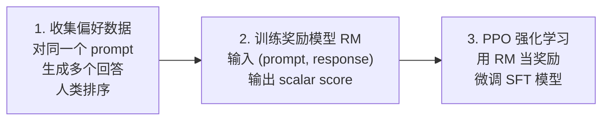

**奖励模型 (Reward Model)**：本质是一个回归模型，输入 `(prompt, response)`，输出一个标量（分数越高 = 人类越偏好）。

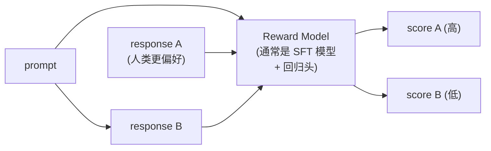

训练目标（pairwise ranking loss）：

```
L_RM = -log σ( score(highly_preferred) - score(less_preferred) )
```

**PPO 阶段**：把 LLM 看作"策略"，用 RM 给出的分数当奖励。完整 PPO 目标：

```
L_PPO = -E[ log π_θ(response | prompt) / π_old(response | prompt) · A ] + β · KL(π_θ || π_ref)
```

其中：
- 第一项是策略梯度（让高分回答出现概率变大）
- 第二项是 KL 散度惩罚（**防止模型偏离 SFT 太远，避免奖励黑客**）
- `π_ref` 是冻结的 SFT 参考模型

**RLHF 的痛点**：
- RM 训练不稳定
- PPO 实现复杂、超参敏感
- 训练成本高（要同时跑 4 个模型：actor / critic / reward / reference）
- 容易"奖励黑客"——模型学会钻 RM 漏洞，分数高但实际回答变差

### 5.4 DPO（Direct Preference Optimization）

2023 年 Stanford 的 Rafailov 等人提出 **DPO**——一个非常优雅的简化：把 RLHF 的两阶段（训 RM + PPO）合并成**单阶段监督学习**。

**核心洞察**：PPO 解的优化问题，可以**闭式解**出最优策略相对参考策略的比值。把这个关系代回去，奖励可以用策略本身表示：

```
L_DPO = -log σ( β · log[π_θ(y_w|x) / π_ref(y_w|x)] - β · log[π_θ(y_l|x) / π_ref(y_l|x)] )
```

其中 `y_w` 是人类更偏好的回答，`y_l` 是较差的。

```mermaid
flowchart LR
    P["prompt x"] --> A["policy π_θ<br/>(要训练的 LLM)"]
    P --> R["reference π_ref<br/>(SFT 模型，冻结)"]
    A --> YW["y_w: 偏好回答"]
    A --> YL["y_l: 较差回答"]
    R --> YW
    R --> YL
    YW --> L["DPO loss<br/>log σ(β·Δlogp_w - β·Δlogp_l)"]
    YL --> L
```

**DPO 的优势**：
- 不需要训 RM
- 不需要采样（PPO 需要在训练时实时生成）
- 实现就是普通监督学习
- 经验上效果跟 RLHF 相当甚至更好

**DPO 的变体**：IPO、KTO、SimPO、ORPO……核心思想类似。

> **2024 年之后，工业界基本从 RLHF 切到 DPO/IPO 这类方法**，因为简单稳定。

---

## 六、推理：自回归生成

训完模型，怎么"用"？——一个 token 一个 token 地生成。

### 6.1 自回归生成

```mermaid
flowchart LR
    A["[BOS] 今"] --> B["预测 logits"]
    B --> C["采样 → 天"]
    A --> D["[BOS] 今 天"]
    C --> D
    D --> E["预测 logits"]
    E --> F["采样 → 气"]
    D --> G["[BOS] 今 天 气"]
    F --> G
    G --> H["..."]
```

每一步：

1. 前向传播整个序列 → 得到最后位置的 logits（vocab 维向量）
2. 用采样策略选一个 token
3. 把新 token 拼到序列末尾
4. 重复直到生成 `[EOS]` 或达到 max length

**最朴素实现（无任何优化）**：

```python
def naive_generate(model, prompt_ids, max_new=100):
    for _ in range(max_new):
        logits = model(prompt_ids)              # (1, n, vocab)
        next_logits = logits[0, -1]              # 最后一步
        next_id = next_logits.argmax()           # 贪心
        prompt_ids = torch.cat([prompt_ids, next_id.unsqueeze(0)], dim=1)
    return prompt_ids
```

**问题**：每步都要把**整个序列**重新算一遍 Attention。计算量随序列长度平方增长，浪费严重。

下一篇文会专门讲 **KV-Cache** 如何把这个 O(n²) 优化到 O(n)。

### 6.2 采样策略

最后位置的 logits → 概率分布。怎么从这个分布选 token，决定了生成质量/多样性。

```mermaid
flowchart LR
    A["logits (vocab 维)"] --> B["可选：温度缩放"]
    B --> C["可选：top-k 截断"]
    C --> D["可选：top-p 截断"]
    D --> E["可选：重复惩罚"]
    E --> F["softmax"]
    F --> G["采样 / argmax"]
```

| 策略 | 公式 / 思路 | 效果 |
|---|---|---|
| **Greedy** | `argmax` | 确定性强，但易循环、单调 |
| **Temperature** | `logits / T` 后 softmax | T<1 更确定，T>1 更多样 |
| **Top-k** | 只保留概率最大的 k 个 | 截掉长尾 |
| **Top-p (nucleus)** | 累计概率到 p 截止 | 自适应截断，比 top-k 更灵活 |
| **Repetition penalty** | 出现过的 token logit 打折 | 减少重复 |

经典组合（ChatGPT 风格）：

```python
def sample(logits, temperature=0.7, top_k=50, top_p=0.9, prev_ids=None):
    if temperature == 0:
        return logits.argmax()
    logits = logits / temperature

    # Top-k
    if top_k:
        kth = torch.topk(logits, top_k).values[-1]
        logits = torch.where(logits < kth, torch.full_like(logits, -1e10), logits)

    # Top-p
    sorted_logits, sorted_idx = torch.sort(logits, descending=True)
    cumprobs = torch.cumsum(F.softmax(sorted_logits, dim=-1), dim=-1)
    mask = cumprobs > top_p
    mask[..., 1:] = mask[..., :-1].clone()  # 至少保留 1 个
    sorted_logits[mask] = -1e10
    logits = torch.zeros_like(logits).scatter(-1, sorted_idx, sorted_logits)

    # 重复惩罚
    if prev_ids is not None:
        for tid in prev_ids.unique():
            logits[tid] -= 1.0  # 简化

    probs = F.softmax(logits, dim=-1)
    return torch.multinomial(probs, 1)
```

### 6.3 推理框架

直接用 PyTorch 跑 LLM 又慢又费显存。生产环境一般用专业框架：

| 框架 | 特点 |
|---|---|
| **HuggingFace Transformers** | 上手简单，通用 |
| **vLLM** | PagedAttention + 连续批处理，吞吐量高 |
| **TGI (Text Generation Inference)** | HuggingFace 官方 Rust 核心 |
| **TensorRT-LLM** | NVIDIA 优化，极致延迟 |
| **llama.cpp** | 纯 C++，CPU/低端 GPU 可跑 |
| **MLX** | Apple Silicon 优化 |

下一篇会重点讲 KV-Cache + 这些框架的底层加速技术。

---

## 七、总结与延伸

### 7.1 一图回顾

```mermaid
flowchart TB
    A["1. Self-Attention<br/>让 token 互相通信"] --> B["2. 多头 + 位置编码<br/>学多视角 + 注入位置"]
    B --> C["3. N 层堆叠 + 残差 + LN<br/>= Transformer block"]
    C --> D["4. Decoder-Only 堆 N 层<br/>= LLM 主干"]
    D --> E["5. 预训练 CLM<br/>学续写能力"]
    E --> F["6. SFT + DPO<br/>学助手风格 + 对齐人类偏好"]
    F --> G["7. 推理 + KV-Cache<br/>一个一个 token 生成"]
```

### 7.2 关键概念清单

| 概念 | 一句话 |
|---|---|
| Self-Attention | 让每个 token 对所有 token 做加权聚合 |
| Q/K/V | Query（查询）、Key（索引）、Value（内容） |
| 缩放因子 √d_k | 控制 softmax 数值稳定性 |
| 因果掩码 | 防止 token 偷看未来 |
| 多头注意力 | h 个独立注意力子空间拼接 |
| 位置编码 | 注入 token 顺序信息（RoPE 主流） |
| 残差 + LN | 让深层网络可训练 |
| Pre-LN | LN 在子层前，训练更稳 |
| SwiGLU | 主流 FFN 激活 |
| CLM | 因果语言建模，自回归预训练目标 |
| SFT | 监督微调，学对话格式 |
| DPO | 直接偏好优化，简化版 RLHF |

### 7.3 延伸阅读

- 论文：[**Attention Is All You Need**](https://arxiv.org/abs/1706.03762) — Transformer 原始论文
- 论文：[**LLaMA**](https://arxiv.org/abs/2302.13971) — 现代开源 LLM 范式
- 论文：[**Direct Preference Optimization**](https://arxiv.org/abs/2305.18290)
- 下一篇：**KV-Cache 与推理加速**——把上面的"自回归生成"做到又快又省
- 配套代码：本文所有 PyTorch 片段可直接拼成 `train.py` 跑通

---

*下一篇我们会深入推理环节：KV-Cache 是怎么省掉 80% 算力的、MQA/GQA 怎么把显存砍半、投机解码怎么"小马拉大车"、量化怎么用 INT4 装下 7B 模型。*
